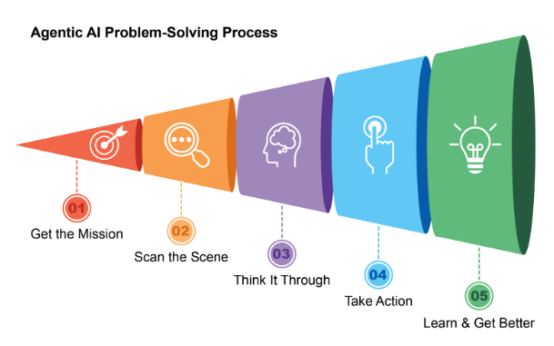
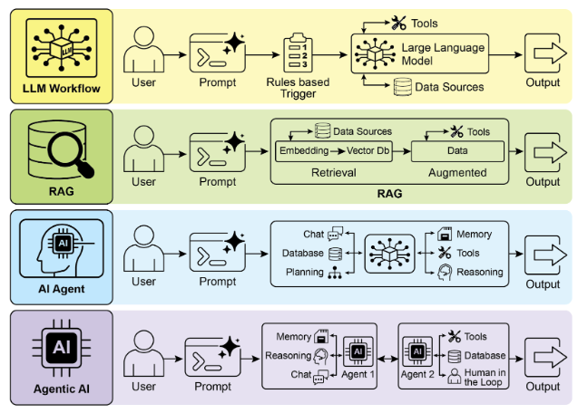
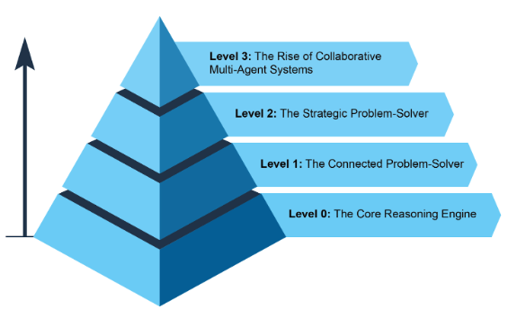
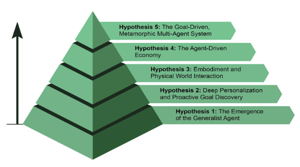

# 什麼讓 AI 系統成為代理？

簡單來說，**AI 代理**是一個設計來感知其環境並採取行動實現特定目標的系統。它是標準大語言模型 (LLM) 的演進，增強了規劃、使用工具和與周圍環境互動的能力。將代理式 AI 想像成一個在工作中學習的智慧助手。它遵循一個簡單的五步循環來完成任務 (見圖 1)：

1. **接受任務：**你給它一個目標，比如「整理我的日程」。
2. **掃描場景：**它收集所有必要資訊——閱讀電子郵件、檢查日曆、存取聯絡人——以理解正在發生的事情。
3. **深思熟慮：**它透過考慮實現目標的最佳方法來制定行動計畫。
4. **採取行動：**它透過發送邀請、安排會議和更新你的日曆來執行計畫。
5. **學習和改進：**它觀察成功結果並相應調整。例如，如果會議重新安排，系統會從這個事件中學習以增強其未來表現。

圖 1：代理式 AI 作為智慧助手運作，透過經驗持續學習。它透過簡單的五步循環運作來完成任務。

代理正以驚人的速度變得越來越受歡迎。根據最近的研究，大多數大型 IT 公司正在積極使用這些代理，其中五分之一的公司在過去一年內才開始使用。金融市場也注意到了這一點。截至 2024 年底，AI 代理新創公司已籌集超過 20 億美元，市場價值為 52 億美元。預計到 2034 年將爆炸性成長至近 2000 億美元的價值。簡而言之，所有跡象都表明 AI 代理將在我們未來的經濟中發揮巨大作用。

在短短兩年內，AI 典範已經發生了巨大轉變，從簡單的自動化轉向複雜的自主系統 (見圖 2)。最初，工作流程依賴基本提示和觸發器來使用 LLM 處理資料。這透過檢索增強生成 (RAG) 得到發展，透過將模型建立在事實資訊基礎上來增強可靠性。然後我們看到了能夠使用各種工具的個別 AI 代理的發展。今天，我們正進入代理式 AI 的時代，專門的代理團隊協調工作以實現複雜目標，標誌著 AI 協作能力的重大飛躍。

圖 2：從 LLM 到 RAG，再到代理式 RAG，最後到代理式 AI 的轉變。

本書的目的是討論專門代理如何協調工作和協作以實現複雜目標的設計模式，你將在每章中看到協作和互動的一種典範。

在此之前，讓我們檢視跨越代理複雜性範圍的範例 (見圖 3)。

## 等級 0：核心推理引擎

雖然 LLM 本身不是代理，但它可以作為基本代理式系統的推理核心。在「等級 0」配置中，LLM 在沒有工具、記憶或環境互動的情況下運作，僅基於其預訓練知識回應。它的優勢在於利用其廣泛的訓練資料來解釋既定概念。這種強大內部推理的代價是完全缺乏時事意識。例如，如果該資訊超出其預訓練知識範圍，它將無法命名 2025 年奧斯卡「最佳影片」獲獎者。

## 等級 1：連接的問題解決者

在這個等級，LLM 透過連接和使用外部工具成為功能性代理。它的問題解決不再局限於其預訓練知識。相反，它可以執行一系列行動來從網路 (透過搜尋) 或資料庫 (透過檢索增強生成或 RAG) 等來源收集和處理資訊。詳細資訊請參閱第 14 章。

例如，為了尋找新的電視節目，代理認識到需要時事資訊，使用搜尋工具找到它，然後綜合結果。關鍵是，它還可以使用專門工具來提高準確性，例如呼叫金融 API 來獲取 AAPL 的即時股價。這種在多個步驟中與外界互動的能力是等級 1 代理的核心能力。

## 等級 2：策略性問題解決者

在這個等級，代理的能力顯著擴展，包含策略規劃、主動協助和自我改進，其中提示工程和上下文工程作為核心啟用技能。

首先，代理超越單一工具使用，透過策略性問題解決來處理複雜的多部分問題。當它執行一系列行動時，它積極執行上下文工程：為每個步驟策略性選擇、包裝和管理最相關資訊的過程。例如，要在兩個地點之間找到咖啡店，它首先使用地圖工具。然後它工程化這個輸出，策劃一個簡短、集中的上下文——可能只是街道名稱清單——來輸入到本地搜尋工具中，防止認知過載並確保第二步高效且準確。要從 AI 獲得最大準確性，必須給它一個簡短、集中且強大的上下文。上下文工程是透過策略性選擇、包裝和管理來自所有可用來源的最關鍵資訊來實現這一點的學科。它有效策劃模型的有限注意力以防止過載，並確保任何給定任務的高品質、高效表現。詳細資訊請參閱附錄 A。

這個等級導致主動和持續運作。連接到你電子郵件的旅行助手透過從冗長的航班確認電子郵件中工程化上下文來展示這一點；它僅選擇關鍵詳細資訊 (航班號碼、日期、地點) 來包裝，以供後續呼叫你的日曆和天氣 API。

在軟體工程等專業領域，代理透過應用這個學科來管理整個工作流程。當被指派錯誤報告時，它讀取報告並存取程式碼庫，然後策略性地將這些大型資訊來源工程化為強大、集中的上下文，讓它能夠有效地編寫、測試和提交正確的程式碼修補。

最後，代理透過改進自己的上下文工程過程來實現自我改進。當它詢問如何改進提示的回饋時，它正在學習如何更好地策劃其初始輸入。這讓它能夠自動改進它如何為未來任務包裝資訊，創造強大的自動回饋循環，隨時間增加其準確性和效率。詳細資訊請參閱第 17 章。

圖 3：展示代理複雜性範圍的各種實例。

## 等級 3：協作多代理系統的興起

在等級 3，我們看到 AI 開發的重大典範轉變，從追求單一全能超級代理轉向複雜協作多代理系統的興起。本質上，這種方法認識到複雜挑戰通常最好不是由單一通才解決，而是由專家團隊協調工作解決。這個模型直接反映人類組織的結構，不同部門被指派特定角色並協作解決多面向目標。這種系統的集體力量在於這種勞動分工和透過協調努力創造的協同效應。詳細資訊請參閱第 7 章。

為了讓這個概念生動起來，考慮推出新產品的複雜工作流程。與其讓一個代理嘗試處理每個方面，「專案經理」代理可以作為中央協調者。這個經理將透過將任務委派給其他專門代理來編排整個過程：「市場研究」代理收集消費者資料，「產品設計」代理開發概念，以及「行銷」代理製作促銷材料。它們成功的關鍵是它們之間無縫的溝通和資訊共享，確保所有個別努力都對齊以實現集體目標。

雖然這種自主、基於團隊的自動化願景已經在開發中，但重要的是要承認目前的障礙。這種多代理系統的有效性目前受到它們使用的 LLM 推理限制的約束。此外，它們真正從彼此學習並作為一個有凝聚力的單位改進的能力仍處於早期階段。克服這些技術瓶頸是關鍵的下一步，這樣做將釋放這個等級的深刻承諾：從頭到尾自動化整個商業工作流程的能力。

## 代理的未來：五大假說

AI 代理開發正以前所未有的速度在軟體自動化、科學研究和客戶服務等領域發展。雖然目前的系統令人印象深刻，但它們只是開始。下一波創新可能會專注於讓代理更可靠、更協作，並更深度整合到我們的生活中。以下是五個主要假說 (見圖 4)。

### 假說 1：通才代理的出現

第一個假說是 AI 代理將從狹窄專家演進為真正的通才，能夠高可靠性地管理複雜、模糊和長期目標。例如，你可以給代理一個簡單的提示，如「為下季度在里斯本為 30 人規劃我公司的異地會議」。然後代理將管理數週的整個專案，處理從預算批准和航班談判到場地選擇，並根據員工回饋建立詳細行程，同時提供定期更新。達到這種自主水準將需要 AI 推理、記憶和接近完美可靠性的基礎突破。另一種替代但不相互排斥的方法是小語言模型 (SLM) 的興起。這個「樂高般」的概念涉及從小型專門專家代理組成系統，而不是擴展單一巨型模型。這種方法承諾系統更便宜、更快除錯且更容易部署。最終，大型通才模型的開發和較小專門模型的組成都是可行的前進路徑，它們甚至可以相互補充。

### 假說 2：深度個人化和主動目標發現

第二個假說認為代理將成為深度個人化和主動的夥伴。我們正在見證新一類代理的出現：主動夥伴。透過從你獨特的模式和目標中學習，這些系統開始從只是遵循命令轉向預測你的需求。當 AI 系統超越簡單回應聊天或指令時，它們就作為代理運作。它們代表使用者啟動和執行任務，在過程中積極協作。這超越了簡單的任務執行，進入主動目標發現的領域。

例如，如果你正在探索永續能源，代理可能識別你的潛在目標並透過建議課程或總結研究來主動支援它。雖然這些系統仍在發展，但它們的軌跡很清楚。它們將變得越來越主動，學會在高度確信行動有幫助時代表你主動行動。最終，代理成為不可或缺的盟友，幫助你發現和實現你尚未完全表達的抱負。

圖 4：關於代理未來的五個假說

### 假說 3：具身化和實體世界互動

這個假說預見代理擺脫純數位限制，在實體世界中運作。透過將代理式 AI 與機器人技術整合，我們將看到「具身代理」的興起。與其只是預約修理工，你可能會要求你的家庭代理修理漏水的水龍頭。代理將使用其視覺感測器感知問題，存取水電知識庫制定計畫，然後精確控制其機器人操縱器執行修理。這將代表巨大的一步，彌合數位智慧和實體行動之間的差距，並改變從製造和物流到老人照護和家庭維護的一切。

### 假說 4：代理驅動的經濟

第四個假說是高度自主的代理將成為經濟的積極參與者，創造新市場和商業模式。我們可能看到代理作為獨立經濟實體行動，負責最大化特定結果，如利潤。企業家可以啟動代理來經營整個電子商務業務。代理將透過分析社群媒體識別趨勢產品，生成行銷文案和視覺效果，透過與其他自動化系統互動來管理供應鏈物流，並基於即時需求動態調整定價。這種轉變將創造一個新的、超高效的「代理經濟」，以人類無法直接管理的速度和規模運作。

### 假說 5：目標驅動的變形多代理系統

這個假說假設智慧系統的出現，它們不是從明確程式設計運作，而是從宣布的目標運作。使用者只需陳述期望的結果，系統自主找出如何實現它。這標誌著向能夠在個人和集體層面進行真正自我改進的變形多代理系統的根本轉變。

這個系統將是動態實體，而非單一代理。它將具有分析自己表現並修改其多代理勞動力拓撲的能力，根據需要建立、複製或移除代理，以形成當前任務最有效的團隊。這種演進發生在多個層面：

* **架構修改：**在最深層面，個別代理可以重寫自己的原始碼並重新架構其內部結構以提高效率，如原始假說中所述。
* **指令修改：**在更高層面，系統持續執行自動提示工程和上下文工程。它改進給予每個代理的指令和資訊，確保它們在沒有任何人類干預的情況下以最佳指導運作。

例如，企業家只需宣布意圖：「推出成功的電子商務業務銷售手工咖啡」。系統在沒有進一步程式設計的情況下，將立即行動。它最初可能產生「市場研究」代理和「品牌」代理。基於初始發現，它可能決定移除品牌代理並產生三個新的專門代理：「商標設計」代理、「網店平台」代理和「供應鏈」代理。它將持續調整它們的內部提示以獲得更好表現。如果網店代理成為瓶頸，系統可能將其複製為三個平行代理來處理網站的不同部分，有效地即時重新架構自己的結構以最好地實現宣布的目標。

## 結論

本質上，AI 代理代表從傳統模型的重大飛躍，作為感知、規劃和行動以實現特定目標的自主系統運作。這項技術的演進正從單一、使用工具的代理推進到處理多面向目標的複雜協作多代理系統。未來假說預測通才化、個人化，甚至實體具身代理的出現，它們將成為經濟的積極參與者。這種持續發展標誌著朝向自我改進、目標驅動系統的重大典範轉變，準備自動化整個工作流程並根本重新定義我們與技術的關係。

## 參考資料

1. Cloudera, Inc. (April 2025), 96% of enterprises are increasing their use of AI agents.[https://www.cloudera.com/about/news-and-blogs/press-releases/2025-04-16-96-percent-of-enterprises-are-expanding-use-of-ai-agents-according-to-latest-data-from-cloudera.html](https://www.cloudera.com/about/news-and-blogs/press-releases/2025-04-16-96-percent-of-enterprises-are-expanding-use-of-ai-agents-according-to-latest-data-from-cloudera.html)
2. Autonomous generative AI agents: [https://www.deloitte.com/us/en/insights/industry/technology/technology-media-and-telecom-predictions/2025/autonomous-generative-ai-agents-still-under-development.html](https://www.deloitte.com/us/en/insights/industry/technology/technology-media-and-telecom-predictions/2025/autonomous-generative-ai-agents-still-under-development.html)
3. Market.us. Global Agentic AI Market Size, Trends and Forecast 2025–2034. [https://market.us/report/agentic-ai-market/](https://market.us/report/agentic-ai-market/)