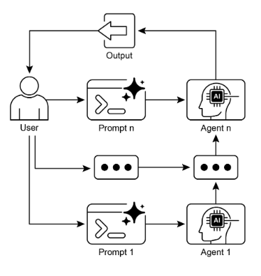

# 第一章：提示鏈結

## 提示鏈結模式概述

提示鏈結 (Prompt Chaining)，有時被稱為管道模式 (Pipeline pattern)，代表在利用大語言模型 (LLMs) 處理複雜任務時的一種強大範例。與其期待 LLM 在單一、整體式的步驟中解決複雜問題，提示鏈結倡導分而治之的策略。核心思想是將原本令人怯步的問題分解為一連串更小、更易於管理的子問題。每個子問題都透過專門設計的提示來個別處理，而從一個提示產生的輸出會策略性地作為鏈結中下一個提示的輸入。

這種順序處理技術本質上為與 LLMs 的互動引入了模組化和清晰度。通過分解複雜任務，理解和除錯每個個別步驟變得更容易，使整個過程更加穩健和可解釋。鏈結中的每個步驟都可以精心制作和優化，專注於更大問題的特定面向，從而產生更準確和聚焦的輸出。

一個步驟的輸出作為下一個步驟的輸入是關鍵所在。這種資訊傳遞建立了依賴鏈結，因此得名，其中先前操作的上下文和結果指導後續處理。這讓 LLM 能夠建立在其先前的工作之上，精煉其理解，並逐步接近所期望的解決方案。

此外，提示鏈結不僅僅是分解問題；它還能夠整合外部知識和工具。在每個步驟中，LLM 都可以被指示與外部系統、API 或資料庫互動，豐富其超出內部訓練資料的知識和能力。這種能力大幅擴展了 LLMs 的潛力，使它們不僅僅是孤立的模型，而是更廣泛、更智慧系統的整體元件。

提示鏈結的重要性延伸到簡單的問題解決之外。它作為構建複雜 AI 智能體的基礎技術。這些智能體可以利用提示鏈結在動態環境中自主規劃、推理和行動。透過策略性地構建提示序列，智能體可以參與需要多步驟推理、規劃和決策制定的任務。這種智能體工作流程可以更密切地模仿人類思維過程，允許與複雜領域和系統進行更自然和有效的互動。

**單一提示的限制：** 對於多方面的任務，為 LLM 使用單一、複雜的提示可能是低效的，導致模型在約束和指令方面遇到困難，可能導致指令忽略 (其中提示的部分被忽略)、上下文漂移 (模型失去對初始上下文的追蹤)、錯誤傳播 (早期錯誤放大)、需要更長上下文視窗的提示 (模型獲得不足資訊來回應) 和幻覺 (認知負擔增加錯誤資訊的機會)。例如，要求分析市場研究報告、總結發現、識別有資料點的趋勢並起草電子郵件的查詢有失敗的風險，因為模型可能總結得很好但無法提取資料或正確起草電子郵件。

**透過順序分解提高可靠性：** 提示鏈結透過將複雜任務分解為聚焦的順序工作流程來解決這些挑戰，這大大提高了可靠性和控制。就上述例子而言，管道或鏈結方法可以描述如下：

1. 初始提示 (總結)：「總結以下市場研究報告的關鍵發現：[文本]。」模型的唯一焦點是總結，提高了這一初始步驟的準確性。
2. 第二個提示 (趨勢識別)：「使用總結，識別前三個新興趨勢並提取支持每個趨勢的具體資料點：[步驟 1 的輸出]。」這個提示現在更受約束，並直接建立在已驗證的輸出之上。
3. 第三個提示 (電子郵件撰寫)：「為行銷團隊起草一封簡潔的電子郵件，概述以下趨勢和它們的支持資料：[步驟 2 的輸出]。」

這種分解允許對過程進行更細粒度的控制。每個步驟都更簡單且更少歧義，這減少了模型的認知負擔並導致更準確和可靠的最終輸出。這種模組化類似於計算管道，其中每個函數在將結果傳遞給下一個之前執行特定操作。為確保每個特定任務的準確回應，可以在每個階段為模型分配不同的角色。例如，在給定的情境中，初始提示可以指定為「市場分析師」，後續提示為「貿易分析師」，第三個提示為「專業文件撰寫員」，以此類推。

**結構化輸出的角色：** 提示鏈結的可靠性高度依賴於步驟間傳遞資料的完整性。如果一個提示的輸出含糊或格式不當，後續提示可能因為錯誤輸入而失敗。為了減輕這種情況，指定結構化輸出格式 (例如 JSON 或 XML) 是關鍵的。

例如，趨勢識別步驟的輸出可以格式化為 JSON 物件：

```json
{  "trends": [    
        {      
            "trend_name": "AI-Powered Personalization",      
            "supporting_data": "73% of consumers prefer to do business with brands that use personal information to make their shopping experiences more relevant."    
        },    
        {      
            "trend_name": "Sustainable and Ethical Brands",      
            "supporting_data": "Sales of products with ESG-related claims grew 28% over the last five years, compared to 20% for products without."    
        } 
    ] 
}
```

這種結構化格式確保資料是機器可讀的，並且可以精確解析並插入到下一個提示中而沒有歧義。這種做法最小化了解釋自然語言時可能出現的錯誤，是建立穩健、多步驟基於 LLM 系統的關鍵組成部分。

## 實際應用與使用案例

提示鏈結是一個多用途的模式，在構建智能體系統時適用於廣泛的情境。其核心效用在於將複雜問題分解為順序、可管理的步驟。以下是幾個實際應用和使用案例：

### 1. 資訊處理工作流程

許多任務涉及透過多個轉換處理原始資訊。例如，總結文件、提取關鍵實體，然後使用這些實體來查詢資料庫或生成報告。提示鏈結可能看起來像：

* 提示 1：從給定的 URL 或文件提取文本內容。
* 提示 2：總結清理過的文本。
* 提示 3：從總結或原始文本中提取特定實體 (例如，姓名、日期、地點)。
* 提示 4：使用實體來搜尋內部知識庫。
* 提示 5：生成結合總結、實體和搜尋結果的最終報告。

這種方法論適用於自動內容分析、AI 驅動研究助手的開發，以及複雜報告生成等領域。

### 2. 複雜查詢回答

回答需要多步推理或資訊檢索的複雜問題是一個主要使用案例。例如，「1929 年股市崩盤的主要原因是什麼，政府政策是如何回應的？」

* 提示 1：識別使用者查詢中的核心子問題 (崩盤的原因、政府回應)。
* 提示 2：研究或檢索關於 1929 年崩盤原因的具體資訊。
* 提示 3：研究或檢索關於政府對 1929 年股市崩盤政策回應的具體資訊。
* 提示 4：將步驟 2 和 3 的資訊綜合成對原始查詢的一致答案。

這種順序處理方法論對於開發能夠進行多步推論和資訊綜合的 AI 系統是不可或缺的。當查詢無法從單一資料點回答，而需要一系列邏輯步驟或來自不同來源的資訊整合時，就需要這樣的系統。

例如，設計用於生成特定主題綜合報告的自動化研究智能體執行混合計算工作流程。最初，系統檢索許多相關文章。從每個來源提取關鍵資訊的後續任務可以對每個來源同時執行。這個階段非常適合並行處理，其中獨立的子任務同時執行以最大化效率。

然而，一旦個別提取完成，過程就變得本質上是順序的。系統必須首先整理提取的資料，然後將其綜合成一致的草稿，最後審查和精煉這個草稿以產生最終報告。這些後期階段中的每一個都在邏輯上依賴於前一個階段的成功完成。這就是應用提示鏈結的地方：整理的資料作為綜合提示的輸入，而結果的綜合文本成為最終審查提示的輸入。因此，複雜操作經常將獨立資料收集的並行處理與綜合和精煉的依賴步驟的提示鏈結相結合。

### 3. 資料提取和轉換

將非結構化文本轉換為結構化格式通常透過迭代過程實現，需要順序修改以提高輸出的準確性和完整性。

* 提示 1：嘗試從發票文件中提取特定欄位 (例如，姓名、地址、金額)。
* 處理：檢查是否提取了所有必需的欄位，以及它們是否符合格式要求。
* 提示 2 (條件式)：如果欄位缺失或格式不正確，制作新提示要求模型特別尋找缺失/格式不正確的資訊，可能提供來自失敗嘗試的上下文。
* 處理：再次驗證結果。如有必要，重複。
* 輸出：提供提取的、已驗證的結構化資料。

這種順序處理方法論特別適用於從非結構化來源 (如表單、發票或電子郵件) 進行資料提取和分析。例如，解決複雜的光學字符識別 (OCR) 問題，如處理 PDF 表單，透過分解的多步方法更有效地處理。

最初，使用大語言模型從文件圖像中執行主要文本提取。接著，模型處理原始輸出以正規化資料，這是一個可能將數字文本 (如「一千零五十」) 轉換為其數值等價物 1050 的步驟。LLMs 的一個重大挑戰是執行精確的數學計算。因此，在後續步驟中，系統可以將任何必需的算術運算委託給外部計算器工具。LLM 識別必要的計算，將正規化的數字餵給工具，然後納入精確的結果。這種文本提取、資料正規化和外部工具使用的鏈結序列達到了一個準確的最終結果，這通常難以從單一 LLM 查詢可靠地獲得。

### 4. 內容生成工作流程

複雜內容的組成是一個程序性任務，通常分解為不同的階段，包括初始構思、結構大綱、起草和後續修訂。

* 提示 1：基於使用者的一般興趣生成 5 個主題想法。
* 處理：允許使用者選擇一個想法或自動選擇最好的一個。
* 提示 2：基於選定的主題，生成詳細的大綱。
* 提示 3：基於大綱中的第一點撰寫草稿段落。
* 提示 4：基於大綱中的第二點撰寫草稿段落，提供前一段落作為上下文。對所有大綱點繼續這樣做。
* 提示 5：審查和精煉完整草稿的連貫性、語調和語法。

這種方法論用於一系列自然語言生成任務，包括創意敘述、技術文檔和其他形式結構化文本內容的自動組成。

### 5. 具有狀態的對話智能體

雖然綜合狀態管理架構採用比順序連結更複雜的方法，但提示鏈結為保持對話連續性提供了基礎機制。這種技術透過將每個對話輪次構建為系統性地納入對話序列中先前互動資訊或提取實體的新提示來維持上下文。

* 提示 1：處理使用者話語 1，識別意圖和關鍵實體。
* 處理：用意圖和實體更新對話狀態。
* 提示 2：基於當前狀態，生成回應和/或識別下一個所需的資訊片段。
* 對後續輪次重複，每個新的使用者話語啟動利用累積對話歷史 (狀態) 的鏈結。

這個原則對於對話智能體的開發是基礎的，使它們能夠在延伸的、多輪對話中維持上下文和連貫性。透過保留對話歷史，系統可以理解並適當回應依賴於先前交換資訊的使用者輸入。

### 6. 程式碼生成和精煉

功能性程式碼的生成通常是一個多階段過程，需要將問題分解為逐步執行的離散邏輯操作序列。

* 提示 1：理解使用者對程式碼函數的請求。生成偽代碼或大綱。
* 提示 2：基於大綱撰寫初始程式碼草稿。
* 提示 3：識別程式碼中的潛在錯誤或改進領域 (可能使用靜態分析工具或另一個 LLM 調用)。
* 提示 4：基於識別的問題重寫或精煉程式碼。
* 提示 5：添加文檔或測試案例。

在 AI 輔助軟體開發等應用中，提示鏈結的效用源於其將複雜編碼任務分解為一系列可管理子問題的能力。這種模組化結構減少了大語言模型在每個步驟的操作複雜性。關鍵的是，這種方法也允許在模型調用之間插入確定性邏輯，實現中間資料處理、輸出驗證和工作流程內的條件分支。透過這種方法，一個原本可能導致不可靠或不完整結果的單一、多方面請求被轉換為由底層執行框架管理的結構化操作序列。

### 7. 多模態和多步推理

分析具有不同模態的資料集需要將問題分解為更小的、基於提示的任務。例如，解釋包含圖片和嵌入文本、標示特定文本段落的標籤，以及解釋每個標籤的表格資料的圖像，需要這樣的方法。

* 提示 1：從使用者的圖像請求中提取和理解文本。
* 提示 2：將提取的圖像文本與其對應的標籤連結。
* 提示 3：使用表格解釋收集的資訊以確定所需的輸出。

# 實作程式碼範例

實現提示鏈結的範圍從腳本內的直接、順序函數調用到利用專門設計來管理控制流程、狀態和元件整合的框架。LangChain、LangGraph、Crew AI 和 Google Agent Development Kit (ADK) 等框架提供了構建和執行這些多步驟過程的結構化環境，這對於複雜架構特別有利。

為了示範目的，LangChain 和 LangGraph 是合適的選擇，因為它們的核心 API 明確設計用於組成操作的鏈結和圖形。LangChain 為線性序列提供基礎抽象，而 LangGraph 擴展了這些能力以支持狀態性和週期性計算，這對於實現更複雜的智能體行為是必要的。這個例子將專注於基本的線性序列。

以下程式碼實現了一個兩步驟提示鏈結，作為資料處理管道運作。初始階段設計用於解析非結構化文本並提取特定資訊。後續階段然後接收這個提取的輸出並將其轉換為結構化資料格式。

要複製這個程序，必須首先安裝所需的程式庫。這可以使用以下命令完成：

```bash
pip install langchain langchain-community langchain-openai langgraph
```

請注意，langchain-openai 可以替換為適合不同模型提供者的適當套件。隨後，執行環境必須配置所選語言模型提供者 (如 OpenAI、Google Gemini 或 Anthropic) 的必要 API 憑證。

```python
import os 
from langchain_openai import ChatOpenAI 
from langchain_core.prompts import ChatPromptTemplate 
from langchain_core.output_parsers import StrOutputParser 

# 為了更好的安全性，從 .env 文件載入環境變數
# from dotenv import load_dotenv 
# load_dotenv() 
# 確保你的 OPENAI_API_KEY 在 .env 文件中設定

# 初始化語言模型 (推薦使用 ChatOpenAI)

llm = ChatOpenAI(temperature=0) 

# --- 提示 1：提取資訊 ---

prompt_extract = ChatPromptTemplate.from_template(
    "從以下文本中提取技術規格：\n\n{text_input}" 
) 

# --- 提示 2：轉換為 JSON --- 

prompt_transform = ChatPromptTemplate.from_template(
    "將以下規格轉換為以 'cpu'、'memory' 和 'storage' 為鍵的 JSON 物件：\n\n{specifications}" 
) 

# --- 使用 LCEL 建立鏈結 --- 
# StrOutputParser() 將 LLM 的訊息輸出轉換為簡單字串。
extraction_chain = prompt_extract | llm | StrOutputParser() 

# 完整鏈結將提取鏈結的輸出傳遞到轉換提示的 'specifications' 變數中。
full_chain = (    
    {"specifications": extraction_chain}
        | 
    prompt_transform
        | 
    llm
        | 
    StrOutputParser() 
) 

# --- 執行鏈結 --- 

input_text = "這款新筆記型電腦型號配備 3.5 GHz 八核心處理器、16GB RAM 和 1TB NVMe SSD。" 

# 使用輸入文本字典執行鏈結。
final_result = full_chain.invoke({"text_input": input_text})
print("\n--- 最終 JSON 輸出 ---")
print(final_result)
```

這個 Python 程式碼示範了如何使用 LangChain 程式庫處理文本。它利用兩個獨立的提示：一個從輸入字串提取技術規格，另一個將這些規格格式化為 JSON 物件。ChatOpenAI 模型用於語言模型互動，StrOutputParser 確保輸出是可用的字串格式。LangChain 表達式語言 (LCEL) 用於優雅地將這些提示和語言模型鏈結在一起。第一個鏈結 `extraction_chain` 提取規格。然後 `full_chain` 取得提取的輸出並將其用作轉換提示的輸入。提供了描述筆記型電腦的樣本輸入文本。使用這個文本調用 `full_chain`，透過兩個步驟處理它。最終結果 (包含提取和格式化規格的 JSON 字串) 然後被印出。

## 上下文工程和提示工程

上下文工程 (見圖 1) 是在 Token 生成之前，為 AI 模型系統性設計、構建和提供完整資訊環境的學科。這種方法論斷言，模型輸出的品質較少依賴於模型架構本身，而更多依賴於所提供上下文的豐富程度。


圖 1：上下文工程是為 AI 建立豐富、綜合資訊環境的學科，因為這種上下文的品質是實現進階智能體效能的主要因素。

它代表了傳統提示工程的重大演變，傳統提示工程主要專注於優化使用者即時查詢的措辭。上下文工程將這個範圍擴展到包含幾個資訊層，例如**系統提示**，這是定義 AI 操作參數的基礎指令集 - 例如，*「你是一位技術作家；你的語調必須正式且精確。」* 上下文進一步透過外部資料豐富。這包括檢索的文件，其中 AI 主動從知識庫獲取資訊來告知其回應，例如為專案提取技術規格。它還納入工具輸出，這些是 AI 使用外部 API 獲得即時資料的結果，例如查詢日曆以確定使用者的可用性。這些明確資料與關鍵的隱含資料結合，例如使用者身分、互動歷史和環境狀態。核心原則是，即使是進階模型在提供有限或構建不良的操作環境視圖時也會表現不佳。

因此，這種實踐將任務從僅僅回答問題重新構架為為智能體建立綜合操作圖景。例如，上下文工程的智能體不會只回應查詢，而會首先整合使用者的日曆可用性 (工具輸出)、與電子郵件收件人的專業關係 (隱含資料)，以及先前會議的筆記 (檢索的文件)。這讓模型能夠生成高度相關、個人化和實用的輸出。「工程」元件涉及創建強健的管道來在執行時獲取和轉換這些資料，並建立反饋迴路以持續改進上下文品質。

為了實現這一點，可以使用專門的調校系統來大規模自動化改進過程。例如，Google 的 Vertex AI 提示優化器等工具可以透過系統性地根據一組樣本輸入和預定義的評估指標評估回應來增強模型效能。這種方法對於跨不同模型調整提示和系統指令而不需要大量手動重寫是有效的。透過為這樣的優化器提供樣本提示、系統指令和模板，它可以以程式方式精煉上下文輸入，為實現複雜上下文工程所需的反饋迴路提供結構化方法。

這種結構化方法是區分基本 AI 工具與更複雜和上下文感知系統的關鍵。它將上下文本身視為主要元件，對智能體知道什麼、何時知道以及如何使用該資訊給予關鍵重要性。這種實踐確保模型對使用者的意圖、歷史和當前環境有全面的理解。最終，上下文工程是將無狀態聊天機器人推進到高度能力、情境感知系統的關鍵方法論。

## 一覽表

**什麼：** 複雜任務在單一提示內處理時經常讓 LLMs 不知所措，導致顯著的效能問題。模型上的認知負擔增加了錯誤的可能性，例如忽略指令、失去上下文和生成錯誤資訊。整體式提示難以有效管理多個約束和順序推理步驟。這導致不可靠和不準確的輸出，因為 LLM 無法處理多方面請求的所有面向。

**為什麼：** 提示鏈結透過將複雜問題分解為一系列更小、相互連接的子任務提供了標準化解決方案。鏈結中的每個步驟使用聚焦的提示執行特定操作，大大提高可靠性和控制。一個提示的輸出作為下一個的輸入傳遞，創建逐步建構向最終解決方案的邏輯工作流程。這種模組化、分而治之的策略使過程更易管理、更易除錯，並允許在步驟間整合外部工具或結構化資料格式。這個模式是開發能夠規劃、推理和執行複雜工作流程的複雜多步驟智能體系統的基礎。

**經驗法則：** 當任務對單一提示太複雜、涉及多個不同的處理階段、需要在步驟間與外部工具互動，或在建立需要執行多步推理和維持狀態的智能體系統時使用這個模式。

**視覺摘要：**



圖 2：提示鏈結模式：智能體從使用者接收一系列提示，每個智能體的輸出作為鏈結中下一個的輸入。

## 關鍵要點

以下是一些關鍵要點：

* 提示鏈結將複雜任務分解為一系列更小、聚焦的步驟。這偶爾被稱為管道模式。
* 鏈結中的每個步驟涉及 LLM 調用或處理邏輯，使用前一步驟的輸出作為輸入。
* 這個模式提高了與語言模型複雜互動的可靠性和可管理性。
* LangChain/LangGraph 和 Google ADK 等框架提供強健的工具來定義、管理和執行這些多步驟序列。

## 結論

透過將複雜問題分解為一系列更簡單、更易管理的子任務，提示鏈結為指導大語言模型提供了強健的框架。這種「分而治之」的策略透過讓模型一次專注於一個特定操作，顯著提高輸出的可靠性和控制。作為基礎模式，它能夠開發具有多步推理、工具整合和狀態管理能力的複雜 AI 智能體。最終，掌握提示鏈結對於建立強健、上下文感知的系統至關重要，這些系統能夠執行遠超單一提示能力的複雜工作流程。

## 參考文獻

1. LangChain Documentation on LCEL: [https://python.langchain.com/v0.2/docs/core_modules/expression_language/](https://python.langchain.com/v0.2/docs/core_modules/expression_language/)
2. LangGraph Documentation: [https://langchain-ai.github.io/langgraph/](https://langchain-ai.github.io/langgraph/)  
3. Prompt Engineering Guide \- Chaining Prompts: [https://www.promptingguide.ai/techniques/chaining](https://www.promptingguide.ai/techniques/chaining)
4. OpenAI API Documentation (General Prompting Concepts): [https://platform.openai.com/docs/guides/gpt/prompting](https://platform.openai.com/docs/guides/gpt/prompting)
5. Crew AI Documentation (Tasks and Processes): [https://docs.crewai.com/](https://docs.crewai.com/)
6. Google AI for Developers (Prompting Guides): [https://cloud.google.com/discover/what-is-prompt-engineering?hl=en](https://cloud.google.com/discover/what-is-prompt-engineering?hl=en)
7. Vertex Prompt Optimizer [https://cloud.google.com/vertex-ai/generative-ai/docs/learn/prompts/prompt-optimizer](https://cloud.google.com/vertex-ai/generative-ai/docs/learn/prompts/prompt-optimizer)