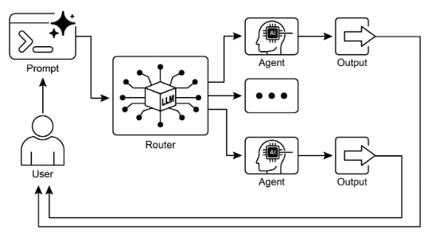

# 第二章：路由

## 路由模式概述

雖然透過提示鏈結進行順序處理是使用語言模型執行確定性、線性工作流程的基礎技術，但其在需要自適應回應的情境中的適用性是有限的。真實世界的智能體系統必須經常在基於條件因素 (例如環境狀態、使用者輸入或前一操作的結果) 的多個潛在行動之間進行仲裁。這種動態決策制定的能力，控制流程流向不同專門功能、工具或子過程，透過稱為路由的機制來實現。

路由將條件邏輯引入智能體的操作框架中，使其能夠從固定執行路徑轉變為智能體動態評估特定標準以從一組可能的後續行動中選擇的模型。這允許更靈活和上下文感知的系統行為。

例如，設計用於客戶諮詢的智能體，當配備路由功能時，可以首先分類傳入查詢以確定使用者的意圖。基於這種分類，它然後可以將查詢導向直接問答的專門智能體、帳戶資訊的資料庫檢索工具，或複雜問題的升級程序，而不是預設為單一、預定的回應路徑。因此，使用路由的更複雜智能體可以：

1. 分析使用者的查詢。
2. **路由**基於其*意圖*的查詢：
   * 如果意圖是「檢查訂單狀態」，路由到與訂單資料庫互動的子智能體或工具鏈結。
   * 如果意圖是「產品資訊」，路由到搜尋產品目錄的子智能體或鏈結。
   * 如果意圖是「技術支援」，路由到存取故障排除指南或升級給人類的不同鏈結。
   * 如果意圖不清楚，路由到澄清子智能體或提示鏈結。

路由模式的核心組成部分是執行評估並導向流程的機制。這個機制可以透過幾種方式實現：

* **基於 LLM 的路由：** 語言模型本身可以被提示來分析輸入並輸出指示下一步或目標的特定識別符或指令。例如，提示可能要求 LLM「分析以下使用者查詢並僅輸出類別：『訂單狀態』、『產品資訊』、『技術支援』或『其他』。」智能體系統然後讀取此輸出並相應地導向工作流程。
* **基於嵌入的路由：** 輸入查詢可以轉換為向量嵌入 (見 RAG，第 14 章)。然後將此嵌入與表示不同路由或能力的嵌入進行比較。查詢被路由到嵌入最相似的路由。這對於語義路由很有用，其中決策基於輸入的意義而不僅僅是關鍵詞。
* **基於規則的路由：** 這涉及使用基於關鍵詞、模式或從輸入提取的結構化資料的預定義規則或邏輯 (例如，if-else 語句、switch 案例)。這可能比基於 LLM 的路由更快和更確定性，但對於處理細緻或新穎的輸入較不靈活。
* **基於機器學習模型的路由**：它採用判別式模型 (例如分類器)，該模型已在小量標籤資料語料庫上專門訓練以執行路由任務。雖然它與基於嵌入的方法在概念上有相似性，但其關鍵特徵是監督式微調過程，它調整模型的參數以創建專門的路由功能。這種技術與基於 LLM 的路由不同，因為決策制定組成部分不是在推論時執行提示的生成式模型。相反，路由邏輯被編碼在微調模型的學習權重中。雖然 LLMs 可能在預處理步驟中用於生成合成資料以增強訓練集，但它們不參與實時路由決策本身。

路由機制可以在智能體操作週期的多個節點實現。它們可以在開始時應用來分類主要任務，在處理鏈結的中間點確定後續行動，或在子程序期間從給定集合中選擇最適當的工具。

LangChain、LangGraph 和 Google 的 Agent Developer Kit (ADK) 等計算框架為定義和管理這種條件邏輯提供了明確的構造。憑藉其基於狀態的圖形架構，LangGraph 特別適合複雜的路由情境，其中決策取決於整個系統的累積狀態。同樣，Google 的 ADK 為構建智能體的能力和互動模型提供了基礎組成部分，這些組成部分作為實現路由邏輯的基礎。在這些框架提供的執行環境中，開發人員定義可能的操作路徑和決定計算圖中節點間轉換的功能或基於模型的評估。

路由的實現使系統能夠超越確定性的順序處理。它促進了可以動態且適當地回應更廣泛輸入和狀態變化的更自適應執行流程的開發。

## 實際應用與使用案例

路由模式是設計自適應智能體系統的關鍵控制機制，使它們能夠根據可變輸入和內部狀態動態改變其執行路徑。其效用透過提供必要的條件邏輯層來跨越多個領域。

在人機互動中，例如虛擬助手或 AI 驅動的導師，路由被用來解釋使用者意圖。對自然語言查詢的初始分析確定最適當的後續行動，無論是調用特定的資訊檢索工具、升級給人類操作員，或根據使用者表現選擇課程中的下一個模組。這允許系統超越線性對話流程並以上下文方式回應。

在自動資料和文件處理管道中，路由作為分類和分發功能。傳入資料 (例如電子郵件、支援票據或 API 負載) 基於內容、元資料或格式進行分析。系統然後將每個項目導向對應的工作流程，例如銷售線索收集過程、JSON 或 CSV 格式的特定資料轉換功能，或緊急問題升級路徑。

在涉及多個專門工具或智能體的複雜系統中，路由充當高級調度器。由用於搜尋、總結和分析資訊的不同智能體組成的研究系統將使用路由器基於當前目標將任務分配給最合適的智能體。同樣，AI 編碼助手使用路由來識別程式語言和使用者的意圖—除錯、解釋或翻譯—然後將程式碼片段傳遞給正確的專門工具。

最終，路由提供了對於創建功能多樣和上下文感知系統必不可少的邏輯仲裁能力。它將智能體從預定義序列的靜態執行器轉變為可以在變化條件下就完成任務的最有效方法做出決策的動態系統。

## 實作程式碼範例 (LangChain)

在程式碼中實現路由涉及定義可能的路徑和決定採取哪條路徑的邏輯。LangChain 和 LangGraph 等框架為此提供了特定的組成部分和結構。LangGraph 的基於狀態的圖形結構對於可視化和實現路由邏輯特別直觀。

此程式碼示範了使用 LangChain 和 Google 的生成式 AI 的簡單智能體系統。它設定了一個「協調器」，根據請求的意圖 (預訂、資訊或不清楚) 將使用者請求路由到不同的模擬「子智能體」處理器。系統使用語言模型來分類請求，然後將其委派給適當的處理器功能，模擬多智能體架構中常見的基本委派模式。

首先，確保你安裝了必要的程式庫：

```bash
pip install langchain langgraph google-cloud-aiplatform langchain-google-genai google-adk deprecated pydantic
```

你還需要為你選擇的語言模型 (例如 OpenAI、Google Gemini、Anthropic) 設定你的 API 金鑰環境。

```python
# Copyright (c) 2025 Marco Fago
# https://www.linkedin.com/in/marco-fago/
#
# This code is licensed under the MIT License.
# See the LICENSE file in the repository for the full license text.

from langchain_google_genai import ChatGoogleGenerativeAI
from langchain_core.prompts import ChatPromptTemplate
from langchain_core.output_parsers import StrOutputParser
from langchain_core.runnables import RunnablePassthrough, RunnableBranch


# --- 配置 ---
# 確保你的 API 金鑰環境變數已設定 (例如，GOOGLE_API_KEY)
try:
    llm = ChatGoogleGenerativeAI(model="gemini-2.5-flash", temperature=0)
    print(f"語言模型初始化：{llm.model}")
except Exception as e:
    print(f"語言模型初始化錯誤：{e}")
    llm = None


# --- 定義模擬子智能體處理器 (相當於 ADK sub_agents) ---
def booking_handler(request: str) -> str:
    """模擬預訂智能體處理請求。"""
    print("\n--- 委派到預訂處理器 ---")
    return f"預訂處理器處理了請求：'{request}'。結果：模擬預訂操作。"


def info_handler(request: str) -> str:
    """模擬資訊智能體處理請求。"""
    print("\n--- 委派到資訊處理器 ---")
    return f"資訊處理器處理了請求：'{request}'。結果：模擬資訊檢索。"


def unclear_handler(request: str) -> str:
    """處理無法委派的請求。"""
    print("\n--- 處理不清楚的請求 ---")
    return f"協調器無法委派請求：'{request}'。請澄清。"


# --- 定義協調器路由器鏈結 (相當於 ADK 協調器的指令) ---
# 這個鏈結決定委派給哪個處理器。
coordinator_router_prompt = ChatPromptTemplate.from_messages([
    (
        "system",
        """分析使用者的請求並確定哪個專門處理器應該處理它。
        - 如果請求與預訂航班或酒店相關，
           輸出 'booker'。
        - 對於所有其他一般資訊問題，輸出 'info'。
        - 如果請求不清楚或不符合任何類別，
           輸出 'unclear'。
        僅輸出一個詞：'booker'、'info' 或 'unclear'。"""
    ),
    ("user", "{request}")
])

if llm:
    coordinator_router_chain = coordinator_router_prompt | llm | StrOutputParser()


# --- 定義委派邏輯 (相當於基於 sub_agents 的 ADK 自動流程) ---
# 使用 RunnableBranch 基於路由器鏈結的輸出進行路由。

# 為 RunnableBranch 定義分支
branches = {
    "booker": RunnablePassthrough.assign(
        output=lambda x: booking_handler(x['request']['request'])
    ),
    "info": RunnablePassthrough.assign(
        output=lambda x: info_handler(x['request']['request'])
    ),
    "unclear": RunnablePassthrough.assign(
        output=lambda x: unclear_handler(x['request']['request'])
    ),
}

# 建立 RunnableBranch。它取得路由器鏈結的輸出
# 並將原始輸入 ('request') 路由到對應的處理器。
delegation_branch = RunnableBranch(
    (lambda x: x['decision'].strip() == 'booker', branches["booker"]),  # 添加 .strip()
    (lambda x: x['decision'].strip() == 'info', branches["info"]),      # 添加 .strip()
    branches["unclear"]  # 'unclear' 或任何其他輸出的預設分支
)

# 將路由器鏈結和委派分支結合成單一可執行項目
# 路由器鏈結的輸出 ('decision') 與原始輸入 ('request') 一起傳遞
# 到 delegation_branch。
coordinator_agent = {
    "decision": coordinator_router_chain,
    "request": RunnablePassthrough()
} | delegation_branch | (lambda x: x['output'])  # 提取最終輸出


# --- 使用範例 ---
def main():
    if not llm:
        print("\n由於 LLM 初始化失敗，跳過執行。")
        return

    print("--- 使用預訂請求執行 ---")
    request_a = "為我預訂到倫敦的航班。"
    result_a = coordinator_agent.invoke({"request": request_a})
    print(f"最終結果 A：{result_a}")

    print("\n--- 使用資訊請求執行 ---")
    request_b = "義大利的首都是什麼？"
    result_b = coordinator_agent.invoke({"request": request_b})
    print(f"最終結果 B：{result_b}")

    print("\n--- 使用不清楚請求執行 ---")
    request_c = "告訴我量子物理學的知識。"
    result_c = coordinator_agent.invoke({"request": request_c})
    print(f"最終結果 C：{result_c}")


if __name__ == "__main__":
    main()
```

如前所述，這個 Python 程式碼使用 LangChain 程式庫和 Google 的生成式 AI 模型 (特別是 gemini-2.5-flash) 構建了一個簡單的智能體系統。詳細來說，它定義了三個模擬子智能體處理器：`booking_handler`、`info_handler` 和 `unclear_handler`，每個都設計來處理特定類型的請求。

核心組成部分是 `coordinator_router_chain`，它利用 ChatPromptTemplate 指示語言模型將傳入的使用者請求分類到三個類別之一：`booker`、`info` 或 `unclear`。然後這個路由器鏈結的輸出被 RunnableBranch 用來將原始請求委派給對應的處理器功能。RunnableBranch 檢查來自語言模型的決策並將請求資料導向 `booking_handler`、`info_handler` 或 `unclear_handler`。`coordinator_agent` 結合了這些組成部分，首先路由請求以做出決策，然後將請求傳遞給選定的處理器。最終輸出從處理器的回應中提取。

主函數透過三個範例請求示範系統的使用，展示不同的輸入如何被路由和由模擬智能體處理。包含語言模型初始化的錯誤處理以確保穩健性。程式碼結構模仿了基本的多智能體框架，其中中央協調器基於意圖將任務委派給專門的智能體。

## 實作程式碼範例 (Google ADK)

Agent Development Kit (ADK) 是工程智能體系統的框架，為定義智能體的能力和行為提供結構化環境。與基於明確計算圖形的架構相比，ADK 範式內的路由通常透過定義表示智能體功能的離散「工具」集來實現。回應使用者查詢時選擇適當工具由框架的內部邏輯管理，該邏輯利用底層模型將使用者意圖與正確的功能處理器匹配。

這個 Python 程式碼示範了使用 Google ADK 程式庫的 Agent Development Kit (ADK) 應用程式範例。它設定了一個「協調器」智能體，根據定義的指令將使用者請求路由到專門的子智能體 (「Booker」用於預訂，「Info」用於一般資訊)。然後子智能體使用特定工具來模擬處理請求，展示智能體系統內的基本委派模式。

```python
# Copyright (c) 2025 Marco Fago
#
# This code is licensed under the MIT License.
# See the LICENSE file in the repository for the full license text.

import uuid
from typing import Dict, Any, Optional

from google.adk.agents import Agent
from google.adk.runners import InMemoryRunner
from google.adk.tools import FunctionTool
from google.genai import types
from google.adk.events import Event


# --- 定義工具函數 ---
# 這些函數模擬專門智能體的行動。
def booking_handler(request: str) -> str:
    """
    處理航班和酒店的預訂請求。

    Args:
        request: 使用者的預訂請求。

    Returns:
        預訂已處理的確認訊息。
    """
    print("-------------------------- 預訂處理器被調用 ----------------------------")
    return f"'{request}' 的預訂操作已被模擬。"


def info_handler(request: str) -> str:
    """
    處理一般資訊請求。

    Args:
        request: 使用者的問題。

    Returns:
        表示資訊請求已處理的訊息。
    """
    print("-------------------------- 資訊處理器被調用 ----------------------------")
    return f"'{request}' 的資訊請求。結果：模擬資訊檢索。"


def unclear_handler(request: str) -> str:
    """處理無法委派的請求。"""
    return f"協調器無法委派請求：'{request}'。請澄清。"


# --- 從函數建立工具 ---
booking_tool = FunctionTool(booking_handler)
info_tool = FunctionTool(info_handler)

# 定義配備各自工具的專門子智能體
booking_agent = Agent(
    name="Booker",
    model="gemini-2.0-flash",
    description="一個專門處理所有航班"
                "和酒店預訂請求的智能體，透過調用預訂工具。",
    tools=[booking_tool],
)

info_agent = Agent(
    name="Info",
    model="gemini-2.0-flash",
    description="一個提供一般資訊"
                "並透過調用資訊工具回答使用者問題的專門智能體。",
    tools=[info_tool],
)

# 定義具有明確委派指令的父智能體
coordinator = Agent(
    name="Coordinator",
    model="gemini-2.0-flash",
    instruction=(
        "你是主要協調器。你的唯一任務是分析"
        "傳入的使用者請求"
        "並將它們委派給適當的專門智能體。不要嘗試直接回答使用者。\n"
        "- 對於與預訂航班或酒店相關的任何請求，委派給 'Booker' 智能體。\n"
        "- 對於所有其他一般資訊問題，委派給 'Info' 智能體。"
    ),
    description="一個將使用者請求路由到正確專門智能體的協調器。",
    # sub_agents 的存在預設啟用 LLM 驅動的委派 (自動流程)。
    sub_agents=[booking_agent, info_agent],
)


# --- 執行邏輯 ---
async def run_coordinator(runner: InMemoryRunner, request: str):
    """使用給定請求執行協調器智能體並委派。"""
    print(f"\n--- 使用請求執行協調器：'{request}' ---")
    final_result = ""
    try:
        user_id = "user_123"
        session_id = str(uuid.uuid4())

        await runner.session_service.create_session(
            app_name=runner.app_name,
            user_id=user_id,
            session_id=session_id,
        )

        for event in runner.run(
            user_id=user_id,
            session_id=session_id,
            new_message=types.Content(
                role='user',
                parts=[types.Part(text=request)],
            ),
        ):
            if event.is_final_response() and event.content:
                # 嘗試直接從 event.content 獲取文本以避免迭代部分
                if hasattr(event.content, 'text') and event.content.text:
                    final_result = event.content.text
                elif event.content.parts:
                    # 回退：迭代部分並提取文本 (可能觸發警告)
                    text_parts = [part.text for part in event.content.parts if getattr(part, "text", None)]
                    final_result = "".join(text_parts)
                # 假設迴圈在最終回應後應該中斷
                break

        print(f"協調器最終回應：{final_result}")
        return final_result

    except Exception as e:
        print(f"處理你的請求時發生錯誤：{e}")
        return f"處理你的請求時發生錯誤：{e}"


async def main():
    """執行 ADK 範例的主要函數。"""
    print("--- Google ADK 路由範例 (ADK 自動流程風格) ---")
    print("註：這需要安裝和認證 Google ADK。")

    runner = InMemoryRunner(coordinator)

    # 使用範例
    result_a = await run_coordinator(runner, "為我在巴黎預訂一間酒店。")
    print(f"最終輸出 A：{result_a}")

    result_b = await run_coordinator(runner, "世界上最高的山是什麼？")
    print(f"最終輸出 B：{result_b}")

    result_c = await run_coordinator(runner, "告訴我一個隨機事實。")  # 應該去 Info
    print(f"最終輸出 C：{result_c}")

    result_d = await run_coordinator(runner, "找下個月到東京的航班。")  # 應該去 Booker
    print(f"最終輸出 D：{result_d}")


if __name__ == "__main__":
    import nest_asyncio

    nest_asyncio.apply()
    await main()
```

這個腳本由一個主要的協調器智能體和兩個專門的 `sub_agents` 組成：Booker 和 Info。每個專門的智能體都配備了一個 FunctionTool，該工具包裝一個模擬操作的 Python 函數。`booking_handler` 函數模擬處理航班和酒店預訂，而 `info_handler` 函數模擬檢索一般資訊。`unclear_handler` 被包含作為協調器無法委派的請求的回退，雖然當前的協調器邏輯在主要 `run_coordinator` 函數中沒有明確將其用於委派失敗。

協調器智能體的主要角色，如其指令中定義的，是分析傳入的使用者訊息並將它們委派給 Booker 或 Info 智能體。這種委派由 ADK 的自動流程機制自動處理，因為協調器定義了 `sub_agents`。`run_coordinator` 函數設定了一個 InMemoryRunner，建立使用者和會話 ID，然後使用 runner 透過協調器智能體處理使用者的請求。runner.run 方法處理請求並產生事件，程式碼從 event.content 提取最終回應文本。

主函數透過使用不同請求執行協調器來示範系統的使用，展示它如何將預訂請求委派給 Booker，將資訊請求委派給 Info 智能體。

## 一覽表

**什麼**：智能體系統必須經常回應無法透過單一、線性過程處理的各種輸入和情況。簡單的順序工作流程缺乏基於上下文做決策的能力。沒有為特定任務選擇正確工具或子過程的機制，系統保持僵化和非自適應。這種限制使得難以建立能夠管理真實世界使用者請求複雜性和變異性的複雜應用程式。

**為什麼：** 路由模式透過將條件邏輯引入智能體的操作框架提供標準化解決方案。它使系統能夠首先分析傳入查詢以確定其意圖或性質。基於這種分析，智能體動態將控制流程導向最適當的專門工具、功能或子智能體。這個決策可以透過各種方法驅動，包括提示 LLMs、應用預定義規則或使用基於嵌入的語義相似性。最終，路由將靜態、預定的執行路徑轉變為能夠選擇最佳可能行動的靈活和上下文感知工作流程。

**經驗法則：** 當智能體必須基於使用者輸入或當前狀態在多個不同的工作流程、工具或子智能體之間做決定時，使用路由模式。它對於需要分類或分流傳入請求以處理不同類型任務的應用程式是必要的，例如客戶支援機器人區分銷售諮詢、技術支援和帳戶管理問題。

**視覺摘要：**



圖 1：路由器模式，使用 LLM 作為路由器

## 關鍵要點

* 路由使智能體能夠基於條件對工作流程中的下一步做出動態決策。
* 它允許智能體處理不同的輸入並調整其行為，超越線性執行。
* 路由邏輯可以使用 LLMs、基於規則的系統或嵌入相似性來實現。
* LangGraph 和 Google ADK 等框架提供了結構化的方式來定義和管理智能體工作流程內的路由，儘管採用不同的架構方法。

## 結論

路由模式是建立真正動態和回應性智能體系統的關鍵步驟。透過實現路由，我們超越了簡單的線性執行流程，並賦予我們的智能體做出關於如何處理資訊、回應使用者輸入以及利用可用工具或子智能體的智慧決策的能力。

我們已經看到路由如何在各種領域中應用，從客戶服務聊天機器人到複雜的資料處理管道。分析輸入並有條件地導向工作流程的能力對於創建能夠處理真實世界任務固有變異性的智能體是基礎的。

使用 LangChain 和 Google ADK 的程式碼範例展示了實現路由的兩種不同但有效的方法。LangGraph 的基於圖形的結構提供了定義狀態和轉換的可視化和明確方式，使其非常適合具有複雜路由邏輯的複雜多步驟工作流程。另一方面，Google ADK 通常專注於定義不同的能力 (工具) 並依賴框架將使用者請求路由到適當工具處理器的能力，這對於具有定義良好的離散行動集合的智能體來說可能更簡單。

掌握路由模式對於建立能夠智慧地導航不同情境並基於上下文提供客製化回應或行動的智能體至關重要。這是創建多功能和穩健智能體應用程式的關鍵組成部分。

## 參考文獻

1. LangGraph Documentation: [https://www.langchain.com/](https://www.langchain.com/)
2. Google Agent Developer Kit Documentation: [https://google.github.io/adk-docs/](https://google.github.io/adk-docs/)