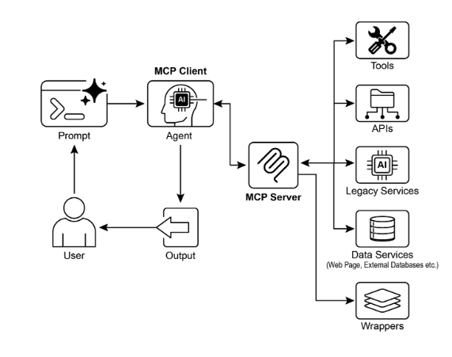

# 第10章：模型語境協定

要使 LLM 能夠作為代理有效運作，其能力必須超越多模態生成。與外部環境的互動是必要的，包括存取當前資料、利用外部軟體，以及執行特定的操作任務。模型語境協定 (MCP) 透過為 LLM 提供與外部資源介面的標準化介面來滿足這個需求。這個協定作為促進一致且可預測整合的關鍵機制。

## MCP 模式概述

想像一個通用適配器，允許任何 LLM 插入任何外部系統、資料庫或工具，而無需為每個系統進行自訂整合。這基本上就是模型語境協定 (MCP) 的功能。它是一個開放標準，設計用於標準化像 Gemini、OpenAI 的 GPT 模型、Mixtral 和 Claude 等 LLM 如何與外部應用程式、資料來源和工具溝通。可以將其視為一種通用連接機制，簡化了 LLM 如何獲得語境、執行行動，以及與各種系統互動。

MCP 運作於客戶端-伺服器架構上。它定義了不同元素——資料 (稱為資源)、互動範本 (本質上是提示) 和可執行函數 (稱為工具)——如何由 MCP 伺服器暴露。這些然後由 MCP 客戶端消費，客戶端可以是 LLM 主機應用程式或 AI 代理本身。這種標準化方法大幅減少了將 LLM 整合到多樣化操作環境中的複雜性。

然而，MCP 是「代理介面」的契約，其有效性很大程度上取決於它暴露的底層 API 的設計。開發者有風險簡單地包裝現有的遺留 API 而不進行修改，這對代理來說可能是次優的。例如，如果票務系統的 API 只允許逐一檢索完整票務詳細資訊，被要求總結高優先級票務的代理在高容量時會很慢且不準確。要真正有效，底層 API 應該用確定性功能如過濾和排序來改善，以幫助非確定性代理有效工作。這突顯了代理並不神奇地取代確定性工作流程；它們通常需要更強的確定性支援才能成功。

此外，MCP 可以包裝一個其輸入或輸出仍然不是代理本質上可理解的 API。只有當 API 的資料格式對代理友好時，API 才有用，這是 MCP 本身不強制執行的保證。例如，為回傳 PDF 檔案的文件儲存建立 MCP 伺服器，如果消費代理無法解析 PDF 內容，則基本上無用。更好的方法是首先建立一個回傳文件文字版本的 API，如 Markdown，代理實際上可以讀取和處理。這表明開發者必須考慮的不僅是連接，還有正在交換的資料的性質，以確保真正的相容性。

## MCP vs. 工具函數呼叫

模型語境協定 (MCP) 和工具函數呼叫是不同的機制，使 LLM 能夠與外部能力 (包括工具) 互動並執行行動。雖然兩者都用於擴展 LLM 能力超越文字生成，但它們在方法和抽象層級上有所不同。

工具函數呼叫可以被視為 LLM 對特定、預定義工具或函數的直接請求。注意在這個語境中我們交替使用「工具」和「函數」這兩個詞。這種互動的特徵是一對一的溝通模型，其中 LLM 基於對需要外部行動的使用者意圖的理解格式化請求。應用程式程式碼然後執行這個請求並將結果回傳給 LLM。這個過程通常是專有的，在不同的 LLM 提供者之間有所變化。

相比之下，模型語境協定 (MCP) 作為 LLM 發現、溝通和利用外部能力的標準化介面運作。它作為一個開放協定，促進與廣泛工具和系統的互動，旨在建立一個生態系統，其中任何符合規範的工具都可以被任何符合規範的 LLM 存取。這促進了不同系統和實作之間的互操作性、可組合性和可重用性。透過採用聯邦模型，我們顯著改善互操作性並釋放現有資產的價值。這種策略允許我們透過簡單地將它們包裝在 MCP 符合規範的介面中，將分散和遺留服務帶入現代生態系統。這些服務繼續獨立運作，但現在可以組合到新的應用程式和工作流程中，由 LLM 編排它們的協作。這促進了敏捷性和可重用性，而無需對基礎系統進行昂貴的重寫。

以下是 MCP 和工具函數呼叫之間基本差異的分解：

| 功能 | 工具函數呼叫 | 模型語境協定 (MCP) |
| ----- | ----- | ----- |
| **標準化** | 專有且供應商特定。格式和實作在 LLM 提供者之間有所不同。 | 開放、標準化協定，促進不同 LLM 和工具之間的互操作性。 |
| **範圍** | LLM 請求執行特定、預定義函數的直接機制。 | LLM 和外部工具如何發現和溝通的更廣泛框架。 |
| **架構** | LLM 和應用程式工具處理邏輯之間的一對一互動。 | 客戶端-伺服器架構，其中 LLM 驅動的應用程式 (客戶端) 可以連接並利用各種 MCP 伺服器 (工具)。 |
| **發現** | LLM 被明確告知在特定對話語境中有哪些工具可用。 | 啟用可用工具的動態發現。MCP 客戶端可以查詢伺服器以查看它提供哪些能力。 |
| **可重用性** | 工具整合通常與正在使用的特定應用程式和 LLM 緊密耦合。 | 促進可重用、獨立「MCP 伺服器」的開發，可以被任何符合規範的應用程式存取。 |

將工具函數呼叫想像為給 AI 一組特定的自訂工具，如特定的扳手和螺絲起子。這對於具有固定任務集的工作坊是高效的。另一方面，MCP (模型語境協定) 就像建立一個通用、標準化的電源插座系統。它本身不提供工具，但它允許任何製造商的任何符合規範的工具插入並工作，啟用動態且不斷擴展的工作坊。

簡而言之，函數呼叫提供對少數特定函數的直接存取，而 MCP 是讓 LLM 發現和使用廣泛外部資源的標準化溝通框架。對於簡單應用程式，特定工具就足夠了；對於需要適應的複雜、互連 AI 系統，像 MCP 這樣的通用標準是必要的。

## MCP 的其他考量

雖然 MCP 提供了一個強大的框架，徹底評估需要考慮幾個影響其對給定使用案例適用性的關鍵方面。讓我們更詳細地看一些方面：

* **工具 vs. 資源 vs. 提示**：理解這些元件的特定角色很重要。資源是靜態資料 (例如，PDF 檔案、資料庫記錄)。工具是執行行動的可執行函數 (例如，發送電子郵件、查詢 API)。提示是指導 LLM 如何與資源或工具互動的範本，確保互動是結構化且有效的。
* **可發現性**：MCP 的一個關鍵優勢是 MCP 客戶端可以動態查詢伺服器以了解它提供的工具和資源。這種「即時」發現機制對於需要適應新能力而無需重新部署的代理來說是強大的。
* **安全性**：透過任何協定暴露工具和資料需要穩健的安全措施。MCP 實作必須包括認證和授權，以控制哪些客戶端可以存取哪些伺服器以及它們被允許執行的特定行動。
* **實作**：雖然 MCP 是開放標準，但其實作可能很複雜。然而，提供者開始簡化這個過程。例如，一些模型提供者如 Anthropic 或 FastMCP 提供 SDK，抽象掉大部分樣板程式碼，讓開發者更容易建立和連接 MCP 客戶端和伺服器。
* **錯誤處理**：全面的錯誤處理策略至關重要。協定必須定義錯誤 (例如，工具執行失敗、不可用伺服器、無效請求) 如何傳達回 LLM，以便它能理解失敗並可能嘗試替代方法。
* **本地 vs. 遠端伺服器**：MCP 伺服器可以部署在與代理相同的機器上本地，或者遠端在不同的伺服器上。本地伺服器可能被選擇用於速度和敏感資料的安全性，而遠端伺服器架構允許跨組織對通用工具的共享、可擴充存取。
* **即時 vs. 批次**：MCP 可以支援即時、互動會話和更大規模的批次處理。選擇取決於應用程式，從需要即時工具存取的即時對話代理到批次處理記錄的資料分析管線。
* **傳輸機制**：協定還定義了溝通的底層傳輸層。對於本地互動，它使用透過 STDIO (標準輸入/輸出) 的 JSON-RPC 進行高效的程序間溝通。對於遠端連接，它利用像可串流 HTTP 和伺服器發送事件 (SSE) 等網路友好協定，以啟用持久且高效的客戶端-伺服器溝通。

模型語境協定使用客戶端-伺服器模型來標準化資訊流。理解元件互動是 MCP 先進代理行為的關鍵：

1. **大語言模型 (LLM)**：核心智慧。它處理使用者請求、制定計畫，並決定何時需要存取外部資訊或執行行動。
2. **MCP 客戶端**：這是 LLM 周圍的應用程式或包裝器。它作為中介，將 LLM 的意圖翻譯成符合 MCP 標準的正式請求。它負責發現、連接到 MCP 伺服器並與之溝通。
3. **MCP 伺服器**：這是通往外部世界的閘道。它向任何授權的 MCP 客戶端暴露一組工具、資源和提示。每個伺服器通常負責特定領域，如連接到公司內部資料庫、電子郵件服務或公共 API。
4. **可選第三方 (3P) 服務：** 這代表 MCP 伺服器管理和暴露的實際外部工具、應用程式或資料來源。它是執行請求行動的最終端點，如查詢專有資料庫、與 SaaS 平台互動，或呼叫公共天氣 API。

互動流程如下：

1. **發現**：MCP 客戶端代表 LLM 查詢 MCP 伺服器，詢問它提供哪些能力。伺服器回應一個清單，列出其可用工具 (例如，send_email)、資源 (例如，customer_database) 和提示。
2. **請求制定**：LLM 確定它需要使用其中一個發現的工具。例如，它決定發送電子郵件。它制定請求，指定要使用的工具 (send_email) 和必要參數 (收件人、主旨、內文)。
3. **客戶端溝通**：MCP 客戶端取得 LLM 制定的請求，並將其作為標準化呼叫發送到適當的 MCP 伺服器。
4. **伺服器執行**：MCP 伺服器接收請求。它認證客戶端、驗證請求，然後透過與底層軟體介面 (例如，呼叫電子郵件 API 的 send() 函數) 執行指定的行動。
5. **回應和語境更新**：執行後，MCP 伺服器將標準化回應發送回 MCP 客戶端。這個回應指示行動是否成功，並包括任何相關輸出 (例如，已發送電子郵件的確認 ID)。客戶端然後將這個結果傳回給 LLM，更新其語境並使其能夠繼續執行任務的下一步。

## 實際應用與使用案例

MCP 顯著擴展了 AI/LLM 能力，使它們更多元化且更強大。以下是九個關鍵使用案例：

* **資料庫整合：** MCP 允許 LLM 和代理無縫存取和與資料庫中的結構化資料互動。例如，使用資料庫的 MCP 工具箱，代理可以查詢 Google BigQuery 資料集以檢索即時資訊、生成報告或更新記錄，所有這些都由自然語言命令驅動。
* **生成媒體編排：** MCP 使代理能夠與先進的生成媒體服務整合。透過 Genmedia 服務的 MCP 工具，代理可以編排涉及 Google 的 Imagen 進行圖片生成、Google 的 Veo 進行影片建立、Google 的 Chirp 3 HD 進行逼真語音，或 Google 的 Lyria 進行音樂創作的工作流程，允許在 AI 應用程式內進行動態內容建立。
* **外部 API 互動：** MCP 為 LLM 呼叫和接收來自任何外部 API 的回應提供標準化方法。這意味著代理可以獲取即時天氣資料、拉取股價、發送電子郵件或與 CRM 系統互動，將其能力遠遠擴展超越其核心語言模型。
* **基於推理的資訊提取：** 利用 LLM 強大的推理技能，MCP 促進有效的、查詢相關的資訊提取，超越傳統的搜尋和檢索系統。代理可以分析文字並提取直接回答使用者複雜問題的精確條款、數字或陳述，而不是傳統搜尋工具回傳整個文件。
* **自訂工具開發：** 開發者可以建立自訂工具並透過 MCP 伺服器暴露它們 (例如，使用 FastMCP)。這允許專門的內部函數或專有系統以標準化、易於消費的格式提供給 LLM 和其他代理，無需直接修改 LLM。
* **標準化 LLM 到應用程式溝通：** MCP 確保 LLM 和它們互動的應用程式之間一致的溝通層。這減少了整合開銷，促進不同 LLM 提供者和主機應用程式之間的互操作性，並簡化複雜代理系統的開發。
* **複雜工作流程編排：** 透過結合各種 MCP 暴露的工具和資料來源，代理可以編排高度複雜的多步驟工作流程。例如，代理可以從資料庫檢索客戶資料、生成個人化行銷圖片、起草客製化電子郵件，然後發送它，所有這些都透過與不同 MCP 服務互動。
* **IoT 設備控制：** MCP 可以促進 LLM 與物聯網 (IoT) 設備的互動。代理可以使用 MCP 向智慧家電、工業感測器或機器人發送命令，實現物理系統的自然語言控制和自動化。
* **金融服務自動化：** 在金融服務中，MCP 可以讓 LLM 與各種金融資料來源、交易平台或合規系統互動。代理可能分析市場資料、執行交易、生成個人化財務建議或自動化法規報告，同時維持安全且標準化的溝通。

簡而言之，模型語境協定 (MCP) 使代理能夠從資料庫、API 和網路資源存取即時資訊。它也允許代理執行行動，如發送電子郵件、更新記錄、控制設備，並透過整合和處理來自各種來源的資料執行複雜任務。此外，MCP 支援 AI 應用程式的媒體生成工具。

## 使用 ADK 的實作程式碼範例

本節概述如何連接到提供檔案系統操作的本地 MCP 伺服器，使 ADK 代理能夠與本地檔案系統互動。

### 使用 MCPToolset 的代理設定

要配置代理進行檔案系統互動，必須建立 `agent.py` 檔案 (例如，在 `./adk_agent_samples/mcp_agent/agent.py`)。`MCPToolset` 在 `LlmAgent` 物件的 `tools` 清單中實例化。關鍵是用本地系統上 MCP 伺服器可以存取的目錄的絕對路徑替換 `args` 清單中的 `"/path/to/your/folder"`。這個目錄將是代理執行檔案系統操作的根目錄。

```python
import os

from google.adk.agents import LlmAgent
from google.adk.tools.mcp_tool.mcp_toolset import MCPToolset, StdioServerParameters


# 建立到與此代理腳本相同目錄內名為 'mcp_managed_files' 
# 資料夾的可靠絕對路徑。
# 這確保代理開箱即用進行示範。
# 對於生產，你會將此指向更持久且安全的位置。
TARGET_FOLDER_PATH = os.path.join(
    os.path.dirname(os.path.abspath(__file__)),
    "mcp_managed_files",
)

# 確保目標目錄在代理需要之前存在。
os.makedirs(TARGET_FOLDER_PATH, exist_ok=True)

root_agent = LlmAgent(
    model="gemini-2.0-flash",
    name="filesystem_assistant_agent",
    instruction=(
        "Help the user manage their files. You can list files, read files, and write files. "
        f"You are operating in the following directory: {TARGET_FOLDER_PATH}"
    ),
    tools=[
        MCPToolset(
            connection_params=StdioServerParameters(
                command="npx",
                args=[
                    "-y",  # npx 自動確認安裝的參數
                    "@modelcontextprotocol/server-filesystem",
                    # 這必須是資料夾的絕對路徑。
                    TARGET_FOLDER_PATH,
                ],
            ),
            # 可選：你可以過濾從 MCP 伺服器暴露的工具。
            # 例如，僅允許讀取：
            # tool_filter=['list_directory', 'read_file']
        )
    ],
)
```

`npx` (Node Package Execute)，與 npm (Node Package Manager) 版本 5.2.0 及更高版本捆綁，是一個實用程式，能夠直接從 npm 註冊表執行 Node.js 套件。這消除了全域安裝的需要。本質上，`npx` 作為 npm 套件執行器，通常用於執行許多社群 MCP 伺服器，這些伺服器以 Node.js 套件形式分發。

建立 `__init__.py` 檔案是必要的，以確保 agent.py 檔案被識別為 Agent Developer Kit (ADK) 可發現 Python 套件的一部分。這個檔案應該與 [agent.py](http://agent.py) 位於同一目錄。

```python
# ./adk_agent_samples/mcp_agent/__init__.py 
from . import agent
```

當然，其他支援的命令可供使用。例如，連接到 python3 可以如下實現：

```python
connection_params = StdioConnectionParams(
    server_params={
        "command": "python3",
        "args": ["./agent/mcp_server.py"],
        "env": {
            "SERVICE_ACCOUNT_PATH": SERVICE_ACCOUNT_PATH,
            "DRIVE_FOLDER_ID": DRIVE_FOLDER_ID,
        },
    }
)
```

UVX，在 Python 語境中，指的是一個利用 uv 在臨時、隔離的 Python 環境中執行命令的命令列工具。本質上，它允許你執行 Python 工具和套件，而無需在全域或專案環境中安裝它們。你可以透過 MCP 伺服器執行它。

```python
connection_params = StdioConnectionParams(
    server_params={
        "command": "uvx",
        "args": ["mcp-google-sheets@latest"],
        "env": {
            "SERVICE_ACCOUNT_PATH": SERVICE_ACCOUNT_PATH,
            "DRIVE_FOLDER_ID": DRIVE_FOLDER_ID,
        },
    }
)
```

一旦建立了 MCP 伺服器，下一步是連接到它。

## 使用 ADK Web 連接 MCP 伺服器

首先，執行 'adk web'。在終端中導航到 mcp_agent 的父目錄 (例如，adk_agent_samples) 並執行：

```python
cd ./adk_agent_samples # 或你的等效父目錄
adk web
```

一旦 ADK Web UI 在你的瀏覽器中載入，從代理選單中選擇 `filesystem_assistant_agent`。接下來，實驗這些提示：

* "Show me the contents of this folder."
* "Read the `sample.txt` file." (這假設 `sample.txt` 位於 `TARGET_FOLDER_PATH`。)
* "What's in `another_file.md`?"

## 使用 FastMCP 建立 MCP 伺服器

FastMCP 是一個高階 Python 框架，設計用於簡化 MCP 伺服器的開發。它提供抽象層，簡化協定複雜性，讓開發者專注於核心邏輯。

該函式庫使用簡單的 Python 裝飾器能夠快速定義工具、資源和提示。一個重要優勢是其自動結構生成，智慧地解釋 Python 函數簽名、類型提示和文件字串，以構建必要的 AI 模型介面規格。這種自動化最小化手動配置並減少人為錯誤。

除了基本工具建立，FastMCP 促進先進的架構模式，如伺服器組合和代理。這啟用複雜、多元件系統的模組化開發，以及將現有服務無縫整合到 AI 可存取的框架中。此外，FastMCP 包含針對高效、分散式和可擴充 AI 驅動應用程式的優化。

## 使用 FastMCP 的伺服器設定

## 為了說明，考慮伺服器提供的基本「greet」工具。一旦啟動，ADK 代理和其他 MCP 客戶端可以使用 HTTP 與此工具互動

```python
# fastmcp_server.py
# 這個腳本展示如何使用 FastMCP 建立簡單的 MCP 伺服器。
# 它暴露一個生成問候語的單一工具。
# 1. 確保你已安裝 FastMCP：
# pip install fastmcp

from fastmcp import FastMCP, Client


# 初始化 FastMCP 伺服器。
mcp_server = FastMCP()


# 定義簡單的工具函數。
# `@mcp_server.tool` 裝飾器將此 Python 函數註冊為 MCP 工具。
# 文件字串成為 LLM 的工具描述。
@mcp_server.tool
def greet(name: str) -> str:
    """
    生成個人化問候語。

    Args:
        name: 要問候的人的姓名。

    Returns:
        問候語字串。
    """
    return f"Hello, {name}! Nice to meet you."


# 或者如果你想從腳本執行它：
if __name__ == "__main__":
    mcp_server.run(
        transport="http",
        host="127.0.0.1",
        port=8000,
    )
```

這個 Python 腳本定義了一個名為 greet 的單一函數，它接受一個人的姓名並回傳個人化問候語。這個函數上方的 @tool() 裝飾器自動將其註冊為 AI 或另一個程式可以使用的工具。函數的文件字串和類型提示被 FastMCP 用來告訴代理工具如何工作、需要什麼輸入，以及它將回傳什麼。

當腳本執行時，它啟動 FastMCP 伺服器，在 localhost:8000 上監聽請求。這使 greet 函數作為網路服務可用。代理然後可以被配置為連接到這個伺服器，並使用 greet 工具作為更大任務的一部分生成問候語。伺服器持續執行直到手動停止。

## 使用 ADK 代理消費 FastMCP 伺服器

ADK 代理可以設定為 MCP 客戶端來使用執行中的 FastMCP 伺服器。這需要使用 FastMCP 伺服器的網路位址配置 HttpServerParameters，通常是 <http://localhost:8000>。

可以包含 `tool_filter` 參數來限制代理對伺服器提供的特定工具的工具使用，如 'greet'。當收到像「Greet John Doe」這樣的請求提示時，代理的嵌入式 LLM 識別透過 MCP 可用的 'greet' 工具，用參數「John Doe」調用它，並回傳伺服器的回應。這個過程展示了透過 MCP 暴露的使用者定義工具與 ADK 代理的整合。

要建立這個配置，需要一個代理檔案 (例如，位於 ./adk_agent_samples/fastmcp_client_agent/ 的 agent.py)。這個檔案將實例化 ADK 代理並使用 HttpServerParameters 與操作中的 FastMCP 伺服器建立連接。

```python
# ./adk_agent_samples/fastmcp_client_agent/agent.py
import os

from google.adk.agents import LlmAgent
from google.adk.tools.mcp_tool.mcp_toolset import MCPToolset, HttpServerParameters


# 定義 FastMCP 伺服器的位址。
# 確保你的 fastmcp_server.py (之前定義的) 在此埠上執行。
FASTMCP_SERVER_URL = "http://localhost:8000"

root_agent = LlmAgent(
    model="gemini-2.0-flash",  # 或你偏好的模型
    name="fastmcp_greeter_agent",
    instruction='You are a friendly assistant that can greet people by their name. Use the "greet" tool.',
    tools=[
        MCPToolset(
            connection_params=HttpServerParameters(
                url=FASTMCP_SERVER_URL,
            ),
            # 可選：過濾從 MCP 伺服器暴露的工具
            # 對於此範例，我們預期僅有 'greet'
            tool_filter=["greet"],
        )
    ],
)
```

腳本定義了一個名為 `fastmcp_greeter_agent` 的代理，使用 Gemini 語言模型。它被給予特定指示，作為一個友好助理，其目的是問候人們。關鍵地，程式碼為這個代理配備了執行其任務的工具。它配置 MCPToolset 連接到在 localhost:8000 上執行的獨立伺服器，這預期是來自先前範例的 FastMCP 伺服器。代理被特別授予對該伺服器上託管的 greet 工具的存取權。本質上，這個程式碼設定了系統的客戶端側，建立一個智慧代理，理解其目標是問候人們，並確切知道使用哪個外部工具來完成它。

在 `fastmcp_client_agent` 目錄內建立 `__init__.py` 檔案是必要的。這確保代理被識別為 ADK 的可發現 Python 套件。

首先，開啟新終端並執行 `python fastmcp_server.py` 來啟動 FastMCP 伺服器。接下來，在終端中前往 `fastmcp_client_agent` 的父目錄 (例如，`adk_agent_samples`) 並執行 `adk web`。一旦 ADK Web UI 在你的瀏覽器中載入，從代理選單中選擇 `fastmcp_greeter_agent`。然後你可以透過輸入像「Greet John Doe」這樣的提示來測試它。代理將在你的 FastMCP 伺服器上使用 `greet` 工具來建立回應。

## 一目了然

**什麼：** 要作為有效代理運作，LLM 必須超越簡單的文字生成。它們需要與外部環境互動的能力，以存取當前資料並利用外部軟體。沒有標準化的溝通方法，LLM 和外部工具或資料來源之間的每個整合都變成自訂、複雜且不可重用的努力。這種臨時方法阻礙可擴充性，並使建立複雜、互連的 AI 系統變得困難且低效。

**為什麼：** 模型語境協定 (MCP) 透過作為 LLM 和外部系統之間的通用介面提供標準化解決方案。它建立開放、標準化的協定，定義外部能力如何被發現和使用。運作於客戶端-伺服器模型上，MCP 允許伺服器向任何符合規範的客戶端暴露工具、資料資源和互動提示。LLM 驅動的應用程式作為這些客戶端，以可預測的方式動態發現和與可用資源互動。這種標準化方法促進互操作且可重用元件的生態系統，大幅簡化複雜代理工作流程的開發。

**經驗法則：** 在建立需要與多樣化且不斷發展的外部工具、資料來源和 API 集合互動的複雜、可擴充或企業級代理系統時使用模型語境協定 (MCP)。當不同 LLM 和工具之間的互操作性是優先考量時，以及當代理需要動態發現新能力而無需重新部署時，它是理想的。對於具有固定且有限數量預定義函數的簡單應用程式，直接工具函數呼叫可能就足夠了。

**視覺摘要：**



圖1：模型語境協定

## 關鍵要點

這些是關鍵要點：

* 模型語境協定 (MCP) 是一個開放標準，促進 LLM 和外部應用程式、資料來源和工具之間的標準化溝通。
* 它採用客戶端-伺服器架構，定義暴露和消費資源、提示和工具的方法。
* Agent Developer Kit (ADK) 支援利用現有 MCP 伺服器和透過 MCP 伺服器暴露 ADK 工具。
* FastMCP 簡化 MCP 伺服器的開發和管理，特別是用於暴露在 Python 中實作的工具。
* Genmedia 服務的 MCP 工具允許代理與 Google Cloud 的生成媒體能力整合 (Imagen、Veo、Chirp 3 HD、Lyria)。
* MCP 使 LLM 和代理能夠與現實世界系統互動、存取動態資訊，並執行超越文字生成的行動。

## 結論

模型語境協定 (MCP) 是一個促進大語言模型 (LLM) 和外部系統之間溝通的開放標準。它採用客戶端-伺服器架構，使 LLM 能夠透過標準化工具存取資源、利用提示和執行行動。MCP 允許 LLM 與資料庫互動、管理生成媒體工作流程、控制 IoT 設備，並自動化金融服務。實際範例展示設定代理與 MCP 伺服器溝通，包括檔案系統伺服器和使用 FastMCP 建立的伺服器，說明其與 Agent Developer Kit (ADK) 的整合。MCP 是開發超越基本語言能力的互動 AI 代理的關鍵元件。

## 參考資料

1. Model Context Protocol (MCP) Documentation. (Latest). *Model Context Protocol (MCP)*. [https://google.github.io/adk-docs/mcp/](https://google.github.io/adk-docs/mcp/)
2. FastMCP Documentation. FastMCP. [https://github.com/jlowin/fastmcp](https://github.com/jlowin/fastmcp)
3. MCP Tools for Genmedia Services. *MCP Tools for Genmedia Services*. [https://google.github.io/adk-docs/mcp/\#mcp-servers-for-google-cloud-genmedia](https://google.github.io/adk-docs/mcp/#mcp-servers-for-google-cloud-genmedia)
4. MCP Toolbox for Databases Documentation. (Latest). *MCP Toolbox for Databases*. [https://google.github.io/adk-docs/mcp/databases/](https://google.github.io/adk-docs/mcp/databases/)