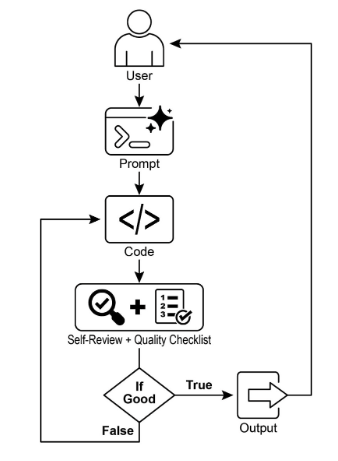
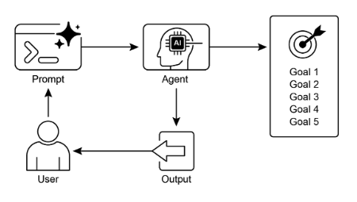

# 第11章：目標設定和監控

要讓 AI 代理真正有效且有目的，它們需要的不僅僅是處理資訊或使用工具的能力；它們需要清楚的方向感，以及知道它們是否真正成功的方法。這就是目標設定和監控模式發揮作用的地方。它是關於給代理特定的目標來努力，並為它們配備追蹤進度和確定是否達成這些目標的手段。

## 目標設定和監控模式概述

想想規劃一次旅行。你不會自發地出現在你的目的地。你決定你想去哪裡 (目標狀態)，弄清楚你從哪裡開始 (初始狀態)，考慮可用選項 (交通、路線、預算)，然後制定一系列步驟：訂票、打包行李、前往機場/車站、登車、抵達、找住宿等。這個逐步過程，通常考慮依賴性和約束，基本上就是我們在代理系統中所說的規劃。

在 AI 代理的語境中，規劃通常涉及代理接受高層次目標並自主或半自主地產生一系列中間步驟或子目標。這些步驟然後可以按順序執行或以更複雜的流程執行，可能涉及其他模式如工具使用、路由或多代理協作。規劃機制可能涉及複雜的搜尋演算法、邏輯推理，或越來越多地利用大語言模型 (LLM) 的能力，基於它們的訓練資料和對任務的理解來產生合理且有效的計畫。

良好的規劃能力允許代理處理不是簡單、單步驟查詢的問題。它使它們能夠處理多面向請求，透過重新規劃適應變化的環境，並編排複雜的工作流程。這是支撐許多先進代理行為的基礎模式，將簡單的反應式系統轉變為能夠主動朝向定義目標工作的系統。

## 實際應用與使用案例

目標設定和監控模式對於建立能夠在複雜、現實世界場景中自主且可靠運作的代理至關重要。以下是一些實際應用：

* **客戶支援自動化：** 代理的目標可能是「解決客戶的帳單查詢」。它監控對話、檢查資料庫條目，並使用工具調整帳單。成功透過確認帳單變更和收到正面客戶回饋來監控。如果問題沒有解決，它會升級。
* **個人化學習系統：** 學習代理可能有「改善學生對代數理解」的目標。它監控學生在練習上的進度，調整教材，並追蹤表現指標如準確性和完成時間，如果學生有困難則調整其方法。
* **專案管理助理：** 代理可能被指派「確保專案里程碑 X 在 Y 日期前完成」。它監控任務狀態、團隊溝通和資源可用性，標記延遲並在目標有風險時建議修正行動。
* **自動交易機器人：** 交易代理的目標可能是「在風險容忍度內最大化投資組合收益」。它持續監控市場資料、其當前投資組合價值和風險指標，當條件符合其目標時執行交易，如果風險閾值被突破則調整策略。
* **機器人和自主車輛：** 自主車輛的主要目標是「安全地將乘客從 A 點運送到 B 點」。它持續監控其環境 (其他車輛、行人、交通號誌)、自身狀態 (速度、燃料) 和沿計畫路線的進度，調整其駕駛行為以安全高效地達成目標。
* **內容審核：** 代理的目標可能是「識別並移除平台 X 上的有害內容」。它監控傳入內容，應用分類模型，並追蹤如假陽性/假陰性等指標，調整其過濾標準或將模糊案例升級給人類審核者。

這個模式對於需要可靠運作、達成特定結果並適應動態條件的代理是基礎的，提供智慧自我管理的必要框架。

## 實作程式碼範例

為了說明目標設定和監控模式，我們有一個使用 LangChain 和 OpenAI API 的範例。這個 Python 腳本概述了一個自主 AI 代理，設計用於生成和改進 Python 程式碼。其核心功能是為指定問題產生解決方案，確保遵守使用者定義的品質基準。

它採用「目標設定和監控」模式，不只是一次生成程式碼，而是進入建立、自我評估和改進的迭代循環。代理的成功透過其自身的 AI 驅動判斷來衡量，判斷生成的程式碼是否成功達到初始目標。最終輸出是一個經過潤飾、註解且準備使用的 Python 檔案，代表這個改進過程的頂點。

**依賴項**：

```python
pip install langchain_openai openai python-dotenv .env file with key in OPENAI_API_KEY
```

你可以透過將其想像為被分配到專案的自主 AI 程式設計師來最好地理解這個腳本 (見圖1)。當你交給 AI 詳細的專案簡報時，過程開始，這是它需要解決的特定編碼問題。

```python
# MIT License
# Copyright (c) 2025 Mahtab Syed
# https://www.linkedin.com/in/mahtabsyed/

"""
實作程式碼範例 - 迭代 2
- 為了說明目標設定和監控模式，我們有一個使用 LangChain 和 OpenAI API 的範例：

目標：建立一個能夠為指定使用案例基於指定目標編寫程式碼的 AI 代理：
- 接受編碼問題 (使用案例) 在程式碼中或可以作為輸入。
- 接受目標清單 (例如，「簡單」、「經過測試」、「處理邊緣情況」) 在程式碼中或可以輸入。
- 使用 LLM (如 GPT-4o) 生成和改進 Python 程式碼直到達成目標。(我使用最多 5 次迭代，這也可以基於設定的目標)
- 要檢查我們是否達成目標，我要求 LLM 判斷這個並僅回答 True 或 False，這使得停止迭代更容易。
- 將最終程式碼保存在 .py 檔案中，具有清潔的檔名和標題註解。
"""

import os
import random
import re
from pathlib import Path

from langchain_openai import ChatOpenAI
from dotenv import load_dotenv, find_dotenv


# 🔐 載入環境變數
_ = load_dotenv(find_dotenv())
OPENAI_API_KEY = os.getenv("OPENAI_API_KEY")
if not OPENAI_API_KEY:
    raise EnvironmentError("❌ 請設定 OPENAI_API_KEY 環境變數。")

# ✅ 初始化 OpenAI 模型
print("📡 初始化 OpenAI LLM (gpt-4o)...")
llm = ChatOpenAI(
    model="gpt-4o",  # 如果你沒有 gpt-4o 的存取權限，使用其他 OpenAI LLM
    temperature=0.3,
    openai_api_key=OPENAI_API_KEY,
)


# --- 實用函數 ---
def generate_prompt(
    use_case: str, goals: list[str], previous_code: str = "", feedback: str = ""
) -> str:
    print("📝 構建程式碼生成提示...")
    base_prompt = f"""
你是一個 AI 編碼代理。你的工作是基於以下使用案例編寫 Python 程式碼：

使用案例：{use_case}

你的目標是：
{chr(10).join(f"- {g.strip()}" for g in goals)}
"""
    if previous_code:
        print("🔄 將先前程式碼添加到提示中進行改進。")
        base_prompt += f"\n先前生成的程式碼：\n{previous_code}"
    if feedback:
        print("📋 包含回饋進行修訂。")
        base_prompt += f"\n先前版本的回饋：\n{feedback}\n"

    base_prompt += "\n請僅回傳修訂後的 Python 程式碼。不要在程式碼外包含註解或說明。"
    return base_prompt


def get_code_feedback(code: str, goals: list[str]) -> str:
    print("🔍 根據目標評估程式碼...")
    feedback_prompt = f"""
你是一個 Python 程式碼審核者。下面顯示了一個程式碼片段。基於以下目標：

{chr(10).join(f"- {g.strip()}" for g in goals)}

請批評這個程式碼並識別是否達成目標。如果需要改進清晰度、簡潔性、正確性、邊緣情況處理或測試覆蓋率，請提及。

程式碼：
{code}
"""
    return llm.invoke(feedback_prompt)


def goals_met(feedback_text: str, goals: list[str]) -> bool:
    """
    使用 LLM 基於回饋文字評估是否達成目標。
    回傳 True 或 False (從 LLM 輸出解析)。
    """
    review_prompt = f"""
你是一個 AI 審核者。

這裡是目標：
{chr(10).join(f"- {g.strip()}" for g in goals)}

這裡是程式碼的回饋：
\"\"\"
{feedback_text}
\"\"\"

基於上述回饋，目標是否已達成？

僅用一個詞回應：True 或 False。
"""
    response = llm.invoke(review_prompt).content.strip().lower()
    return response == "true"


def clean_code_block(code: str) -> str:
    lines = code.strip().splitlines()
    if lines and lines[0].strip().startswith("```"):
        lines = lines[1:]
    if lines and lines[-1].strip() == "```":
        lines = lines[:-1]
    return "\n".join(lines).strip()


def add_comment_header(code: str, use_case: str) -> str:
    comment = f"# 這個 Python 程式實現以下使用案例：\n# {use_case.strip()}\n"
    return comment + "\n" + code


def to_snake_case(text: str) -> str:
    text = re.sub(r"[^a-zA-Z0-9 ]", "", text)
    return re.sub(r"\s+", "_", text.strip().lower())


def save_code_to_file(code: str, use_case: str) -> str:
    print("💾 將最終程式碼保存到檔案...")

    summary_prompt = (
        f"將以下使用案例總結為單一小寫詞或短語，"
        f"不超過 10 個字元，適合 Python 檔名：\n\n{use_case}"
    )
    raw_summary = llm.invoke(summary_prompt).content.strip()
    short_name = re.sub(r"[^a-zA-Z0-9_]", "", raw_summary.replace(" ", "_").lower())[:10]

    random_suffix = str(random.randint(1000, 9999))
    filename = f"{short_name}_{random_suffix}.py"
    filepath = Path.cwd() / filename

    with open(filepath, "w") as f:
        f.write(code)

    print(f"✅ 程式碼已保存到：{filepath}")
    return str(filepath)


# --- 主代理函數 ---
def run_code_agent(use_case: str, goals_input: str, max_iterations: int = 5) -> str:
    goals = [g.strip() for g in goals_input.split(",")]

    print(f"\n🎯 使用案例：{use_case}")
    print("🎯 目標：")
    for g in goals:
        print(f"  - {g}")

    previous_code = ""
    feedback = ""

    for i in range(max_iterations):
        print(f"\n=== 🔁 迭代 {i + 1} / {max_iterations} ===")
        prompt = generate_prompt(
            use_case,
            goals,
            previous_code,
            feedback if isinstance(feedback, str) else feedback.content,
        )

        print("🚧 生成程式碼...")
        code_response = llm.invoke(prompt)
        raw_code = code_response.content.strip()
        code = clean_code_block(raw_code)
        print("\n🧾 生成的程式碼：\n" + "-" * 50 + f"\n{code}\n" + "-" * 50)

        print("\n📤 提交程式碼進行回饋審核...")
        feedback = get_code_feedback(code, goals)
        feedback_text = feedback.content.strip()
        print("\n📥 收到回饋：\n" + "-" * 50 + f"\n{feedback_text}\n" + "-" * 50)

        if goals_met(feedback_text, goals):
            print("✅ LLM 確認目標已達成。停止迭代。")
            break

        print("🛠️ 目標未完全達成。準備下一次迭代...")
        previous_code = code

    final_code = add_comment_header(code, use_case)
    return save_code_to_file(final_code, use_case)


# --- CLI 測試執行 ---
if __name__ == "__main__":
    print("\n🧠 歡迎使用 AI 程式碼生成代理")

    # 範例 1
    use_case_input = "編寫程式碼找出給定正整數的 BinaryGap"
    goals_input = "程式碼易於理解，功能正確，處理全面的邊緣情況，僅接受正整數輸入，用幾個範例列印結果"
    run_code_agent(use_case_input, goals_input)

    # 範例 2
    # use_case_input = "編寫程式碼計算當前目錄及其所有巢狀子目錄中的檔案數量，並列印總數"
    # goals_input = (
    #     "程式碼易於理解，功能正確，處理全面的邊緣情況，忽略效能建議，忽略如 unittest 或 pytest 等測試套件使用建議"
    # )
    # run_code_agent(use_case_input, goals_input)

    # 範例 3
    # use_case_input = "編寫程式碼接受 word doc 或 docx 檔案的命令列輸入並開啟它，計算其中的單詞數和字元數並全部列印"
    # goals_input = "程式碼易於理解，功能正確，處理邊緣情況"
    # run_code_agent(use_case_input, goals_input)
```

除了這個簡報，你提供嚴格的品質檢查清單，這代表最終程式碼必須滿足的目標——如「解決方案必須簡單」、「必須功能正確」或「需要處理意外的邊緣情況」等標準。



圖1：目標設定和監控範例

帶著這個任務，AI 程式設計師開始工作並產生其程式碼的第一個草稿。然而，它不是立即提交這個初始版本，而是暫停執行一個關鍵步驟：嚴格的自我審查。它仔細地將自己的創作與你提供的品質檢查清單上的每個項目進行比較，充當自己的品質保證檢查員。經過這個檢查後，它對自己的進度做出簡單、公正的判決：如果工作符合所有標準則為「True」，如果不足則為「False」。

如果判決是「False」，AI 不會放棄。它進入深思熟慮的修訂階段，使用來自自我批評的見解來精確定位弱點並智慧地重寫程式碼。這個起草、自我審查和改進的循環持續進行，每次迭代都旨在更接近目標。這個過程重複進行，直到 AI 最終透過滿足每個需求達到「True」狀態，或直到達到預定義的嘗試限制，就像開發者在截止日期前工作一樣。一旦程式碼通過這個最終檢查，腳本將經過潤飾的解決方案打包，添加有用的註解並保存到乾淨的新 Python 檔案中，準備使用。

**警告和考量：** 重要的是要注意這是一個示例說明，而不是生產就緒的程式碼。對於現實世界的應用，必須考慮幾個因素。LLM 可能無法完全掌握目標的預期含義，可能錯誤地評估其表現為成功。即使目標被很好地理解，模型也可能產生幻覺。當同一個 LLM 負責編寫程式碼和判斷其品質時，它可能更難發現自己走錯方向。

最終，LLM 不會神奇地產生完美的程式碼；你仍然需要執行和測試產生的程式碼。此外，簡單範例中的「監控」是基本的，會產生過程永遠執行的潛在風險。

```text
充當具有對產生乾淨、正確和簡單程式碼深度承諾的專家程式碼審核者。你的核心使命是透過確保每個建議都基於現實和最佳實務來消除程式碼「幻覺」。當我提供程式碼片段時，我希望你：-- 識別和糾正錯誤：指出任何邏輯缺陷、錯誤或潛在的執行時間錯誤。-- 簡化和重構：建議使程式碼更可讀、高效和可維護而不犧牲正確性的變更。-- 提供清楚說明：對於每個建議的變更，解釋為什麼這是改進，參考乾淨程式碼、效能或安全性的原則。-- 提供修正的程式碼：顯示你建議變更的「之前」和「之後」，使改進明確。你的回饋應該直接、建設性，並總是旨在改善程式碼的品質。
```

更穩健的方法涉及透過給代理團隊特定角色來分離這些關注點。例如，我使用 Gemini 建立了一個個人的 AI 代理團隊，其中每個都有特定角色：

* 同事程式設計師：協助編寫和腦力激盪程式碼。
* 程式碼審核者：捕捉錯誤並建議改進。
* 文件編寫者：生成清楚簡潔的文件。
* 測試編寫者：建立全面的單元測試。
* 提示改進者：優化與 AI 的互動。

在這個多代理系統中，作為與程式設計師代理分離實體的程式碼審核者，具有類似範例中法官的提示，這顯著改善了客觀評估。這種結構自然導致更好的實務，因為測試編寫者代理可以滿足為同事程式設計師產生的程式碼編寫單元測試的需要。

我留給有興趣的讀者添加這些更複雜的控制並使程式碼更接近生產就緒的任務。

## 一目了然

**什麼**：AI 代理通常缺乏清楚的方向，阻止它們有目的地行動，超越簡單的反應式任務。沒有定義的目標，它們無法獨立處理複雜的多步驟問題或編排複雜的工作流程。此外，沒有固有機制讓它們確定其行動是否導致成功結果。這限制了它們的自主性，並阻止它們在動態、現實世界場景中真正有效，在這些場景中僅僅任務執行是不夠的。

**為什麼**：目標設定和監控模式透過將目的感和自我評估嵌入代理系統提供標準化解決方案。它涉及明確定義代理要達成的清楚、可衡量目標。同時，它建立監控機制，持續追蹤代理的進度和其環境狀態與這些目標的對比。這建立了關鍵的回饋循環，使代理能夠評估其表現、修正其路線，並在偏離成功路徑時調整其計畫。透過實施這個模式，開發者可以將簡單的反應式代理轉變為能夠自主且可靠運作的主動、目標導向系統。

**經驗法則**：當 AI 代理必須自主執行多步驟任務、適應動態條件，並在沒有持續人工干預的情況下可靠地達成特定、高層次目標時使用此模式。

**視覺摘要**：



圖2：目標設計模式

## 關鍵要點

關鍵要點包括：

* 目標設定和監控為代理配備目的和追蹤進度的機制。
* 目標應該是具體、可衡量、可達成、相關且有時限的 (SMART)。
* 清楚定義指標和成功標準對有效監控至關重要。
* 監控涉及觀察代理行動、環境狀態和工具輸出。
* 來自監控的回饋循環允許代理適應、修訂計畫或升級問題。
* 在 Google 的 ADK 中，目標通常透過代理指示傳達，監控透過狀態管理和工具互動完成。

## 結論

本章專注於目標設定和監控的關鍵範式。我強調了這個概念如何將 AI 代理從僅僅反應式系統轉變為主動、目標驅動的實體。文字強調了定義清楚、可衡量目標和建立嚴格監控程序來追蹤進度的重要性。實際應用展示了這個範式如何支援跨各種領域的可靠自主運作，包括客戶服務和機器人。概念編碼範例說明了在結構化框架內這些原則的實施，使用代理指令和狀態管理來指導和評估代理對其指定目標的達成。最終，為代理配備制定和監督目標的能力是建立真正智慧且負責的 AI 系統的基本步驟。

## 參考資料

1. SMART Goals Framework. [https://en.wikipedia.org/wiki/SMART\_criteria](https://en.wikipedia.org/wiki/SMART_criteria)