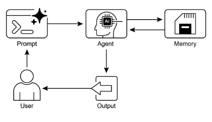

# 第8章：記憶體管理

有效的記憶體管理對於智慧代理保留資訊至關重要。代理需要不同類型的記憶體，就像人類一樣，才能有效運作。本章深入探討記憶體管理，特別是處理代理的即時 (短期) 和持久 (長期) 記憶體需求。

在代理系統中，記憶體指的是代理保留和利用過去互動、觀察和學習經驗資訊的能力。這種能力使代理能夠做出明智的決策、維持對話語境，並隨時間改進。代理記憶體通常分為兩種主要類型：

* **短期記憶體 (語境記憶體)：** 類似於工作記憶體，這保存當前正在處理或最近存取的資訊。對於使用大語言模型 (LLM) 的代理，短期記憶體主要存在於語境視窗內。這個視窗包含最近的訊息、代理回覆、工具使用結果，以及來自當前互動的代理反思，所有這些都會影響 LLM 的後續回應和行動。語境視窗的容量有限，限制了代理可以直接存取的最近資訊量。有效的短期記憶體管理涉及在這個有限空間內保留最相關的資訊，可能透過摘要較舊對話片段或強調關鍵細節等技術。具有「長語境」視窗的模型出現只是擴大了這種短期記憶體的大小，允許在單一互動中保存更多資訊。然而，這種語境仍然是臨時的，會話結束後就會遺失，每次處理都可能昂貴且低效。因此，代理需要單獨的記憶體類型來實現真正的持久性，從過去的互動中回想資訊，並建立持久的知識庫。
* **長期記憶體 (持久記憶體)：** 這作為代理需要在各種互動、任務或長期間保留資訊的儲存庫，類似於長期知識庫。資料通常儲存在代理即時處理環境之外，常常在資料庫、知識圖譜或向量資料庫中。在向量資料庫中，資訊被轉換為數值向量並儲存，使代理能夠基於語義相似性而非精確關鍵字匹配來檢索資料，這個過程稱為語義搜尋。當代理需要來自長期記憶體的資訊時，它查詢外部儲存，檢索相關資料，並將其整合到短期語境中以供即時使用，從而將先前知識與當前互動結合。

## 實際應用與使用案例

記憶體管理對於代理追蹤資訊並隨時間智慧地執行至關重要。這對於代理超越基本問答能力是必要的。應用包括：

* **聊天機器人和對話式 AI：** 維持對話流程依賴短期記憶體。聊天機器人需要記住先前的使用者輸入以提供連貫的回應。長期記憶體使聊天機器人能夠回憶使用者偏好、過去問題或先前討論，提供個人化和持續的互動。
* **任務導向代理：** 管理多步驟任務的代理需要短期記憶體來追蹤先前步驟、當前進度和整體目標。這些資訊可能存在於任務的語境或臨時儲存中。長期記憶體對於存取不在即時語境中的特定使用者相關資料至關重要。
* **個人化體驗：** 提供客製化互動的代理利用長期記憶體來儲存和檢索使用者偏好、過去行為和個人資訊。這允許代理調整其回應和建議。
* **學習和改進：** 代理可以透過從過去互動中學習來改善其表現。成功策略、錯誤和新資訊儲存在長期記憶體中，促進未來的適應。強化學習代理以這種方式儲存學習到的策略或知識。
* **資訊檢索 (RAG)：** 設計用於回答問題的代理存取知識庫，即它們的長期記憶體，通常在檢索增強生成 (RAG) 中實現。代理檢索相關文件或資料來告知其回應。
* **自主系統：** 機器人或自動駕駛汽車需要記憶體來儲存地圖、路線、物體位置和學習到的行為。這涉及用於即時周圍環境的短期記憶體和用於一般環境知識的長期記憶體。

記憶體使代理能夠維持歷史、學習、個人化互動，並管理複雜的時間相關問題。

## 實作程式碼：Google Agent Developer Kit (ADK) 中的記憶體管理

Google Agent Developer Kit (ADK) 提供了一種結構化的方法來管理語境和記憶體，包括用於實際應用的元件。對 ADK 的 Session、State 和 Memory 的深入理解對於建立需要保留資訊的代理至關重要。

就像在人類互動中一樣，代理需要能夠回憶先前的交換以進行連貫和自然的對話。ADK 透過三個核心概念及其相關服務簡化了語境管理。

與代理的每個互動都可以視為一個獨特的對話執行緒。代理可能需要存取來自較早互動的資料。ADK 將此結構化如下：

* **Session：** 一個個別的聊天執行緒，記錄該特定互動的訊息和行動 (Events)，也儲存與該對話相關的臨時資料 (State)。
* **State (`session.state`)：** 儲存在 Session 內的資料，包含僅與當前活躍聊天執行緒相關的資訊。
* **Memory：** 來自各種過去聊天或外部來源的資訊的可搜尋儲存庫，作為超出即時對話的資料檢索資源。

ADK 提供專門的服務來管理建立複雜、有狀態和語境感知代理所必需的關鍵元件。SessionService 透過處理聊天執行緒 (Session 物件) 的啟動、記錄和終止來管理它們，而 MemoryService 監督長期知識 (Memory) 的儲存和檢索。

SessionService 和 MemoryService 都提供各種配置選項，允許使用者根據應用需求選擇儲存方法。記憶體內選項可用於測試目的，儘管資料在重新啟動後不會持久。對於持久儲存和擴充性，ADK 也支援資料庫和雲端服務。

### Session：追蹤每個聊天

ADK 中的 Session 物件設計用來追蹤和管理個別聊天執行緒。當與代理開始對話時，SessionService 產生一個 Session 物件，表示為 `google.adk.sessions.Session`。這個物件封裝與特定對話執行緒相關的所有資料，包括唯一識別符 (`id`、`app_name`、`user_id`)、作為 Event 物件的事件時間順序記錄、稱為 state 的會話特定臨時資料儲存區域，以及指示最後更新時間的時間戳 (`last_update_time`)。開發者通常透過 SessionService 間接與 Session 物件互動。SessionService 負責管理對話會話的生命週期，包括啟動新會話、恢復先前會話、記錄會話活動 (包括狀態更新)、識別活躍會話，以及管理會話資料的移除。ADK 提供幾種具有不同儲存機制的 SessionService 實作，用於會話歷史和臨時資料，例如 InMemorySessionService，適合測試但不提供跨應用程式重新啟動的資料持久性。

```python
# 範例：使用 InMemorySessionService 
# 這適合本地開發和測試，不需要跨應用程式重新啟動的資料持久性。
from google.adk.sessions import InMemorySessionService
session_service = InMemorySessionService()
```

然後有 DatabaseSessionService，如果你想要可靠地儲存到你管理的資料庫。

```python
# 範例：使用 DatabaseSessionService 
# 這適合需要持久儲存的生產或開發環境。
# 你需要配置資料庫 URL (例如，用於 SQLite、PostgreSQL 等)。
# 需要：pip install google-adk[sqlalchemy] 和資料庫驅動程式 (例如，PostgreSQL 的 psycopg2) 
from google.adk.sessions import DatabaseSessionService 
# 使用本地 SQLite 檔案的範例：
db_url = "sqlite:///./my_agent_data.db"
session_service = DatabaseSessionService(db_url=db_url)
```

此外，還有 VertexAiSessionService，它使用 Vertex AI 基礎設施在 Google Cloud 上進行可擴充的生產。

```python
# 範例：使用 VertexAiSessionService
# 這適合 Google Cloud Platform 上的可擴充生產，利用
# Vertex AI 基礎設施進行會話管理。
# 需要：pip install google-adk[vertexai] 和 GCP 設定/認證

from google.adk.sessions import VertexAiSessionService


PROJECT_ID = "your-gcp-project-id"  # 替換為你的 GCP 專案 ID
LOCATION = "us-central1"  # 替換為你想要的 GCP 位置

# 與此服務一起使用的 app_name 應該對應到 Reasoning Engine ID 或名稱
REASONING_ENGINE_APP_NAME = (
    "projects/your-gcp-project-id/locations/us-central1/reasoningEngines/your-engine-id"
)  # 替換為你的 Reasoning Engine 資源名稱

session_service = VertexAiSessionService(project=PROJECT_ID, location=LOCATION)

# 使用此服務時，將 REASONING_ENGINE_APP_NAME 傳遞給服務方法：
# session_service.create_session(app_name=REASONING_ENGINE_APP_NAME, ...)
# session_service.get_session(app_name=REASONING_ENGINE_APP_NAME, ...)
# session_service.append_event(session, event, app_name=REASONING_ENGINE_APP_NAME)
# session_service.delete_session(app_name=REASONING_ENGINE_APP_NAME, ...)
```

選擇適當的 SessionService 至關重要，因為它決定了代理的互動歷史和臨時資料如何儲存以及它們的持久性。

每個訊息交換涉及一個循環過程：收到訊息，Runner 使用 SessionService 檢索或建立 Session，代理使用 Session 的語境 (狀態和歷史互動) 處理訊息，代理產生回應並可能更新狀態，Runner 將此封裝為 Event，`session_service.append_event` 方法記錄新事件並在儲存中更新狀態。然後 Session 等待下一個訊息。理想情況下，當互動結束時使用 `delete_session` 方法來終止會話。這個過程說明了 SessionService 如何透過管理 Session 特定的歷史和臨時資料來維持連續性。

### State：Session 的便條本

在 ADK 中，每個代表聊天執行緒的 Session 都包含一個狀態元件，類似於代理在該特定對話期間的臨時工作記憶體。雖然 session.events 記錄整個聊天歷史，session.state 儲存和更新與活躍聊天相關的動態資料點。

基本上，session.state 作為一個字典運作，將資料儲存為鍵值對。其核心功能是使代理能夠保留和管理連貫對話所必需的細節，例如使用者偏好、任務進度、增量資料收集或影響後續代理行動的條件標誌。

狀態的結構包括與可序列化 Python 類型的值配對的字串鍵，包括字串、數字、布林值、清單和包含這些基本類型的字典。狀態是動態的，在整個對話中演變。這些變更的持久性取決於配置的 SessionService。

狀態組織可以透過使用鍵前綴來定義資料範圍和持久性來實現。沒有前綴的鍵是會話特定的。

* user: 前綴將資料與跨所有會話的使用者 ID 關聯。
* app: 前綴指定在應用程式的所有使用者之間共享的資料。
* temp: 前綴表示僅對當前處理輪次有效且不會持久儲存的資料。

代理透過單一 session.state 字典存取所有狀態資料。SessionService 處理資料檢索、合併和持久性。狀態應該在透過 `session_service.append_event()` 向會話歷史添加 Event 時更新。這確保了準確的追蹤、在持久服務中的適當儲存，以及狀態變更的安全處理。

#### 1. 簡單方法：使用 `output_key` (用於代理文字回覆)

如果你只想將代理的最終文字回應直接儲存到狀態中，這是最簡單的方法。當你設定 LlmAgent 時，只需告訴它你想要使用的 output_key。Runner 看到這個並自動建立必要的行動，在附加事件時將回應儲存到狀態。讓我們看一個展示透過 `output_key` 更新狀態的程式碼範例。

```python
# 從 Google Agent Developer Kit (ADK) 匯入必要的類別
from google.adk.agents import LlmAgent
from google.adk.sessions import InMemorySessionService, Session
from google.adk.runners import Runner
from google.genai.types import Content, Part


# 定義一個具有 output_key 的 LlmAgent。
greeting_agent = LlmAgent(
 name="Greeter",
 model="gemini-2.0-flash",
 instruction="Generate a short, friendly greeting.",
 output_key="last_greeting",
)


# --- 設定 Runner 和 Session ---
app_name, user_id, session_id = "state_app", "user1", "session1"

session_service = InMemorySessionService()

runner = Runner(
    agent=greeting_agent,
    app_name=app_name,
    session_service=session_service,
)

session = session_service.create_session(
    app_name=app_name,
    user_id=user_id,
    session_id=session_id,
)

print(f"Initial state: {session.state}")


# --- 執行代理 ---
user_message = Content(parts=[Part(text="Hello")])

print("\n--- Running the agent ---")
for event in runner.run(
    user_id=user_id,
    session_id=session_id,
    new_message=user_message,
):
    if event.is_final_response():
        print("Agent responded.")


# --- 檢查更新的狀態 ---
# 在 runner 完成處理所有事件後正確檢查狀態。
updated_session = session_service.get_session(app_name, user_id, session_id)
print(f"\nState after agent run: {updated_session.state}")
```

在幕後，Runner 看到你的 `output_key` 並在呼叫 `append_event` 時自動建立必要的帶有 `state_delta` 的行動。

#### 2. 標準方法：使用 `EventActions.state_delta` (用於更複雜的更新)

對於需要做更複雜事情的時候——例如一次更新多個鍵、儲存不只是文字的東西、針對特定範圍如 user: 或 app:，或者進行與代理最終文字回覆無關的更新——你會手動建立狀態變更的字典 (`state_delta`) 並將其包含在你正在附加的 Event 的 EventActions 中。讓我們看一個範例：

```python
import time

from google.adk.tools.tool_context import ToolContext
from google.adk.sessions import InMemorySessionService


# --- 定義推薦的基於工具的方法 ---
def log_user_login(tool_context: ToolContext) -> dict:
    """
    在使用者登入事件時更新會話狀態。
    這個工具封裝了與使用者登入相關的所有狀態變更。

    Args:
        tool_context: 由 ADK 自動提供，提供對會話狀態的存取。

    Returns:
        確認行動成功的字典。
    """
    # 透過提供的語境直接存取狀態。
    state = tool_context.state

    # 取得當前值或預設值，然後更新狀態。
    # 這樣更乾淨且將邏輯集中在一起。
    login_count = state.get("user:login_count", 0) + 1
    state["user:login_count"] = login_count
    state["task_status"] = "active"
    state["user:last_login_ts"] = time.time()
    state["temp:validation_needed"] = True

    print("State updated from within the `log_user_login` tool.")

    return {
        "status": "success",
        "message": f"User login tracked. Total logins: {login_count}.",
    }


# --- 使用方法的示範 ---
# 在真實應用程式中，LLM Agent 會決定呼叫這個工具。
# 這裡，我們模擬直接呼叫以作示範用途。

# 1. 設定
session_service = InMemorySessionService()
app_name, user_id, session_id = "state_app_tool", "user3", "session3"

session = session_service.create_session(
    app_name=app_name,
    user_id=user_id,
    session_id=session_id,
    state={"user:login_count": 0, "task_status": "idle"},
)

print(f"Initial state: {session.state}")

# 2. 模擬工具呼叫 (在真實應用程式中，ADK Runner 會做這件事)
# 我們手動建立一個 ToolContext 只是為了這個獨立範例。
from google.adk.tools.tool_context import InvocationContext

mock_context = ToolContext(
    invocation_context=InvocationContext(
        app_name=app_name,
        user_id=user_id,
        session_id=session_id,
        session=session,
        session_service=session_service,
    )
)

# 3. 執行工具
log_user_login(mock_context)

# 4. 檢查更新的狀態
updated_session = session_service.get_session(app_name, user_id, session_id)
print(f"State after tool execution: {updated_session.state}")

# 預期輸出會顯示與「之前」案例相同的狀態變更，
# 但程式碼組織顯著更乾淨和更穩健。
```

這段程式碼展示了一種基於工具的方法來管理應用程式中的使用者會話狀態。它定義了一個函數 *log_user_login*，作為一個工具。這個工具負責在使用者登入時更新會話狀態。
該函數接受一個 ToolContext 物件，由 ADK 提供，用於存取和修改會話的狀態字典。在工具內，它增加 *user:login_count*，將 *task_status* 設為「active」，記錄 *user:last_login_ts (時間戳)*，並添加一個臨時標誌 temp:validation_needed。

程式碼的示範部分模擬了這個工具的使用方式。它設定了一個記憶體內會話服務並建立一個具有一些預定義狀態的初始會話。然後手動建立一個 ToolContext 來模擬 ADK Runner 執行工具的環境。`log_user_login` 函數用這個模擬語境呼叫。最後，程式碼再次檢索會話以顯示狀態已被工具的執行更新。目標是展示如何將狀態變更封裝在工具內，使程式碼比直接在工具外操作狀態更乾淨和更有組織。

注意，在檢索會話後直接修改 `session.state` 字典是強烈不建議的，因為它繞過了標準的事件處理機制。這種直接變更不會記錄在會話的事件歷史中，可能不會被選定的 `SessionService` 持久化，可能導致並發問題，且不會更新重要的中繼資料如時間戳。更新會話狀態的推薦方法是在 `LlmAgent` 上使用 `output_key` 參數 (特別針對代理的最終文字回應) 或在透過 `session_service.append_event()` 附加事件時在 `EventActions.state_delta` 中包含狀態變更。`session.state` 應該主要用於讀取現有資料。

總結，在設計你的狀態時，保持簡單，使用基本資料類型，給你的鍵清楚的名稱並正確使用前綴，避免深度巢狀，並總是使用 append_event 過程來更新狀態。

## Memory：透過 MemoryService 進行長期知識管理

在代理系統中，Session 元件維持當前聊天歷史 (事件) 和特定於單一對話的臨時資料 (狀態) 的記錄。然而，要讓代理在多個互動中保留資訊或存取外部資料，就需要長期知識管理。這由 MemoryService 促進。

```python
# 範例：使用 InMemoryMemoryService
# 這適合本地開發和測試，不需要跨應用程式重新啟動的資料持久性。
# 當應用程式停止時記憶體內容會遺失。

from google.adk.memory import InMemoryMemoryService

memory_service = InMemoryMemoryService()
```

Session 和 State 可以概念化為單一聊天會話的短期記憶體，而由 MemoryService 管理的長期知識則作為持久且可搜尋的儲存庫。這個儲存庫可能包含來自多個過去互動或外部來源的資訊。MemoryService，如 BaseMemoryService 介面所定義，建立了管理這個可搜尋、長期知識的標準。其主要功能包括添加資訊，涉及從會話中提取內容並使用 add_session_to_memory 方法儲存，以及檢索資訊，允許代理查詢儲存並使用 search_memory 方法接收相關資料。

ADK 提供幾種實作來建立這個長期知識儲存。InMemoryMemoryService 提供適合測試目的的臨時儲存解決方案，但資料不會在應用程式重新啟動後保留。對於生產環境，通常使用 VertexAiRagMemoryService。這個服務利用 Google Cloud 的檢索增強生成 (RAG) 服務，啟用可擴充、持久和語義搜尋能力 (另外，請參考關於 RAG 的第14章)。

```python
# 範例：使用 VertexAiRagMemoryService
# 這適合在 GCP 上的可擴充生產，利用
# Vertex AI RAG (檢索增強生成) 進行持久的可搜尋記憶體。
# 需要：pip install google-adk[vertexai]、GCP
# 設定/認證，以及 Vertex AI RAG Corpus。

from google.adk.memory import VertexAiRagMemoryService


# 你的 Vertex AI RAG Corpus 的資源名稱
RAG_CORPUS_RESOURCE_NAME = (
    "projects/your-gcp-project-id/locations/us-central1/ragCorpora/your-corpus-id"
)  # 替換為你的 Corpus 資源名稱

# 檢索行為的可選配置
SIMILARITY_TOP_K = 5  # 要檢索的前幾名結果數量
VECTOR_DISTANCE_THRESHOLD = 0.7  # 向量相似性的閾值

memory_service = VertexAiRagMemoryService(
    rag_corpus=RAG_CORPUS_RESOURCE_NAME,
    similarity_top_k=SIMILARITY_TOP_K,
    vector_distance_threshold=VECTOR_DISTANCE_THRESHOLD,
)

# 使用此服務時，像 add_session_to_memory
# 和 search_memory 這樣的方法會與指定的 Vertex AI
# RAG Corpus 互動。
```

## 實作程式碼：LangChain 和 LangGraph 中的記憶體管理

在 LangChain 和 LangGraph 中，記憶體是創建智慧且感覺自然的對話應用程式的關鍵元件。它允許 AI 代理記住過去互動的資訊、從回饋中學習，並適應使用者偏好。LangChain 的記憶體功能透過參考儲存的歷史來豐富當前提示，然後記錄最新交換以供未來使用，為此提供了基礎。隨著代理處理更複雜的任務，這種能力對於效率和使用者滿意度都變得至關重要。

**短期記憶體：** 這是執行緒範圍的，意味著它追蹤單一會話或執行緒內的持續對話。它提供即時語境，但完整歷史可能會挑戰 LLM 的語境視窗，可能導致錯誤或效能不佳。LangGraph 將短期記憶體管理為代理狀態的一部分，透過檢查點持久化，允許執行緒隨時恢復。

**長期記憶體：** 這在會話間儲存使用者特定或應用程式層級的資料，並在對話執行緒之間共享。它儲存在自訂「命名空間」中，可以在任何執行緒中隨時回想。LangGraph 提供儲存來儲存和回想長期記憶體，使代理能夠無限期地保留知識。

LangChain 提供幾種管理對話歷史的工具，從手動控制到鏈內的自動整合。

**ChatMessageHistory：手動記憶體管理。** 對於在正式鏈外直接且簡單地控制對話歷史，ChatMessageHistory 類別是理想的。它允許手動追蹤對話交換。

```python
from langchain.memory import ChatMessageHistory


# 初始化歷史物件
history = ChatMessageHistory()

# 添加使用者和 AI 訊息
history.add_user_message("I'm heading to New York next week.")
history.add_ai_message("Great! It's a fantastic city.")

# 存取訊息清單
print(history.messages)
```

**ConversationBufferMemory：鏈的自動記憶體**。要將記憶體直接整合到鏈中，ConversationBufferMemory 是常見選擇。它保存對話的緩衝區並使其可用於你的提示。其行為可以用兩個關鍵參數自訂：

* `memory_key`：一個字串，指定提示中將保存聊天歷史的變數名稱。預設為「history」。
* `return_messages`：一個布林值，決定歷史的格式。
  * 如果是 `False` (預設)，它回傳單一格式化字串，適合標準 LLM。
  * 如果是 `True`，它回傳訊息物件清單，這是聊天模型的推薦格式。

```python
from langchain.memory import ConversationBufferMemory


# 初始化記憶體
memory = ConversationBufferMemory()

# 儲存對話輪次
memory.save_context(
    {"input": "What's the weather like?"},
    {"output": "It's sunny today."},
)

# 將記憶體載入為字串
print(memory.load_memory_variables({}))
```

將此記憶體整合到 LLMChain 中允許模型存取對話的歷史並提供語境相關的回應

```python
from langchain_openai import OpenAI
from langchain.chains import LLMChain
from langchain.prompts import PromptTemplate
from langchain.memory import ConversationBufferMemory


# 1. 定義 LLM 和提示
llm = OpenAI(temperature=0)

template = """You are a helpful travel agent.
Previous conversation: {history}
New question: {question}
Response:"""
prompt = PromptTemplate.from_template(template)

# 2. 配置記憶體
# memory_key「history」符合提示中的變數
memory = ConversationBufferMemory(memory_key="history")

# 3. 建立鏈
conversation = LLMChain(llm=llm, prompt=prompt, memory=memory)

# 4. 執行對話
response = conversation.predict(question="I want to book a flight.")
print(response)

response = conversation.predict(question="My name is Sam, by the way.")
print(response)

response = conversation.predict(question="What was my name again?")
print(response)
```

為了與聊天模型更有效地配合，建議透過設定 `return_messages=True` 使用結構化的訊息物件清單。

```python
from langchain_openai import ChatOpenAI
from langchain.chains import LLMChain
from langchain.memory import ConversationBufferMemory
from langchain_core.prompts import (
    ChatPromptTemplate,
    MessagesPlaceholder,
    SystemMessagePromptTemplate,
    HumanMessagePromptTemplate,
)


# 1. 定義聊天模型和提示
llm = ChatOpenAI()

prompt = ChatPromptTemplate(
    messages=[
        SystemMessagePromptTemplate.from_template("You are a friendly assistant."),
        MessagesPlaceholder(variable_name="chat_history"),
        HumanMessagePromptTemplate.from_template("{question}"),
    ]
)

# 2. 配置記憶體
# return_messages=True 對聊天模型是必要的
memory = ConversationBufferMemory(memory_key="chat_history", return_messages=True)

# 3. 建立鏈
conversation = LLMChain(llm=llm, prompt=prompt, memory=memory)

# 4. 執行對話
response = conversation.predict(question="Hi, I'm Jane.")
print(response)

response = conversation.predict(question="Do you remember my name?")
print(response)
```

**長期記憶體的類型**：長期記憶體允許系統在不同對話間保留資訊，提供更深層次的語境和個人化。它可以分解為類似人類記憶體的三種類型：

* **語義記憶體：記住事實：** 這涉及保留特定事實和概念，例如使用者偏好或領域知識。它用於為代理的回應提供依據，導致更個人化和相關的互動。這些資訊可以作為持續更新的使用者「個人檔案」(JSON 文件) 或作為個別事實文件的「集合」來管理。
* **情節記憶體：記住經驗：** 這涉及回憶過去的事件或行動。對於 AI 代理，情節記憶體通常用於記住如何完成任務。在實務上，它經常透過少樣本範例提示來實現，其中代理從過去成功的互動序列中學習以正確執行任務。
* **程序記憶體：記住規則：** 這是如何執行任務的記憶體——代理的核心指示和行為，通常包含在其系統提示中。代理修改自己的提示以適應和改進是常見的。一個有效的技術是「反思」，其中代理被提示其當前指示和最近互動，然後被要求改進自己的指示。

以下是展示代理如何使用反思來更新儲存在 LangGraph BaseStore 中的程序記憶體的偽程式碼

```python
# 更新代理指示的節點
def update_instructions(state: State, store: BaseStore):
    namespace = ("instructions",)

    # 從儲存取得當前指示
    current_instructions = store.search(namespace)[0]

    # 建立提示要求 LLM 反思對話
    # 並產生新的、改進的指示
    prompt = prompt_template.format(
        instructions=current_instructions.value["instructions"],
        conversation=state["messages"],
    )

    # 從 LLM 取得新指示
    output = llm.invoke(prompt)
    new_instructions = output["new_instructions"]

    # 將更新的指示儲存回儲存
    store.put(("agent_instructions",), "agent_a", {"instructions": new_instructions})


# 使用指示產生回應的節點
def call_model(state: State, store: BaseStore):
    namespace = ("agent_instructions",)

    # 從儲存檢索最新指示
    instructions = store.get(namespace, key="agent_a")[0]

    # 使用檢索的指示格式化提示
    prompt = prompt_template.format(
        instructions=instructions.value["instructions"]
    )
    # ... 應用程式邏輯繼續
```

LangGraph 將長期記憶體作為 JSON 文件儲存在儲存中。每個記憶體在自訂命名空間 (像資料夾) 和不同鍵 (像檔名) 下組織。這種階層結構允許輕鬆組織和檢索資訊。以下程式碼展示如何使用 InMemoryStore 來放置、取得和搜尋記憶體。

```python
from langgraph.store.memory import InMemoryStore


# 真實嵌入函數的佔位符
def embed(texts: list[str]) -> list[list[float]]:
    # 在真實應用程式中，使用適當的嵌入模型
    return [[1.0, 2.0] for _ in texts]


# 初始化記憶體內儲存。對於生產，使用資料庫支援的儲存。
store = InMemoryStore(index={"embed": embed, "dims": 2})

# 為特定使用者和應用程式語境定義命名空間
user_id = "my-user"
application_context = "chitchat"
namespace = (user_id, application_context)

# 1. 將記憶體放入儲存
store.put(
    namespace,
    "a-memory",  # 這個記憶體的鍵
    {
        "rules": [
            "User likes short, direct language",
            "User only speaks English & python",
        ],
        "my-key": "my-value",
    },
)

# 2. 透過其命名空間和鍵取得記憶體
item = store.get(namespace, "a-memory")
print("Retrieved Item:", item)

# 3. 在命名空間內搜尋記憶體，按內容過濾
# 並按與查詢的向量相似性排序。
items = store.search(
    namespace,
    filter={"my-key": "my-value"},
    query="language preferences",
)
print("Search Results:", items)
```

## Vertex Memory Bank

Memory Bank 是 Vertex AI Agent Engine 中的托管服務，為代理提供持久的長期記憶體。該服務使用 Gemini 模型異步分析對話歷史以提取關鍵事實和使用者偏好。

這些資訊持久儲存，按定義的範圍如使用者 ID 組織，並智慧地更新以整合新資料並解決矛盾。開始新會話時，代理透過完整資料回想或使用嵌入的相似性搜尋檢索相關記憶體。這個過程允許代理跨會話維持連續性，並基於回想的資訊個人化回應。

代理的執行器與首先初始化的 VertexAiMemoryBankService 互動。這個服務處理代理對話期間產生的記憶體的自動儲存。每個記憶體都標記有唯一的 USER_ID 和 APP_NAME，確保未來的準確檢索。

```python
from google.adk.memory import VertexAiMemoryBankService


agent_engine_id = agent_engine.api_resource.name.split("/")[-1]

memory_service = VertexAiMemoryBankService(
    project="PROJECT_ID",
    location="LOCATION",
    agent_engine_id=agent_engine_id,
)

session = await session_service.get_session(
    app_name=app_name,
    user_id="USER_ID",
    session_id=session.id,
)

await memory_service.add_session_to_memory(session)
```

Memory Bank 提供與 Google ADK 的無縫整合，提供即時的開箱即用體驗。對於其他代理框架的使用者，如 LangGraph 和 CrewAI，Memory Bank 也透過直接 API 呼叫提供支援。展示這些整合的線上程式碼範例對有興趣的讀者容易取得。

## 一目了然

**什麼**：代理系統需要記住過去互動的資訊以執行複雜任務並提供連貫的體驗。沒有記憶體機制，代理是無狀態的，無法維持對話語境、從經驗中學習或為使用者個人化回應。這根本上限制它們只能進行簡單的一次性互動，無法處理多步驟過程或不斷發展的使用者需求。核心問題是如何有效管理單一對話的即時臨時資訊和隨時間收集的廣泛持久知識。

**為什麼：** 標準化解決方案是實現區分短期和長期儲存的雙元件記憶體系統。短期語境記憶體在 LLM 的語境視窗內保存最近的互動資料以維持對話流程。對於必須持久的資訊，長期記憶體解決方案使用外部資料庫，通常是向量儲存，以進行高效的語義檢索。像 Google ADK 這樣的代理框架提供特定元件來管理這些，例如用於對話執行緒的 Session 和用於其臨時資料的 State。專門的 MemoryService 用於與長期知識庫介面，允許代理檢索相關的過去資訊並將其整合到當前語境中。

**經驗法則：** 當代理需要做的不只是回答單一問題時使用此模式。對於必須在整個對話中維持語境、追蹤多步驟任務中的進度或透過回憶使用者偏好和歷史來個人化互動的代理，這是必要的。每當代理預期基於過去的成功、失敗或新獲得的資訊來學習或適應時，實現記憶體管理。

**視覺摘要：**



圖1：記憶體管理設計模式

## 關鍵要點

快速回顧記憶體管理的要點：

* 記憶體對於代理追蹤事物、學習和個人化互動非常重要。
* 對話式 AI 依賴短期記憶體在單一聊天內的即時語境和長期記憶體在多個會話間的持久知識。
* 短期記憶體 (即時的東西) 是臨時的，通常受到 LLM 的語境視窗或框架如何傳遞語境的限制。
* 長期記憶體 (持續存在的東西) 使用外部儲存如向量資料庫跨不同聊天儲存資訊，並透過搜尋存取。
* 像 ADK 這樣的框架有特定部分如 Session (聊天執行緒)、State (臨時聊天資料) 和 MemoryService (可搜尋的長期知識) 來管理記憶體。
* ADK 的 SessionService 處理聊天會話的整個生命，包括其歷史 (事件) 和臨時資料 (狀態)。
* ADK 的 session.state 是臨時聊天資料的字典。前綴 (user:、app:、temp:) 告訴你資料屬於哪裡以及是否會持續存在。
* 在 ADK 中，你應該透過在添加事件時使用 EventActions.state_delta 或 output_key 來更新狀態，而不是直接更改狀態字典。
* ADK 的 MemoryService 用於將資訊放入長期儲存並讓代理搜尋它，通常使用工具。
* LangChain 提供實用工具如 ConversationBufferMemory 來自動將單一對話的歷史注入提示，使代理能夠回想即時語境。
* LangGraph 透過使用儲存來儲存和檢索語義事實、情節經驗，甚至跨不同使用者會話的可更新程序規則，實現進階的長期記憶體。
* Memory Bank 是一個托管服務，透過自動提取、儲存和回想使用者特定資訊，為代理提供持久的長期記憶體，在 Google 的 ADK、LangGraph 和 CrewAI 等框架中實現個人化的持續對話。

## 結論

本章深入探討了代理系統記憶體管理的重要工作，展示了短期語境和長期持續知識之間的差異。我們討論了這些記憶體類型如何設定以及在建立更智慧能記住事物的代理中看到它們的應用。我們詳細了解了 Google ADK 如何為你提供像 Session、State 和 MemoryService 這樣的特定片段來處理這些。現在我們已經涵蓋了代理如何記住事物，無論是短期還是長期，我們可以繼續討論它們如何學習和適應。下一個模式「學習和適應」是關於代理改變其思考、行動或知識的方式，所有這些都基於新的經驗或資料。

## 參考資料

1. ADK Memory, [https://google.github.io/adk-docs/sessions/memory/](https://google.github.io/adk-docs/sessions/memory/)
2. LangGraph Memory, [https://langchain-ai.github.io/langgraph/concepts/memory/](https://langchain-ai.github.io/langgraph/concepts/memory/)
3. Vertex AI Agent Engine Memory Bank, [https://cloud.google.com/blog/products/ai-machine-learning/vertex-ai-memory-bank-in-public-preview](https://cloud.google.com/blog/products/ai-machine-learning/vertex-ai-memory-bank-in-public-preview)