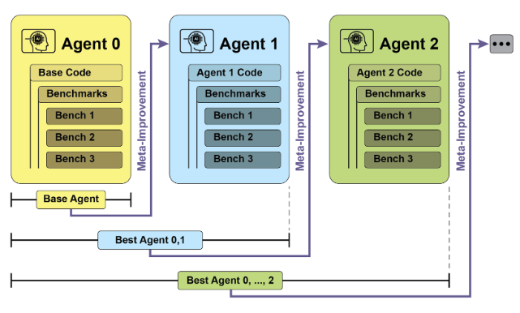
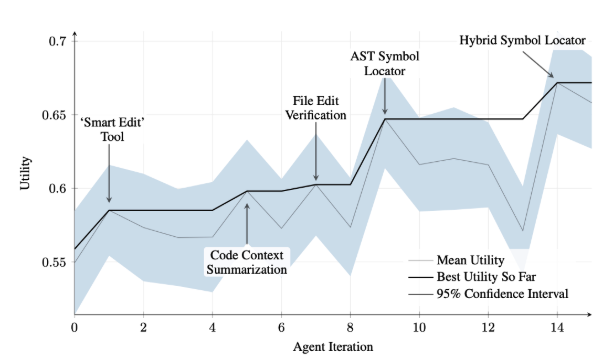
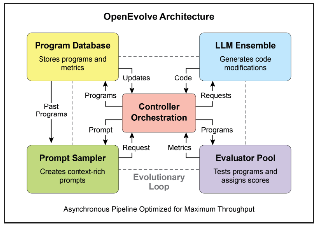
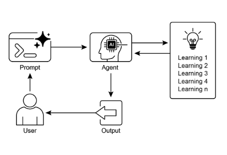

# 第9章：學習和適應

學習和適應對於增強人工智慧代理的能力至關重要。這些過程使代理能夠超越預定義參數而演進，讓它們透過經驗和環境互動自主改進。透過學習和適應，代理可以有效管理新穎情況並優化其表現，無需持續的人工干預。本章詳細探討支撐代理學習和適應的原理和機制。

## 大局觀

代理透過基於新經驗和資料改變其思考、行動或知識來學習和適應。這使代理能夠從單純遵循指示演進為隨時間變得更智慧。

* **強化學習：** 代理嘗試行動並為正面結果獲得獎勵，為負面結果受到懲罰，在變化情況中學習最佳行為。對控制機器人或玩遊戲的代理有用。
* **監督學習：** 代理從標記範例中學習，連接輸入到預期輸出，啟用決策制定和模式識別等任務。對分類電子郵件或預測趨勢的代理理想。
* **無監督學習：** 代理在未標記資料中發現隱藏連接和模式，協助見解、組織和建立其環境的心理地圖。對在沒有特定指導下探索資料的代理有用。
* **基於 LLM 的代理的少樣本/零樣本學習：** 利用 LLM 的代理可以用最少範例或清楚指示快速適應新任務，啟用對新命令或情況的快速回應。
* **線上學習：** 代理持續用新資料更新知識，對於動態環境中的即時反應和持續適應至關重要。對處理連續資料流的代理關鍵。
* **基於記憶體的學習：** 代理回憶過去經驗以在類似情況中調整當前行動，增強語境感知和決策制定。對具有記憶體回想能力的代理有效。

代理透過基於學習改變策略、理解或目標來適應。這對於在不可預測、變化或新環境中的代理至關重要。

**近端策略優化 (PPO)** 是一種強化學習演算法，用於在具有連續行動範圍的環境中訓練代理，如控制機器人的關節或遊戲中的角色。其主要目標是可靠且穩定地改進代理的決策制定策略，稱為其策略。

PPO 背後的核心想法是對代理的策略進行小心且謹慎的更新。它避免可能導致表現崩潰的劇烈變化。以下是其運作方式：

1. 收集資料：代理使用其當前策略與環境互動 (例如，玩遊戲) 並收集一批經驗 (狀態、行動、獎勵)。
2. 評估「代理」目標：PPO 計算潛在策略更新如何改變預期獎勵。然而，它不只是最大化這個獎勵，而是使用特殊的「裁剪」目標函數。
3. 「裁剪」機制：這是 PPO 穩定性的關鍵。它在當前策略周圍建立「信任區域」或安全區域。演算法被阻止進行與當前策略過於不同的更新。這種裁剪就像安全煞車，確保代理不會採取巨大、冒險的步驟來撤銷其學習。

簡而言之，PPO 平衡了改善表現與保持接近已知、有效策略，這可以防止訓練期間的災難性失敗並導致更穩定的學習。

**直接偏好優化 (DPO)** 是一種更新的方法，專門設計用於將大語言模型 (LLM) 與人類偏好對齊。它提供了一個更簡單、更直接的替代方案來使用 PPO 完成這項任務。

要理解 DPO，首先理解傳統的基於 PPO 的對齊方法會有幫助：

* PPO 方法 (兩步驟過程)：
  1. 訓練獎勵模型：首先，你收集人類回饋資料，其中人們評價或比較不同的 LLM 回應 (例如，「回應 A 比回應 B 好」)。這些資料用於訓練一個單獨的 AI 模型，稱為獎勵模型，其工作是預測人類會給任何新回應什麼分數。
  2. 使用 PPO 微調：接下來，使用 PPO 微調 LLM。LLM 的目標是產生從獎勵模型獲得最高可能分數的回應。獎勵模型在訓練遊戲中充當「裁判」。

這個兩步驟過程可能複雜且不穩定。例如，LLM 可能找到漏洞並學會「駭客攻擊」獎勵模型，為壞回應獲得高分。

* DPO 方法 (直接過程)：DPO 完全跳過獎勵模型。它不是將人類偏好轉換為獎勵分數然後針對該分數進行優化，而是直接使用偏好資料來更新 LLM 的策略。
* 它透過使用直接連結偏好資料與最佳策略的數學關係來工作。它本質上教導模型：「增加產生類似*偏好*回應的機率，減少產生類似*不喜歡*回應的機率。」

本質上，DPO 透過直接在人類偏好資料上優化語言模型來簡化對齊。這避免了訓練和使用單獨獎勵模型的複雜性和潛在不穩定性，使對齊過程更高效且更穩健。

## 實際應用與使用案例

適應性代理透過基於經驗資料的迭代更新在可變環境中展現增強的表現。

* **個人化助理代理** 透過縱向分析個別使用者行為來改進互動協議，確保高度優化的回應產生。
* **交易機器人代理** 透過基於高解析度即時市場資料動態調整模型參數來優化決策制定演算法，從而最大化財務回報並減輕風險因素。
* **應用程式代理** 透過基於觀察到的使用者行為進行動態修改來優化使用者介面和功能，導致增加的使用者參與度和系統直覺性。
* **機器人和自主車輛代理** 透過整合感測器資料和歷史行動分析來增強導航和回應能力，使其能夠在多樣環境條件下安全高效地運作。
* **詐欺偵測代理** 透過用新識別的詐欺模式改進預測模型來改善異常偵測，增強系統安全性並最小化財務損失。
* **推薦代理** 透過採用使用者偏好學習演算法來改善內容選擇精度，提供高度個人化和語境相關的推薦。
* **遊戲 AI 代理** 透過動態適應策略演算法來增強玩家參與度，從而增加遊戲複雜性和挑戰。
* **知識庫學習代理**：代理可以利用檢索增強生成 (RAG) 來維持問題描述和已證實解決方案的動態知識庫 (見第14章)。透過儲存成功策略和遇到的挑戰，代理可以在決策制定期間參考這些資料，使其能夠透過應用先前成功的模式或避免已知陷阱來更有效地適應新情況。

## 案例研究：自我改進編碼代理 (SICA)

由 Maxime Robeyns、Laurence Aitchison 和 Martin Szummer 開發的自我改進編碼代理 (SICA) 代表了基於代理學習的進步，展示了代理修改自己原始碼的能力。這與傳統方法形成對比，在傳統方法中一個代理可能訓練另一個代理；SICA 同時充當修改者和被修改實體，迭代改進其程式碼庫以改善在各種編碼挑戰中的表現。

SICA 的自我改進透過迭代循環運作 (見圖1)。最初，SICA 檢視其過去版本的檔案及其在基準測試上的表現。它選擇具有最高表現分數的版本，該分數基於考慮成功、時間和計算成本的加權公式計算。這個選定的版本然後進行下一輪自我修改。它分析檔案以識別潛在改進，然後直接修改其程式碼庫。修改後的代理隨後針對基準進行測試，結果記錄在檔案中。這個過程重複，促進直接從過去表現中學習。這種自我改進機制允許 SICA 演進其能力，無需傳統訓練範式。



圖1：SICA 的自我改進，基於其過去版本學習和適應

SICA 經歷了顯著的自我改進，導致程式碼編輯和導航的進步。最初，SICA 使用基本的檔案覆寫方法進行程式碼變更。它隨後開發了能夠進行更智慧和語境化編輯的「Smart Editor」。這演進為「Diff-Enhanced Smart Editor」，結合差異進行目標修改和基於模式的編輯，以及「Quick Overwrite Tool」以減少處理需求。

SICA 進一步實現了「Minimal Diff Output Optimization」和「Context-Sensitive Diff Minimization」，使用抽象語法樹 (AST) 解析以提高效率。此外，還添加了「SmartEditor Input Normalizer」。在導航方面，SICA 獨立建立了「AST Symbol Locator」，使用程式碼的結構地圖 (AST) 來識別程式碼庫內的定義。後來，開發了「Hybrid Symbol Locator」，結合快速搜尋與 AST 檢查。這透過「Optimized AST Parsing in Hybrid Symbol Locator」進一步優化，專注於相關程式碼部分，改善搜尋速度。(見圖2)



圖2：跨迭代的表現。關鍵改進以其對應的工具或代理修改註解。(由 Maxime Robeyns、Martin Szummer、Laurence Aitchison 提供)

SICA 的架構包含用於基本檔案操作、命令執行和算術計算的基礎工具包。它包括結果提交機制和特殊子代理 (編碼、問題解決和推理) 的調用。這些子代理分解複雜任務並管理 LLM 的語境長度，特別是在擴展改進循環期間。

一個異步監督者，另一個 LLM，監控 SICA 的行為，識別潛在問題如迴圈或停滯。它與 SICA 溝通，如有必要可以干預停止執行。監督者接收 SICA 行動的詳細報告，包括呼叫圖和訊息和工具行動的記錄，以識別模式和低效率。

SICA 的 LLM 在其語境視窗內以結構化方式組織資訊，即其短期記憶體，這對其運作至關重要。這個結構包括定義代理目標的系統提示、工具和子代理文件，以及系統指示。核心提示包含問題陳述或指示、開啟檔案的內容和目錄地圖。助理訊息記錄代理的逐步推理、工具和子代理呼叫記錄和結果，以及監督者溝通。這種組織促進高效的資訊流動，增強 LLM 運作並減少處理時間和成本。最初，檔案變更記錄為差異，僅顯示修改並定期整合。

**SICA：程式碼一窺：** 深入 SICA 的實作揭示了支撐其能力的幾個關鍵設計選擇。如討論的，系統採用模組化架構建立，結合幾個子代理，如編碼代理、問題解決代理和推理代理。這些子代理由主代理調用，就像工具呼叫一樣，用於分解複雜任務並有效管理語境長度，特別是在那些擴展的元改進迭代期間。

該專案正在積極開發，旨在為那些對在工具使用和其他代理任務上進行後訓練 LLM 感興趣的人提供穩健的框架，完整程式碼可在 [https://github.com/MaximeRobeyns/self_improving_coding_agent/](https://github.com/MaximeRobeyns/self_improving_coding_agent/) GitHub 儲存庫中進一步探索和貢獻。

為了安全，該專案強烈強調 Docker 容器化，意味著代理在專用的 Docker 容器內運行。這是一個關鍵措施，因為它提供與主機機器的隔離，減輕了如無意檔案系統操作等風險，因為代理有能力執行 shell 命令。

為了確保透明度和控制，系統透過互動式網頁提供穩健的可觀察性，該網頁視覺化事件匯流排上的事件和代理的呼叫圖。這提供了對代理行動的全面見解，允許使用者檢查個別事件、閱讀監督者訊息，並為更清楚的理解摺疊子代理追蹤。

在其核心智慧方面，代理框架支援來自各種提供者的 LLM 整合，啟用對不同模型的實驗以找到特定任務的最佳適配。最後，一個關鍵元件是異步監督者，一個與主代理同時運行的 LLM。這個監督者定期評估代理的行為是否有病理偏差或停滯，可以透過發送通知甚至在必要時取消代理的執行來干預。它接收系統狀態的詳細文字表示，包括呼叫圖和 LLM 訊息、工具呼叫和回應的事件流，這允許它偵測低效模式或重複工作。

在初始 SICA 實作中一個值得注意的挑戰是提示基於 LLM 的代理在每個元改進迭代期間獨立提出新穎、創新、可行且引人入勝的修改。這種限制，特別是在促進 LLM 代理的開放式學習和真實創造力方面，仍然是當前研究的關鍵調查領域。

## AlphaEvolve 和 OpenEvolve

**AlphaEvolve** 是 Google 開發的 AI 代理，設計用於發現和優化演算法。它利用 LLM 的組合，特別是 Gemini 模型 (Flash 和 Pro)、自動評估系統和演化演算法框架。這個系統旨在推進理論數學和實際計算應用。

AlphaEvolve 採用 Gemini 模型的集合。Flash 用於產生廣泛的初始演算法提案，而 Pro 提供更深入的分析和改進。提出的演算法然後根據預定義標準自動評估和評分。這種評估提供回饋，用於迭代改進解決方案，導致優化和新穎的演算法。

在實際計算中，AlphaEvolve 已部署在 Google 的基礎設施內。它已展示在資料中心排程方面的改進，導致全球計算資源使用減少 0.7%。它也透過為即將推出的 Tensor Processing Units (TPU) 建議 Verilog 程式碼的優化來貢獻硬體設計。此外，AlphaEvolve 已加速 AI 表現，包括 Gemini 架構核心核心的 23% 速度改進和 FlashAttention 低層級 GPU 指示的高達 32.5% 優化。

在基礎研究領域，AlphaEvolve 已貢獻於矩陣乘法新演算法的發現，包括使用 48 個純量乘法的 4x4 複數值矩陣方法，超越了先前已知的解決方案。在更廣泛的數學研究中，它已在 75% 的案例中重新發現超過 50 個開放問題的現有最先進解決方案，並在 20% 的案例中改進了現有解決方案，例子包括 kissing number 問題的進步。

**OpenEvolve** 是一個利用 LLM (見圖3) 迭代優化程式碼的演化編碼代理。它編排一個 LLM 驅動的程式碼產生、評估和選擇管線，以持續增強各種任務的程式。OpenEvolve 的一個關鍵方面是其演化整個程式碼檔案的能力，而不是限於單一函數。該代理設計為多功能，提供對多種程式語言的支援和與任何 LLM 的 OpenAI 相容 API 的相容性。此外，它結合多目標優化，允許靈活的提示工程，並能夠分散式評估以有效處理複雜的編碼挑戰。



圖3：OpenEvolve 內部架構由控制器管理。這個控制器編排幾個關鍵元件：程式取樣器、程式資料庫、評估器池和 LLM 集合。其主要功能是促進它們的學習和適應過程以增強程式碼品質。

這個程式碼片段使用 OpenEvolve 函式庫對程式執行演化優化。它用初始程式、評估檔案和配置檔案的路徑初始化 OpenEvolve 系統。evolve.run(iterations=1000) 行開始演化過程，運行 1000 次迭代以找到程式的改進版本。最後，它列印在演化期間找到的最佳程式的指標，格式化為四位小數。

```python
from openevolve import OpenEvolve


# 初始化系統
evolve = OpenEvolve(
    initial_program_path="path/to/initial_program.py",
    evaluation_file="path/to/evaluator.py",
    config_path="path/to/config.yaml",
)

# 執行演化
best_program = await evolve.run(iterations=1000)

print("Best program metrics:")
for name, value in best_program.metrics.items():
    print(f"  {name}: {value:.4f}")
```

## 一目了然

**什麼：** AI 代理經常在動態和不可預測的環境中運作，其中預先程式設計的邏輯是不足的。當面對在初始設計期間未預期的新穎情況時，它們的表現可能會降低。沒有從經驗中學習的能力，代理無法優化其策略或隨時間個人化其互動。這種僵硬性限制了它們的有效性，並防止它們在複雜的現實世界場景中實現真正的自主性。

**為什麼：** 標準化解決方案是整合學習和適應機制，將靜態代理轉換為動態、演進的系統。這允許代理基於新資料和互動自主改進其知識和行為。代理系統可以使用各種方法，從強化學習到更先進的技術如自我修改，如在自我改進編碼代理 (SICA) 中所見。像 Google 的 AlphaEvolve 這樣的先進系統利用 LLM 和演化演算法來發現全新且更高效的複雜問題解決方案。透過持續學習，代理可以掌握新任務，增強其表現，並適應變化的條件，無需持續的手動重新程式設計。

**經驗法則：** 在建立必須在動態、不確定或演進環境中運作的代理時使用此模式。對於需要個人化、持續表現改進和自主處理新穎情況能力的應用程式，這是必要的。

**視覺摘要：**



圖4：學習和適應模式

## 關鍵要點

* 學習和適應是關於代理透過使用其經驗在他們所做的事情上變得更好並處理新情況。
* 「適應」是代理行為或知識中來自學習的可見變化。
* SICA，自我改進編碼代理，透過基於過去表現修改其程式碼來自我改進。這導致了像 Smart Editor 和 AST Symbol Locator 這樣的工具。
* 擁有專門的「子代理」和「監督者」幫助這些自我改進系統管理大任務並保持在軌道上。
* LLM 的「語境視窗」的設定方式 (包含系統提示、核心提示和助理訊息) 對代理工作的效率非常重要。
* 這個模式對於需要在總是變化、不確定或需要個人化接觸的環境中運作的代理至關重要。
* 建立學習的代理通常意味著將它們與機器學習工具連接並管理資料流動方式。
* 配備基本編碼工具的代理系統可以自主編輯自己，從而改善其在基準任務上的表現
* AlphaEvolve 是 Google 的 AI 代理，利用 LLM 和演化框架自主發現和優化演算法，顯著增強基礎研究和實際計算應用。

## 結論

本章檢視學習和適應在人工智慧中的關鍵角色。AI 代理透過持續的資料獲取和經驗來增強其表現。自我改進編碼代理 (SICA) 透過程式碼修改自主改善其能力來例證這一點。

我們已經回顧了代理 AI 的基本元件，包括架構、應用、規劃、多代理協作、記憶體管理，以及學習和適應。學習原理對於多代理系統中的協調改進特別重要。要實現這一點，調優資料必須準確反映完整的互動軌跡，捕捉每個參與代理的個別輸入和輸出。

這些元素貢獻了重大進步，如 Google 的 AlphaEvolve。這個 AI 系統透過 LLM、自動評估和演化方法獨立發現和改進演算法，推動科學研究和計算技術的進步。這些模式可以結合構建複雜的 AI 系統。像 AlphaEvolve 這樣的發展展示了 AI 代理的自主演算法發現和優化是可實現的。

## 參考資料

1. Sutton, R. S., & Barto, A. G. (2018). *Reinforcement Learning: An Introduction*. MIT Press.
2. Goodfellow, I., Bengio, Y., & Courville, A. (2016). *Deep Learning*. MIT Press.
3. Mitchell, T. M. (1997). *Machine Learning*. McGraw-Hill.
4. **Proximal Policy Optimization Algorithms** by John Schulman, Filip Wolski, Prafulla Dhariwal, Alec Radford, and Oleg Klimov. You can find it on arXiv: [https://arxiv.org/abs/1707.06347](https://arxiv.org/abs/1707.06347)
5. Robeyns, M., Aitchison, L., & Szummer, M. (2025). *A Self-Improving Coding Agent*. arXiv:2504.15228v2. [https://arxiv.org/pdf/2504.15228](https://arxiv.org/pdf/2504.15228)  [https://github.com/MaximeRobeyns/self_improving_coding_agent](https://github.com/MaximeRobeyns/self_improving_coding_agent)
6. AlphaEvolve blog, [https://deepmind.google/discover/blog/alphaevolve-a-gemini-powered-coding-agent-for-designing-advanced-algorithms/](https://deepmind.google/discover/blog/alphaevolve-a-gemini-powered-coding-agent-for-designing-advanced-algorithms/)
7. OpenEvolve, [https://github.com/codelion/openevolve](https://github.com/codelion/openevolve)