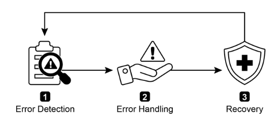
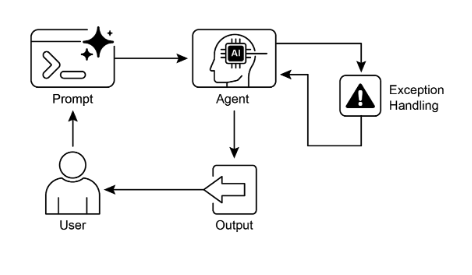

# 第 12 章：異常處理與恢復

為了讓 AI 代理能在多樣化的真實世界環境中可靠運行，它們必須能夠管理意外情況、錯誤和故障。就像人類會適應意外的障礙一樣，智慧代理需要強健的系統來檢測問題、啟動恢復程序，或至少確保受控故障。這個基本需求構成了異常處理與恢復模式的基礎。

此模式專注於開發異常持久且具有彈性的代理，能夠在面對各種困難和異常時保持不間斷的功能和操作完整性。它強調主動準備和被動策略的重要性，以確保即使在面臨挑戰時也能持續運行。這種適應性對於代理在複雜且不可預測的環境中成功運作至關重要，最終提升它們的整體效率和可信度。

處理意外事件的能力確保了這些 AI 系統不僅智慧，而且穩定可靠，這增強了對其部署和效能的信心。整合全面的監控和診斷工具進一步強化了代理快速識別和解決問題的能力，防止潛在中斷並確保在變化條件下更順暢的運行。這些先進系統對於維護 AI 運作的完整性和效率至關重要，強化了它們管理複雜性和不可預測性的能力。

此模式有時可能與反思一起使用。例如，如果初始嘗試失敗並引發異常，反思過程可以分析失敗原因並以改進的方法重新嘗試任務，例如改進的提示，以解決錯誤。

## 異常處理與恢復模式概述

異常處理與恢復模式解決了 AI 代理管理操作故障的需求。此模式涉及預測潛在問題，例如工具錯誤或服務不可用，並制定緩解策略。這些策略可能包括錯誤記錄、重試、回退、優雅降級和通知。此外，此模式強調恢復機制，如狀態回滾、診斷、自我糾正和升級，以將代理恢復到穩定運行狀態。實施此模式可增強 AI 代理的可靠性和強健性，使它們能在不可預測的環境中運作。實際應用的例子包括聊天機器人管理資料庫錯誤、交易機器人處理金融錯誤，以及智慧家庭代理解決裝置故障。此模式確保代理即使遇到複雜性和故障也能繼續有效運作。



圖 1：AI 代理異常處理與恢復的關鍵組件

**錯誤檢測：** 這涉及在操作問題出現時仔細識別它們。這可能表現為無效或格式錯誤的工具輸出、特定的 API 錯誤，如 404 (未找到) 或 500 (內部伺服器錯誤) 代碼、來自服務或 API 的異常長回應時間，或偏離預期格式的不連貫和無意義回應。此外，可能實施其他代理或專門監控系統的監控，以進行更主動的異常檢測，使系統能在潛在問題升級之前捕獲它們。

**錯誤處理**：一旦檢測到錯誤，需要仔細考慮的回應計劃至關重要。這包括在日誌中仔細記錄錯誤詳細資訊，以供稍後除錯和分析 (記錄)。重試操作或請求，有時使用稍微調整的參數，可能是可行的策略，特別是對於暫時性錯誤 (重試)。使用替代策略或方法 (回退) 可以確保維持某些功能。在無法立即完全恢復的情況下，代理可以維持部分功能以至少提供一些價值 (優雅降級)。最後，對於需要人工干預或協作的情況，向人類操作員或其他代理發出警報可能至關重要 (通知)。

**恢復：** 此階段是關於在錯誤後將代理或系統恢復到穩定和可操作的狀態。這可能涉及撤銷最近的變更或交易以取消錯誤的影響 (狀態回滾)。徹底調查錯誤原因對於防止再次發生至關重要。可能需要透過自我糾正機制或重新規劃過程調整代理的計劃、邏輯或參數，以避免將來出現相同錯誤。在複雜或嚴重的情況下，將問題委託給人類操作員或更高級別系統 (升級) 可能是最佳行動方案。

實施這種強健的異常處理與恢復模式可以將 AI 代理從脆弱和不可靠的系統轉變為強健、可靠的組件，能夠在具有挑戰性和高度不可預測的環境中有效且具彈性地運作。這確保代理維持功能、最小化停機時間，並即使在面對意外問題時也提供無縫且可靠的體驗。

## 實際應用與使用案例

異常處理與恢復對於部署在無法保證完美條件的真實世界場景中的任何代理都至關重要。

* **客戶服務聊天機器人：** 如果聊天機器人嘗試存取客戶資料庫而資料庫暫時停機，它不應該崩潰。相反，它應該檢測 API 錯誤，告知使用者暫時問題，也許建議稍後再試，或將查詢升級給人類代理。
* **自動化金融交易：** 嘗試執行交易的交易機器人可能遇到「資金不足」錯誤或「市場關閉」錯誤。它需要透過記錄錯誤、不重複嘗試相同的無效交易，以及可能通知使用者或調整策略來處理這些異常。
* **智慧家庭自動化：** 控制智慧燈具的代理可能由於網路問題或裝置故障而無法開啟燈具。它應該檢測此故障，也許重試，如果仍然不成功，通知使用者燈具無法開啟並建議手動干預。
* **資料處理代理：** 負責處理一批文件的代理可能遇到損壞的檔案。它應該跳過損壞的檔案，記錄錯誤，繼續處理其他檔案，並在最後報告跳過的檔案，而不是停止整個過程。
* **網頁抓取代理：** 當網頁抓取代理遇到 CAPTCHA、網站結構變更或伺服器錯誤 (例如，404 未找到、503 服務不可用) 時，它需要優雅地處理這些情況。這可能涉及暫停、使用代理伺服器或報告失敗的特定 URL。
* **機器人技術與製造：** 執行組裝任務的機械手臂可能由於未對齊而無法拾取組件。它需要檢測此故障 (例如，透過感測器回饋)，嘗試重新調整，重試拾取，如果持續存在，警報人類操作員或切換到不同組件。

簡而言之，此模式對於建構不僅智慧而且在面對真實世界複雜性時可靠、具彈性且使用者友善的代理是基礎。

## 實作程式碼範例 (ADK)

異常處理與恢復對於系統的強健性和可靠性至關重要。例如，考慮代理對失敗工具呼叫的回應。此類失敗可能源於不正確的工具輸入或工具依賴的外部服務問題。

```python
from google.adk.agents import Agent, SequentialAgent


# 代理 1：嘗試主要工具。其焦點狹窄且明確。
primary_handler = Agent(
    name="primary_handler",
    model="gemini-2.0-flash-exp",
    instruction="""
    你的工作是獲取精確的位置資訊。使用 get_precise_location_info
    工具與使用者提供的地址。
    """,
    tools=[get_precise_location_info],
)

# 代理 2：作為回退處理器，檢查狀態以決定其行動。
fallback_handler = Agent(
    name="fallback_handler",
    model="gemini-2.0-flash-exp",
    instruction="""
    透過查看 state["primary_location_failed"] 檢查主要位置查詢是否失敗。
    - 如果為 True，從使用者的原始查詢中提取城市並使用 get_general_area_info 工具。
    - 如果為 False，什麼都不做。
    """,
    tools=[get_general_area_info],
)

# 代理 3：從狀態呈現最終結果。
response_agent = Agent(
    name="response_agent",
    model="gemini-2.0-flash-exp",
    instruction="""
    檢查儲存在 state["location_result"] 中的位置資訊。清楚簡潔地向使用者呈現此資訊。
    如果 state["location_result"] 不存在或為空，道歉你無法檢索位置。
    """,
    tools=[],  # 此代理僅對最終狀態進行推理。
)

# SequentialAgent 確保處理器以保證的順序運行。
robust_location_agent = SequentialAgent(
    name="robust_location_agent",
    sub_agents=[primary_handler, fallback_handler, response_agent],
)
```

此程式碼定義了一個使用 ADK 的 SequentialAgent 與三個子代理的強健位置檢索系統。`primary_handler` 是第一個代理，嘗試使用 `get_precise_location_info` 工具獲取精確位置資訊。`fallback_handler` 作為備份，透過檢查狀態變數來檢查主要查詢是否失敗。如果主要查詢失敗，回退代理從使用者查詢中提取城市並使用 `get_general_area_info` 工具。`response_agent` 是序列中的最終代理。它檢查儲存在狀態中的位置資訊。此代理設計為向使用者呈現最終結果。如果未找到位置資訊，它會道歉。SequentialAgent 確保這三個代理以預定義順序執行。此結構允許對位置資訊檢索採用分層方法。

## 一覽表

**內容：** 在真實世界環境中運作的 AI 代理不可避免地會遇到意外情況、錯誤和系統故障。這些中斷可能從工具故障和網路問題到無效資料，威脅代理完成任務的能力。沒有結構化的方式來管理這些問題，代理可能脆弱、不可靠，並且在面對意外阻礙時容易完全失敗。這種不可靠性使得難以在一致效能至關重要的關鍵或複雜應用中部署它們。

**原因**：異常處理與恢復模式為建構強健且具彈性的 AI 代理提供了標準化解決方案。它為它們配備了預測、管理和從操作故障中恢復的代理能力。此模式涉及主動錯誤檢測，例如監控工具輸出和 API 回應，以及被動處理策略，如記錄用於診斷、重試暫時性故障或使用回退機制。對於更嚴重的問題，它定義了恢復協議，包括恢復到穩定狀態、透過調整計劃進行自我糾正，或將問題升級給人類操作員。這種系統性方法確保代理能維持操作完整性、從故障中學習，並在不可預測的環境中可靠運作。

**經驗法則：** 對於部署在動態、真實世界環境中的任何 AI 代理，當系統故障、工具錯誤、網路問題或不可預測輸入可能發生且操作可靠性是關鍵需求時，使用此模式。

**視覺摘要：**



圖 2：異常處理模式

## 關鍵要點

需要記住的要點：

* 異常處理與恢復對於建構強健且可靠的代理至關重要。
* 此模式涉及檢測錯誤、優雅地處理它們，以及實施恢復策略。
* 錯誤檢測可能涉及驗證工具輸出、檢查 API 錯誤代碼和使用逾時。
* 處理策略包括記錄、重試、回退、優雅降級和通知。
* 恢復專注於透過診斷、自我糾正或升級恢復穩定運行。
* 此模式確保代理即使在不可預測的真實世界環境中也能有效運作。

## 結論

本章探討了異常處理與恢復模式，這對於開發強健且可靠的 AI 代理至關重要。此模式解決了 AI 代理如何識別和管理意外問題、實施適當回應，並恢復到穩定操作狀態。本章討論了此模式的各個方面，包括錯誤檢測、透過記錄、重試和回退等機制處理這些錯誤，以及用於將代理或系統恢復到正常功能的策略。異常處理與恢復模式的實際應用在多個領域中進行了說明，以展示其在處理真實世界複雜性和潛在故障方面的相關性。這些應用顯示了為 AI 代理配備異常處理能力如何有助於它們在動態環境中的可靠性和適應性。

## 參考文獻

1. McConnell, S. (2004). *Code Complete (2nd ed.)*. Microsoft Press.
2. Shi, Y., Pei, H., Feng, L., Zhang, Y., & Yao, D. (2024). *Towards Fault Tolerance in Multi-Agent Reinforcement Learning*. arXiv preprint arXiv:2412.00534.
3. O'Neill, V. (2022). *Improving Fault Tolerance and Reliability of Heterogeneous Multi-Agent IoT Systems Using Intelligence Transfer*. Electronics, 11(17), 2724.