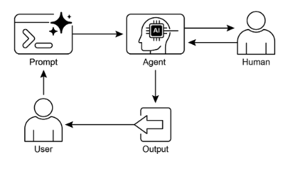

# 第 13 章：人在環路中

人在環路中 (HITL) 模式代表了代理開發和部署中的重要策略。它有意地將人類認知的獨特優勢——如判斷力、創造力和細微理解——與 AI 的計算能力和效率交織在一起。這種策略整合不僅僅是一種選擇，通常是必需的，特別是當 AI 系統越來越嵌入到關鍵決策過程中時。

HITL 的核心原則是確保 AI 在道德界限內運作，遵守安全協議，並以最佳效果實現其目標。這些關切在以複雜性、模糊性或重大風險為特徵的領域中特別尖銳，在這些領域中，AI 錯誤或誤解的影響可能是巨大的。在這種情況下，完全自主性——AI 系統在沒有任何人工干預的情況下獨立運作——可能被證明是不明智的。HITL 承認這一現實，並強調即使 AI 技術快速發展，人類監督、策略輸入和協作互動仍然是不可或缺的。

HITL 方法根本上圍繞著人工智慧和人類智慧之間協同作用的理念。HITL 不是將 AI 視為人類工作者的替代品，而是將 AI 定位為增強和提升人類能力的工具。這種增強可以採取各種形式，從自動化例行任務到提供資料驅動的洞察來指導人類決策。最終目標是創建一個協作生態系統，其中人類和 AI 代理都可以利用他們各自的優勢來實現任何一方都無法單獨完成的結果。

在實踐中，HITL 可以以多種方式實施。一種常見方法涉及人類充當驗證者或審查員，檢查 AI 輸出以確保準確性並識別潛在錯誤。另一種實施方法涉及人類積極指導 AI 行為，即時提供回饋或進行糾正。在更複雜的設置中，人類可能與 AI 作為夥伴協作，透過互動對話或共享介面共同解決問題或做出決策。無論具體實施方式如何，HITL 模式都強調維持人類控制和監督的重要性，確保 AI 系統與人類道德、價值觀、目標和社會期望保持一致。

## 人在環路中模式概述

人在環路中 (HITL) 模式將人工智慧與人類輸入整合，以增強代理能力。這種方法承認最佳 AI 效能經常需要自動化處理和人類洞察的結合，特別是在高複雜性或道德考量的情況下。HITL 不是要取代人類輸入，而是透過確保關鍵判斷和決策由人類理解所指導來增強人類能力。

HITL 包含幾個關鍵方面：人類監督，涉及監控 AI 代理效能和輸出 (例如，透過日誌審查或即時儀表板) 以確保遵守指導方針並防止不良結果。干預和糾正發生在 AI 代理遇到錯誤或模糊情況並可能請求人工干預時；人類操作員可以糾正錯誤、提供缺失資料或指導代理，這也為未來代理改進提供資訊。收集用於學習的人類回饋並用於改進 AI 模型，特別是在人類回饋強化學習等方法論中，人類偏好直接影響代理的學習軌跡。決策增強是 AI 代理向人類提供分析和建議，然後人類做出最終決策，透過 AI 生成的洞察而非完全自主來增強人類決策制定。人機代理協作是人類和 AI 代理貢獻各自優勢的合作互動；例行資料處理可能由代理處理，而創意問題解決或複雜談判則由人類管理。最後，升級政策是既定協議，規定代理何時以及如何應將任務升級給人類操作員，防止在超出代理能力的情況下出現錯誤。

實施 HITL 模式使得能在敏感部門中使用代理，在這些部門中完全自主是不可行或不被允許的。它還透過回饋循環為持續改進提供機制。例如，在金融領域，大型企業貸款的最終批准需要人類信貸員評估定性因素，如領導品格。同樣，在法律領域，正義和問責的核心原則要求人類法官對涉及複雜道德推理的關鍵決策 (如判刑) 保留最終權威。

> **注意事項：** 儘管有其好處，HITL 模式有重大注意事項，其中最主要的是缺乏可擴展性。雖然人類監督提供高準確性，但操作員無法管理數百萬項任務，造成根本的權衡，通常需要結合自動化以實現規模和 HITL 以實現準確性的混合方法。此外，此模式的有效性在很大程度上取決於人類操作員的專業知識；例如，雖然 AI 可以生成軟體程式碼，但只有熟練的開發人員才能準確識別細微錯誤並提供正確指導來修復它們。這種對專業知識的需求也適用於使用 HITL 生成訓練資料時，因為人類標註員可能需要特殊訓練來學習如何以產生高品質資料的方式糾正 AI。最後，實施 HITL 引發重大隱私關切，因為敏感資訊在暴露給人類操作員之前通常必須經過嚴格匿名化，增加了另一層過程複雜性。

## 實際應用與使用案例

人在環路中模式在廣泛的行業和應用中至關重要，特別是在準確性、安全性、道德或細微理解至關重要的地方。

* **內容審核：** AI 代理可以快速過濾大量線上內容以查找違規行為 (例如，仇恨言論、垃圾內容)。然而，模糊案例或邊緣內容會升級給人類審核員進行審查和最終決策，確保細微判斷和遵守複雜政策。
* **自動駕駛：** 雖然自駕車在大多數駕駛任務中自主處理，但它們被設計為在 AI 無法自信導航的複雜、不可預測或危險情況下 (例如，極端天氣、異常道路條件) 將控制權交給人類駕駛員。
* **金融詐騙檢測：** AI 系統可以基於模式標記可疑交易。然而，高風險或模糊警報通常發送給人類分析師，他們進一步調查、聯繫客戶，並對交易是否為詐騙做出最終判定。
* **法律文件審查：** AI 可以快速掃描和分類數千份法律文件以識別相關條款或證據。然後人類法律專業人員審查 AI 的發現以確保準確性、背景和法律影響，特別是對於關鍵案例。
* **客戶支援 (複雜查詢)：** 聊天機器人可能處理例行客戶查詢。如果使用者的問題過於複雜、情緒化或需要 AI 無法提供的同理心，對話會無縫交給人類支援代理。
* **資料標註和註解：** AI 模型通常需要大型標註資料集進行訓練。人類被納入環路中以準確標註圖片、文字或音頻，提供 AI 學習的基本事實。隨著模型演變，這是一個持續過程。
* **生成式 AI 改進：** 當大語言模型生成創意內容 (例如，行銷文案、設計想法) 時，人類編輯或設計師審查和改進輸出，確保它符合品牌指導方針、與目標受眾產生共鳴，並維持品質。
* **自主網路：** AI 系統能夠透過利用關鍵效能指標 (KPI) 和已識別模式來分析警報並預測網路問題和流量異常。然而，關鍵決策——如解決高風險警報——經常升級給人類分析師。這些分析師進行進一步調查並對網路變更的批准做出最終決定。

此模式體現了 AI 實施的實用方法。它利用 AI 來增強可擴展性和效率，同時維持人類監督以確保品質、安全和道德合規。

「人在環上」是此模式的變體，其中人類專家定義總體政策，然後 AI 處理即時行動以確保合規。讓我們考慮兩個例子：

* **自動化金融交易系統**：在這種情況下，人類金融專家設定總體投資策略和規則。例如，人類可能將政策定義為：「維持 70% 科技股和 30% 債券的投資組合，不投資任何單一公司超過 5%，並自動賣出任何跌幅超過購買價格 10% 的股票。」AI 然後即時監控股市，當這些預定義條件滿足時立即執行交易。AI 處理基於人類操作員設定的較慢、更策略性政策的即時、高速行動。
* **現代呼叫中心**：在這種設置中，人類經理為客戶互動建立高級政策。例如，經理可能設定規則，如「任何提及『服務中斷』的電話應立即轉接給技術支援專家」，或「如果客戶的語調表示高度沮喪，系統應提供直接連接到人類代理」。AI 系統然後處理初始客戶互動，即時聽取和解釋他們的需求。它透過立即轉接電話或提供升級而無需對每個個別案例進行人工干預來自主執行經理的政策。這允許 AI 根據人類操作員提供的較慢、策略性指導管理大量即時行動。

## 實作程式碼範例

為了展示人在環路中模式，ADK 代理可以識別需要人類審查的情況並啟動升級過程。這允許在代理的自主決策能力有限或需要複雜判斷的情況下進行人工干預。這不是一個孤立的功能；其他流行框架也採用了類似的能力。例如，LangChain 也提供工具來實施這些類型的互動。

```python
from typing import Optional

from google.adk.agents import Agent
from google.adk.tools.tool_context import ToolContext
from google.adk.callbacks import CallbackContext
from google.adk.models.llm import LlmRequest
from google.genai import types


# 工具的佔位符 (如需要，請替換為實際實施)
def troubleshoot_issue(issue: str) -> dict:
    return {"status": "success", "report": f"針對 {issue} 的故障排除步驟。"}


def create_ticket(issue_type: str, details: str) -> dict:
    return {"status": "success", "ticket_id": "TICKET123"}


def escalate_to_human(issue_type: str) -> dict:
    # 在真實系統中，這通常會轉移到人類佇列
    return {"status": "success", "message": f"已將 {issue_type} 升級給人類專家。"}


technical_support_agent = Agent(
    name="technical_support_specialist",
    model="gemini-2.0-flash-exp",
    instruction="""
    你是我們電子公司的技術支援專家。
    首先，檢查使用者是否在 state["customer_info"]["support_history"] 中有支援歷史記錄。
    如果有，在你的回應中參考這段歷史。

    對於技術問題：
    1. 使用 troubleshoot_issue 工具分析問題。
    2. 指導使用者完成基本故障排除步驟。
    3. 如果問題持續存在，使用 create_ticket 記錄問題。

    對於超出基本故障排除的複雜問題：
    1. 使用 escalate_to_human 轉移給人類專家。

    保持專業但富有同理心的語調。承認技術問題可能造成的挫折感，
    同時提供解決的明確步驟。
    """,
    tools=[troubleshoot_issue, create_ticket, escalate_to_human],
)


def personalization_callback(
    callback_context: CallbackContext, llm_request: LlmRequest
) -> Optional[LlmRequest]:
    """將個人化資訊添加到 LLM 請求中。"""
    # 從狀態獲取客戶資訊
    customer_info = callback_context.state.get("customer_info")
    if customer_info:
        customer_name = customer_info.get("name", "尊貴的客戶")
        customer_tier = customer_info.get("tier", "標準")
        recent_purchases = customer_info.get("recent_purchases", [])

        personalization_note = (
            f"\n重要個人化資訊：\n"
            f"客戶姓名：{customer_name}\n"
            f"客戶等級：{customer_tier}\n"
        )
        if recent_purchases:
            personalization_note += f"最近購買：{', '.join(recent_purchases)}\n"

        if llm_request.contents:
            # 在第一個內容之前添加為系統訊息
            system_content = types.Content(
                role="system",
                parts=[types.Part(text=personalization_note)],
            )
            llm_request.contents.insert(0, system_content)

    return None  # 返回 None 以繼續處理修改後的請求
```

此程式碼提供了使用 Google 的 ADK 創建技術支援代理的藍圖，該代理圍繞 HITL 框架設計。代理充當智慧的第一線支援，配置了特定指令並配備了 `troubleshoot_issue`、`create_ticket` 和 `escalate_to_human` 等工具來管理完整的支援工作流程。升級工具是 HITL 設計的核心部分，確保複雜或敏感案例傳遞給人類專家。

此架構的一個關鍵功能是其深度個人化能力，透過專用回調函數實現。在聯繫大語言模型之前，此函數動態檢索客戶特定資料——如他們的姓名、等級和購買歷史——從代理的狀態中。然後將此背景作為系統訊息注入提示中，使代理能夠提供高度量身定制且明智的回應，參考使用者的歷史。透過結合結構化工作流程與必要的人類監督和動態個人化，此程式碼作為 ADK 如何促進開發精密且強健的 AI 支援解決方案的實際例子。

## 一覽表

**內容：** AI 系統，包括先進的大語言模型，經常在需要細微判斷、道德推理或對複雜、模糊背景深度理解的任務上遇到困難。在高風險環境中部署完全自主的 AI 存在重大風險，因為錯誤可能導致嚴重的安全、金融或道德後果。這些系統缺乏人類擁有的固有創造力和常識推理。因此，在關鍵決策過程中僅依賴自動化通常是不明智的，可能會破壞系統的整體效果和可信度。

**原因：** 人在環路中 (HITL) 模式透過策略性地將人類監督整合到 AI 工作流程中提供標準化解決方案。這種代理方法創建了一種共生夥伴關係，其中 AI 處理計算繁重工作和資料處理，而人類提供關鍵驗證、回饋和干預。透過這樣做，HITL 確保 AI 行動與人類價值觀和安全協議保持一致。這種協作框架不僅緩解了完全自動化的風險，還透過從人類輸入中持續學習來增強系統能力。最終，這導致更強健、準確和道德的結果，這是人類或 AI 都無法單獨實現的。

**經驗法則：** 在部署 AI 於錯誤會產生重大安全、道德或金融後果的領域時使用此模式，例如醫療保健、金融或自主系統。對於涉及大語言模型無法可靠處理的模糊性和細微差別的任務，如內容審核或複雜客戶支援升級，這是必要的。當目標是透過高品質、人類標註資料持續改進 AI 模型或改進生成式 AI 輸出以符合特定品質標準時，採用 HITL。

**視覺摘要：**



圖 1：人在環路中設計模式

## 關鍵要點

關鍵要點包括：

* 人在環路中 (HITL) 將人類智慧和判斷整合到 AI 工作流程中。
* 它對於複雜或高風險情況中的安全、道德和效果至關重要。
* 關鍵方面包括人類監督、干預、學習回饋和決策增強。
* 升級政策對於代理知道何時交給人類至關重要。
* HITL 允許負責任的 AI 部署和持續改進。
* 人在環路中的主要缺點是其固有的缺乏可擴展性，在準確性和數量之間創造權衡，以及其對高技能領域專家進行有效干預的依賴性。
* 其實施呈現操作挑戰，包括需要訓練人類操作員進行資料生成，以及透過匿名化敏感資訊來解決隱私關切。

## 結論

本章探討了重要的人在環路中 (HITL) 模式，強調其在創建強健、安全和道德的 AI 系統中的作用。我們討論了將人類監督、干預和回饋整合到代理工作流程中如何能顯著增強其效能和可信度，特別是在複雜和敏感領域中。實際應用展示了 HITL 的廣泛效用，從內容審核和醫療診斷到自動駕駛和客戶支援。概念程式碼範例提供了 ADK 如何透過升級機制促進這些人機代理互動的一瞥。隨著 AI 能力持續發展，HITL 仍然是負責任 AI 開發的基石，確保人類價值觀和專業知識在智慧系統設計中保持核心地位。

## 參考文獻

1. A Survey of Human-in-the-loop for Machine Learning, Xingjiao Wu, Luwei Xiao, Yixuan Sun, Junhang Zhang, Tianlong Ma, Liang He, [https://arxiv.org/abs/2108.00941](https://arxiv.org/abs/2108.00941)