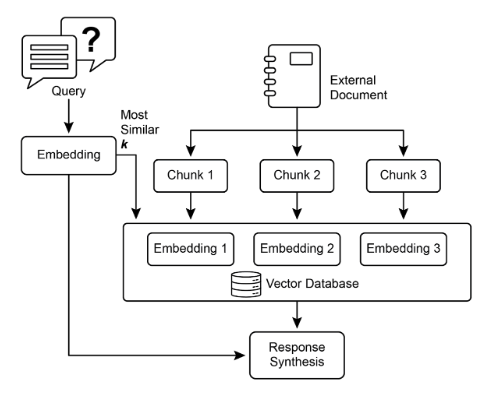
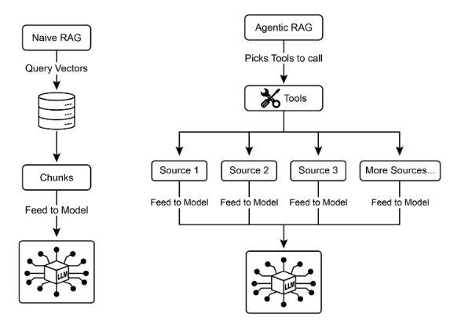
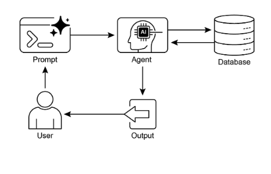
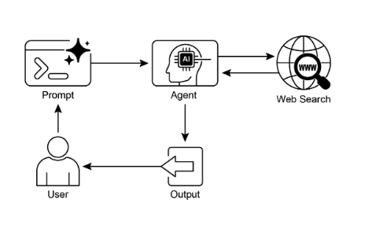

# 第 14 章：知識檢索 (RAG)

大語言模型展現了生成類人文字的巨大能力。然而，它們的知識庫通常僅限於訓練時的資料，限制了它們存取即時資訊、特定公司資料或高度專業化細節的能力。知識檢索 (RAG，或檢索增強生成) 解決了這個限制。RAG 使大語言模型能夠存取和整合外部、當前和背景特定的資訊，從而增強其輸出的準確性、相關性和事實基礎。

對於 AI 代理而言，這至關重要，因為它允許它們將行動和回應建立在即時、可驗證的資料上，超越其靜態訓練。這種能力使它們能夠準確執行複雜任務，例如存取最新公司政策來回答特定問題或在下訂單前檢查當前庫存。透過整合外部知識，RAG 將代理從簡單的對話者轉變為有效、資料驅動的工具，能夠執行有意義的工作。

## 知識檢索 (RAG) 模式概述

知識檢索 (RAG) 模式透過在生成回應前授予大語言模型存取外部知識庫的能力，顯著增強了它們的能力。RAG 不僅依賴其內部預訓練知識，還允許大語言模型「查找」資訊，就像人類可能會查閱書籍或搜尋網際網路一樣。這個過程賦予大語言模型提供更準確、最新和可驗證答案的能力。

當使用者對使用 RAG 的 AI 系統提出問題或給出提示時，查詢不會直接發送給大語言模型。相反，系統首先搜尋一個龐大的外部知識庫——一個高度組織化的文件、資料庫或網頁庫——尋找相關資訊。這種搜尋不是簡單的關鍵字匹配；它是一種理解使用者意圖和詞語背後含義的「語意搜尋」。這個初始搜尋提取出最相關的片段或資訊「塊」。然後將這些提取的片段「增強」或添加到原始提示中，創建更豐富、更有根據的查詢。最後，這個增強的提示被發送給大語言模型。有了這個額外背景，大語言模型可以生成不僅流暢自然，而且在檢索資料中有事實根據的回應。

RAG 框架提供了幾個重要好處。它允許大語言模型存取最新資訊，從而克服其靜態訓練資料的限制。這種方法還透過將回應建立在可驗證資料上來降低「幻覺」——生成虛假資訊——的風險。此外，大語言模型可以利用內部公司文件或 wiki 中找到的專業知識。這個過程的一個重要優勢是提供「引用」的能力，指出資訊的確切來源，從而增強 AI 回應的可信度和可驗證性。

要充分理解 RAG 如何運作，了解幾個核心概念至關重要 (見圖 1)：

### 嵌入

在大語言模型的背景下，嵌入是文字 (如單詞、片語或整個文件) 的數值表示。這些表示以向量的形式，即數字列表。關鍵想法是在數學空間中捕獲語意含義和不同文字片段之間的關係。具有相似含義的單詞或片語將在此向量空間中具有彼此更接近的嵌入。例如，想像一個簡單的 2D 圖。單詞「貓」可能由座標 (2, 3) 表示，而「小貓」會非常接近 (2.1, 3.1)。相反，單詞「汽車」會有一個遙遠的座標，如 (8, 1)，反映其不同的含義。實際上，這些嵌入處於更高維度的空間中，有數百甚至數千個維度，允許對語言有非常細微的理解。

### 文字相似性

文字相似性指的是衡量兩段文字有多相似。這可以在表面層次，查看單詞的重疊 (詞彙相似性)，或在更深層、基於含義的層次。在 RAG 的背景下，文字相似性對於在知識庫中找到與使用者查詢對應的最相關資訊至關重要。例如，考慮這些句子：「法國的首都是什麼？」和「哪個城市是法國的首都？」。雖然措辭不同，但它們問的是同一個問題。一個好的文字相似性模型會識別這一點，並給這兩個句子分配高相似性分數，即使它們只共享幾個單詞。這通常使用文字的嵌入來計算。

### 語意相似性和距離

語意相似性是文字相似性的一種更高級形式，純粹專注於文字的含義和背景，而不僅僅是使用的單詞。它旨在理解兩段文字是否傳達相同的概念或想法。語意距離是其反面；高語意相似性意味著低語意距離，反之亦然。在 RAG 中，語意搜尋依賴於找到與使用者查詢語意距離最小的文件。例如，片語「毛茸茸的貓科伴侶」和「家貓」除了「一個」之外沒有共同單詞。然而，理解語意相似性的模型會識別它們指的是同一件事，並認為它們高度相似。這是因為它們的嵌入在向量空間中會非常接近，表示小的語意距離。這是允許 RAG 找到相關資訊的「智慧搜尋」，即使使用者的措辭與知識庫中的文字不完全匹配。



圖 1：RAG 核心概念：分塊、嵌入和向量資料庫

### 文件分塊

分塊是將大型文件分解為更小、更易管理的片段或「塊」的過程。為了讓 RAG 系統有效運作，它不能將整個大型文件餵給大語言模型。相反，它處理這些較小的塊。文件分塊的方式對於保留資訊的背景和含義很重要。例如，不將 50 頁的使用者手冊視為單一文字塊，分塊策略可能將其分解為章節、段落或甚至句子。例如，「故障排除」章節會是與「安裝指南」分開的塊。當使用者詢問特定問題時，RAG 系統可以檢索最相關的故障排除塊，而不是整個手冊。這使檢索過程更快，向大語言模型提供的資訊更專注且與使用者的即時需求更相關。一旦文件被分塊，RAG 系統必須採用檢索技術來找到給定查詢最相關的片段。主要方法是向量搜尋，它使用嵌入和語意距離來找到與使用者問題概念上相似的塊。一種較舊但仍有價值的技術是 BM25，一種基於關鍵字的演算法，根據詞頻對塊進行排名，而不理解語意含義。為了兼得兩者之長，通常使用混合搜尋方法，結合 BM25 的關鍵字精度和語意搜尋的背景理解。這種融合允許更強健和準確的檢索，捕獲字面匹配和概念相關性。

### 向量資料庫

向量資料庫是一種專門設計用於有效儲存和查詢嵌入的專用資料庫類型。在文件被分塊並轉換為嵌入後，這些高維向量被儲存在向量資料庫中。傳統檢索技術，如基於關鍵字的搜尋，擅長找到包含查詢中確切單詞的文件，但缺乏對語言的深度理解。它們不會識別「毛茸茸的貓科伴侶」意味著「貓」。這就是向量資料庫的優勢所在。它們專門為語意搜尋而建。透過將文字儲存為數值向量，它們可以基於概念含義而不僅僅是關鍵字重疊找到結果。當使用者的查詢也轉換為向量時，資料庫使用高度優化的演算法 (如 HNSW - 分層可導航小世界) 快速搜尋數百萬個向量，並找到在含義上「最接近」的向量。這種方法對 RAG 來說遠勝於其他方法，因為即使使用者的措辭與來源文件完全不同，它也能發現相關背景。本質上，雖然其他技術搜尋單詞，向量資料庫搜尋含義。這項技術以各種形式實現，從託管資料庫如 Pinecone 和 Weaviate 到開源解決方案如 Chroma DB、Milvus 和 Qdrant。即使現有資料庫也可以增加向量搜尋能力，如 Redis、Elasticsearch 和 Postgres (使用 pgvector 擴展)。核心檢索機制通常由 Meta AI 的 FAISS 或 Google Research 的 ScaNN 等函式庫提供動力，這些對這些系統的效率至關重要。

### RAG 的挑戰

儘管威力強大，RAG 模式並非沒有挑戰。一個主要問題出現在回答查詢所需的資訊不侷限於單一塊，而是分散在文件的多個部分甚至幾個文件中時。在這種情況下，檢索器可能無法收集所有必要的背景，導致不完整或不準確的答案。系統的有效性也高度依賴於分塊和檢索過程的品質；如果檢索到不相關的塊，可能會引入雜訊並混淆大語言模型。此外，有效整合來自潛在矛盾來源的資訊仍然是這些系統的重大障礙。除此之外，另一個挑戰是 RAG 需要整個知識庫在專門資料庫 (如向量或圖形資料庫) 中進行預處理和儲存，這是一項相當大的工作。因此，當處理不斷演變的來源 (如公司 wiki) 時，這些知識需要定期協調以保持最新，這是一項關鍵任務。整個過程可能對效能產生明顯影響，增加延遲、操作成本和最終提示中使用的 Token 數量。

總結來說，檢索增強生成 (RAG) 模式代表了使 AI 更有知識和可靠性的重大飛躍。透過無縫地將外部知識檢索步驟整合到生成過程中，RAG 解決了獨立大語言模型的一些核心限制。嵌入和語意相似性的基礎概念，結合關鍵字和混合搜尋等檢索技術，允許系統智慧地找到相關資訊，透過策略性分塊使其變得可管理。整個檢索過程由專門設計用於大規模儲存和高效查詢數百萬嵌入的專用向量資料庫提供動力。雖然檢索分散或矛盾資訊的挑戰持續存在，RAG 賦予大語言模型產生不僅在背景上合適而且錨定在可驗證事實中的答案的能力，在 AI 中培養更大的信任和效用。

### 圖形 RAG

GraphRAG 是檢索增強生成的高級形式，利用知識圖譜而不是簡單的向量資料庫進行資訊檢索。它透過導航此結構化知識庫內資料實體 (節點) 之間的明確關係 (邊) 來回答複雜查詢。一個關鍵優勢是其能夠從跨多個文件分散的資訊中綜合答案的能力，這是傳統 RAG 的常見失敗。透過理解這些連接，GraphRAG 提供更具背景準確性和細微的回應。

使用案例包括複雜的金融分析、將公司與市場事件連接，以及發現基因與疾病之間關係的科學研究。然而，主要缺點是建立和維護高品質知識圖譜所需的重大複雜性、成本和專業知識。與更簡單的向量搜尋系統相比，這種設置也較不靈活，可能引入更高的延遲。系統的有效性完全依賴於底層圖結構的品質和完整性。因此，GraphRAG 為複雜問題提供了優越的背景推理，但實施和維護成本要高得多。總結來說，它在深度、相互連接的洞察比標準 RAG 的速度和簡單性更關鍵的地方表現出色。

### 代理 RAG

此模式的演進，被稱為**代理 RAG** (見圖 2)，引入了推理和決策層，顯著增強了資訊提取的可靠性。代理不僅僅是檢索和增強，一個「代理」——專門的 AI 組件——充當知識的關鍵守門人和改進者。這個代理不是被動地接受最初檢索的資料，而是主動詢問其品質、相關性和完整性，如以下情境所示。

首先，代理擅長反思和來源驗證。如果使用者問「我們公司的遠距工作政策是什麼？」標準 RAG 可能會提取 2020 年的部落格文章和官方 2025 年政策文件。然而，代理會分析文件的元資料，識別 2025 年政策為最新和最權威的來源，並在發送正確背景給大語言模型以獲得精確答案之前丟棄過時的部落格文章。



圖 2：代理 RAG 引入推理代理，主動評估、協調和改進檢索資訊，以確保更準確和可信的最終回應。

其次，代理善於協調知識衝突。想像一位金融分析師問「Alpha 專案的第一季預算是多少？」系統檢索兩個文件：一個初始提案說明 50,000 歐元預算，以及一個最終財務報告列出 65,000 歐元。代理 RAG 會識別這種矛盾，將財務報告優先為更可靠的來源，並向大語言模型提供驗證的數字，確保最終答案基於最準確的資料。

第三，代理可以執行多步推理來綜合複雜答案。如果使用者問「我們產品的功能和定價與競爭對手 X 相比如何？」代理會將此分解為單獨的子查詢。它會為自己產品的功能、定價、競爭對手 X 的功能和競爭對手 X 的定價啟動不同的搜尋。收集這些個別資訊片段後，代理會將它們綜合為結構化的比較背景，然後餵給大語言模型，使其能夠產生簡單檢索無法產生的全面回應。

第四，代理可以識別知識差距並使用外部工具。假設使用者問「市場對我們昨天推出的新產品的即時反應是什麼？」代理搜尋每週更新的內部知識庫，發現沒有相關資訊。識別到這個差距，它可以啟動工具——如即時網頁搜尋 API——找到最近的新聞文章和社交媒體情緒。代理然後使用這些新收集的外部資訊提供最新答案，克服其靜態內部資料庫的限制。

### 代理 RAG 的挑戰

雖然威力強大，代理層引入了自己的一套挑戰。主要缺點是複雜性和成本的顯著增加。設計、實施和維護代理的決策邏輯和工具整合需要大量工程努力，並增加計算費用。這種複雜性也可能導致延遲增加，因為代理的反思、工具使用和多步推理循環比標準、直接檢索過程需要更多時間。此外，代理本身可能成為新的錯誤來源；有缺陷的推理過程可能導致它陷入無用循環、誤解任務或不當地丟棄相關資訊，最終降低最終回應的品質。

### 總結

代理 RAG 代表了標準檢索模式的精密演進，將其從被動資料管道轉變為主動、問題解決框架。透過嵌入可以評估來源、協調衝突、分解複雜問題和使用外部工具的推理層，代理顯著改進了生成答案的可靠性和深度。這種進步使 AI 更可信和有能力，儘管它帶來了系統複雜性、延遲和成本方面的重要權衡，必須仔細管理。

## 實際應用與使用案例

知識檢索 (RAG) 正在改變大語言模型在各個行業中的利用方式，增強它們提供更準確和背景相關回應的能力。

應用包括：

* **企業搜尋和問答：** 組織可以開發內部聊天機器人，使用內部文件 (如 HR 政策、技術手冊和產品規格) 回應員工查詢。RAG 系統從這些文件中提取相關章節來指導大語言模型的回應。
* **客戶支援和服務台：** 基於 RAG 的系統可以透過存取產品手冊、常見問題 (FAQ) 和支援票證中的資訊，為客戶查詢提供精確和一致的回應。這可以減少例行問題對直接人工干預的需求。
* **個人化內容推薦：** RAG 不使用基本關鍵字匹配，而是可以識別和檢索與使用者偏好或先前互動語意相關的內容 (文章、產品)，導致更相關的推薦。
* **新聞和時事摘要：** 大語言模型可以與即時新聞源整合。當提示關於時事時，RAG 系統檢索最近文章，允許大語言模型產生最新摘要。

透過結合外部知識，RAG 將大語言模型的能力從簡單溝通擴展到作為知識處理系統運作。

## 實作程式碼範例 (ADK)

為了說明知識檢索 (RAG) 模式，讓我們看三個例子。

首先，是如何使用 Google 搜尋來做 RAG 並將大語言模型建立在搜尋結果上。由於 RAG 涉及存取外部資訊，Google 搜尋工具是可以增強大語言模型知識的內建檢索機制的直接例子。

```python
from google.adk.tools import google_search
from google.adk.agents import Agent


search_agent = Agent(
    name="research_assistant",
    model="gemini-2.0-flash-exp",
    instruction="你幫助使用者研究主題。當被詢問時，使用 Google 搜尋工具",
    tools=[google_search],
)
```

其次，本節解釋如何在 Google ADK 中利用 Vertex AI RAG 能力。提供的程式碼展示了從 ADK 初始化 VertexAiRagMemoryService。這允許建立與 Google Cloud Vertex AI RAG Corpus 的連接。服務透過指定語料庫資源名稱和可選參數 (如 `SIMILARITY_TOP_K` 和 `VECTOR_DISTANCE_THRESHOLD`) 進行配置。這些參數影響檢索過程。`SIMILARITY_TOP_K` 定義要檢索的頂部相似結果數量。`VECTOR_DISTANCE_THRESHOLD` 設定檢索結果的語意距離限制。此設置使代理能夠從指定的 RAG Corpus 執行可擴展且持久的語意知識檢索。該過程有效地將 Google Cloud 的 RAG 功能整合到 ADK 代理中，從而支援基於事實資料的回應開發。

```python
# 從 google.adk.memory 模組匯入必要的 VertexAiRagMemoryService 類別。
from google.adk.memory import VertexAiRagMemoryService


RAG_CORPUS_RESOURCE_NAME = "projects/your-gcp-project-id/locations/us-central1/ragCorpora/your-corpus-id"

# 定義檢索頂部相似結果數量的可選參數。
# 這控制 RAG 服務將返回多少相關文件塊。
SIMILARITY_TOP_K = 5

# 定義向量距離閾值的可選參數。
# 此閾值確定檢索結果允許的最大語意距離；
# 距離大於此值的結果可能被過濾掉。
VECTOR_DISTANCE_THRESHOLD = 0.7

# 初始化 VertexAiRagMemoryService 的實例。
# 這設置與你的 Vertex AI RAG Corpus 的連接。
# - rag_corpus：指定你的 RAG Corpus 的唯一識別符。
# - similarity_top_k：設置要獲取的相似結果的最大數量。
# - vector_distance_threshold：定義過濾結果的相似性閾值。
memory_service = VertexAiRagMemoryService(
    rag_corpus=RAG_CORPUS_RESOURCE_NAME,
    similarity_top_k=SIMILARITY_TOP_K,
    vector_distance_threshold=VECTOR_DISTANCE_THRESHOLD,
)
```

## 實作程式碼範例 (LangChain)

第三，讓我們使用 LangChain 完整範例進行說明。

```python
import os
import requests
from typing import List, Dict, Any, TypedDict

from langchain_community.document_loaders import TextLoader
from langchain_core.documents import Document
from langchain_core.prompts import ChatPromptTemplate
from langchain_core.output_parsers import StrOutputParser
from langchain_community.embeddings import OpenAIEmbeddings
from langchain_community.vectorstores import Weaviate
from langchain_openai import ChatOpenAI
from langchain.text_splitter import CharacterTextSplitter
from langchain.schema.runnable import RunnablePassthrough
from langgraph.graph import StateGraph, END

import weaviate
from weaviate.embedded import EmbeddedOptions
import dotenv


# 載入環境變數 (例如，OPENAI_API_KEY)
dotenv.load_dotenv()

# 設定你的 OpenAI API 金鑰 (確保從 .env 載入或在此設定)
# os.environ["OPENAI_API_KEY"] = "YOUR_OPENAI_API_KEY"


# --- 1. 資料準備 (預處理) ---

# 載入資料
url = "https://github.com/langchain-ai/langchain/blob/master/docs/docs/how_to/state_of_the_union.txt"
res = requests.get(url)
with open("state_of_the_union.txt", "w") as f:
    f.write(res.text)

loader = TextLoader("./state_of_the_union.txt")
documents = loader.load()

# 分塊文件
text_splitter = CharacterTextSplitter(chunk_size=500, chunk_overlap=50)
chunks = text_splitter.split_documents(documents)

# 嵌入並在 Weaviate 中儲存塊
client = weaviate.Client(embedded_options=EmbeddedOptions())

vectorstore = Weaviate.from_documents(
    client=client,
    documents=chunks,
    embedding=OpenAIEmbeddings(),
    by_text=False,
)

# 定義檢索器
retriever = vectorstore.as_retriever()

# 初始化大語言模型
llm = ChatOpenAI(model_name="gpt-3.5-turbo", temperature=0)


# --- 2. 為 LangGraph 定義狀態 ---
class RAGGraphState(TypedDict):
    question: str
    documents: List[Document]
    generation: str


# --- 3. 定義節點 (函數) ---
def retrieve_documents_node(state: RAGGraphState) -> RAGGraphState:
    """根據使用者問題檢索文件。"""
    question = state["question"]
    documents = retriever.invoke(question)
    return {"documents": documents, "question": question, "generation": ""}


def generate_response_node(state: RAGGraphState) -> RAGGraphState:
    """使用基於檢索文件的大語言模型生成回應。"""
    question = state["question"]
    documents = state["documents"]

    # 來自 PDF 的提示模板
    template = """你是問答任務的助理。使用以下檢索的背景片段來回答問題。如果你不知道答案，就說你不知道。最多使用三個句子並保持答案簡潔。
問題：{question}
背景：{context}
答案："""
    prompt = ChatPromptTemplate.from_template(template)

    # 從文件格式化背景
    context = "\n\n".join([doc.page_content for doc in documents])

    # 創建 RAG 鏈
    rag_chain = prompt | llm | StrOutputParser()

    # 調用鏈
    generation = rag_chain.invoke({"context": context, "question": question})

    return {"question": question, "documents": documents, "generation": generation}


# --- 4. 建立 LangGraph 圖 ---
workflow = StateGraph(RAGGraphState)

# 添加節點
workflow.add_node("retrieve", retrieve_documents_node)
workflow.add_node("generate", generate_response_node)

# 設定入口點
workflow.set_entry_point("retrieve")

# 添加邊 (轉換)
workflow.add_edge("retrieve", "generate")
workflow.add_edge("generate", END)

# 編譯圖
app = workflow.compile()


# --- 5. 運行 RAG 應用程式 ---
if __name__ == "__main__":
    print("\n--- 運行 RAG 查詢 ---")
    query = "總統對 Justice Breyer 說了什麼"
    inputs = {"question": query}
    for s in app.stream(inputs):
        print(s)

    print("\n--- 運行另一個 RAG 查詢 ---")
    query_2 = "總統對經濟說了什麼？"
    inputs_2 = {"question": query_2}
    for s in app.stream(inputs_2):
        print(s)
```

這個 Python 程式碼說明了使用 LangChain 和 LangGraph 實施的檢索增強生成 (RAG) 管道。該過程從創建衍生自文字文件的知識庫開始，將其分割為塊並轉換為嵌入。然後將這些嵌入儲存在 Weaviate 向量存儲中，促進高效的資訊檢索。LangGraph 中的 StateGraph 用於管理兩個關鍵函數之間的工作流程：`retrieve_documents_node` 和 `generate_response_node`。`retrieve_documents_node` 函數查詢向量存儲，根據使用者輸入識別相關文件塊。隨後，`generate_response_node` 函數利用檢索資訊和預定義的提示模板，使用 OpenAI 大語言模型產生回應。`app.stream` 方法允許透過 RAG 管道執行查詢，展示系統產生背景相關輸出的能力。

## 一覽表

**內容：** 大語言模型具有令人印象深刻的文字生成能力，但基本上受到其訓練資料的限制。這種知識是靜態的，意味著它不包括即時資訊或私人、領域特定資料。因此，它們的回應可能過時、不準確或缺乏專業任務所需的特定背景。這種差距限制了它們在需要當前和事實答案的應用中的可靠性。

**原因：** 檢索增強生成 (RAG) 模式透過將大語言模型連接到外部知識來源提供標準化解決方案。當收到查詢時，系統首先從指定知識庫檢索相關資訊片段。然後將這些片段附加到原始提示，用及時和特定背景豐富它。然後將此增強提示發送給大語言模型，使其能夠生成準確、可驗證且建立在外部資料上的回應。這個過程有效地將大語言模型從封閉式推理者轉變為開放式推理者，顯著增強其效用和可信度。

**經驗法則：** 當你需要大語言模型根據特定、最新或專有資訊 (不是其原始訓練資料的一部分) 回答問題或生成內容時，使用此模式。它非常適合建立內部文件的問答系統、客戶支援機器人，以及需要可驗證、基於事實且附引用回應的應用程式。

**視覺摘要：**



知識檢索模式：AI 代理查詢和檢索結構化資料庫中的資訊



圖 3：知識檢索模式：AI 代理從公共網際網路找到並綜合資訊以回應使用者查詢。

## 關鍵要點

* 知識檢索 (RAG) 透過允許大語言模型存取外部、最新和特定資訊來增強它們。
* 該過程涉及檢索 (在知識庫中搜尋相關片段) 和增強 (將這些片段添加到大語言模型的提示)。
* RAG 幫助大語言模型克服過時訓練資料等限制，減少「幻覺」，並實現領域特定知識整合。
* RAG 允許可歸因的答案，因為大語言模型的回應建立在檢索來源上。
* GraphRAG 利用知識圖譜理解不同資訊片段之間的關係，允許它回答需要從多個來源綜合資料的複雜問題。
* 代理 RAG 超越簡單的資訊檢索，使用智慧代理主動推理、驗證和改進外部知識，確保更準確和可靠的答案。
* 實際應用涵蓋企業搜尋、客戶支援、法律研究和個人化推薦。

## 結論

總結來說，檢索增強生成 (RAG) 透過將大語言模型連接到外部、最新資料來源來解決其靜態知識的核心限制。該過程透過首先檢索相關資訊片段然後增強使用者提示，使大語言模型能夠生成更準確和背景感知的回應。這透過嵌入、語意搜尋和向量資料庫等基礎技術成為可能，這些技術基於含義而不僅僅是關鍵字找到資訊。透過將輸出建立在可驗證資料上，RAG 顯著減少事實錯誤並允許使用專有資訊，透過引用增強信任。

一個高級演進，代理 RAG，引入推理層，主動驗證、協調和綜合檢索知識以實現更大可靠性。類似地，GraphRAG 等專門方法利用知識圖譜導航明確的資料關係，允許系統綜合對高度複雜、相互連接查詢的答案。這個代理可以解決衝突資訊、執行多步查詢，並使用外部工具找到缺失資料。雖然這些高級方法增加了複雜性和延遲，但它們顯著改進了最終回應的深度和可信度。這些模式的實際應用已經在轉變行業，從企業搜尋和客戶支援到個人化內容傳遞。儘管有挑戰，RAG 是使 AI 更有知識、可靠和有用的關鍵模式。最終，它將大語言模型從封閉式對話者轉變為強大的開放式推理工具。

## 參考文獻

1. Lewis, P., et al. (2020). *Retrieval-Augmented Generation for Knowledge-Intensive NLP Tasks*. [https://arxiv.org/abs/2005.11401](https://arxiv.org/abs/2005.11401)
2. Google AI for Developers Documentation.  *Retrieval Augmented Generation - [https://cloud.google.com/vertex-ai/generative-ai/docs/rag-engine/rag-overview](https://cloud.google.com/vertex-ai/generative-ai/docs/rag-engine/rag-overview)*
3. Retrieval-Augmented Generation with Graphs (GraphRAG), [https://arxiv.org/abs/2501.00309](https://arxiv.org/abs/2501.00309)
4. LangChain and LangGraph: Leonie Monigatti, "Retrieval-Augmented Generation (RAG): From Theory to LangChain Implementation,"  [*https://medium.com/data-science/retrieval-augmented-generation-rag-from-theory-to-langchain-implementation-4e9bd5f6a4f2*](https://medium.com/data-science/retrieval-augmented-generation-rag-from-theory-to-langchain-implementation-4e9bd5f6a4f2)
5. Google Cloud Vertex AI RAG Corpus [*https://cloud.google.com/vertex-ai/generative-ai/docs/rag-engine/manage-your-rag-corpus#corpus-management*](https://cloud.google.com/vertex-ai/generative-ai/docs/rag-engine/manage-your-rag-corpus#corpus-management)