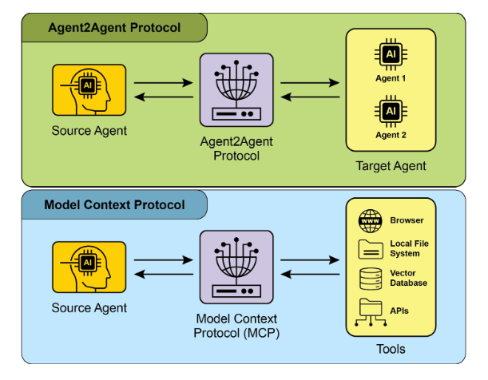
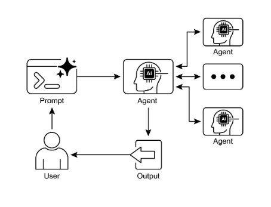

# 第15章：代理間通訊 (A2A)

個別的AI代理在處理複雜、多面向的問題時，即使具備先進的能力，也常常面臨限制。為了克服這個問題，代理間通訊 (A2A) 讓不同的AI代理 (可能使用不同的框架建構) 能夠有效協作。這種協作涉及無縫協調、任務委派和資訊交換。

Google的A2A協定是一個開放標準，旨在促進這種通用通訊。本章將探討A2A、其實際應用，以及在Google ADK中的實作。

## 代理間通訊模式概述

Agent2Agent (A2A) 協定是一個開放標準，旨在實現不同AI代理框架之間的通訊與協作。它確保互操作性，讓使用LangGraph、CrewAI或Google ADK等技術開發的AI代理能夠協同工作，無論其來源或框架差異。

A2A獲得眾多科技公司和服務提供商的支持，包括Atlassian、Box、LangChain、MongoDB、Salesforce、SAP和ServiceNow。Microsoft計劃將A2A整合到Azure AI Foundry和Copilot Studio中，展現了其對開放協定的承諾。此外，Auth0和SAP也正在將A2A支援整合到他們的平台和代理中。

作為一個開源協定，A2A歡迎社群貢獻，以促進其演進和廣泛採用。

## A2A核心概念

A2A協定為代理互動提供了結構化方法，建立在幾個核心概念之上。深入理解這些概念對於任何開發或整合A2A相容系統的人來說都是至關重要的。A2A的基本支柱包括核心角色、代理卡片、代理發現、通訊與任務、互動機制和安全性，所有這些都將詳細檢討。

**核心角色：** A2A涉及三個主要實體：

* 使用者：發起對代理協助的請求。
* A2A客戶端 (客戶端代理)：代表使用者行動以請求動作或資訊的應用程式或AI代理。
* A2A伺服器 (遠端代理)：提供HTTP端點來處理客戶端請求並回傳結果的AI代理或系統。遠端代理作為「不透明」系統運作，意味著客戶端不需要了解其內部運作細節。

**代理卡片：** 代理的數位身份由其代理卡片定義，通常是一個JSON檔案。此檔案包含客戶端互動和自動發現的關鍵資訊，包括代理的身份、端點URL和版本。它還詳細說明支援的功能 (如串流或推播通知)、特定技能、預設輸入/輸出模式和身份驗證要求。以下是WeatherBot代理卡片的範例。

```json
{
    "name": "WeatherBot",
    "description": "Provides accurate weather forecasts and historical data.",
    "url": "http://weather-service.example.com/a2a",
    "version": "1.0.0",
    "capabilities": {
        "streaming": true,
        "pushNotifications": false,
        "stateTransitionHistory": true
    },
    "authentication": {
        "schemes": [
            "apiKey"
        ]
    },
    "defaultInputModes": [
        "text"
    ],
    "defaultOutputModes": [
        "text"
    ],
    "skills": [
        {
            "id": "get_current_weather",
            "name": "Get Current Weather",
            "description": "Retrieve real-time weather for any location.",
            "inputModes": [
                "text"
            ],
            "outputModes": [
                "text"
            ],
            "examples": [
                "What's the weather in Paris?",
                "Current conditions in Tokyo"
            ],
            "tags": [
                "weather",
                "current",
                "real-time"
            ]
        },
        {
            "id": "get_forecast",
            "name": "Get Forecast",
            "description": "Get 5-day weather predictions.",
            "inputModes": [
                "text"
            ],
            "outputModes": [
                "text"
            ],
            "examples": [
                "5-day forecast for New York",
                "Will it rain in London this weekend?"
            ],
            "tags": [
                "weather",
                "forecast",
                "prediction"
            ]
        }
    ]
}
```

**代理發現：** 它允許客戶端找到代理卡片，這些卡片描述了可用A2A伺服器的功能。此過程存在幾種策略：

* 知名URI：代理在標準化路徑 (例如/.well-known/agent.json) 託管其代理卡片。這種方法為公共或領域特定用途提供廣泛且通常自動化的可存取性。
* 策劃註冊中心：這些提供集中式目錄，其中發布代理卡片並可根據特定條件查詢。這很適合需要集中管理和存取控制的企業環境。
* 直接配置：代理卡片資訊被嵌入或私人分享。這種方法適用於緊密耦合或私人系統，其中動態發現並非至關重要。

無論選擇哪種方法，保護代理卡片端點都很重要。這可以透過存取控制、相互TLS (mTLS) 或網路限制來實現，特別是如果卡片包含敏感 (雖然非機密) 資訊。

**通訊與任務：** 在A2A框架中，通訊圍繞非同步任務進行結構化，這些任務代表長期執行過程中的基本工作單位。每個任務都被分配一個唯一識別碼，並在一系列狀態中移動，如已提交、工作中或已完成，這種設計支援複雜操作中的並行處理。代理之間的通訊透過訊息進行。

這種通訊包含屬性，即描述訊息的鍵值中繼資料 (如其優先級或建立時間)，以及一個或多個部分，承載實際傳遞的內容，如純文字、檔案或結構化JSON資料。代理在任務期間產生的具體輸出稱為工件。像訊息一樣，工件也由一個或多個部分組成，並可在結果可用時增量串流。A2A框架內的所有通訊都是透過HTTP(S) 進行，使用JSON-RPC 2.0協定作為負載。為了在多次互動中保持連續性，使用伺服器產生的contextId來分組相關任務並保持上下文。

**互動機制：** 請求/回應 (輪詢) 伺服器傳送事件 (SSE)。A2A提供多種互動方法以適應各種AI應用需求，每種都有獨特的機制：

* 同步請求/回應：用於快速、即時操作。在此模型中，客戶端傳送請求並主動等待伺服器處理並在單一、同步交換中回傳完整回應。
* 非同步輪詢：適用於需要較長時間處理的任務。客戶端傳送請求，伺服器立即確認並回傳「工作中」狀態和任務ID。然後客戶端可以自由執行其他動作，並可定期透過傳送新請求來輪詢伺服器，檢查任務狀態，直到標記為「已完成」或「失敗」。
* 串流更新 (伺服器傳送事件 - SSE)：適合接收即時、增量結果。此方法建立從伺服器到客戶端的持久、單向連接。它允許遠端代理持續推送更新，如狀態變更或部分結果，而無需客戶端發出多個請求。
* 推播通知 (Webhooks)：為非常長期執行或資源密集的任務而設計，其中維持持續連接或頻繁輪詢是低效的。客戶端可以註冊webhook URL，當任務狀態顯著變更時 (例如完成時)，伺服器將向該URL傳送非同步通知 (「推播」)。

代理卡片指定代理是否支援串流或推播通知功能。此外，A2A是模態不可知的，意味著它可以促進這些互動模式不僅適用於文字，還適用於音訊和影片等其他資料類型，實現豐富的多模態AI應用。串流和推播通知功能都在代理卡片中指定。

```json
# 同步請求範例
{
    "jsonrpc": "2.0",
    "id": "1",
    "method": "sendTask",
    "params": {
        "id": "task-001",
        "sessionId": "session-001",
        "message": {
            "role": "user",
            "parts": [
                {
                    "type": "text",
                    "text": "What is the exchange rate from USD to EUR?"
                }
            ]
        },
        "acceptedOutputModes": [
            "text/plain"
        ],
        "historyLength": 5
    }
}
```

同步請求使用sendTask方法，客戶端要求並期望對其查詢的單一、完整答案。相比之下，串流請求使用sendTaskSubscribe方法建立持久連接，允許代理隨時間傳送多個、增量更新或部分結果。

```json
# 串流請求範例
{
    "jsonrpc": "2.0",
    "id": "2",
    "method": "sendTaskSubscribe",
    "params": {
        "id": "task-002",
        "sessionId": "session-001",
        "message": {
            "role": "user",
            "parts": [
                {
                    "type": "text",
                    "text": "What's the exchange rate for JPY to GBP today?"
                }
            ]
        },
        "acceptedOutputModes": [
            "text/plain"
        ],
        "historyLength": 5
    }
}
```

**安全性：** 代理間通訊 (A2A)：代理間通訊 (A2A) 是系統架構的重要組成部分，透過幾種內建機制確保穩健性和完整性，實現代理之間安全且無縫的資料交換。

相互傳輸層安全性 (TLS)：建立加密和身份驗證連接以防止未授權存取和資料攔截，確保安全通訊。

綜合稽核日誌：所有代理間通訊都被仔細記錄，詳述資訊流程、涉及的代理和動作。此稽核追蹤對於問責制、故障排除和安全分析至關重要。

代理卡片聲明：身份驗證要求在代理卡片中明確聲明，這是一個配置工件，概述代理的身份、功能和安全政策。這集中化並簡化了身份驗證管理。

憑證處理：代理通常使用安全憑證 (如OAuth 2.0 Token或API金鑰) 進行身份驗證，透過HTTP標頭傳遞。此方法防止憑證在URL或訊息主體中暴露，增強整體安全性。

## A2A vs. MCP

A2A是一個補充Anthropic的模型上下文協定 (MCP) 的協定 (見圖1)。雖然MCP專注於為代理構建上下文及其與外部資料和工具的互動，但A2A促進代理之間的協調和通訊，實現任務委派和協作。



圖1：A2A和MCP協定比較

A2A的目標是提高效率、降低整合成本，並在開發複雜、多代理AI系統中促進創新和互操作性。因此，深入理解A2A的核心組件和操作方法對於有效設計、實作和應用於建構協作且可互操作的AI代理系統至關重要。

## 實際應用與使用案例

代理間通訊對於構建跨多個領域的複雜AI解決方案是不可或缺的，實現模組化、可擴展性和增強智慧。

* **多框架協作：** A2A的主要使用案例是讓獨立的AI代理，無論其底層框架 (例如ADK、LangChain、CrewAI) 為何，都能進行通訊和協作。這是構建複雜多代理系統的基礎，其中不同代理專門處理問題的不同面向。
* **自動化工作流程編排：** 在企業環境中，A2A可以透過讓代理委派和協調任務來促進複雜工作流程。例如，一個代理可能處理初始資料收集，然後委派給另一個代理進行分析，最後委派給第三個代理進行報告產生，所有這些都透過A2A協定進行通訊。
* **動態資訊檢索：** 代理可以通訊以檢索和交換即時資訊。主要代理可能從專門的「資料獲取代理」請求即時市場資料，該代理然後使用外部API收集資訊並將其傳送回去。

## 實作程式碼範例

讓我們檢視A2A協定的實際應用。位於 [https://github.com/google-a2a/a2a-samples/tree/main/samples](https://github.com/google-a2a/a2a-samples/tree/main/samples) 的存儲庫提供了Java、Go和Python的範例，說明了各種代理框架 (如LangGraph、CrewAI、Azure AI Foundry和AG2) 如何使用A2A進行通訊。此存儲庫中的所有程式碼都在Apache 2.0授權下發布。為了進一步說明A2A的核心概念，我們將檢討程式碼摘錄，重點關注使用基於ADK的代理設定A2A伺服器，該代理具有Google身份驗證工具。查看 [https://github.com/google-a2a/a2a-samples/blob/main/samples/python/agents/birthday_planner_adk/calendar_agent/adk_agent.py](https://github.com/google-a2a/a2a-samples/blob/main/samples/python/agents/birthday_planner_adk/calendar_agent/adk_agent.py)

```python
import datetime

from google.adk.agents import LlmAgent  # type: ignore[import-untyped]
from google.adk.tools.google_api_tool import CalendarToolset  # type: ignore[import-untyped]


async def create_agent(client_id: str, client_secret: str) -> LlmAgent:
    """Constructs the ADK agent."""
    toolset = CalendarToolset(client_id=client_id, client_secret=client_secret)
    return LlmAgent(
        model="gemini-2.0-flash-001",
        name="calendar_agent",
        description="An agent that can help manage a user's calendar",
        instruction=(
            f""" You are an agent that can help manage a user's calendar. Users will request information about the state of their calendar """
            f""" or to make changes to their calendar. Use the provided tools for interacting with the calendar API. """
            f""" If not specified, assume the calendar the user wants is the 'primary' calendar. """
            f""" When using the Calendar API tools, use well-formed RFC3339 timestamps. Today is {datetime.datetime.now()}. """
        ),
        tools=await toolset.get_tools(),
    )
```

這個Python程式碼定義了一個非同步函數`create_agent`，用於構建ADK LlmAgent。它首先使用提供的客戶端憑證初始化`CalendarToolset`以存取Google Calendar API。隨後，建立一個`LlmAgent`實例，配置指定的Gemini模型、描述性名稱和管理使用者行事曆的指令。代理配備來自`CalendarToolset`的行事曆工具，使其能夠與Calendar API互動並回應關於行事曆狀態或修改的使用者查詢。代理的指令動態整合當前日期以提供時間上下文。為了說明如何構建代理，讓我們檢視GitHub上A2A範例中`calendar_agent`的關鍵部分。

下面的程式碼展示了如何使用其特定指令和工具定義代理。請注意，這裡只顯示了解釋此功能所需的程式碼；你可以在這裡存取完整檔案：[https://github.com/a2aproject/a2a-samples/blob/main/samples/python/agents/birthday_planner_adk/calendar_agent/__main__.py](https://github.com/a2aproject/a2a-samples/blob/main/samples/python/agents/birthday_planner_adk/calendar_agent/__main__.py)

```python
def main(host: str = "0.0.0.0", port: int = 8000):
    # Verify an API key is set.
    # Not required if using Vertex AI APIs.
    if os.getenv("GOOGLE_GENAI_USE_VERTEXAI") != "TRUE" and not os.getenv("GOOGLE_API_KEY"):
        raise ValueError(
            "GOOGLE_API_KEY environment variable not set and "
            "GOOGLE_GENAI_USE_VERTEXAI is not TRUE."
        )

    skill = AgentSkill(
        id="check_availability",
        name="Check Availability",
        description="Checks a user's availability for a time using their Google Calendar",
        tags=["calendar"],
        examples=["Am I free from 10am to 11am tomorrow?"],
    )

    agent_card = AgentCard(
        name="Calendar Agent",
        description="An agent that can manage a user's calendar",
        url=f"http://{host}:{port}/",
        version="1.0.0",
        defaultInputModes=["text"],
        defaultOutputModes=["text"],
        capabilities=AgentCapabilities(streaming=True),
        skills=[skill],
    )

    adk_agent = asyncio.run(
        create_agent(
            client_id=os.getenv("GOOGLE_CLIENT_ID"),
            client_secret=os.getenv("GOOGLE_CLIENT_SECRET"),
        )
    )

    runner = Runner(
        app_name=agent_card.name,
        agent=adk_agent,
        artifact_service=InMemoryArtifactService(),
        session_service=InMemorySessionService(),
        memory_service=InMemoryMemoryService(),
    )
    agent_executor = ADKAgentExecutor(runner, agent_card)

    async def handle_auth(request: Request) -> PlainTextResponse:
        await agent_executor.on_auth_callback(
            str(request.query_params.get("state")),
            str(request.url),
        )
        return PlainTextResponse("Authentication successful.")

    request_handler = DefaultRequestHandler(
        agent_executor=agent_executor,
        task_store=InMemoryTaskStore(),
    )

    a2a_app = A2AStarletteApplication(
        agent_card=agent_card,
        http_handler=request_handler,
    )
    routes = a2a_app.routes()
    routes.append(
        Route(
            path="/authenticate",
            methods=["GET"],
            endpoint=handle_auth,
        )
    )
    app = Starlette(routes=routes)

    uvicorn.run(app, host=host, port=port)


if __name__ == "__main__":
    main()
```

這個Python程式碼展示了如何設定A2A相容的「行事曆代理」，用於使用Google Calendar檢查使用者可用性。它涉及驗證API金鑰或Vertex AI配置以進行身份驗證。代理的功能，包括「check_availability」技能，在AgentCard中定義，該卡片還指定代理的網路位址。隨後，建立一個ADK代理，配置記憶體服務來管理工件、會話和記憶體。然後程式碼初始化Starlette網路應用程式，整合身份驗證回調和A2A協定處理程序，並使用Uvicorn執行它以透過HTTP公開代理。

這些範例說明了建構A2A相容代理的過程，從定義其功能到將其作為網路服務執行。透過利用代理卡片和ADK，開發人員可以建立能夠與Google Calendar等工具整合的可互操作AI代理。這種實用方法展示了A2A在建立多代理生態系統中的應用。

建議透過 [https://www.trickle.so/blog/how-to-build-google-a2a-project](https://www.trickle.so/blog/how-to-build-google-a2a-project) 的程式碼演示進一步探索A2A。此連結提供的資源包括Python和JavaScript的範例A2A客戶端和伺服器、多代理網路應用程式、命令列介面，以及各種代理框架的範例實作。

## 速覽

**什麼：** 個別的AI代理，特別是那些建立在不同框架上的代理，在獨自處理複雜、多面向問題時常常遇到困難。主要挑戰是缺乏共同語言或協定，讓它們能夠有效地通訊和協作。這種孤立阻礙了建立複雜系統的可能性，在這些系統中，多個專門代理可以結合其獨特技能來解決更大的任務。沒有標準化方法，整合這些不同的代理是昂貴、耗時的，並阻礙了更強大、凝聚力AI解決方案的開發。

**為什麼：** 代理間通訊 (A2A) 協定為這個問題提供了開放、標準化的解決方案。它是一個基於HTTP的協定，實現互操作性，讓不同的AI代理能夠無縫協調、委派任務和分享資訊，無論其底層技術為何。核心組件是代理卡片，這是一個描述代理功能、技能和通訊端點的數位身份檔案，促進發現和互動。A2A定義了各種互動機制，包括同步和非同步通訊，以支援多樣化的使用案例。透過為代理協作建立通用標準，A2A促進了構建複雜、多代理系統的模組化和可擴展生態系統。

**經驗法則：** 當你需要編排兩個或更多AI代理之間的協作時，特別是如果它們使用不同框架 (例如Google ADK、LangGraph、CrewAI) 建構時，使用此模式。它適合構建複雜、模組化的應用程式，其中專門代理處理工作流程的特定部分，例如將資料分析委派給一個代理，將報告產生委派給另一個代理。當代理需要動態發現和使用其他代理的功能來完成任務時，此模式也是必要的。

**視覺摘要：**



圖2：A2A代理間通訊模式

## 關鍵要點

關鍵要點：

* Google A2A協定是一個開放、基於HTTP的標準，促進使用不同框架建構的AI代理之間的通訊與協作。
* AgentCard作為代理的數位識別碼，允許其他代理自動發現和理解其功能。
* A2A提供同步請求-回應互動 (使用`tasks/send`) 和串流更新 (使用`tasks/sendSubscribe`) 來適應不同的通訊需求。
* 協定支援多輪對話，包括`input-required`狀態，允許代理請求額外資訊並在互動期間維持上下文。
* A2A鼓勵模組化架構，其中專門代理可以在不同埠上獨立運作，實現系統可擴展性和分散性。
* 像Trickle AI這樣的工具有助於視覺化和追蹤A2A通訊，幫助開發人員監控、除錯和優化多代理系統。
* 雖然A2A是用於管理不同代理之間任務和工作流程的高階協定，模型上下文協定 (MCP) 為大語言模型提供與外部資源介面的標準化介面。

## 結論

代理間通訊 (A2A) 協定建立了一個重要的開放標準，以克服個別AI代理固有的孤立性。透過提供共同的基於HTTP的框架，它確保了建立在不同平台上的代理 (如Google ADK、LangGraph或CrewAI) 之間的無縫協作和互操作性。核心組件是代理卡片，它作為數位身份，清楚定義代理的功能並讓其他代理能夠動態發現。協定的靈活性支援各種互動模式，包括同步請求、非同步輪詢和即時串流，滿足廣泛的應用需求。

這實現了模組化和可擴展架構的建立，其中專門代理可以組合來編排複雜的自動化工作流程。安全性是基本面向，具有mTLS和明確身份驗證要求等內建機制來保護通訊。雖然補充了MCP等其他標準，但A2A的獨特焦點是代理之間的高階協調和任務委派。主要科技公司的強力支持和實用實作的可用性突顯了其日益增長的重要性。此協定為開發人員構建更複雜、分散和智慧的多代理系統鋪平了道路。最終，A2A是促進創新且可互操作的協作AI生態系統的基礎支柱。

## 參考文獻

1. Chen, B. (2025, April 22). *How to Build Your First Google A2A Project: A Step-by-Step Tutorial*. Trickle.so Blog. [https://www.trickle.so/blog/how-to-build-google-a2a-project](https://www.trickle.so/blog/how-to-build-google-a2a-project)
2. Google A2A GitHub Repository. [https://github.com/google-a2a/A2A](https://github.com/google-a2a/A2A)
3. Google Agent Development Kit (ADK) [https://google.github.io/adk-docs/](https://google.github.io/adk-docs/)
4. Getting Started with Agent-to-Agent (A2A) Protocol: [https://codelabs.developers.google.com/intro-a2a-purchasing-concierge\#0](https://codelabs.developers.google.com/intro-a2a-purchasing-concierge#0)
5. Google AgentDiscovery \- [https://a2a-protocol.org/latest/](https://a2a-protocol.org/latest/)
6. Communication between different AI frameworks such as LangGraph, CrewAI, and Google ADK [https://www.trickle.so/blog/how-to-build-google-a2a-project](https://www.trickle.so/blog/how-to-build-google-a2a-project#setting-up-your-a2a-development-environment)
7. Designing Collaborative Multi-Agent Systems with the A2A Protocol [https://www.oreilly.com/radar/designing-collaborative-multi-agent-systems-with-the-a2a-protocol/](https://www.oreilly.com/radar/designing-collaborative-multi-agent-systems-with-the-a2a-protocol/)