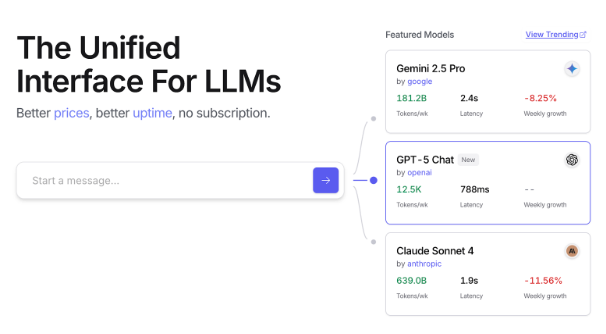
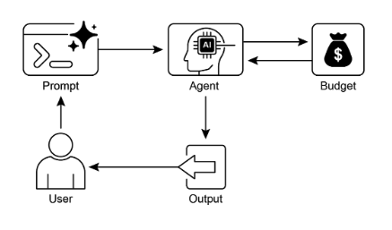

# 第16章：資源感知優化

資源感知優化讓智慧代理能夠在操作期間動態監控和管理計算、時間和財務資源。這與主要專注於動作排序的簡單規劃不同。資源感知優化要求代理做出關於動作執行的決策，以在指定資源預算內實現目標或優化效率。這涉及在更準確但昂貴的模型與更快、更低成本的模型之間做出選擇，或決定是否分配額外的計算資源來獲得更精細的回應，還是回傳更快但詳細程度較低的答案。

例如，考慮一個被指派為金融分析師分析大型資料集的代理。如果分析師需要立即獲得初步報告，代理可能會使用更快、更經濟的模型來快速總結關鍵趨勢。然而，如果分析師需要高度準確的預測來做出關鍵投資決策，並且有更大的預算和更多時間，代理將分配更多資源來使用強大、較慢但更精確的預測模型。這個類別中的關鍵策略是後備機制，當首選模型因過載或受到限制而不可用時，它作為保護措施。為了確保優雅降級，系統會自動切換到預設或更經濟的模型，保持服務連續性而不是完全失敗。

## 實際應用與使用案例

實際使用案例包括：

* **成本優化的大語言模型使用：** 代理根據預算限制決定是否對複雜任務使用大型、昂貴的大語言模型，或對簡單查詢使用較小、更經濟的模型。
* **延遲敏感操作：** 在即時系統中，代理選擇更快但可能不太全面的推理路徑以確保及時回應。
* **能源效率：** 對於部署在邊緣設備或電力有限的代理，優化其處理以節省電池壽命。
* **服務可靠性的後備機制：** 當主要選擇不可用時，代理自動切換到備用模型，確保服務連續性和優雅降級。
* **資料使用管理：** 代理選擇摘要資料檢索而非完整資料集下載以節省頻寬或儲存空間。
* **自適應任務分配：** 在多代理系統中，代理根據其當前計算負載或可用時間自我分配任務。

## 實作程式碼範例

一個用於回答使用者問題的智慧系統可以評估每個問題的難度。對於簡單查詢，它使用成本效益高的語言模型，如Gemini Flash。對於複雜詢問，考慮使用更強大但昂貴的語言模型 (如Gemini Pro)。使用更強大模型的決定也取決於資源可用性，特別是預算和時間限制。這個系統動態選擇適當的模型。

例如，考慮一個使用階層式代理建構的旅行規劃工具。高階規劃涉及理解使用者的複雜請求、將其分解為多步驟行程，以及做出邏輯決策，這將由像Gemini Pro這樣複雜且更強大的大語言模型管理。這是需要深度理解上下文和推理能力的「規劃者」代理。

然而，一旦建立計劃，該計劃內的個別任務，如查詢航班價格、檢查酒店可用性或尋找餐廳評論，本質上都是簡單、重複的網路查詢。這些「工具函數呼叫」可以由更快且更經濟的模型如Gemini Flash執行。很容易理解為什麼經濟型模型可以用於這些直接的網路搜尋，而複雜的規劃階段需要更先進模型的更強智慧來確保連貫且邏輯的旅行計劃。

Google的ADK透過其多代理架構支援這種方法，允許建立模組化和可擴展的應用程式。不同的代理可以處理專門的任務。模型靈活性使得能夠直接使用各種Gemini模型，包括Gemini Pro和Gemini Flash，或透過LiteLLM整合其他模型。ADK的編排功能支援動態、大語言模型驅動的路由以實現自適應行為。內建評估功能允許系統化評估代理效能，可用於系統優化 (見評估和監控章節)。

接下來，將定義兩個具有相同設定但使用不同模型和成本的代理。

```python
# 概念性Python結構，非可執行程式碼
from google.adk.agents import Agent
# from google.adk.models.lite_llm import LiteLlm  # 如果使用ADK預設Agent不直接支援的模型

# 使用更昂貴的Gemini Pro 2.5的代理
gemini_pro_agent = Agent(
    name="GeminiProAgent",
    model="gemini-2.5-pro",  # 如果實際模型名稱不同的占位符
    description="A highly capable agent for complex queries.",
    instruction="You are an expert assistant for complex problem-solving.",
)

# 使用較便宜的Gemini Flash 2.5的代理
gemini_flash_agent = Agent(
    name="GeminiFlashAgent",
    model="gemini-2.5-flash",  # 如果實際模型名稱不同的占位符
    description="A fast and efficient agent for simple queries.",
    instruction="You are a quick assistant for straightforward questions.",
)
```

路由代理可以根據簡單指標 (如查詢長度) 導向查詢，其中較短的查詢轉到較便宜的模型，較長的查詢轉到更有能力的模型。然而，更複雜的路由代理可以利用大語言模型或機器學習模型來分析查詢的細微差別和複雜性。這個大語言模型路由器可以確定哪個下游語言模型最適合。例如，請求事實回憶的查詢被路由到flash模型，而需要深度分析的複雜查詢被路由到pro模型。

優化技術可以進一步增強大語言模型路由器的效果。提示調整涉及製作提示來指導路由器大語言模型做出更好的路由決策。在查詢及其最佳模型選擇的資料集上微調大語言模型路由器可以提高其準確性和效率。這種動態路由能力平衡了回應品質與成本效益。

```python
# 概念性Python結構，非可執行程式碼
import asyncio
from typing import AsyncGenerator

from google.adk.agents import Agent, BaseAgent
from google.adk.events import Event
from google.adk.agents.invocation_context import InvocationContext


class QueryRouterAgent(BaseAgent):
    name: str = "QueryRouter"
    description: str = "Routes user queries to the appropriate LLM agent based on complexity."

    async def _run_async_impl(self, context: InvocationContext) -> AsyncGenerator[Event, None]:
        user_query = context.current_message.text  # 假設為文字輸入
        query_length = len(user_query.split())  # 簡單指標：單字數量

        if query_length < 20:  # 簡單性與複雜性的範例閾值
            print(f"Routing to Gemini Flash Agent for short query (length: {query_length})")
            # 在真實的ADK設定中，你會使用'transfer_to_agent'或直接調用
            # 為了演示，我們將模擬呼叫並產生其回應
            response = await gemini_flash_agent.run_async(context.current_message)
            yield Event(author=self.name, content=f"Flash Agent processed: {response}")
        else:
            print(f"Routing to Gemini Pro Agent for long query (length: {query_length})")
            response = await gemini_pro_agent.run_async(context.current_message)
            yield Event(author=self.name, content=f"Pro Agent processed: {response}")
```

批評代理評估來自語言模型的回應，提供具有多種功能的回饋。對於自我修正，它識別錯誤或不一致，促使回答代理改進其輸出以提高品質。它還系統性地評估回應以進行效能監控，追蹤準確性和相關性等指標，用於優化。

此外，其回饋可以訊號強化學習或微調；例如，持續識別Flash模型回應不足可以改進路由代理的邏輯。雖然不直接管理預算，批評代理透過識別次優路由選擇來貢獻間接預算管理，例如將簡單查詢導向Pro模型或將複雜查詢導向Flash模型，這會導致不良結果。這有助於調整以改善資源分配和成本節約。

批評代理可以配置為只檢視回答代理產生的文字，或同時檢視原始查詢和產生的文字，實現對回應與初始問題對齊的全面評估。

```python
CRITIC_SYSTEM_PROMPT = """
你是**批評代理**，作為我們協作研究助理系統的品質保證部門。你的主要功能是**仔細檢視和挑戰**來自研究者代理的資訊，確保**準確性、完整性和無偏見的呈現**。你的職責包括：* **評估研究發現**的事實正確性、徹底性和潛在傾向。* **識別任何遺漏的資料**或推理中的不一致。* **提出關鍵問題**，可以改進或擴展當前的理解。* **提供建設性建議**以改進或探索不同角度。* **驗證最終輸出是全面且平衡的**。所有批評都必須是建設性的。你的目標是強化研究，而不是否定它。清楚地組織你的回饋，關注需要修訂的具體要點。你的總體目標是確保最終研究產品達到最高可能的品質標準。
"""
```

批評代理基於預定義的系統提示運作，該提示概述其角色、職責和回饋方法。為這個代理設計良好的提示必須清楚確立其作為評估者的功能。它應該指定關鍵關注的領域，並強調提供建設性回饋而不是單純的否定。提示還應鼓勵識別優點和缺點，並必須指導代理如何結構化和呈現其回饋。

## OpenAI實作程式碼

這個系統使用資源感知優化策略來有效處理使用者查詢。它首先將每個查詢分類為三個類別之一，以確定最適當且成本效益高的處理路徑。這種方法避免在簡單請求上浪費計算資源，同時確保複雜查詢獲得必要的關注。三個類別是：

* simple：對於可以直接回答而無需複雜推理或外部資料的直接問題。
* reasoning：對於需要邏輯推導或多步驟思考過程的查詢，會路由到更強大的模型。
* `internetsearch`：對於需要當前資訊的問題，會自動觸發Google搜尋以提供最新答案。

程式碼採用MIT授權並在Github上提供：([https://github.com/mahtabsyed/21-Agentic-Patterns/blob/main/16ResourceAwareOptLLMReflectionv2.ipynb](https://github.com/mahtabsyed/21-Agentic-Patterns/blob/main/16_Resource_Aware_Opt_LLM_Reflection_v2.ipynb))

```python
# MIT License
# Copyright (c) 2025 Mahtab Syed
# https://www.linkedin.com/in/mahtabsyed/

import os
import json
import requests
from dotenv import load_dotenv
from openai import OpenAI


# 載入環境變數
load_dotenv()

OPENAI_API_KEY = os.getenv("OPENAI_API_KEY")
GOOGLE_CUSTOM_SEARCH_API_KEY = os.getenv("GOOGLE_CUSTOM_SEARCH_API_KEY")
GOOGLE_CSE_ID = os.getenv("GOOGLE_CSE_ID")

if not OPENAI_API_KEY or not GOOGLE_CUSTOM_SEARCH_API_KEY or not GOOGLE_CSE_ID:
    raise ValueError(
        "Please set OPENAI_API_KEY, GOOGLE_CUSTOM_SEARCH_API_KEY, and GOOGLE_CSE_ID in your .env file."
    )

client = OpenAI(api_key=OPENAI_API_KEY)


# --- 步驟1：分類提示 ---
def classify_prompt(prompt: str) -> dict:
    system_message = {
        "role": "system",
        "content": (
            "You are a classifier that analyzes user prompts and returns one of three categories ONLY:\n\n"
            "- simple\n"
            "- reasoning\n"
            "- internet_search\n\n"
            "Rules:\n"
            "- Use 'simple' for direct factual questions that need no reasoning or current events.\n"
            "- Use 'reasoning' for logic, math, or multi-step inference questions.\n"
            "- Use 'internet_search' if the prompt refers to current events, recent data, or things not in your training data.\n\n"
            "Respond ONLY with JSON like:\n"
            '{ "classification": "simple" }'
        ),
    }
    user_message = {"role": "user", "content": prompt}

    response = client.chat.completions.create(
        model="gpt-4o",
        messages=[system_message, user_message],
        temperature=1,
    )
    reply = response.choices[0].message.content
    return json.loads(reply)


# --- 步驟2：Google搜尋 ---
def google_search(query: str, num_results: int = 1) -> list:
    url = "https://www.googleapis.com/customsearch/v1"
    params = {
        "key": GOOGLE_CUSTOM_SEARCH_API_KEY,
        "cx": GOOGLE_CSE_ID,
        "q": query,
        "num": num_results,
    }
    try:
        response = requests.get(url, params=params)
        response.raise_for_status()
        results = response.json()
        if "items" in results and results["items"]:
            return [
                {
                    "title": item.get("title"),
                    "snippet": item.get("snippet"),
                    "link": item.get("link"),
                }
                for item in results["items"]
            ]
        else:
            return []
    except requests.exceptions.RequestException as e:
        return {"error": str(e)}


# --- 步驟3：產生回應 ---
def generate_response(prompt: str, classification: str, search_results=None) -> tuple[str, str]:
    if classification == "simple":
        model = "gpt-4o-mini"
        full_prompt = prompt

    elif classification == "reasoning":
        model = "o4-mini"
        full_prompt = prompt

    elif classification == "internet_search":
        model = "gpt-4o"
        # 將每個搜尋結果字典轉換為可讀字串
        if search_results:
            search_context = "\n".join(
                [
                    f"Title: {item.get('title')}\nSnippet: {item.get('snippet')}\nLink: {item.get('link')}"
                    for item in search_results
                ]
            )
        else:
            search_context = "No search results found."
        full_prompt = (
            "Use the following web results to answer the user query: "
            f"{search_context}\nQuery: {prompt}"
        )
    else:
        # 後備機制
        model = "gpt-4o"
        full_prompt = prompt

    response = client.chat.completions.create(
        model=model,
        messages=[{"role": "user", "content": full_prompt}],
        temperature=1,
    )
    return response.choices[0].message.content, model


# --- 步驟4：結合路由器 ---
def handle_prompt(prompt: str) -> dict:
    classification_result = classify_prompt(prompt)
    classification = classification_result["classification"]

    search_results = None
    if classification == "internet_search":
        search_results = google_search(prompt)

    answer, model = generate_response(prompt, classification, search_results)
    return {"classification": classification, "response": answer, "model": model}


if __name__ == "__main__":
    test_prompt = "What is the capital of Australia?"
    # test_prompt = "Explain the impact of quantum computing on cryptography."
    # test_prompt = "When does the Australian Open 2026 start, give me full date?"

    result = handle_prompt(test_prompt)

    print("🔍 Classification:", result["classification"])
    print("🧠 Model Used:", result["model"])
    print("🧠 Response:\n", result["response"])
```

這個Python程式碼實作了一個提示路由系統來回答使用者問題。它首先從.env檔案載入OpenAI和Google Custom Search的必要API金鑰。核心功能在於將使用者的提示分類為三個類別：simple、reasoning或internet search。專用函數利用OpenAI模型進行這個分類步驟。如果提示需要當前資訊，則使用Google Custom Search API執行Google搜尋。另一個函數然後產生最終回應，根據分類選擇適當的OpenAI模型。對於網路搜尋查詢，搜尋結果作為上下文提供給模型。主要的`handleprompt`函數編排這個工作流程，在產生回應之前呼叫分類和搜尋 (如果需要) 函數。它回傳分類、使用的模型和產生的答案。這個系統有效地將不同類型的查詢導向優化方法以獲得更好的回應。

# OpenRouter實作程式碼範例

OpenRouter透過單一API端點提供統一介面來存取數百個AI模型。它提供自動故障轉移和成本優化，透過你偏好的SDK或框架輕鬆整合。

```python
import json
import requests

response = requests.post(
    url="https://openrouter.ai/api/v1/chat/completions",
    headers={
        "Authorization": "Bearer <OPENROUTER_API_KEY>",
        "HTTP-Referer": "<YOUR_SITE_URL>",  # 可選。openrouter.ai排名的網站URL。
        "X-Title": "<YOUR_SITE_NAME>",      # 可選。openrouter.ai排名的網站標題。
    },
    data=json.dumps({
        "model": "openai/gpt-4o",  # 可選
        "messages": [
            {
                "role": "user",
                "content": "What is the meaning of life?"
            }
        ]
    }),
)
```

這個程式碼片段使用requests庫與OpenRouter API互動。它向聊天完成端點傳送POST請求，帶有使用者訊息。請求包含帶有API金鑰和可選網站資訊的授權標頭。目標是從指定的語言模型獲得回應，在這種情況下是"openai/gpt-4o"。

Openrouter提供兩種不同的方法來路由和確定用於處理給定請求的計算模型。

* **自動模型選擇：** 此功能將請求路由到從策劃的可用模型集中選擇的優化模型。選擇基於使用者提示的特定內容。最終處理請求的模型的識別碼在回應的中繼資料中回傳。

```json
{  
    "model": "openrouter/auto",  
    ... // 其他參數
}
```

* **順序模型後備：** 此機制透過允許使用者指定模型的階層式清單來提供操作冗餘。系統將首先嘗試使用序列中指定的主要模型處理請求。如果此主要模型由於任何錯誤條件 (如服務不可用、速率限制或內容過濾) 而無法回應，系統將自動將請求重新路由到序列中的下一個指定模型。此過程持續進行，直到清單中的模型成功執行請求或清單耗盡。操作的最終成本和在回應中回傳的模型識別碼將對應於成功完成計算的模型。

```json
{  
    "models": ["anthropic/claude-3.5-sonnet", "gryphe/mythomax-l2-13b"],  
    ... // 其他參數 }
```

OpenRouter提供詳細的排行榜 ([https://openrouter.ai/rankings](https://openrouter.ai/rankings))，根據可用AI模型的累積Token產量對其進行排名。它還提供來自不同提供商 (ChatGPT、Gemini、Claude) 的最新模型 (見圖1)

 

圖1：OpenRouter網站 ([https://openrouter.ai/](https://openrouter.ai/))

## 超越動態模型切換：代理資源優化的範圍

資源感知優化在開發在現實世界限制內高效且有效運作的智慧代理系統中至關重要。讓我們看看一些額外的技術：

**動態模型切換**是一項關鍵技術，涉及根據手頭任務的複雜性和可用計算資源策略性選擇大語言模型。面對簡單查詢時，可以部署輕量級、成本效益高的大語言模型，而複雜、多面向的問題則需要使用更複雜且資源密集的模型。

**自適應工具使用與選擇**確保代理能夠智慧地從一套工具中選擇，為每個特定子任務選擇最適當且高效的工具，仔細考慮API使用成本、延遲和執行時間等因素。這種動態工具選擇透過優化外部API和服務的使用來增強整體系統效率。

**上下文修剪與摘要**在管理代理處理的資訊量方面發揮重要作用，透過智慧摘要和選擇性保留互動歷史中最相關的資訊，策略性地最小化提示Token數量並降低推理成本，防止不必要的計算開銷。

**主動資源預測**涉及透過預測未來工作負載和系統需求來預測資源需求，這允許主動分配和管理資源，確保系統回應性並防止瓶頸。

**成本敏感探索**在多代理系統中將優化考慮擴展到包含通訊成本和傳統計算成本，影響代理用於協作和分享資訊的策略，旨在最小化整體資源支出。

**節能部署**專門針對資源嚴格限制的環境，旨在最小化智慧代理系統的能源足跡，延長操作時間並降低整體運行成本。

**並行化與分散式計算感知**利用分散式資源來增強代理的處理能力和吞吐量，將計算工作負載分散到多台機器或處理器上，以實現更高效率和更快的任務完成。

**學習型資源分配政策**引入學習機制，讓代理能夠根據回饋和效能指標，隨時間適應和優化其資源分配策略，透過持續改進提高效率。

**優雅降級和後備機制**確保智慧代理系統即使在資源限制嚴重時也能繼續運作，儘管可能在降低的容量下，優雅地降級效能並退回到替代策略以維持操作並提供基本功能。

## 速覽

**什麼：** 資源感知優化解決在智慧系統中管理計算、時間和財務資源消耗的挑戰。基於大語言模型的應用可能昂貴且緩慢，為每個任務選擇最佳模型或工具通常是低效的。這在系統輸出品質與產生它所需的資源之間建立了基本權衡。沒有動態管理策略，系統無法適應不同的任務複雜性或在預算和效能限制內運作。

**為什麼：** 標準化解決方案是建立一個智慧監控並根據手頭任務分配資源的代理系統。此模式通常採用「路由代理」來首先分類傳入請求的複雜性。然後將請求轉發到最合適的大語言模型或工具——對簡單查詢使用快速、便宜的模型，對複雜推理使用更強大的模型。「批評代理」可以透過評估回應品質進一步改進過程，提供回饋以隨時間改進路由邏輯。這種動態、多代理方法確保系統高效運作，平衡回應品質與成本效益。

**經驗法則：** 在API呼叫或計算能力的嚴格財務預算下運作，建立延遲敏感的應用程式，其中快速回應時間至關重要，在資源受限的硬體上部署代理，如電池壽命有限的邊緣設備，程式化地平衡回應品質與操作成本之間的權衡，以及管理複雜、多步驟工作流程，其中不同任務有不同的資源需求時使用此模式。

**視覺摘要：**



圖2：資源感知優化設計模式

## 關鍵要點

* 資源感知優化是必要的：智慧代理可以動態管理計算、時間和財務資源。基於即時限制和目標做出關於模型使用和執行路徑的決策。
* 可擴展性的多代理架構：Google的ADK提供多代理框架，實現模組化設計。不同代理 (回答、路由、批評) 處理特定任務。
* 動態、大語言模型驅動的路由：路由代理根據查詢複雜性和預算將查詢導向語言模型 (簡單用Gemini Flash，複雜用Gemini Pro)。這優化了成本和效能。
* 批評代理功能：專用批評代理為自我修正、效能監控和改進路由邏輯提供回饋，增強系統效果。
* 透過回饋和靈活性優化：批評和模型整合靈活性的評估能力有助於自適應和自我改進的系統行為。
* 額外的資源感知優化：其他方法包括自適應工具使用與選擇、上下文修剪與摘要、主動資源預測、多代理系統中的成本敏感探索、節能部署、並行化與分散式計算感知、學習型資源分配政策、優雅降級和後備機制，以及關鍵任務的優先順序。

## 結論

資源感知優化對於智慧代理的開發至關重要，使其能夠在現實世界限制內高效運作。透過管理計算、時間和財務資源，代理可以實現最佳效能和成本效益。動態模型切換、自適應工具使用和上下文修剪等技術對於實現這些效率至關重要。包括學習型資源分配政策和優雅降級在內的先進策略增強了代理在不同條件下的適應性和韌性。將這些優化原則整合到代理設計中是建立可擴展、穩健和可持續AI系統的基礎。

## 參考文獻

1. Google's Agent Development Kit (ADK): [https://google.github.io/adk-docs/](https://google.github.io/adk-docs/)
2. Gemini Flash 2.5 & Gemini 2.5 Pro:  [https://aistudio.google.com/](https://aistudio.google.com/)
3. OpenRouter: [https://openrouter.ai/docs/quickstart](https://openrouter.ai/docs/quickstart)