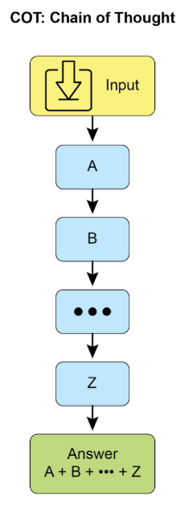
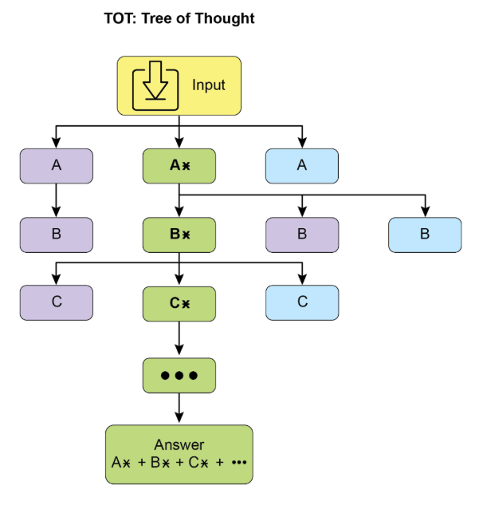
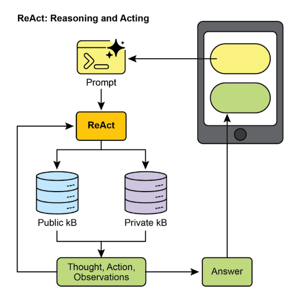
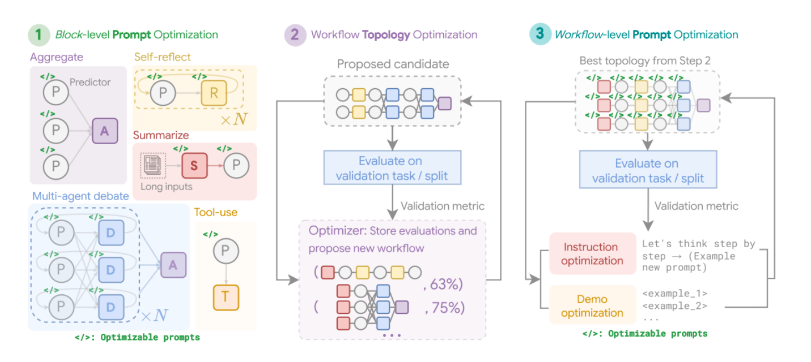
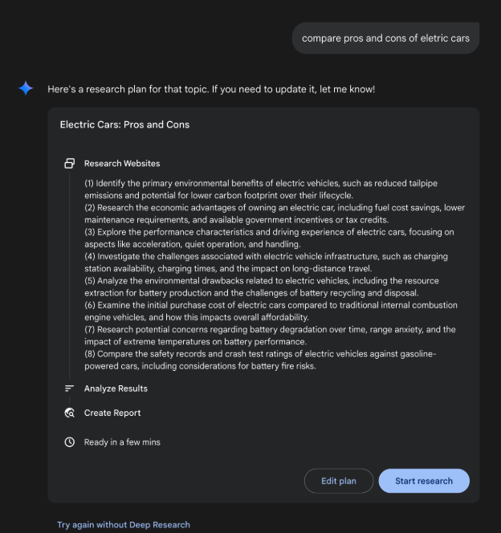
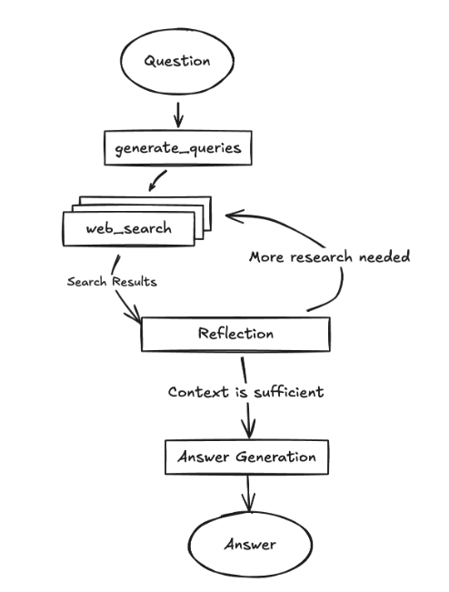
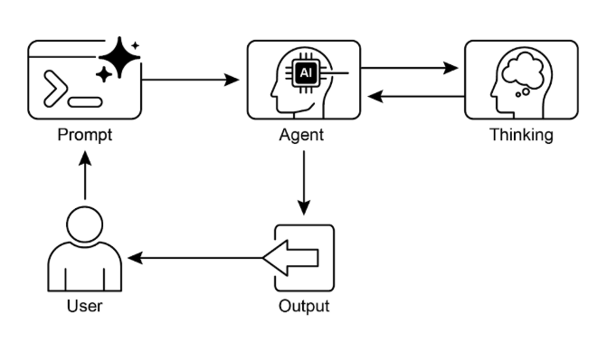

# 第17章：推理技術

本章深入探討智慧代理的進階推理方法，專注於多步驟邏輯推理和問題解決。這些技術超越了簡單的順序操作，讓代理的內部推理過程變得明確。這允許代理分解問題、考慮中間步驟，並得出更穩健且準確的結論。這些進階方法的核心原則是在推理期間分配增加的計算資源。這意味著給予代理或底層大語言模型更多處理時間或步驟來處理查詢並產生回應。代理可以進行迭代改進、探索多個解決路徑或使用外部工具，而不是快速的單次處理。這種在推理期間的延長處理時間通常顯著增強準確性、連貫性和穩健性，特別是對於需要更深入分析和考慮的複雜問題。

## 實際應用與使用案例

實際應用包括：

* **複雜問答：** 促進多跳查詢的解決，這需要整合來自不同來源的資料並執行邏輯推導，可能涉及檢視多個推理路徑，並受益於延長的推理時間來綜合資訊。
* **數學問題解決：** 讓數學問題能夠分解為更小的可解組件，說明逐步過程，並使用程式碼執行進行精確計算，其中延長的推理使更複雜的程式碼產生和驗證成為可能。
* **程式碼除錯和產生：** 支援代理解釋其產生或修正程式碼的理由，按順序指出潛在問題，並基於測試結果迭代改進程式碼 (自我修正)，利用延長的推理時間進行徹底的除錯週期。
* **策略規劃：** 協助透過推理各種選項、後果和前提條件來開發綜合計劃，並基於即時回饋調整計劃 (ReAct)，其中延長的考慮可以導致更有效和可靠的計劃。
* **醫學診斷：** 協助代理系統化評估症狀、測試結果和患者病史以達成診斷，在每個階段闡述其推理，並可能使用外部工具進行資料檢索 (ReAct)。增加的推理時間允許更全面的鑑別診斷。
* **法律分析：** 支援分析法律文件和先例以制定論點或提供指導，詳述所採取的邏輯步驟，並透過自我修正確保邏輯一致性。增加的推理時間允許更深入的法律研究和論證構建。

## 推理技術

首先，讓我們深入了解用於增強AI模型問題解決能力的核心推理技術。

**思維鏈 (CoT)** 提示透過模擬逐步思考過程顯著增強大語言模型的複雜推理能力 (見圖1)。CoT提示不是提供直接答案，而是引導模型產生一系列中間推理步驟。這種明確的分解讓大語言模型能夠透過將複雜問題分解為更小、更易處理的子問題來解決複雜問題。這種技術顯著改善模型在需要多步驟推理的任務上的表現，如算術、常識推理和符號操作。CoT的主要優勢是其能夠將困難的單步問題轉換為一系列更簡單的步驟，從而增加大語言模型推理過程的透明度。這種方法不僅提高準確性，還提供對模型決策制定的寶貴見解，有助於除錯和理解。CoT可以使用各種策略實作，包括提供展示逐步推理的少樣本範例或簡單地指示模型「逐步思考」。其效果源於其引導模型內部處理朝向更深思熟慮和邏輯進展的能力。因此，思維鏈已成為讓當代大語言模型具備進階推理能力的基石技術。這種增強的透明度和將複雜問題分解為易處理子問題對於自主代理特別重要，因為它使它們能夠在複雜環境中執行更可靠和可稽核的動作。

  

圖1：CoT提示以及代理產生的詳細、逐步回應。

讓我們看一個範例。它從一組指示開始，告訴AI如何思考，定義其角色和要遵循的清晰五步過程。這是啟動結構化思考的提示。

接下來，範例展示CoT過程的實際運作。標記為「代理思考過程」的部分是模型執行指示步驟的內部獨白。這是字面上的「思維鏈」。最後，「代理最終答案」是作為仔細、逐步推理過程結果產生的精緻、全面輸出。

```markdown
你是一個資訊檢索代理。你的目標是透過逐步思考來全面且準確地回答使用者的問題。

以下是你必須遵循的過程：
1. **分析查詢：** 理解使用者問題的核心主題和具體要求。識別關鍵實體、關鍵字和所尋求的資訊類型。
2. **制定搜尋查詢 (針對知識庫)：** 基於你的分析，產生一系列精確的搜尋查詢，你將使用這些查詢從知識庫或外部工具檢索相關資訊。
3. **模擬資訊檢索 (自我修正/推理)：** 對於每個搜尋查詢，在心理上考慮你期望找到什麼樣的資訊。如果你要檢索內容，最相關的片段會是什麼？思考潛在的模糊性或遺漏部分。
4. **綜合資訊：** 基於模擬檢索和你對使用者原始查詢的理解，將收集的資訊綜合成連貫且完整的答案。確保查詢的所有面向都得到解決。
5. **審查和改進：** 在最終確定前，批判性地評估你的答案。它是否準確？是否全面？是否容易理解？是否簡潔？如果不是，識別需要改進的地方以及如何改進。

**使用者查詢：** 「解釋傳統電腦和量子電腦之間的主要差異，並簡要描述量子計算的潛在應用。」

**代理思考過程 (內部CoT輸出 - 由提示鼓勵)：**

**思考1 (分析查詢)：**
使用者想要兩件事：
    1. 傳統和量子電腦之間的主要差異。
    2. 量子計算的一個潛在應用。關鍵字：傳統電腦、量子電腦、差異、潛在應用。

**思考2 (制定搜尋查詢)：**
    - 「傳統電腦與量子電腦的差異」
    - 「量子電腦如何運作」
    - 「傳統電腦如何運作」
    - 「量子計算的應用」
    
**思考3 (模擬資訊檢索與識別關鍵概念)：**
    - 從「差異」：期望概念如位元與量子位元、疊加、糾纏、機率性質、特定問題的計算能力。
    - 從「如何運作」：傳統使用電晶體/二進位。量子使用量子力學。
    - 從「應用」：期望藥物發現、材料科學、密碼學、優化。

**思考4 (綜合資訊)：**
傳統電腦使用位元 (0或1)，按順序處理資訊。量子電腦使用量子位元，可以同時是0、1或兩者 (疊加)，並且可以糾纏，允許截然不同的計算方法。這使它們能夠解決某些問題 (如分解大數或模擬複雜分子) 比傳統電腦更有效率。潛在應用是在藥物發現中，量子電腦可以以前所未有的準確性模擬分子相互作用，加速新藥物的開發。

**思考5 (審查和改進)：**
    - 涵蓋了差異 (位元與量子位元、疊加、糾纏、處理)。
    - 給出了應用 (藥物發現)。
    - 是否簡要？是的。
    - 是否清楚？是的。
    - 看起來不錯。

**代理最終答案 (輸出給使用者)：**
傳統電腦使用位元處理資訊，在任何給定時間只能是0或1，按順序執行操作。相比之下，量子電腦利用量子位元，透過疊加可以同時存在於多個狀態，並且可以透過糾纏連結，允許指數級更複雜的計算。這種基本差異使量子機器能夠解決某些問題，如模擬分子結構或破解複雜加密，這些對於即使是最強大的傳統超級電腦來說都是棘手的。量子計算的重要潛在應用在於藥物發現，其精確建模分子行為的能力可能會革命性地改變新藥物的開發。
```

**思維樹 (ToT)** 是一種建立在思維鏈 (CoT) 之上的推理技術。它允許大語言模型透過分支到不同的中間步驟來探索多個推理路徑，形成樹狀結構 (見圖2)。這種方法透過支援回溯、自我修正和探索替代解決方案來支援複雜問題解決。維護可能性樹讓模型能夠在最終確定答案之前評估各種推理軌跡。這種迭代過程增強了模型處理需要策略規劃和決策制定的挑戰性任務的能力。



圖2：思維樹範例

**自我修正**，也稱為自我改進，是代理推理過程的關鍵面向，特別是在思維鏈提示中。它涉及代理對其產生內容和中間思考過程的內部評估。這種批判性審查讓代理能夠識別其理解或解決方案中的模糊性、資訊差距或不準確性。這種審查和改進的迭代循環讓代理能夠調整其方法、改善回應品質，並在提供最終輸出前確保準確性和徹底性。這種內部批評增強了代理產生可靠和高品質結果的能力，如專門的第4章中的範例所示。

這個範例展示了系統化的自我修正過程，對於改進AI產生的內容至關重要。它涉及起草、根據原始要求審查和實施特定改進的迭代循環。說明首先概述AI作為「自我修正代理」的功能，具有定義的五步分析和修訂工作流程。接下來，呈現社交媒體貼文的低品質「初始草稿」。「自我修正代理的思考過程」構成演示的核心。在這裡，代理根據其指示批判性地評估草稿，指出弱點，如低參與度和模糊的行動呼籲。然後它建議具體的改進，包括使用更有影響力的動詞和表情符號。過程以「最終修訂內容」結束，這是整合自我識別調整的精緻且顯著改善的版本。

```markdown
你是一個高度批判和注重細節的自我修正代理。你的任務是根據原始要求審查先前產生的內容片段，並識別改進領域。你的目標是改進內容，使其更準確、全面、引人入勝，並與提示保持一致。

以下是你必須遵循的自我修正過程：

1. **理解原始要求：** 審查導致內容建立的初始提示/要求。*原始意圖*是什麼？關鍵限制或目標是什麼？
2. **分析當前內容：** 仔細閱讀提供的內容。
3. **識別差異/弱點：** 將當前內容與原始要求進行比較。尋找：
   * **準確性問題：** 是否有任何事實錯誤或誤導性陳述？
   * **完整性差距：** 是否完全解決原始提示的所有面向？是否遺漏任何內容？
   * **清晰度與連貫性：** 語言是否清晰、簡潔且易於理解？是否邏輯流暢？
   * **語調與風格：** 是否符合所需的語調和風格 (例如專業、引人入勝、簡潔)？
   * **參與度：** 是否有吸引力？是否能抓住讀者的注意力？
   * **冗餘/冗長：** 是否有任何部分可以在不失去意義的情況下精簡或移除？
4. **提出具體改進：** 對於每個識別的弱點，建議具體且可行的變更。不要只是陳述問題；提出解決方案。
5. **產生修訂內容：** 基於你提出的改進，重寫原始內容以納入所有必要的變更。確保修訂內容經過精緻且準備好最終使用。

**原始提示/要求：** 「撰寫一篇簡短、引人入勝的社交媒體貼文 (最多150字元) 宣布新的環保產品線：'GreenTech Gadgets'。」

**初始草稿 (待修正的內容)：** 「我們有新產品。它們是綠色且科技的。現在購買GreenTech Gadgets！」

**自我修正代理的思考過程 (內部CoT輸出 - 由提示鼓勵)：**

**思考1 (理解原始要求)：**
    - 簡短、引人入勝的社交媒體貼文。
    - 最多150字元。
    - 宣布「GreenTech Gadgets」- 新的環保產品線。

**思考2 (分析當前內容)：**
「我們有新產品。它們是綠色且科技的。現在購買GreenTech Gadgets！」(64字元)

**思考3 (識別差異/弱點)：**
- **引人入勝：** 不太引人入勝。聽起來很普通。
- **環保：** 由「綠色」暗示，但沒有明確強調作為好處。
- **行動呼籲：** 「現在購買！」還可以，但可以更有說服力。
- **簡潔性：** 很短，但可以使用更強的動詞/措辭。
- **影響力：** 缺乏新產品發布的興奮感。

**思考4 (提出具體改進)：**
- 讓它更動態和令人興奮。
- 強調「環保」和「創新」。
- 使用更強的動詞和更主動的語態。
- 添加清晰、引人入勝的行動呼籲。
- 確保保持在150字元以下。

**思考5 (產生修訂內容)：**
原始：「我們有新產品。它們是綠色且科技的。現在購買GreenTech Gadgets！」
修訂想法1：「🌱 發現GreenTech Gadgets！我們的新環保產品線將創新與永續性結合。變綠色，變聰明！立即購物！#環保 #綠色科技」(148字元)
這個修訂直接解決環保問題，使用表情符號增加參與度，添加更強的行動呼籲，並包含相關標籤，同時保持在字元限制內。

**自我修正代理的最終修訂內容 (輸出給使用者)：**
🌱 發現GreenTech Gadgets！我們的新環保產品線將創新與永續性結合。變綠色，變聰明！立即購物！#環保 #綠色科技
```

基本上，這種技術將品質控制措施直接整合到代理的內容產生中，產生更精緻、精確且優越的結果，更有效地滿足複雜的使用者需求。

**程式輔助語言模型 (PALMs)** 將大語言模型與符號推理能力整合。這種整合允許大語言模型在其問題解決過程中產生和執行程式碼，如Python。PALMs將複雜計算、邏輯操作和資料處理卸載到確定性程式設計環境。這種方法利用傳統程式設計在大語言模型可能在準確性或一致性方面表現出限制的任務上的優勢。面對符號挑戰時，模型可以產生程式碼、執行它，並將結果轉換為自然語言。這種混合方法結合了大語言模型的理解和產生能力與精確計算，使模型能夠以潛在增加的可靠性和準確性解決更廣泛的複雜問題。這對代理很重要，因為它允許它們透過在理解和產生能力的同時利用精確計算來執行更準確和可靠的動作。一個例子是在Google的ADK中使用外部工具來產生程式碼。

```python
from google.adk.tools import agent_tool
from google.adk.agents import Agent
from google.adk.tools import google_search
from google.adk.code_executors import BuiltInCodeExecutor


search_agent = Agent(
    model="gemini-2.0-flash",
    name="SearchAgent",
    instruction="""
    You're a specialist in Google Search
    """,
    tools=[google_search],
)

coding_agent = Agent(
    model="gemini-2.0-flash",
    name="CodeAgent",
    instruction="""
    You're a specialist in Code Execution
    """,
    code_executor=BuiltInCodeExecutor(),
)

root_agent = Agent(
    name="RootAgent",
    model="gemini-2.0-flash",
    description="Root Agent",
    tools=[
        agent_tool.AgentTool(agent=search_agent),
        agent_tool.AgentTool(agent=coding_agent),
    ],
)
```

**可驗證獎勵強化學習 (RLVR)：** 雖然有效，但許多大語言模型使用的標準思維鏈 (CoT) 提示是一種相對基本的推理方法。它產生單一、預定的思路而不適應問題的複雜性。為了克服這些限制，開發了一類新的專門「推理模型」。這些模型的運作方式不同，在提供答案前投入可變的「思考」時間。這個「思考」過程產生更廣泛且動態的思維鏈，可能長達數千個Token。這種延長的推理允許更複雜的行為，如自我修正和回溯，模型對較困難的問題投入更多努力。實現這些模型的關鍵創新是稱為可驗證獎勵強化學習 (RLVR) 的訓練策略。透過在已知正確答案的問題 (如數學或程式碼) 上訓練模型，它透過試錯學會產生有效的長篇推理。這讓模型能夠在沒有直接人類監督的情況下發展其問題解決能力。最終，這些推理模型不只是產生答案；它們產生展示規劃、監控和評估等進階技能的「推理軌跡」。這種增強的推理和策略化能力是開發自主AI代理的基礎，它們可以在最少人類干預下分解和解決複雜任務。

**ReAct** (推理與行動，見圖3，其中KB代表知識庫) 是一個整合思維鏈 (CoT) 提示與代理透過工具與外部環境互動能力的範式。與產生最終答案的生成式模型不同，ReAct代理推理要採取哪些行動。這個推理階段涉及內部規劃過程，類似於CoT，代理確定其下一步驟、考慮可用工具並預期結果。接下來，代理透過執行工具或函數呼叫來行動，如查詢資料庫、執行計算或與API互動。



圖3：推理與行動

ReAct以交錯方式運作：代理執行行動、觀察結果，並將此觀察納入後續推理。這種「思考、行動、觀察、思考...」的迭代循環讓代理能夠動態調整其計劃、修正錯誤，並實現需要與環境多次互動的目標。與線性CoT相比，這提供了更穩健且靈活的問題解決方法，因為代理回應即時回饋。透過結合語言模型理解和產生與使用工具的能力，ReAct讓代理能夠執行需要推理和實際執行的複雜任務。這種方法對代理至關重要，因為它允許它們不僅推理，還能實際執行步驟並與動態環境互動。

**CoD** (辯論鏈) 是Microsoft提出的正式AI框架，其中多個、多樣化的模型協作和辯論來解決問題，超越單一AI的「思維鏈」。這個系統像AI議會會議一樣運作，不同模型提出初始想法、批評彼此的推理並交換反駁。主要目標是透過利用集體智慧來增強準確性、減少偏見並改善最終答案的整體品質。作為AI版本的同儕審查，這種方法為推理過程建立透明且可信賴的記錄。最終，它代表從孤立代理提供答案轉向協作代理團隊共同努力尋找更穩健且經過驗證的解決方案。

**GoD** (辯論圖) 是一個進階的代理框架，將討論重新想像為動態、非線性網路而非簡單鏈條。在這個模型中，論點是由表示「支持」或「反駁」等關係的邊連接的個別節點，反映真實辯論的多執行緒性質。這種結構允許新的探討路線動態分支、獨立演進，甚至隨時間合併。結論不是在序列末尾達成，而是透過識別整個圖中最穩健且得到良好支持的論點集群。在此背景下，「得到良好支持」指的是牢固建立且可驗證的知識。這可以包括被認為是基本事實的資訊，這意味著它本質上是正確的且被廣泛接受為事實。此外，它包括透過搜尋基礎獲得的事實證據，其中資訊根據外部來源和現實世界資料進行驗證。最後，它還涉及在辯論期間多個模型達成的共識，表明對所呈現資訊的高度一致性和信心。這種綜合方法確保為所討論的資訊提供更穩健且可靠的基礎。這種方法為複雜、協作的AI推理提供更整體且現實的模型。

**MASS (選擇性進階主題)：** 對多代理系統設計的深入分析顯示，其效果關鍵取決於用於程式設計個別代理的提示品質和決定它們互動的拓撲。設計這些系統的複雜性很大，因為它涉及廣闊且複雜的搜尋空間。為了解決這個挑戰，開發了稱為多代理系統搜尋 (MASS) 的新框架來自動化和優化MAS的設計。

MASS採用多階段優化策略，透過交錯提示和拓撲優化系統化地導航複雜的設計空間 (見圖4)

**1. 區塊級提示優化：** 過程從對個別代理類型或「區塊」的提示進行局部優化開始，確保每個組件在整合到更大系統之前有效執行其角色。這個初始步驟至關重要，因為它確保後續的拓撲優化建立在表現良好的代理之上，而不是受到配置不當的代理的複合影響。例如，在HotpotQA資料集的優化中，「辯論者」代理的提示被創造性地框架為指示其作為「主要出版物的專家事實檢查員」。其優化任務是仔細審查來自其他代理的建議答案，與提供的上下文段落交叉參考，並識別任何不一致或不受支持的聲明。這種專門的角色扮演提示，在區塊級優化期間發現，旨在讓辯論者代理在被置於更大的工作流程之前高度有效地綜合資訊。

**2. 工作流程拓撲優化：** 在局部優化之後，MASS透過從可自訂設計空間中選擇和安排不同的代理互動來優化工作流程拓撲。為了讓這個搜尋高效，MASS採用影響加權方法。此方法透過測量相對於基線代理的效能增益來計算每個拓撲的「增量影響」，並使用這些分數引導搜尋朝向更有希望的組合。例如，在MBPP編碼任務的優化中，拓撲搜尋發現特定的混合工作流程最有效。找到的最佳拓撲不是簡單結構，而是迭代改進過程與外部工具使用的組合。具體來說，它包含一個預測器代理進行幾輪反思，其程式碼由一個執行器代理根據測試案例進行驗證。這個發現的工作流程顯示，對於編碼，結合迭代自我修正與外部驗證的結構優於更簡單的MAS設計。

**3. 工作流程級提示優化：** 最後階段涉及整個系統提示的全域優化。在識別最佳執行拓撲後，提示作為單一、整合實體進行微調，以確保它們針對編排進行調整，並且代理相互依賴性得到優化。例如，在找到DROP資料集的最佳拓撲後，最終優化階段改進「預測器」代理的提示。最終、優化的提示高度詳細，首先為代理提供資料集本身的摘要，注意其對「抽取式問答」和「數值資訊」的關注。然後它包含正確問答行為的少樣本範例，並將核心指示框架為高風險情境：「你是一個高度專業的AI，負責為緊急新聞報導提取關鍵數值資訊。現場廣播依賴你的準確性和速度」。這個多面向提示，結合元知識、範例和角色扮演，專門針對最終工作流程進行調整以最大化準確性。



圖4：(作者提供)：多代理系統搜尋 (MASS) 框架是一個三階段優化過程，導航包含可優化提示 (指示和演示) 和可配置代理構建區塊 (聚合、反思、辯論、摘要和工具使用) 的搜尋空間。第一階段，區塊級提示優化，獨立優化每個代理模組的提示。第二階段，工作流程拓撲優化，從影響加權設計空間中採樣有效的系統配置，整合優化的提示。最後階段，工作流程級提示優化，在識別第二階段的最佳工作流程後，涉及整個多代理系統的第二輪提示優化

關鍵發現和原則：實驗證明，由MASS優化的MAS在一系列任務中顯著優於現有的手動設計系統和其他自動化設計方法。從這項研究得出的有效MAS關鍵設計原則有三個方面：

* 在組合代理之前，使用高品質提示優化個別代理。
* 透過組合有影響力的拓撲而不是探索無約束的搜尋空間來構建MAS。
* 透過最終的工作流程級聯合優化建模和優化代理之間的相互依賴性。

建立在我們對關鍵推理技術討論的基礎上，讓我們首先檢視一個核心效能原則：大語言模型的推理縮放法則。這個法則表明，隨著分配給模型的計算資源增加，模型的效能可預測地改善。我們可以在Deep Research等複雜系統中看到這個原則的實際應用，AI代理利用這些資源透過將主題分解為子問題、使用網路搜尋作為工具並綜合其發現來自主調查主題。

**Deep Research。** 「Deep Research」一詞描述了一類AI代理工具，旨在作為不知疲倦、有條理的研究助理。這個領域的主要平台包括Perplexity AI、Google的Gemini研究能力，以及OpenAI在ChatGPT中的進階功能 (見圖5)。



圖5：Google Deep Research用於資訊收集

這些工具引入的基本轉變是搜尋過程本身的變化。標準搜尋提供即時連結，將綜合工作留給你。Deep Research在不同模型上運作。在這裡，你向AI分配複雜查詢並給它一個「時間預算」——通常是幾分鐘。作為這種耐心的回報，你會收到詳細報告。

在此期間，AI以代理方式代表你工作。它自主執行一系列對人來說非常耗時的複雜步驟：

1. 初始探索：它基於你的初始提示執行多個、針對性的搜尋。
2. 推理和改進：它閱讀和分析第一波結果，綜合發現，並批判性地識別差距、矛盾或需要更多詳細資訊的領域。
3. 後續詢問：基於其內部推理，它進行新的、更細緻的搜尋來填補這些差距並深化其理解。
4. 最終綜合：在經過幾輪這種迭代搜尋和推理後，它將所有驗證的資訊編譯成單一、連貫且結構化的摘要。

這種系統化方法確保全面且合理的回應，顯著增強資訊收集的效率和深度，從而促進更多的代理決策制定。

## 推理縮放法則

這個關鍵原則決定大語言模型效能與其操作階段 (稱為推理) 期間分配的計算資源之間的關係。推理縮放法則與更熟悉的訓練縮放法則不同，後者專注於在模型建立期間，隨著資料量和計算能力增加，模型品質如何改善。相反，這個法則專門檢視大語言模型主動產生輸出或答案時發生的動態權衡。

這個法則的基石是揭示，透過在推理時增加計算投資，通常可以從相對較小的大語言模型實現優越結果。這不一定意味著使用更強大的GPU，而是採用更複雜或資源密集的推理策略。這種策略的主要例子是指示模型產生多個潛在答案——可能透過多樣化束搜尋或自我一致性方法等技術——然後採用選擇機制來識別最佳輸出。這種迭代改進或多候選產生過程需要更多計算週期，但可以顯著提升最終回應的品質。

這個原則為代理系統部署中的明智且經濟上合理的決策制定提供了關鍵框架。它挑戰更大模型總是會產生更好效能的直觀概念。法則提出，在推理期間給予更大「思考預算」的較小模型，有時可以超越依賴更簡單、計算密集度較低的生成過程的更大模型的效能。這裡的「思考預算」指的是在推理期間應用的額外計算步驟或複雜演算法，讓較小模型能夠探索更廣泛的可能性範圍或在確定答案前應用更嚴格的內部檢查。

因此，推理縮放法則成為構建高效且成本效益高的代理系統的基礎。它提供了一種方法來細緻平衡幾個相互關聯的因素：

* **模型大小：** 較小模型在記憶體和儲存方面本質上要求較低。
* **回應延遲：** 雖然增加推理時間計算可能增加延遲，法則有助於識別效能增益超過這種增加的點，或如何策略性地應用計算以避免過度延遲。
* **操作成本：** 部署和執行較大模型通常由於增加的電力消耗和基礎設施要求而產生更高的持續操作成本。法則展示如何在不不必要地升高這些成本的情況下優化效能。

透過理解和應用推理縮放法則，開發人員和組織可以做出策略選擇，為特定代理應用帶來最佳效能，確保計算資源分配到對大語言模型輸出品質和實用性影響最大的地方。這允許更細緻且經濟上可行的AI部署方法，超越簡單的「越大越好」範式。

## 實作程式碼範例

Google開源的DeepSearch程式碼可透過gemini-fullstack-langgraph-quickstart存儲庫獲得 (圖6)。這個存儲庫為開發人員提供使用Gemini 2.5和LangGraph編排框架構建全端AI代理的模板。這個開源堆疊促進代理架構的實驗，並可與本地大語言模型如Gemma整合。它利用Docker和模組化專案腳手架進行快速原型設計。應該注意的是，這個發布作為結構良好的演示，不打算作為生產就緒的後端。



圖6：(作者提供) 多重反思步驟的DeepSearch範例

這個專案提供一個全端應用程式，具有React前端和LangGraph後端，設計用於進階研究和對話AI。LangGraph代理使用Google Gemini模型動態產生搜尋查詢，並透過Google Search API整合網路研究。系統採用反思推理來識別知識差距，迭代改進搜尋，並綜合帶有引用的答案。前端和後端支援熱重載。專案結構包括獨立的frontend/和backend/目錄。設定要求包括Node.js、npm、Python 3.8+和Google Gemini API金鑰。在後端的.env檔案中配置API金鑰後，可以安裝後端 (使用pip install .) 和前端 (npm install) 的相依性。開發伺服器可以使用make dev同時執行或個別執行。後端代理定義在backend/src/agent/graph.py中，產生初始搜尋查詢，進行網路研究，執行知識差距分析，迭代改進查詢，並使用Gemini模型綜合引用答案。生產部署涉及後端伺服器提供靜態前端建置，需要Redis用於串流即時輸出和Postgres資料庫用於管理資料。可以使用docker-compose up建置和執行Docker映像，這也需要LangSmith API金鑰用於docker-compose.yml範例。應用程式利用React with Vite、Tailwind CSS、Shadcn UI、LangGraph和Google Gemini。專案採用Apache License 2.0授權。

| ```# 建立我們的代理圖 builder = StateGraph(OverallState, config_schema=Configuration) # 定義我們將循環的節點 builder.add_node("generate_query", generate_query) builder.add_node("web_research", web_research) builder.add_node("reflection", reflection) builder.add_node("finalize_answer", finalize_answer) # 設定入口點為 `generate_query` # 這意味著這個節點是第一個被呼叫的 builder.add_edge(START, "generate_query") # 添加條件邊以在並行分支中繼續搜尋查詢 builder.add_conditional_edges(    "generate_query", continue_to_web_research, ["web_research"] ) # 反思網路研究 builder.add_edge("web_research", "reflection") # 評估研究 builder.add_conditional_edges(    "reflection", evaluate_research, ["web_research", "finalize_answer"] ) # 最終確定答案 builder.add_edge("finalize_answer", END) graph = builder.compile(name="pro-search-agent")``` |
| :---- |

圖4：使用LangGraph的DeepSearch範例 (來自backend/src/agent/graph.py的程式碼)

## 那麼，代理如何思考？

總之，代理的思考過程是一種結合推理和行動來解決問題的結構化方法。這種方法讓代理能夠明確規劃其步驟、監控其進度，並與外部工具互動以收集資訊。

在其核心，代理的「思考」由強大的大語言模型促進。這個大語言模型產生一系列指導代理後續行動的思考。過程通常遵循思考-行動-觀察循環：

1. **思考：** 代理首先產生分解問題、制定計劃或分析當前情況的文字思考。這種內部獨白讓代理的推理過程透明且可操控。
2. **行動：** 基於思考，代理從預定義的離散選項集中選擇行動。例如，在問答情境中，行動空間可能包括線上搜尋、從特定網頁檢索資訊或提供最終答案。
3. **觀察：** 代理然後根據所採取的行動從其環境接收回饋。這可能是網路搜尋的結果或網頁的內容。

這個循環重複，每個觀察都為下一個思考提供資訊，直到代理確定它已達到最終解決方案並執行「完成」行動。

這種方法的效果依賴於底層大語言模型的進階推理和規劃能力。為了指導代理，ReAct框架通常採用少樣本學習，其中大語言模型獲得類似人類問題解決軌跡的範例。這些範例展示如何有效地結合思考和行動來解決類似任務。

代理思考的頻率可以根據任務調整。對於像事實檢查這樣的知識密集推理任務，思考通常與每個行動交錯，以確保資訊收集和推理的邏輯流程。相比之下，對於需要許多行動的決策任務，如導航模擬環境，思考可能更節省地使用，讓代理決定何時需要思考。

## 速覽

**什麼：** 複雜問題解決通常需要超越單一、直接答案，這對AI構成重大挑戰。核心問題是讓AI代理能夠處理需要邏輯推理、分解和策略規劃的多步驟任務。沒有結構化方法，代理可能無法處理複雜性，導致不準確或不完整的結論。這些進階推理方法旨在讓代理的內部「思考」過程變得明確，讓它能夠系統化地處理挑戰。

**為什麼：** 標準化解決方案是一套推理技術，為代理的問題解決過程提供結構化框架。思維鏈 (CoT) 和思維樹 (ToT) 等方法指導大語言模型分解問題並探索多個解決路徑。自我修正允許答案的迭代改進，確保更高準確性。像ReAct這樣的代理框架將推理與行動整合，讓代理能夠與外部工具和環境互動以收集資訊並調整其計劃。這種明確推理、探索、改進和工具使用的組合創造出更穩健、透明且有能力的AI系統。

**經驗法則：** 當問題對於單次答案來說太複雜且需要分解、多步驟邏輯、與外部資料來源或工具的互動，或策略規劃和適應時，使用這些推理技術。它們適合展示「工作」或思考過程與最終答案同等重要的任務。

**視覺摘要：**



圖7：推理設計模式

## 關鍵要點

* 透過讓推理變得明確，代理可以制定透明、多步驟的計劃，這是自主行動和使用者信任的基礎能力。
* ReAct框架為代理提供核心操作循環，讓它們能夠超越單純推理，與外部工具互動以在環境中動態行動和適應。
* 推理縮放法則意味著代理的效能不僅關於其底層模型大小，而是其分配的「思考時間」，允許更深思熟慮且更高品質的自主行動。
* 思維鏈 (CoT) 作為代理的內部獨白，提供結構化方式透過將複雜目標分解為可管理的行動序列來制定計劃。
* 思維樹和自我修正給予代理關鍵的深思能力，讓它們能夠評估多種策略、從錯誤中回溯，並在執行前改進自己的計劃。
* 像辯論鏈 (CoD) 這樣的協作框架標誌著從孤立代理到多代理系統的轉變，其中代理團隊可以一起推理來解決更複雜的問題並減少個別偏見。
* 像Deep Research這樣的應用展示這些技術如何在代理中達到頂峰，它們可以完全自主地代表使用者執行複雜、長期執行的任務，如深入調查。
* 為了建立有效的代理團隊，像MASS這樣的框架自動化優化個別代理如何被指示以及它們如何互動，確保整個多代理系統表現最佳。
* 透過整合這些推理技術，我們建立的代理不僅是自動化的，而且是真正自主的，能夠被信任來規劃、行動和解決複雜問題而無需直接監督。

## 結論

現代AI正從被動工具演進為自主代理，能夠透過結構化推理處理複雜目標。這種代理行為始於內部獨白，由思維鏈 (CoT) 等技術驅動，讓代理能夠在行動前制定連貫計劃。真正的自主性需要深思，代理透過自我修正和思維樹 (ToT) 實現，讓它們能夠評估多種策略並獨立改進自己的工作。向完全代理系統的關鍵飛躍來自ReAct框架，它讓代理能夠超越思考並開始透過使用外部工具來行動。這建立了思考、行動和觀察的核心代理循環，讓代理能夠基於環境回饋動態調整其策略。

代理深度深思的能力由推理縮放法則推動，其中更多計算「思考時間」直接轉化為更穩健的自主行動。下一個前沿是多代理系統，其中像辯論鏈 (CoD) 這樣的框架創造協作代理社會，一起推理來實現共同目標。這不是理論性的；像Deep Research這樣的代理應用已經展示自主代理如何能夠代表使用者執行複雜、多步驟調查。總體目標是設計可靠且透明的自主代理，可以被信任來獨立管理和解決複雜問題。最終，透過結合明確推理與行動能力，這些方法正在完成AI向真正代理問題解決者的轉變。

## 參考文獻

相關研究包括：

1. "Chain-of-Thought Prompting Elicits Reasoning in Large Language Models" by Wei et al. (2022)  
2. "Tree of Thoughts: Deliberate Problem Solving with Large Language Models" by Yao et al. (2023)  
3. "Program-Aided Language Models" by Gao et al. (2023)  
4. "ReAct: Synergizing Reasoning and Acting in Language Models" by Yao et al. (2023)  
5. Inference Scaling Laws: An Empirical Analysis of Compute-Optimal Inference for LLM Problem-Solving, 2024  
6. Multi-Agent Design: Optimizing Agents with Better Prompts and Topologies, [https://arxiv.org/abs/2502.02533](https://arxiv.org/abs/2502.02533)