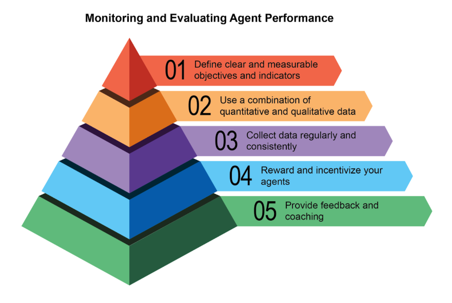
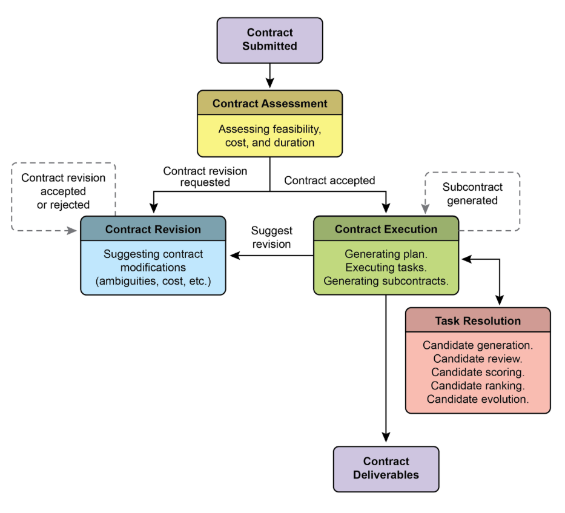
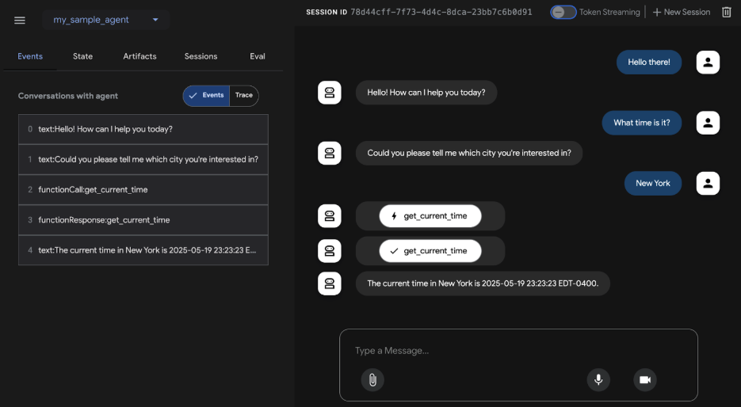
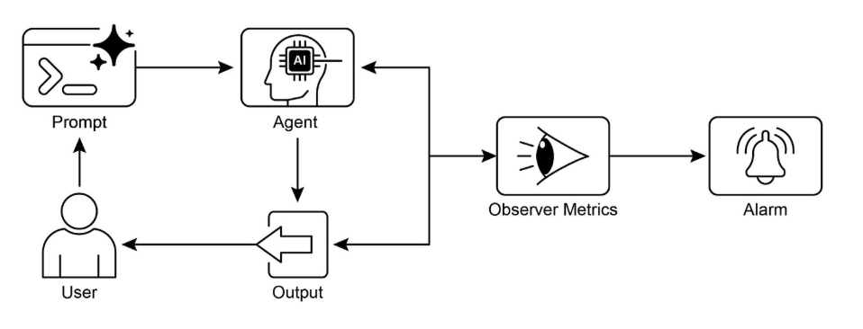

# 第19章：評估與監控

本章檢視讓智慧代理能夠系統化評估其效能、監控朝向目標的進度，以及檢測操作異常的方法。雖然第11章概述目標設定和監控，第17章解決推理機制，但本章專注於對代理效果、效率和需求合規性的持續、通常是外部的測量。這包括定義指標、建立回饋循環，以及實作報告系統，以確保代理效能在操作環境中符合期望 (見圖1)。



圖1：評估和監控的最佳實踐

## 實際應用與使用案例

最常見的應用和使用案例：

* **即時系統中的效能追蹤：** 持續監控部署在生產環境中的代理的準確性、延遲和資源消耗 (例如客戶服務聊天機器人的解決率、回應時間)。
* **代理改進的A/B測試：** 系統化比較不同代理版本或策略的並行效能，以識別最佳方法 (例如為物流代理嘗試兩種不同的規劃演算法)。
* **合規和安全稽核：** 產生自動化稽核報告，追蹤代理隨時間對倫理指導原則、法規要求和安全協定的合規性。這些報告可以由人機協作或另一個代理驗證，並且可以產生KPI或在識別問題時觸發警報。
* **企業系統：** 為了在企業系統中管理代理AI，需要一個新的控制工具，即AI「合約」。這個動態協議編纂AI委派任務的目標、規則和控制。
* **漂移檢測：** 監控代理輸出隨時間的相關性或準確性，檢測由於輸入資料分布變化 (概念漂移) 或環境變化導致的效能下降。
* **代理行為中的異常檢測：** 識別代理採取的異常或意外動作，這可能表示錯誤、惡意攻擊或緊急的不良行為。
* **學習進度評估：** 對於設計來學習的代理，追蹤其學習曲線、特定技能的改進，或在不同任務或資料集上的泛化能力。

## 實作程式碼範例

為AI代理開發綜合評估框架是一個挑戰性的努力，在複雜性上可比擬學術學科或實質出版物。這種困難源於需要考慮的眾多因素，如模型效能、使用者互動、倫理影響和更廣泛的社會影響。然而，對於實際實作，焦點可以縮小到對AI代理高效且有效運作至關重要的關鍵使用案例。

**代理回應評估：** 這個核心過程對於評估代理輸出的品質和準確性至關重要。它涉及確定代理是否針對給定輸入提供相關、正確、邏輯、無偏見且準確的資訊。評估指標可能包括事實正確性、流暢度、語法精確性，以及對使用者預期目的的遵守。

```python
def evaluate_response_accuracy(agent_output: str, expected_output: str) -> float:
    """計算代理回應的簡單準確性分數。"""
    # 這是非常基本的精確匹配；實際應用會使用更複雜的指標
    return 1.0 if agent_output.strip().lower() == expected_output.strip().lower() else 0.0


# 範例使用
agent_response = "The capital of France is Paris."
ground_truth = "Paris is the capital of France."
score = evaluate_response_accuracy(agent_response, ground_truth)
print(f"Response accuracy: {score}")
```

Python函數`evaluate_response_accuracy`透過在移除前後空白字元後，在代理輸出與預期輸出之間執行精確、不區分大小寫的比較，計算AI代理回應的基本準確性分數。對於精確匹配它回傳1.0的分數，否則回傳0.0，代表二進位的正確或錯誤評估。這種方法雖然對簡單檢查很直接，但不考慮像釋義或語義等價性的變化。

問題在於其比較方法。函數執行兩個字串的嚴格、逐字元比較。在提供的範例中：

* `agent_response`：「The capital of France is Paris.」
* `ground_truth`：「Paris is the capital of France.」

即使在移除空白字元並轉換為小寫後，這兩個字串也不相同。因此，函數將錯誤地回傳準確性分數`0.0`，即使兩個句子表達相同的意思。

直接比較在評估語義相似性方面不足，只有在代理的回應完全匹配預期輸出時才成功。更有效的評估需要進階自然語言處理 (NLP) 技術來辨別句子之間的意義。對於現實世界情境中的徹底AI代理評估，更複雜的指標通常是不可或缺的。這些指標可以包含字串相似性測量如Levenshtein距離和Jaccard相似性、特定關鍵字存在或缺失的關鍵字分析、使用嵌入模型的餘弦相似性的語義相似性、大語言模型作為裁判評估 (稍後討論用於評估細緻的正確性和有用性)，以及RAG特定指標如忠實度和相關性。

**延遲監控：** 代理動作的延遲監控在AI代理回應或動作速度是關鍵因素的應用中至關重要。此過程測量代理處理請求並產生輸出所需的持續時間。過高的延遲可能對使用者體驗和代理的整體效果產生不利影響，特別是在即時或互動環境中。在實際應用中，僅將延遲資料印到控制台是不足的。建議將此資訊記錄到持久儲存系統。選項包括結構化記錄檔 (例如JSON)、時間序列資料庫 (例如InfluxDB、Prometheus)、資料倉庫 (例如Snowflake、BigQuery、PostgreSQL)，或可觀察性平台 (例如Datadog、Splunk、Grafana Cloud)。

**追蹤大語言模型互動的Token使用量：** 對於大語言模型驅動的代理，追蹤Token使用量對於管理成本和優化資源分配至關重要。大語言模型互動的計費通常取決於處理的Token數量 (輸入和輸出)。因此，高效的Token使用直接降低操作費用。此外，監控Token計數有助於識別提示工程或回應產生過程中潛在的改進領域。

```python
# 這是概念性的，因為實際Token計數取決於大語言模型API
class LLMInteractionMonitor:
    def __init__(self):
        self.total_input_tokens = 0
        self.total_output_tokens = 0

    def record_interaction(self, prompt: str, response: str):
        # 在真實情境中，使用大語言模型API的Token計數器或tokenizer
        input_tokens = len(prompt.split())  # 占位符
        output_tokens = len(response.split())  # 占位符
        self.total_input_tokens += input_tokens
        self.total_output_tokens += output_tokens
        print(f"已記錄互動：輸入Token={input_tokens}，輸出Token={output_tokens}")

    def get_total_tokens(self):
        return self.total_input_tokens, self.total_output_tokens


# 範例使用
monitor = LLMInteractionMonitor()
monitor.record_interaction("What is the capital of France?", "The capital of France is Paris.")
monitor.record_interaction("Tell me a joke.", "Why don't scientists trust atoms? Because they make up everything!")
input_t, output_t = monitor.get_total_tokens()
print(f"總輸入Token：{input_t}，總輸出Token：{output_t}")
```

這個部分介紹了概念性Python類別`LLMInteractionMonitor`，開發用於追蹤大語言模型互動中的Token使用量。類別包含輸入和輸出Token的計數器。其`record_interaction`方法透過分割提示和回應字串來模擬Token計數。在實際實作中，會使用特定的大語言模型API tokenizer來獲得精確的Token計數。隨著互動發生，監控器累積總輸入和輸出Token計數。`get_total_tokens`方法提供對這些累積總計的存取，這對於大語言模型使用的成本管理和優化至關重要。

**使用大語言模型作為裁判的「有用性」自訂指標：** 評估像AI代理「有用性」這樣的主觀品質超越標準客觀指標，帶來挑戰。一個潛在框架涉及使用大語言模型作為評估者。這種大語言模型作為裁判的方法根據「有用性」的預定義標準評估另一個AI代理的輸出。利用大語言模型的進階語言能力，這種方法提供對主觀品質的細緻、類似人類的評估，超越簡單的關鍵字匹配或基於規則的評估。雖然在開發中，這種技術顯示出自動化和規模化質性評估的前景。

```python
import os
import json
import logging
from typing import Optional

import google.generativeai as genai

# --- 配置 ---
logging.basicConfig(level=logging.INFO, format='%(asctime)s - %(levelname)s - %(message)s')

# 設定你的API金鑰作為環境變數來執行此腳本
# 例如，在你的終端：export GOOGLE_API_KEY='your_key_here'
try:
    genai.configure(api_key=os.environ["GOOGLE_API_KEY"])
except KeyError:
    logging.error("錯誤：GOOGLE_API_KEY環境變數未設定。")
    exit(1)

# --- 法律調查品質的大語言模型裁判評分標準 ---
LEGAL_SURVEY_RUBRIC = """
你是法律調查方法專家和批判性法律審查員。你的任務是評估給定法律調查問題的品質。提供1到5的整體品質分數，以及詳細理由和具體回饋。

專注於以下標準：

1. **清晰度與精確性 (分數1-5)：**
   * 1：極度模糊、高度歧義或令人困惑。
   * 3：適度清晰，但可以更精確。
   * 5：完全清晰、無歧義，在法律術語 (如果適用) 和意圖上精確。

2. **中立性與偏見 (分數1-5)：**
   * 1：高度引導性或偏見，明顯影響受訪者朝向特定答案。
   * 3：稍微暗示性或可能被解釋為引導性。
   * 5：完全中立、客觀，無任何引導性語言或帶有情感色彩的術語。

3. **相關性與焦點 (分數1-5)：**
   * 1：與既定調查主題無關或超出範圍。
   * 3：鬆散相關但可以更專注。
   * 5：直接與調查目標相關，專注於單一概念。

4. **完整性 (分數1-5)：**
   * 1：遺漏準確回答所需的關鍵資訊或提供不足的上下文。
   * 3：大部分完整，但遺漏次要細節。
   * 5：提供受訪者徹底回答所需的所有必要上下文和資訊。

5. **對受眾的適當性 (分數1-5)：**
   * 1：使用目標受眾無法理解的術語或對專家過於簡化。
   * 3：大致適當，但一些術語可能具有挑戰性或過於簡化。
   * 5：完全適合目標調查受眾的假定法律知識和背景。

**輸出格式：**
你的回應必須是包含以下鍵的JSON物件：
* `overall_score`：1到5的整數 (標準分數的平均值，或你的整體判斷)。
* `rationale`：為什麼給予此分數的簡潔摘要，強調主要優勢和弱點。
* `detailed_feedback`：詳述每個標準 (清晰度、中立性、相關性、完整性、受眾適當性) 回饋的要點清單。建議具體改進。
* `concerns`：任何特定法律、倫理或方法學關注的清單。
* `recommended_action`：簡要建議 (例如「修訂中立性」、「按原樣批准」、「澄清範圍」)。
"""

class LLMJudgeForLegalSurvey:
    """使用生成式AI模型評估法律調查問題的類別。"""

    def __init__(self, model_name: str = 'gemini-1.5-flash-latest', temperature: float = 0.2):
        """
        初始化大語言模型裁判。

        Args:
            model_name (str): 要使用的Gemini模型名稱。
                              'gemini-1.5-flash-latest'建議用於速度和成本。
                              'gemini-1.5-pro-latest'提供最高品質。
            temperature (float): 生成溫度。較低值對確定性評估更好。
        """
        self.model = genai.GenerativeModel(model_name)
        self.temperature = temperature

    def _generate_prompt(self, survey_question: str) -> str:
        """為大語言模型裁判構建完整提示。"""
        return f"{LEGAL_SURVEY_RUBRIC}\n\n---\n**待評估的法律調查問題：**\n{survey_question}\n---"

    def judge_survey_question(self, survey_question: str) -> Optional[dict]:
        """
        使用大語言模型判斷單一法律調查問題的品質。

        Args:
            survey_question (str): 待評估的法律調查問題。

        Returns:
            Optional[dict]: 包含大語言模型判斷的字典，如果發生錯誤則為None。
        """
        full_prompt = self._generate_prompt(survey_question)

        try:
            logging.info(f"向'{self.model.model_name}'發送判斷請求...")
            response = self.model.generate_content(
                full_prompt,
                generation_config=genai.types.GenerationConfig(
                    temperature=self.temperature,
                    response_mime_type="application/json"
                )
            )

            # 檢查內容審核或其他導致空回應的原因。
            if not response.parts:
                safety_ratings = response.prompt_feedback.safety_ratings
                logging.error(f"大語言模型回應為空或被阻止。安全評級：{safety_ratings}")
                return None

            return json.loads(response.text)
        except json.JSONDecodeError:
            logging.error(f"無法將大語言模型回應解碼為JSON。原始回應：{response.text}")
            return None
        except Exception as e:
            logging.error(f"大語言模型判斷期間發生意外錯誤：{e}")
            return None


# --- 範例使用 ---
if __name__ == "__main__":
    judge = LLMJudgeForLegalSurvey()

    # --- 良好範例 ---
    good_legal_survey_question = """
    你在多大程度上同意或不同意瑞士目前的智慧財產權法律足以保護新興AI生成內容，假設內容符合聯邦最高法院建立的原創性標準？
    (選擇一項：強烈不同意、不同意、中立、同意、強烈同意)
    """
    print("\n--- 評估良好的法律調查問題 ---")
    judgment_good = judge.judge_survey_question(good_legal_survey_question)
    if judgment_good:
        print(json.dumps(judgment_good, indent=2))

    # --- 有偏見/不良範例 ---
    biased_legal_survey_question = """
    你不同意像FADP這樣過度限制性的資料隱私法律正在阻礙瑞士的基本技術創新和經濟成長嗎？
    (選擇一項：是，否)
    """
    print("\n--- 評估有偏見的法律調查問題 ---")
    judgment_biased = judge.judge_survey_question(biased_legal_survey_question)
    if judgment_biased:
        print(json.dumps(judgment_biased, indent=2))

    # --- 模糊/含糊範例 ---
    vague_legal_survey_question = """
    你對法律科技有什麼想法？
    """
    print("\n--- 評估模糊的法律調查問題 ---")
    judgment_vague = judge.judge_survey_question(vague_legal_survey_question)
    if judgment_vague:
        print(json.dumps(judgment_vague, indent=2))
```

Python程式碼定義了一個類別LLMJudgeForLegalSurvey，設計用於使用生成式AI模型評估法律調查問題的品質。它利用google.`generativeai`函式庫與Gemini模型互動。

核心功能涉及將調查問題與詳細的評估評分標準一起傳送給模型。評分標準指定判斷調查問題的五個標準：清晰度與精確性、中立性與偏見、相關性與焦點、完整性，以及對受眾的適當性。對於每個標準，分配1到5的分數，並在輸出中要求詳細理由和回饋。程式碼構建包含評分標準和待評估調查問題的提示。

`judge_survey_question`方法將此提示傳送到配置的Gemini模型，要求根據定義結構格式化的JSON回應。預期的輸出JSON包括整體分數、摘要理由、每個標準的詳細回饋、關注清單和建議動作。類別處理AI模型互動期間的潛在錯誤，如JSON解碼問題或空回應。腳本透過評估法律調查問題的範例來展示其操作，說明AI如何根據預定義標準評估品質。

在我們結束之前，讓我們檢視各種評估方法，考慮其優勢和弱點。

| 評估方法 | 優勢 | 弱點 |
| :---- | :---- | :---- |
| 人類評估 | 捕捉細微行為 | 難以擴展、昂貴且耗時，因為它考慮主觀人為因素。 |
| 大語言模型作為裁判 | 一致、高效且可擴展。 | 可能忽略中間步驟。受大語言模型能力限制。 |
| 自動化指標 | 可擴展、高效且客觀 | 在捕捉完整能力方面的潛在限制。 |

## 代理軌跡

評估代理軌跡至關重要，因為傳統軟體測試不足。標準程式碼產生可預測的通過/失敗結果，而代理以機率方式運作，需要對最終輸出和代理軌跡——到達解決方案所採取的步驟序列——進行質性評估。評估多代理系統具有挑戰性，因為它們不斷變化。這需要開發超越個別效能的複雜指標，來測量通訊和團隊合作的效果。此外，環境本身不是靜態的，要求評估方法，包括測試案例，隨時間適應。

這涉及檢視決策品質、推理過程和整體結果。實作自動化評估很有價值，特別是對於原型階段之外的開發。分析軌跡和工具使用包括評估代理用來實現目標的步驟，如工具選擇、策略和任務效率。例如，處理客戶產品查詢的代理可能理想地遵循涉及意圖確定、資料庫搜尋工具使用、結果審查和報告產生的軌跡。代理的實際動作與這個預期或基本事實軌跡進行比較，以識別錯誤和低效率。比較方法包括精確匹配 (要求與理想序列完美匹配)、有序匹配 (正確動作按順序，允許額外步驟)、任意順序匹配 (正確動作以任何順序，允許額外步驟)、精確度 (測量預測動作的相關性)、召回率 (測量捕獲多少基本動作)，以及單一工具使用 (檢查特定動作)。指標選擇取決於特定代理要求，高風險情境可能要求精確匹配，而更靈活的情況可能使用有序或任意順序匹配。

AI代理的評估涉及兩個主要方法：使用測試檔案和使用評估集檔案。測試檔案採用JSON格式，代表單一、簡單的代理-模型互動或會話，適合在主動開發期間進行單元測試，專注於快速執行和簡單會話複雜性。每個測試檔案包含具有多個回合的單一會話，其中回合是使用者-代理互動，包括使用者查詢、預期工具使用軌跡、中間代理回應和最終回應。例如，測試檔案可能詳述使用者請求「關閉臥室中的`device_2`」，指定代理使用帶有location: Bedroom、`device_id: device_2`和status: OFF等參數的`set_device_info`工具，以及預期的最終回應「我已將`device_2`狀態設為關閉」。測試檔案可以組織到資料夾中，並可能包含`test_config.json`檔案來定義評估標準。評估集檔案利用稱為「評估集」的資料集來評估互動，包含多個可能冗長的會話，適合模擬複雜、多回合對話和整合測試。評估集檔案包含多個「評估」，每個代表具有一個或多個「回合」的不同會話，包括使用者查詢、預期工具使用、中間回應和參考最終回應。範例評估集可能包含使用者首先問「你能做什麼？」然後說「擲一個10面骰子兩次，然後檢查9是否為質數」的會話，定義預期的`roll_die`工具呼叫和`check_prime`工具呼叫，以及總結骰子擲出和質數檢查的最終回應。

**多代理：** 評估具有多個代理的複雜AI系統非常像評估團隊專案。因為有許多步驟和交接，其複雜性是一個優勢，讓你能夠檢查每個階段的工作品質。你可以檢視每個個別「代理」執行其特定工作的程度，但你也必須評估整個系統作為整體的表現。

為此，你詢問關於團隊動態的關鍵問題，並由具體範例支持：

* 代理是否有效合作？例如，在「航班預訂代理」確保航班後，它是否成功將正確日期和目的地傳遞給「酒店預訂代理」？合作失敗可能導致酒店被預訂錯週。
* 他們是否建立了好計劃並堅持執行？想像計劃是先預訂航班，然後是酒店。如果「酒店代理」在航班確認前嘗試預訂房間，它就偏離了計劃。你也檢查代理是否卡住，例如無休止地搜尋「完美」租車而從不進行下一步。
* 是否為正確的任務選擇了正確的代理？如果使用者詢問他們旅行的天氣，系統應該使用提供即時資料的專門「天氣代理」。如果它改用「一般知識代理」給出像「夏天通常很溫暖」這樣的一般答案，它就選擇了錯誤的工具。
* 最後，添加更多代理是否改善效能？如果你向團隊添加新的「餐廳預訂代理」，它是否讓整體旅行規劃更好且更高效？或者它是否造成衝突並拖慢系統，表明可擴展性問題？

## 從代理到進階承包商

最近，有人提出 (Agent Companion, gulli et al.) 從簡單AI代理演進到進階「承包商」，從機率性、通常不可靠的系統轉向為複雜、高風險環境設計的更確定性且負責任的系統 (見圖2)。

今天常見的AI代理基於簡短、欠指定的指示運作，這讓它們適合簡單演示，但在生產中脆弱，其中模糊性導致失敗。「承包商」模型透過在使用者和AI之間建立嚴格、正式化的關係來解決這個問題，建立在清楚定義且共同同意的條款基礎上，就像人類世界中的法律服務協議。這種轉變由四個關鍵支柱支持，共同確保清晰度、可靠性和強健執行以前超出自主系統範圍的任務。

首先是正式化合約的支柱，一個詳細規格，作為任務的單一真相來源。它遠超簡單提示。例如，財務分析任務的合約不會只說「分析上季銷售」；它會要求「一份20頁的PDF報告，分析2025年第一季歐洲市場銷售，包括五個特定資料視覺化、與2024年第一季的比較分析，以及基於包含的供應鏈中斷資料集的風險評估」。此合約明確定義所需交付物、其精確規格、可接受的資料來源、工作範圍，甚至預期的計算成本和完成時間，讓結果客觀可驗證。

第二是協商和回饋的動態生命週期支柱。合約不是靜態命令，而是對話的開始。承包商代理可以分析初始條款並協商。例如，如果合約要求使用代理無法存取的特定專有資料來源，它可以回傳回饋說明：「指定的XYZ資料庫無法存取。請提供憑證或批准使用替代公共資料庫，這可能稍微改變資料的粒度」。這個協商階段，也允許代理標記模糊性或潛在風險，在執行開始前解決誤解，防止昂貴的失敗並確保最終輸出與使用者的實際意圖完美對齊。



圖2：代理間合約執行範例

第三個支柱是以品質為重點的迭代執行。與設計用於低延遲回應的代理不同，承包商優先考慮正確性和品質。它基於自我驗證和修正的原則運作。例如，對於程式碼生成合約，代理不會只是寫程式碼；它會產生多種演算法方法，根據合約內定義的單元測試套件編譯和執行它們，在效能、安全性和可讀性等指標上為每個解決方案評分，並只提交通過所有驗證標準的版本。這種產生、審查和改進自己工作直到滿足合約規格的內部循環對於建立對其輸出的信任至關重要。

最後，第四個支柱是透過子合約的階層分解。對於極其複雜的任務，主要承包商代理可以作為專案經理，將主要目標分解為較小、更易管理的子任務。它透過產生新的、正式「子合約」來實現這一點。例如，「建立電子商務行動應用程式」的主合約可以由主要代理分解為「設計UI/UX」、「開發使用者身份驗證模組」、「建立產品資料庫架構」和「整合支付閘道」的子合約。這些子合約中的每一個都是完整、獨立的合約，有自己的交付物和規格，可以分配給其他專門代理。這種結構化分解讓系統能夠以高度組織且可擴展的方式處理巨大、多面向的專案，標誌著AI從簡單工具轉向真正自主且可靠的問題解決引擎。

最終，這個承包商框架透過將正式規格、協商和可驗證執行的原則直接嵌入代理的核心邏輯來重新想像AI互動。這種方法化的方法將人工智慧從有前景但通常不可預測的助手提升為能夠以可稽核精確度自主管理複雜專案的可靠系統。透過解決模糊性和可靠性的關鍵挑戰，這個模型為在信任和責任至關重要的關鍵任務領域部署AI鋪平道路。

## Google的ADK

在結束之前，讓我們看一個支援評估的框架的具體範例。使用Google的ADK進行代理評估 (見圖3) 可以透過三種方法進行：基於網路的UI (adk web) 用於互動評估和資料集生成、使用pytest的程式化整合用於納入測試管道，以及直接命令列介面 (adk eval) 用於適合定期建置生成和驗證過程的自動化評估。



圖3：Google ADK的評估支援

基於網路的UI能夠互動會話建立並儲存到現有或新評估集中，顯示評估狀態。Pytest整合允許透過呼叫AgentEvaluator.evaluate，指定代理模組和測試檔案路徑，將測試檔案作為整合測試的一部分執行。

命令列介面透過提供代理模組路徑和評估集檔案，以及指定配置檔案或印出詳細結果的選項，促進自動化評估。可以透過在評估集檔案名稱後列出它們，用逗號分隔，來選擇較大評估集內的特定評估進行執行。

## 速覽

**什麼：** 代理系統和大語言模型在複雜、動態環境中運作，其效能可能隨時間下降。它們的機率性和非確定性性質意味著傳統軟體測試不足以確保可靠性。評估動態多代理系統是重大挑戰，因為它們不斷變化的性質和其環境要求開發能夠測量超越個別效能的協作成功的適應性測試方法和複雜指標。資料漂移、意外互動、工具呼叫和偏離預期目標等問題可能在部署後出現。因此，持續評估對於測量代理的效果、效率和對操作及安全要求的遵守是必要的。

**為什麼：** 標準化評估和監控框架提供系統化方式來評估和確保智慧代理的持續效能。這涉及為準確性、延遲和資源消耗 (如大語言模型的Token使用量) 定義清晰指標。它還包括進階技術，如分析代理軌跡以理解推理過程，以及採用大語言模型作為裁判進行細緻、質性評估。透過建立回饋循環和報告系統，此框架允許持續改進、A/B測試，以及檢測異常或效能漂移，確保代理與其目標保持一致。

**經驗法則：** 在部署代理到即時、生產環境中，其中即時效能和可靠性至關重要時使用此模式。此外，在需要系統化比較代理的不同版本或其底層模型以推動改進時使用它，以及在需要合規、安全和倫理稽核的受監管或高風險領域運作時。此模式也適用於代理效能可能由於資料或環境變化 (漂移) 而隨時間下降時，或評估複雜代理行為時，包括動作序列 (軌跡) 和主觀輸出 (如有用性) 的品質。

**視覺摘要：**



圖4：評估和監控設計模式

## 關鍵要點

* 評估智慧代理超越傳統測試，持續測量它們在現實環境中的效果、效率和對要求的遵守。
* 代理評估的實際應用包括即時系統中的效能追蹤、改進的A/B測試、合規稽核，以及檢測行為中的漂移或異常。
* 基本代理評估涉及評估回應準確性，而現實情境需要更複雜的指標，如延遲監控和大語言模型驅動代理的Token使用量追蹤。
* 代理軌跡，即代理採取的步驟序列，對評估至關重要，將實際動作與理想、基本事實路徑進行比較以識別錯誤和低效率。
* ADK透過單元測試的個別測試檔案和整合測試的綜合評估集檔案提供結構化評估方法，兩者都定義預期的代理行為。
* 代理評估可以透過互動測試的基於網路UI、CI/CD整合的pytest程式化，或自動化工作流程的命令列介面執行。
* 為了讓AI在複雜、高風險任務中可靠，我們必須從簡單提示轉向精確定義可驗證交付物和範圍的正式「合約」。這種結構化協議讓代理能夠協商、澄清模糊性並迭代驗證自己的工作，將其從不可預測的工具轉變為負責任且值得信賴的系統。

## 結論

總結而言，有效評估AI代理需要超越簡單準確性檢查，轉向在動態環境中對其效能的持續、多面向評估。這涉及延遲和資源消耗等指標的實際監控，以及透過其軌跡對代理決策制定過程的複雜分析。對於像有用性這樣的細緻品質，大語言模型作為裁判等創新方法變得至關重要，而像Google的ADK這樣的框架為單元和整合測試提供結構化工具。多代理系統的挑戰加劇，其中焦點轉向評估協作成功和有效合作。

為了確保關鍵應用中的可靠性，範式正從簡單、提示驅動的代理轉向受正式協議約束的進階「承包商」。這些承包商代理基於明確、可驗證的條款運作，允許它們協商、分解任務，並自我驗證其工作以滿足嚴格的品質標準。這種結構化方法將代理從不可預測的工具轉變為能夠處理複雜、高風險任務的負責任系統。最終，這種演進對於建立在關鍵任務領域部署複雜代理AI所需的信任至關重要。

## 參考文獻

相關研究包括：

1. ADK Web: [https://github.com/google/adk-web](https://github.com/google/adk-web)
2. ADK Evaluate: [https://google.github.io/adk-docs/evaluate/](https://google.github.io/adk-docs/evaluate/)  
3. Survey on Evaluation of LLM-based Agents, [https://arxiv.org/abs/2503.16416](https://arxiv.org/abs/2503.16416)
4. Agent-as-a-Judge: Evaluate Agents with Agents, [https://arxiv.org/abs/2410.10934](https://arxiv.org/abs/2410.10934)
5. Agent Companion, gulli et al: [https://www.kaggle.com/whitepaper-agent-companion](https://www.kaggle.com/whitepaper-agent-companion)