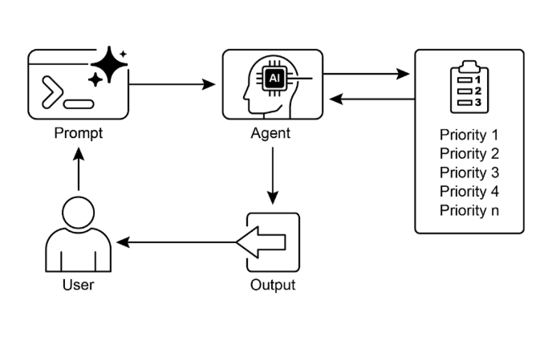

# 第20章：優先順序

在複雜、動態的環境中，代理經常遇到眾多潛在動作、衝突目標和有限資源。沒有確定下一步動作的明確流程，代理可能會經歷效率降低、操作延遲，或無法實現關鍵目標。優先順序模式透過讓代理根據重要性、緊急性、相依性和既定標準來評估和排序任務、目標或動作來解決這個問題。這確保代理將努力集中在最關鍵的任務上，結果是增強效果和目標對齊。

## 優先順序模式概述

代理採用優先順序來有效管理任務、目標和子目標，指導後續動作。這個過程在處理多重需求時促進明智決策制定，將重要或緊急活動置於較不關鍵的活動之上。它在資源受限、時間有限且目標可能衝突的現實情境中特別相關。

代理優先順序的基本面向通常涉及幾個元素。首先，標準定義建立任務評估的規則或指標。這些可能包括緊急性 (任務的時間敏感性)、重要性 (對主要目標的影響)、相依性 (任務是否為其他任務的先決條件)、資源可用性 (必要工具或資訊的準備狀態)、成本/效益分析 (努力與預期結果)，以及個人化代理的使用者偏好。第二，任務評估涉及根據這些定義標準評估每個潛在任務，使用從簡單規則到複雜評分或大語言模型推理的方法。第三，排程或選擇邏輯指的是基於評估選擇最佳下一動作或任務序列的演算法，可能利用佇列或進階規劃組件。最後，動態重新優先排序允許代理隨著情況變化修改優先順序，如出現新的關鍵事件或接近截止日期，確保代理適應性和回應性。

優先排序可以在各種層級發生：選擇總體目標 (高階目標優先排序)、安排計劃內的步驟 (子任務優先排序)，或從可用選項中選擇下一個即時動作 (動作選擇)。有效的優先排序讓代理能夠展現更智慧、高效且強健的行為，特別是在複雜、多目標環境中。這反映了人類團隊組織，其中經理透過考慮所有成員的輸入來優先排序任務。

## 實際應用與使用案例

在各種現實應用中，AI代理展示了優先排序的複雜使用來做出及時且有效的決策。

* **自動化客戶支援：** 代理優先處理緊急請求，如系統中斷報告，而非例行事務，如密碼重設。它們也可能給予高價值客戶優先待遇。
* **雲端運算：** AI透過在尖峰需求期間優先分配給關鍵應用程式來管理和排程資源，同時將較不緊急的批次作業安排到離峰時間以優化成本。
* **自動駕駛系統：** 持續優先排序動作以確保安全和效率。例如，煞車以避免碰撞優先於維持車道紀律或優化燃油效率。
* **金融交易：** 機器人透過分析市場條件、風險容忍度、利潤邊際和即時新聞等因素來優先排序交易，實現高優先順序交易的迅速執行。
* **專案管理：** AI代理根據截止日期、相依性、團隊可用性和策略重要性在專案看板上優先排序任務。
* **網路安全：** 監控網路流量的代理透過評估威脅嚴重性、潛在影響和資產關鍵性來優先排序警報，確保對最危險威脅的即時回應。
* **個人助理AI：** 利用優先排序來管理日常生活，根據使用者定義的重要性、即將到來的截止日期和當前情境組織行事曆事件、提醒和通知。

這些範例共同說明了優先排序能力如何成為AI代理在廣泛情境中增強效能和決策制定能力的基礎。

## 實作程式碼範例

以下展示使用LangChain開發專案經理AI代理。此代理促進向團隊成員建立、優先排序和分配任務，說明大語言模型與客製化工具在自動化專案管理中的應用。

```python
import os
import asyncio
from typing import List, Optional, Dict, Type

from dotenv import load_dotenv
from pydantic import BaseModel, Field
from langchain_core.prompts import ChatPromptTemplate
from langchain_core.tools import Tool
from langchain_openai import ChatOpenAI
from langchain.agents import AgentExecutor, create_react_agent
from langchain.memory import ConversationBufferMemory


# --- 0. 配置和設定 ---
# 從.env檔案載入OPENAI_API_KEY。
load_dotenv()

# ChatOpenAI客戶端自動從環境中獲取API金鑰。
llm = ChatOpenAI(temperature=0.5, model="gpt-4o-mini")


# --- 1. 任務管理系統 ---
class Task(BaseModel):
    """代表系統中的單一任務。"""
    id: str
    description: str
    priority: Optional[str] = None  # P0, P1, P2
    assigned_to: Optional[str] = None  # 工作者姓名


class SuperSimpleTaskManager:
    """高效且強健的記憶體內任務管理器。"""

    def __init__(self):
        # 使用字典進行O(1)查詢、更新和刪除。
        self.tasks: Dict[str, Task] = {}
        self.next_task_id = 1

    def create_task(self, description: str) -> Task:
        """建立並儲存新任務。"""
        task_id = f"TASK-{self.next_task_id:03d}"
        new_task = Task(id=task_id, description=description)
        self.tasks[task_id] = new_task
        self.next_task_id += 1
        print(f"DEBUG: 任務已建立 - {task_id}: {description}")
        return new_task

    def update_task(self, task_id: str, **kwargs) -> Optional[Task]:
        """使用Pydantic的model_copy安全地更新任務。"""
        task = self.tasks.get(task_id)
        if task:
            # 使用model_copy進行類型安全更新。
            update_data = {k: v for k, v in kwargs.items() if v is not None}
            updated_task = task.model_copy(update=update_data)
            self.tasks[task_id] = updated_task
            print(f"DEBUG: 任務 {task_id} 已更新：{update_data}")
            return updated_task

        print(f"DEBUG: 找不到任務 {task_id} 進行更新。")
        return None

    def list_all_tasks(self) -> str:
        """列出系統中目前的所有任務。"""
        if not self.tasks:
            return "系統中沒有任務。"

        task_strings = []
        for task in self.tasks.values():
            task_strings.append(
                f"ID: {task.id}, 描述: '{task.description}', "
                f"優先順序: {task.priority or 'N/A'}, "
                f"分配給: {task.assigned_to or 'N/A'}"
            )
        return "目前任務：\n" + "\n".join(task_strings)


task_manager = SuperSimpleTaskManager()


# --- 2. 專案經理代理的工具 ---
# 為工具參數使用Pydantic模型以獲得更好的驗證和清晰度。
class CreateTaskArgs(BaseModel):
    description: str = Field(description="任務的詳細描述。")


class PriorityArgs(BaseModel):
    task_id: str = Field(description="要更新的任務ID，例如'TASK-001'。")
    priority: str = Field(description="要設定的優先順序。必須是：'P0'、'P1'、'P2'之一。")


class AssignWorkerArgs(BaseModel):
    task_id: str = Field(description="要更新的任務ID，例如'TASK-001'。")
    worker_name: str = Field(description="要分配任務的工作者姓名。")


def create_new_task_tool(description: str) -> str:
    """使用給定描述建立新的專案任務。"""
    task = task_manager.create_task(description)
    return f"已建立任務 {task.id}: '{task.description}'。"


def assign_priority_to_task_tool(task_id: str, priority: str) -> str:
    """為給定任務ID分配優先順序 (P0, P1, P2)。"""
    if priority not in ["P0", "P1", "P2"]:
        return "無效的優先順序。必須是P0、P1或P2。"
    task = task_manager.update_task(task_id, priority=priority)
    return f"已為任務 {task.id} 分配優先順序 {priority}。" if task else f"找不到任務 {task_id}。"


def assign_task_to_worker_tool(task_id: str, worker_name: str) -> str:
    """將任務分配給特定工作者。"""
    task = task_manager.update_task(task_id, assigned_to=worker_name)
    return f"已將任務 {task.id} 分配給 {worker_name}。" if task else f"找不到任務 {task_id}。"


# PM代理可以使用的所有工具
pm_tools = [
    Tool(
        name="create_new_task",
        func=create_new_task_tool,
        description="首先使用此工具建立新任務並取得其ID。",
        args_schema=CreateTaskArgs
    ),
    Tool(
        name="assign_priority_to_task",
        func=assign_priority_to_task_tool,
        description="在建立任務後使用此工具為任務分配優先順序。",
        args_schema=PriorityArgs
    ),
    Tool(
        name="assign_task_to_worker",
        func=assign_task_to_worker_tool,
        description="在建立任務後使用此工具將任務分配給特定工作者。",
        args_schema=AssignWorkerArgs
    ),
    Tool(
        name="list_all_tasks",
        func=task_manager.list_all_tasks,
        description="使用此工具列出所有目前任務及其狀態。"
    ),
]


# --- 3. 專案經理代理定義 ---
pm_prompt_template = ChatPromptTemplate.from_messages([
    ("system", """你是專注的專案經理大語言模型代理。你的目標是有效管理專案任務。
      當你收到新任務請求時，請遵循以下步驟：
    1.  首先，使用`create_new_task`工具根據給定描述建立任務。你必須先這樣做以取得`task_id`。
    2.  接下來，分析使用者請求以查看是否提到優先順序或受分配者。
        - 如果提到優先順序 (例如「緊急」、「ASAP」、「關鍵」)，將其對應到P0。使用`assign_priority_to_task`。
        - 如果提到工作者，使用`assign_task_to_worker`。
    3.  如果遺漏任何資訊 (優先順序、受分配者)，你必須做出合理的預設分配 (例如分配P1優先順序並分配給'工作者A')。
    4.  任務完全處理後，使用`list_all_tasks`顯示最終狀態。

    可用工作者：'工作者A'、'工作者B'、'審查團隊'
    優先順序層級：P0 (最高)、P1 (中等)、P2 (最低)
    """),
    ("placeholder", "{chat_history}"),
    ("human", "{input}"),
    ("placeholder", "{agent_scratchpad}")
])

# 建立代理執行器
pm_agent = create_react_agent(llm, pm_tools, pm_prompt_template)
pm_agent_executor = AgentExecutor(
    agent=pm_agent,
    tools=pm_tools,
    verbose=True,
    handle_parsing_errors=True,
    memory=ConversationBufferMemory(memory_key="chat_history", return_messages=True)
)


# --- 4. 簡單互動流程 ---
async def run_simulation():
    print("--- 專案經理模擬 ---")

    # 情境1：處理新的緊急功能請求
    print("\n[使用者請求] 我需要盡快實作新的登入系統。它應該分配給工作者B。")
    await pm_agent_executor.ainvoke({"input": "建立任務來實作新的登入系統。這是緊急的，應該分配給工作者B。"})

    print("\n" + "-" * 60 + "\n")

    # 情境2：處理較不緊急的內容更新，詳細資訊較少
    print("[使用者請求] 我們需要審查行銷網站內容。")
    await pm_agent_executor.ainvoke({"input": "管理新任務：審查行銷網站內容。"})

    print("\n--- 模擬完成 ---")


# 執行模擬
if __name__ == "__main__":
    asyncio.run(run_simulation())
```

這個程式碼使用Python和LangChain實作簡單的任務管理系統，設計用來模擬由大語言模型驅動的專案經理代理。

系統採用SuperSimpleTaskManager類別在記憶體內有效管理任務，利用字典結構進行快速資料檢索。每個任務由Task Pydantic模型表示，包含唯一識別碼、描述性文字、可選優先順序層級 (P0, P1, P2) 和可選受分配者指定等屬性。記憶體使用量根據任務類型、工作者數量和其他貢獻因素而變化。任務管理器提供任務建立、任務修改和檢索所有任務的方法。

代理透過定義的工具集與任務管理器互動。這些工具促進新任務建立、為任務分配優先順序、將任務分配給人員，以及列出所有任務。每個工具都被封裝以實現與SuperSimpleTaskManager實例的互動。利用Pydantic模型來描述工具所需的參數，從而確保資料驗證。

AgentExecutor配置了語言模型、工具集和對話記憶體組件以維持上下文連續性。定義特定的ChatPromptTemplate來指導代理在其專案管理角色中的行為。提示指示代理首先建立任務，隨後根據指定分配優先順序和人員，並以綜合任務清單結束。在資訊缺失的情況下，提示中規定了預設分配，如P1優先順序和「工作者A」。

程式碼包含非同步性質的模擬函數 (`run_simulation`) 來展示代理的操作能力。模擬執行兩個不同情境：管理具有指定人員的緊急任務，以及管理輸入最少的較不緊急任務。由於在AgentExecutor中啟用verbose=True，代理的動作和邏輯過程被輸出到控制台。

# 速覽

**什麼：** 在複雜環境中運作的AI代理面臨眾多潛在動作、衝突目標和有限資源。沒有確定下一步動作的明確方法，這些代理有變得低效且無效的風險。這可能導致顯著的操作延遲或完全無法完成主要目標。核心挑戰是管理這種壓倒性的選擇數量，以確保代理有目的且邏輯地行動。

**為什麼：** 優先順序模式透過讓代理能夠排序任務和目標為這個問題提供標準化解決方案。這是透過建立明確標準如緊急性、重要性、相依性和資源成本來實現的。代理然後根據這些標準評估每個潛在動作，以確定最關鍵且及時的行動方案。這種代理能力讓系統能夠動態適應變化情況並有效管理受限資源。透過專注於最高優先順序項目，代理的行為變得更智慧、強健且與其策略目標一致。

**經驗法則：** 當代理系統必須在資源約束下自主管理多個、通常衝突的任務或目標以在動態環境中有效運作時，使用優先順序模式。

**視覺摘要：**



圖1：優先順序設計模式

# 關鍵要點

* 優先排序讓AI代理能夠在複雜、多面向環境中有效運作。
* 代理利用既定標準如緊急性、重要性和相依性來評估和排序任務。
* 動態重新優先排序讓代理能夠回應即時變化調整其操作焦點。
* 優先排序發生在各種層級，包含總體策略目標和即時戰術決策。
* 有效的優先排序結果是AI代理效率增加和操作強健性改善。

# 結論

總結而言，優先順序模式是有效代理AI的基石，讓系統能夠有目的且智慧地導航動態環境的複雜性。它讓代理能夠自主評估眾多衝突任務和目標，對於在何處集中其有限資源做出合理決策。這種代理能力超越簡單任務執行，讓系統能夠作為主動、策略決策制定者。透過權衡緊急性、重要性和相依性等標準，代理展示複雜、類似人類的推理過程。

這種代理行為的關鍵特徵是動態重新優先排序，它授予代理在條件變化時即時調整其焦點的自主性。如程式碼範例所示，代理解釋模糊請求，自主選擇和使用適當工具，並邏輯地排序其動作以實現其目標。這種自我管理其工作流程的能力是真正代理系統與簡單自動化腳本的區別。最終，掌握優先排序對於建立能夠在任何複雜、現實情境中有效且可靠運作的強健且智慧代理是基礎的。

# 參考文獻

1. Examining the Security of Artificial Intelligence in Project Management: A Case Study of AI-driven Project Scheduling and Resource Allocation in Information Systems Projects ; [https://www.irejournals.com/paper-details/1706160](https://www.irejournals.com/paper-details/1706160)
2. AI-Driven Decision Support Systems in Agile Software Project Management: Enhancing Risk Mitigation and Resource Allocation; [https://www.mdpi.com/2079-8954/13/3/208](https://www.mdpi.com/2079-8954/13/3/208)