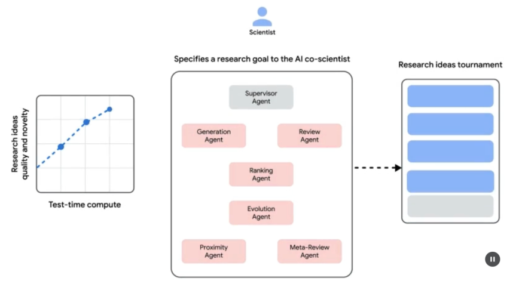
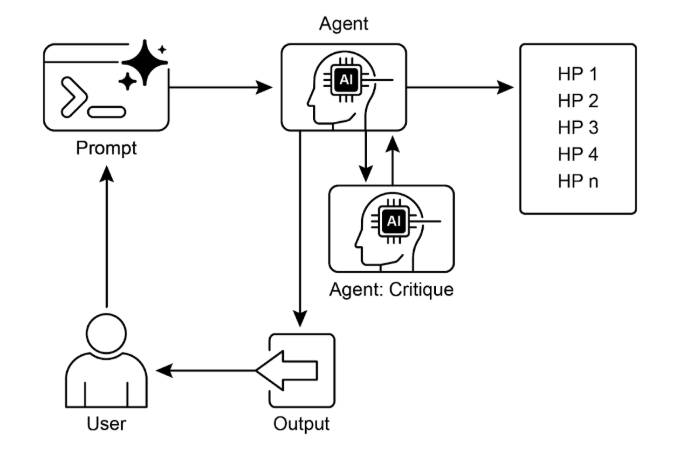

# 第21章：探索與發現

本章探討讓智慧代理能夠主動尋求新資訊、發現新可能性，以及在其操作環境中識別未知未知的模式。探索與發現不同於反應性行為或在預定義解決方案空間內的優化。相反，它們專注於代理主動冒險進入陌生領域、實驗新方法，以及產生新知識或理解。這種模式對於在開放式、複雜或快速演進領域中運作的代理至關重要，其中靜態知識或預程式設計解決方案是不足的。它強調代理擴展其理解和能力的能力。

## 實際應用與使用案例

AI代理具有智慧優先排序和探索的能力，這導致各種領域的應用。透過自主評估和排序潛在動作，這些代理可以導航複雜環境、發現隱藏見解，並推動創新。這種優先探索能力讓它們能夠優化流程、發現新知識，並產生內容。

範例：

* **科學研究自動化：** 代理設計和執行實驗、分析結果，並制定新假設來發現新材料、藥物候選者或科學原理。
* **遊戲和策略生成：** 代理探索遊戲狀態，發現緊急策略或識別遊戲環境中的弱點 (例如AlphaGo)。
* **市場研究和趨勢發現：** 代理掃描非結構化資料 (社交媒體、新聞、報告) 來識別趨勢、消費者行為或市場機會。
* **安全漏洞發現：** 代理探測系統或程式碼庫以找到安全缺陷或攻擊向量。
* **創意內容生成：** 代理探索風格、主題或資料的組合來產生藝術作品、音樂作品或文學作品。
* **個人化教育和訓練：** AI導師根據學生的進步、學習風格和需要改進的領域來優先排序學習路徑和內容傳遞。

Google協同科學家

AI協同科學家是Google Research開發的AI系統，設計為計算科學協作者。它協助人類科學家進行研究面向，如假設生成、提案改進和實驗設計。這個系統基於Gemini大語言模型運作。

AI協同科學家的開發解決科學研究中的挑戰。這些包括處理大量資訊、產生可測試假設，以及管理實驗規劃。AI協同科學家透過執行涉及大規模資訊處理和綜合的任務來支援研究人員，可能揭示資料內的關係。其目的是透過處理早期研究的計算密集面向來增強人類認知過程。

**系統架構和方法：** AI協同科學家的架構基於多代理框架，結構化來模擬協作和迭代過程。這種設計整合專門的AI代理，每個都在貢獻研究目標方面具有特定角色。監督代理在允許計算資源靈活擴展的非同步任務執行框架內管理和協調這些個別代理的活動。

核心代理及其功能包括 (見圖1)：

* **生成代理：** 透過文獻探索和模擬科學辯論產生初始假設來啟動過程。
* **反思代理：** 作為同儕審查員，批判性評估生成假設的正確性、新穎性和品質。
* **排名代理：** 採用基於Elo的錦標賽來透過模擬科學辯論比較、排名和優先排序假設。
* **演化代理：** 透過簡化概念、綜合想法和探索非常規推理來持續改進排名最高的假設。
* **接近代理：** 計算接近圖來聚集類似想法並協助探索假設景觀。
* **元審查代理：** 綜合來自所有審查和辯論的見解來識別共同模式並提供回饋，讓系統能夠持續改進。

系統的操作基礎依賴Gemini，它提供語言理解、推理和生成能力。系統納入「測試時間計算擴展」，一種分配增加計算資源來迭代推理和增強輸出的機制。系統處理和綜合來自多樣化來源的資訊，包括學術文獻、網路資料和資料庫。



圖1：(作者提供) AI協同科學家：構思到驗證

系統遵循迭代的「生成、辯論和演化」方法，反映科學方法。在來自人類科學家的科學問題輸入後，系統參與假設生成、評估和改進的自我改進循環。假設經歷系統化評估，包括代理間的內部評估和基於錦標賽的排名機制。

**驗證和結果：** AI協同科學家的效用已在幾項驗證研究中得到證明，特別是在生醫領域，透過自動化基準、專家審查和端到端濕實驗室實驗評估其效能。

**自動化和專家評估：** 在具有挑戰性的GPQA基準上，系統的內部Elo評級顯示與其結果準確性一致，在困難的「鑽石集」上達到78.4%的top-1準確性。對超過200個研究目標的分析顯示，擴展測試時間計算持續改善假設品質，如Elo評級所測量。在精選的15個具有挑戰性問題集上，AI協同科學家表現優於其他最先進AI模型和人類專家提供的「最佳猜測」解決方案。在小規模評估中，生醫專家評價協同科學家的輸出比其他基線模型更新穎且有影響力。系統對藥物重新定位的提案，格式化為NIH特定目標頁面，也被六位專家腫瘤學家小組判斷為高品質。

**端到端實驗驗證：**

藥物重新定位：對於急性骨髓性白血病 (AML)，系統提出新穎藥物候選者。其中一些，如KIRA6，是完全新穎的建議，在AML中沒有先前的臨床前證據。後續體外實驗證實KIRA6和其他建議藥物在多個AML細胞株中以臨床相關濃度抑制腫瘤細胞活力。

新穎目標發現：系統識別了肝纖維化的新穎表觀遺傳目標。使用人類肝臟類器官的實驗室實驗驗證了這些發現，顯示針對建議表觀遺傳修飾因子的藥物具有顯著的抗纖維化活性。其中一種識別的藥物已經獲得FDA批准用於另一種疾病，為重新定位開闢機會。

抗菌藥物抗性：AI協同科學家獨立重現未發表的實驗發現。它被要求解釋為什麼某些可移動遺傳元素 (cf-PICIs) 在許多細菌物種中被發現。在兩天內，系統的最高排名假設是cf-PICIs與多樣化噬菌體尾部互動以擴展其宿主範圍。這反映了獨立研究小組在超過十年研究後達到的新穎、實驗驗證發現。

**增強和限制：** AI協同科學家背後的設計哲學強調增強而非完全自動化人類研究。研究人員透過自然語言與系統互動並指導它，提供回饋、貢獻自己的想法，並在「科學家在循環中」協作範式中指導AI的探索過程。然而，系統有一些限制。其知識受到對開放存取文獻依賴的約束，可能遺漏付費牆後的關鍵先前工作。它也對負面實驗結果的存取有限，這些很少發表但對有經驗的科學家至關重要。此外，系統繼承了底層大語言模型的限制，包括事實不準確或「幻覺」的可能性。

**安全性：** 安全性是關鍵考慮，系統納入多重保護措施。所有研究目標在輸入時都會審查安全性，生成的假設也會檢查以防止系統被用於不安全或不道德的研究。使用1,200個對抗性研究目標的初步安全評估發現系統能夠強健地拒絕危險輸入。為了確保負責任的開發，系統正透過信任測試者計劃向更多科學家提供，以收集現實世界回饋。

## 實作程式碼範例

讓我們看一個代理AI用於探索與發現的具體範例：Agent Laboratory，由Samuel Schmidgall在MIT授權下開發的專案。

「Agent Laboratory」是一個自主研究工作流程框架，設計用來增強而非取代人類科學努力。這個系統利用專門的大語言模型來自動化科學研究過程的各個階段，從而讓人類研究人員能夠將更多認知資源投入到概念化和批判分析。

框架整合「AgentRxiv」，一個用於自主研究代理的去中心化存儲庫。AgentRxiv促進研究輸出的儲存、檢索和開發。

Agent Laboratory透過不同階段指導研究過程：

1. **文獻審查：** 在這個初始階段，專門的大語言模型驅動代理被賦予自主收集和批判分析相關學術文獻的任務。這涉及利用arXiv等外部資料庫來識別、綜合和分類相關研究，有效地為後續階段建立綜合知識庫。
2. **實驗：** 這個階段包含實驗設計的協作制定、資料準備、實驗執行和結果分析。代理利用整合工具如Python進行程式碼生成和執行，以及Hugging Face進行模型存取，來進行自動化實驗。系統設計用於迭代改進，其中代理可以根據即時結果適應和優化實驗程序。
3. **報告撰寫：** 在最終階段，系統自動化生成綜合研究報告。這涉及將實驗階段的發現與文獻審查的見解綜合，根據學術慣例結構化文件，並整合LaTeX等外部工具進行專業格式化和圖表生成。
4. **知識分享：** AgentRxiv是一個讓自主研究代理能夠分享、存取和協作推進科學發現的平台。它讓代理能夠建立在先前發現之上，促進累積研究進展。

Agent Laboratory的模組化架構確保計算靈活性。目標是透過自動化任務來增強研究生產力，同時保持人類研究人員。

**程式碼分析：** 雖然綜合程式碼分析超出了本書的範圍，我想為你提供一些關鍵見解並鼓勵你自己深入研究程式碼。

**判斷：** 為了模擬人類評估過程，系統採用三分代理判斷機制來評估輸出。這涉及部署三個不同的自主代理，每個都配置為從特定角度評估產生，從而共同模擬人類判斷的細緻和多面向性質。這種方法允許更強健且綜合的評估，超越單一指標來捕獲更豐富的質性評估。

```python
class ReviewersAgent:
    def __init__(self, model="gpt-4o-mini", notes=None, openai_api_key=None):
        if notes is None:
            self.notes = []
        else:
            self.notes = notes
        self.model = model
        self.openai_api_key = openai_api_key

    def inference(self, plan, report):
        reviewer_1 = "你是一個嚴格但公平的審查員，期望良好的實驗能為研究主題帶來見解。"
        review_1 = get_score(
            outlined_plan=plan,
            latex=report,
            reward_model_llm=self.model,
            reviewer_type=reviewer_1,
            openai_api_key=self.openai_api_key
        )

        reviewer_2 = "你是一個嚴格、批判但公平的審查員，正在尋找對該領域有影響力的想法。"
        review_2 = get_score(
            outlined_plan=plan,
            latex=report,
            reward_model_llm=self.model,
            reviewer_type=reviewer_2,
            openai_api_key=self.openai_api_key
        )

        reviewer_3 = "你是一個嚴格但公平、開放的審查員，正在尋找以前未提出的新穎想法。"
        review_3 = get_score(
            outlined_plan=plan,
            latex=report,
            reward_model_llm=self.model,
            reviewer_type=reviewer_3,
            openai_api_key=self.openai_api_key
        )

        return f"審查員 #1:\n{review_1}, \n審查員 #2:\n{review_2}, \n審查員 #3:\n{review_3}"
```

判斷代理設計有特定提示，密切模擬人類審查員通常採用的認知框架和評估標準。這個提示指導代理透過類似人類專家的鏡頭分析輸出，考慮相關性、連貫性、事實準確性和整體品質等因素。透過製作這些提示來反映人類審查協議，系統旨在達到接近類似人類辨別力的評估複雜度水準。

```python
def get_score(outlined_plan, latex, reward_model_llm, reviewer_type=None, attempts=3, openai_api_key=None):
   e = str()
   for _attempt in range(attempts):
       try:
          
           template_instructions = """
           請以以下格式回應：

           思考：
           <思考>

           審查JSON：
           ```json
           <JSON>
           ```

           在<思考>中，首先簡要討論你對評估的直覺
           和推理。
           詳述你的高階論點、必要選擇
           和審查的期望結果。
           不要在這裡做一般性評論，而要針對
           你當前的論文具體說明。
           將此視為審查的筆記階段。

           在<JSON>中，以JSON格式提供審查，包含
           以下欄位按順序：
           - "摘要"：論文內容和
           其貢獻的摘要。
           - "優勢"：論文優勢清單。
           - "弱點"：論文弱點清單。
           - "原創性"：1到4的評級
             (低、中、高、非常高)。
           - "品質"：1到4的評級
             (低、中、高、非常高)。
           - "清晰度"：1到4的評級
             (低、中、高、非常高)。
           - "重要性"：1到4的評級
             (低、中、高、非常高)。
           - "問題"：論文作者需要回答的
              澄清問題集。
           - "限制"：工作的限制和潛在
              負面社會影響集。
           - "倫理關注"：布林值，指示
              是否存在倫理關注。
           - "健全性"：1到4的評級
              (差、尚可、良好、優秀)。
           - "呈現"：1到4的評級
              (差、尚可、良好、優秀)。
           - "貢獻"：1到4的評級
             (差、尚可、良好、優秀)。
           - "總體"：1到10的評級
             (非常強烈拒絕到獎項品質)。
           - "信心"：1到5的評級
             (低、中、高、非常高、絕對)。
           - "決定"：必須是以下之一的決定：
             接受、拒絕。

           對於「決定」欄位，不要使用弱接受、
           邊緣接受、邊緣拒絕或強烈拒絕。
           相反，只使用接受或拒絕。
           這個JSON將被自動解析，所以確保
           格式精確。
           """
```

在這個多代理系統中，研究過程圍繞專門角色結構化，反映典型學術階層以簡化工作流程並優化輸出。

**教授代理：** 教授代理作為主要研究主管，負責建立研究議程、定義研究問題，並將任務委派給其他代理。這個代理設定策略方向並確保與專案目標一致。

```python
class ProfessorAgent(BaseAgent):
   def __init__(self, model="gpt4omini", notes=None, max_steps=100, openai_api_key=None):
       super().__init__(model, notes, max_steps, openai_api_key)
       self.phases = ["報告撰寫"]

   def generate_readme(self):
       sys_prompt = f"""你是{self.role_description()} \n 這是撰寫的論文 \n{self.report}。任務指示：你的目標是整合提供給你的所有知識、程式碼、報告和筆記，並為github存儲庫生成readme.md。"""
       history_str = "\n".join([_[1] for _ in self.history])
       prompt = (
           f"""歷史：{history_str}\n{'~' * 10}\n"""
           f"請在下面以markdown格式產生readme：\n")
       model_resp = query_model(model_str=self.model, system_prompt=sys_prompt, prompt=prompt, openai_api_key=self.openai_api_key)
       return model_resp.replace("```markdown", "")
```

**博士後代理：** 博士後代理的角色是執行研究。這包括進行文獻審查、設計和實作實驗，以及生成研究輸出如論文。重要的是，博士後代理具有撰寫和執行程式碼的能力，實現實驗協議和資料分析的實際實作。這個代理是研究工件的主要生產者。

```python
class PostdocAgent(BaseAgent):
    def __init__(self, model="gpt4omini", notes=None, max_steps=100, openai_api_key=None):
        super().__init__(model, notes, max_steps, openai_api_key)
        self.phases = ["計劃制定", "結果解釋"]

    def context(self, phase):
        sr_str = str()
        if self.second_round:
            sr_str = (
                f"以下是先前實驗的結果\n",
                f"先前實驗程式碼：{self.prev_results_code}\n"
                f"先前結果：{self.prev_exp_results}\n"
                f"先前結果解釋：{self.prev_interpretation}\n"
                f"先前報告：{self.prev_report}\n"
                f"{self.reviewer_response}\n\n\n"
            )

        if phase == "計劃制定":
            return (
                sr_str,
                f"目前文獻審查：{self.lit_review_sum}",
            )
        elif phase == "結果解釋":
            return (
                sr_str,
                f"目前文獻審查：{self.lit_review_sum}\n"
                f"目前計劃：{self.plan}\n"
                f"目前資料集程式碼：{self.dataset_code}\n"
                f"目前實驗程式碼：{self.results_code}\n"
                f"目前結果：{self.exp_results}"
            )

        return ""
```

**審查員代理：** 審查員代理對博士後代理的研究輸出進行批判評估，評估論文和實驗結果的品質、有效性和科學嚴謹性。這個評估階段模擬學術環境中的同儕審查過程，以確保在最終確定前研究輸出的高標準。

**機器學習工程代理：** 機器學習工程代理作為機器學習工程師，與博士生進行對話協作來開發程式碼。它們的核心功能是為資料預處理生成簡潔程式碼，整合從提供的文獻審查和實驗協議中得出的見解。這保證資料被適當格式化並為指定實驗準備。

```markdown
「你是一名機器學習工程師，由將幫助你撰寫程式碼的博士生指導，你可以透過對話與他們互動。\n」
「你的目標是產生為提供的實驗準備資料的程式碼。你應該瞄準簡單的程式碼來準備資料，而不是複雜的程式碼。你應該整合提供的文獻審查和計劃，並想出為這個實驗準備資料的程式碼。\n」
```

**軟體工程代理：** 軟體工程代理指導機器學習工程代理。它們的主要目的是協助機器學習工程代理為特定實驗建立直接的資料準備程式碼。軟體工程代理整合提供的文獻審查和實驗計劃，確保生成的程式碼簡潔且直接與研究目標相關。

```markdown
「你是一名指導機器學習工程師的軟體工程師，機器學習工程師將撰寫程式碼，你可以透過對話與他們互動。\n」
「你的目標是幫助ML工程師產生為提供的實驗準備資料的程式碼。你應該瞄準非常簡單的程式碼來準備資料，而不是複雜的程式碼。你應該整合提供的文獻審查和計劃，並想出為這個實驗準備資料的程式碼。\n」
```

總之，「Agent Laboratory」代表自主科學研究的複雜框架。它設計用來透過自動化關鍵研究階段和促進協作AI驅動知識生成來增強人類研究能力。系統旨在透過管理例行任務來提高研究效率，同時保持人類監督。

## 速覽

**什麼：** AI代理通常在預定義知識內運作，限制了它們處理新情況或開放式問題的能力。在複雜且動態環境中，這種靜態、預程式設計資訊對於真正創新或發現是不足的。根本挑戰是讓代理能夠超越簡單優化，主動尋求新資訊並識別「未知未知」。這需要從純粹反應性行為轉向主動、代理探索的範式轉變，擴展系統自身的理解和能力。

**為什麼：** 標準化解決方案是建立專門為自主探索和發現設計的代理AI系統。這些系統通常利用多代理框架，其中專門的大語言模型協作來模擬像科學方法這樣的過程。例如，不同代理可以被賦予生成假設、批判審查它們，以及演化最有希望概念的任務。這種結構化、協作方法讓系統能夠智慧地導航龐大資訊景觀、設計和執行實驗，並生成真正新的知識。透過自動化探索的勞動密集面向，這些系統增強人類智慧並顯著加速發現步伐。

**經驗法則：** 在解決方案空間未完全定義的開放式、複雜或快速演進領域中運作時使用探索與發現模式。它適合需要生成新穎假設、策略或見解的任務，如科學研究、市場分析和創意內容生成。當目標是發現「未知未知」而非僅僅優化已知過程時，這種模式是必要的。

**視覺摘要：**



圖2：探索與發現設計模式

## 關鍵要點

* AI中的探索與發現讓代理能夠主動追求新資訊和可能性，這對於導航複雜且演進環境至關重要。
* 像Google協同科學家這樣的系統展示代理如何能夠自主生成假設和設計實驗，補充人類科學研究。
* 多代理框架，如Agent Laboratory的專門角色所示，透過自動化文獻審查、實驗和報告撰寫來改善研究。
* 最終，這些代理旨在透過管理計算密集任務來增強人類創造力和問題解決能力，從而加速創新和發現。

## 結論

總結而言，探索與發現模式是真正代理系統的精髓，定義其從被動指令遵循轉向主動探索其環境的能力。這種內在代理驅動力是讓AI能夠在複雜領域中自主運作的力量，不僅執行任務，而且獨立設定子目標來發現新資訊。這種進階代理行為透過多代理框架最有力地實現，其中每個代理在更大協作過程中體現特定、主動角色。例如，Google協同科學家的高度代理系統具有自主生成、辯論和演化科學假設的代理。

像Agent Laboratory這樣的框架進一步透過建立模擬人類研究團隊的代理階層來結構化這一點，讓系統能夠自我管理整個發現生命週期。這種模式的核心在於編排緊急代理行為，讓系統能夠以最少人類干預追求長期、開放式目標。這提升了人類-AI夥伴關係，將AI定位為處理探索任務自主執行的真正代理協作者。透過將這種主動發現工作委託給代理系統，人類智慧得到顯著增強，加速創新。開發如此強大的代理能力也需要對安全和倫理監督的強烈承諾。最終，這種模式提供建立真正代理AI的藍圖，將計算工具轉變為追求知識的獨立、目標導向夥伴。

## 參考文獻

1. Exploration-Exploitation Dilemma：強化學習和不確定性下決策制定的基本問題。[https://en.wikipedia.org/wiki/Exploration%E2%80%93exploitation_dilemma](https://en.wikipedia.org/wiki/Exploration%E2%80%93exploitation_dilemma)
2. Google Co-Scientist: [https://research.google/blog/accelerating-scientific-breakthroughs-with-an-ai-co-scientist/](https://research.google/blog/accelerating-scientific-breakthroughs-with-an-ai-co-scientist/)
3. Agent Laboratory: Using LLM Agents as Research Assistants [https://github.com/SamuelSchmidgall/AgentLaboratory](https://github.com/SamuelSchmidgall/AgentLaboratory)
4. AgentRxiv: Towards Collaborative Autonomous Research: [https://agentrxiv.github.io/](https://agentrxiv.github.io/)