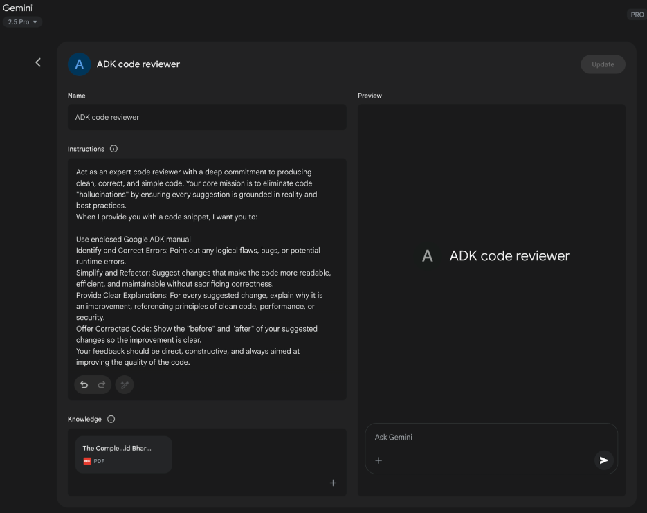

# 附錄 A：進階提示工程技巧

## 提示工程簡介

提示工程是與大語言模型互動的主要介面，涉及製作輸入來引導模型產生所需的輸出。這包括結構化請求、提供相關脈絡、指定輸出格式，以及示範預期的回應類型。設計良好的提示可以最大化大語言模型的潛力，產生準確、相關且有創意的回應。相反地，設計不良的提示可能導致模糊、不相關或錯誤的輸出。

提示工程的目標是持續從大語言模型中獲得高品質的回應。這需要理解模型的能力和限制，並有效傳達預期目標。它涉及通過學習如何最好地指導 AI 來發展與 AI 溝通的專業知識。

本附錄詳述了各種超越基本互動方法的提示技巧。它探討了結構化複雜請求、增強模型推理能力、控制輸出格式以及整合外部資訊的方法。這些技巧適用於建置從簡單聊天機器人到複雜多智能體系統的各種應用，並可以改善智能體應用的效能和可靠性。

智能體模式是建置智慧系統的架構結構，在主要章節中有詳細說明。這些模式定義了智能體如何規劃、使用工具、管理記憶體和協作。這些智能體系統的效能取決於它們與大語言模型有意義互動的能力。

## 核心提示原則

有效提示大語言模型的核心原則：

有效的提示基於指導與大語言模型溝通的基本原則，適用於各種模型和任務複雜性。掌握這些原則對於持續產生有用且準確的回應至關重要。

**清晰性和具體性**：指令應該明確且精確。大語言模型解釋模式；多重解釋可能導致意外的回應。定義任務、所需的輸出格式以及任何限制或要求。避免模糊的語言或假設。不充分的提示會產生模糊且不準確的回應，阻礙有意義的輸出。

**簡潔性**：雖然具體性很重要，但不應該影響簡潔性。指令應該直接明確。不必要的措辭或複雜的句子結構可能會混淆模型或掩蓋主要指令。提示應該簡單；對用戶困惑的東西對模型也可能困惑。避免複雜的語言和多餘的資訊。使用直接的措辭和主動動詞來清楚描述所需的行動。有效的動詞包括：執行、分析、分類、歸類、對比、比較、建立、描述、定義、評估、提取、尋找、產生、識別、列出、測量、組織、解析、選擇、預測、提供、排名、推薦、回傳、檢索、重寫、選取、顯示、排序、總結、翻譯、撰寫。

**使用動詞：** 動詞選擇是關鍵的提示工具。動作動詞指示預期的操作。相比於「考慮總結這個」，直接指令如「總結以下文字」更有效。精確的動詞引導模型啟動相關的訓練資料和該特定任務的處理程序。

**指令優於限制：** 正面指令通常比負面限制更有效。指定所需的行動比概述不該做什麼更好。雖然限制在安全性或嚴格格式方面有其作用，但過度依賴可能導致模型專注於避免而非目標。將提示框架為直接引導模型。正面指令符合人類指導偏好並減少混淆。

**實驗與迭代：** 提示工程是一個迭代過程。識別最有效的提示需要多次嘗試。從草稿開始，測試它，分析輸出，識別不足之處，並改進提示。模型變化、配置 (如溫度或 top-p) 以及細微的措辭變化都可能產生不同的結果。記錄嘗試對於學習和改進至關重要。實驗和迭代是達到所需效能的必要條件。

這些原則構成了與大語言模型有效溝通的基礎。通過優先考慮清晰性、簡潔性、動作動詞、正面指令和迭代，建立了一個強健的框架來應用更高階的提示技巧。

## 基本提示技巧

基於核心原則，基礎技巧為大語言模型提供不同程度的資訊或範例來指導其回應。這些方法作為提示工程的初始階段，對廣泛的應用都很有效。

### 零次提示 (Zero-Shot Prompting)

零次提示是最基本的提示形式，其中大語言模型只提供指令和輸入資料，而沒有任何所需輸入-輸出對的範例。它完全依賴模型的預訓練來理解任務並產生相關回應。基本上，零次提示包含任務描述和開始處理的初始文字。

* **何時使用：** 零次提示通常足以處理模型在訓練期間可能大量遇到的任務，如簡單的問答、文字完成或基本的直接文字總結。這是首先嘗試的最快方法。
* **範例：**  
  將以下英文句子翻譯成法文：'Hello, how are you?'

### 單次提示 (One-Shot Prompting)

單次提示涉及在呈現實際任務之前，為大語言模型提供單一輸入和相應所需輸出的範例。此方法作為初始示範，說明模型預期複製的模式。目的是為模型提供一個具體實例，可以用作模板來有效執行給定任務。

* **何時使用：** 單次提示在所需的輸出格式或風格特定或較不常見時很有用。它為模型提供了一個具體的學習實例。與零次提示相比，對於需要特定結構或語調的任務，它可以改善效能。
* **範例：**  
  將以下英文句子翻譯成西班牙文：  
  英文：'Thank you.'  
  西班牙文：'Gracias.'

  英文：'Please.'  
  西班牙文：

### 少次提示 (Few-Shot Prompting)

少次提示通過提供多個範例 (通常三到五個) 的輸入-輸出對來增強單次提示。這旨在示範更清楚的預期回應模式，提高模型為新輸入複製此模式的可能性。此方法提供多個範例來引導模型遵循特定的輸出模式。

* **何時使用：** 少次提示對於所需輸出需要遵守特定格式、風格或展現細緻變化的任務特別有效。它非常適合分類、具有特定結構的資料擷取或以特定風格產生文字等任務，特別是當零次或單次提示無法產生一致結果時。使用至少三到五個範例是一般經驗法則，根據任務複雜性和模型 Token 限制進行調整。
* **範例品質和多樣性的重要性：** 少次提示的有效性很大程度上依賴於所提供範例的品質和多樣性。範例應該準確、代表任務，並涵蓋模型可能遇到的潛在變化或邊緣情況。高品質、撰寫良好的範例至關重要；即使小錯誤也可能混淆模型並導致不良輸出。包含多樣化的範例有助於模型更好地泛化到未見過的輸入。
* **在分類範例中混合類別：** 在分類任務中使用少次提示時 (模型需要將輸入分類到預定義類別)，最佳實踐是混合不同類別範例的順序。這防止模型可能過度適應特定範例序列，並確保它學會獨立識別每個類別的關鍵特徵，從而在未見過的資料上實現更強健和可泛化的效能。
* **演化為「多次」學習：** 隨著 Gemini 等現代大語言模型在長脈絡建模方面變得更強大，它們在利用「多次」學習方面變得非常有效。這意味著複雜任務的最佳效能現在可以通過在提示中直接包含更多範例 (有時甚至數百個) 來實現，讓模型學習更複雜的模式。
* **範例：**  
  將以下電影評論的情感分類為 POSITIVE、NEUTRAL 或 NEGATIVE：

  評論：「演技很棒，故事很吸引人。」  
  情感：POSITIVE

  評論：「還好，沒什麼特別的。」  
  情感：NEUTRAL

  評論：「我覺得情節令人困惑，角色不討人喜歡。」  
  情感：NEGATIVE

  評論：「視覺效果很棒，但對話很弱。」  
  情感：

理解何時應用零次、單次和少次提示技巧，以及用心製作和組織範例，對於增強智能體系統的有效性至關重要。這些基本方法為各種提示策略奠定了基礎。

## 結構化提示

除了提供範例的基本技巧之外，你構建提示的方式在引導大語言模型方面發揮關鍵作用。結構化涉及在提示中使用不同的部分或元素，以清晰有組織的方式提供不同類型的資訊，如指令、脈絡或範例。這有助於模型正確解析提示並理解每段文字的特定角色。

### 系統提示 (System Prompting)

系統提示為大語言模型設定整體脈絡和目的，定義其在互動或會話中的預期行為。這涉及提供建立規則、角色或整體行為的指令或背景資訊。與特定的用戶查詢不同，系統提示為模型的回應提供基礎指導方針。它影響模型在整個互動過程中的語調、風格和一般方法。例如，系統提示可以指示模型始終簡潔且有幫助地回應，或確保回應適合一般受眾。系統提示也用於安全和毒性控制，包括維持尊重語言等指導方針。

此外，為了最大化其有效性，系統提示可以通過基於大語言模型的迭代改進來進行自動提示優化。Vertex AI 提示優化器等服務通過基於用戶定義的指標和目標資料系統性地改善提示來促進這一點，確保給定任務的最高可能效能。

* **範例：**  
  你是一個有幫助且無害的 AI 助手。以禮貌且資訊豐富的方式回應所有查詢。不要產生有害、偏見或不當的內容

### 角色提示 (Role Prompting)

角色提示為大語言模型分配特定的角色、身份或角色，通常與系統或脈絡提示結合使用。這涉及指示模型採用與該角色相關的知識、語調和溝通風格。例如，「擔任旅遊指南」或「你是專家資料分析師」等提示引導模型反映該指定角色的觀點和專業知識。定義角色為語調、風格和專業知識焦點提供框架，旨在增強輸出的品質和相關性。角色內的所需風格也可以指定，例如「幽默且鼓舞人心的風格」。

* **範例：**  
  擔任經驗豐富的旅遊部落客。寫一段關於羅馬最佳隱藏寶石的簡短、吸引人的段落。

### 使用分隔符

有效的提示涉及為大語言模型清楚區分指令、脈絡、範例和輸入。分隔符，如三重反引號 (```)、XML 標籤 (<instruction>、<context>) 或標記 (---) 可以用來視覺化和程式化地分離這些部分。這種在提示工程中廣泛使用的實踐最小化了模型的誤解，確保清楚理解提示每部分的角色。

* **範例：**  
  <instruction>總結以下文章，專注於作者提出的主要論點。</instruction>  
  <article>  
  [在此插入文章的完整文字]  
  </article>

## 脈絡工程

脈絡工程與靜態系統提示不同，動態提供對任務和對話至關重要的背景資訊。這種不斷變化的資訊幫助模型掌握細節、回憶過去的互動並整合相關細節，從而產生有根據的回應和更流暢的交流。範例包括先前的對話、相關文件 (如在檢索增強生成中) 或特定的操作參數。例如，在討論日本旅行時，可能會利用現有的對話脈絡詢問東京的三個適合家庭的活動。在智能體系統中，脈絡工程是核心智能體行為的基礎，如記憶持久性、決策制定和跨子任務協調。具有動態脈絡管線的智能體可以隨時間維持目標、適應策略，並與其他智能體或工具無縫協作——這些品質對長期自主性至關重要。這種方法論提出模型輸出的品質更多地取決於提供脈絡的豐富性，而非模型的架構。它代表了從傳統提示工程的重大演進，傳統方法主要專注於優化直接用戶查詢的措辭。脈絡工程將其範圍擴展到包含多層資訊。

這些層包括：

* **系統提示：** 定義 AI 操作參數的基礎指令 (例如「你是技術作家；你的語調必須正式且精確」)。
* **外部資料：**  
  * **檢索的文件：** 從知識庫主動獲取的資訊來指導回應 (例如，提取技術規格)。  
  * **工具輸出：** AI 使用外部 API 獲取即時資料的結果 (例如，查詢行事曆的可用性)。
* **隱含資料：** 關鍵資訊，如用戶身份、互動歷史和環境狀態。納入隱含脈絡在隱私和倫理資料管理方面帶來挑戰。因此，強健的治理對於脈絡工程至關重要，特別是在企業、醫療保健和金融等部門。

核心原則是，即使是高階模型，在對其操作環境的視野有限或構建不良時也會表現不佳。這種實踐將任務從僅僅回答問題重新框架為為智能體建立綜合的操作圖像。例如，脈絡工程的智能體會在回應查詢之前整合用戶的行事曆可用性 (工具輸出)、與電子郵件接收者的專業關係 (隱含資料) 以及先前會議的筆記 (檢索的文件)。這使模型能夠產生高度相關、個人化且實用有用的輸出。「工程」方面涉及建立強健的管線來在執行時獲取和轉換這些資料，並建立回饋迴路以持續改善脈絡品質。

為了實現這一點，專門的調整系統，如 Google 的 Vertex AI 提示優化器，可以大規模自動化改進過程。通過系統性地評估回應與樣本輸入和預定義指標的對比，這些工具可以增強模型效能並在不同模型間適應提示和系統指令，無需大量手動重寫。為優化器提供樣本提示、系統指令和模板允許它程式化地改進脈絡輸入，為實施複雜脈絡工程所需的回饋迴路提供結構化方法。  
這種結構化方法區分了基本的 AI 工具和更複雜、脈絡感知的系統。它將脈絡視為主要組件，強調智能體知道什麼、何時知道以及如何使用該資訊。這種實踐確保模型對用戶的意圖、歷史和當前環境有全面的理解。最終，脈絡工程是將無狀態聊天機器人轉變為高度能力、情境感知系統的關鍵方法論。

## 結構化輸出

通常，提示的目標不僅是獲得自由形式的文字回應，而是以特定的機器可讀格式提取或產生資訊。請求結構化輸出，如 JSON、XML、CSV 或 Markdown 表格，是一個重要的結構化技巧。通過明確要求特定格式的輸出並可能提供所需結構的結構描述或範例，你引導模型以可以被你的智能體系統或應用程式的其他部分輕鬆解析和使用的方式組織其回應。為資料擷取回傳 JSON 物件是有益的，因為它強制模型建立結構並可以限制幻覺。建議實驗輸出格式，特別是對於非創意任務，如擷取或分類資料。

* **範例：**  
  從下面的文字中提取以下資訊，並將其作為具有鍵 `name`、`address` 和 `phone.number` 的 JSON 物件回傳。

  文字：「聯繫 John Smith，地址為 123 Main St, Anytown, CA 或致電 (555) 123-4567。」

有效利用系統提示、角色分配、脈絡資訊、分隔符和結構化輸出顯著增強了與大語言模型互動的清晰度、控制和實用性，為開發可靠的智能體系統提供了強大的基礎。請求結構化輸出對於建立大語言模型輸出作為後續系統或處理步驟輸入的管線至關重要。

**利用 Pydantic 實現物件導向外觀：** 強制結構化輸出和增強互操作性的一個強大技巧是使用大語言模型產生的資料來填充 Pydantic 物件實例。Pydantic 是一個使用 Python 類型註釋進行資料驗證和設定管理的 Python 函式庫。通過定義 Pydantic 模型，你為所需的資料結構建立了清晰且可強制執行的結構描述。這種方法有效地為提示的輸出提供了物件導向的外觀，將原始文字或半結構化資料轉換為經過驗證、具有類型提示的 Python 物件。

你可以使用 `model.validate.json` 方法直接將大語言模型的 JSON 字串解析為 Pydantic 物件。這特別有用，因為它將解析和驗證結合在單一步驟中。

```python
from pydantic import BaseModel, EmailStr, Field, ValidationError
from typing import List, Optional
from datetime import date


# --- Pydantic 模型定義 (來自上面) ---
class User(BaseModel):
    name: str = Field(..., description="使用者的全名。")
    email: EmailStr = Field(..., description="使用者的電子郵件地址。")
    date_of_birth: Optional[date] = Field(None, description="使用者的出生日期。")
    interests: List[str] = Field(default_factory=list, description="使用者興趣清單。")


# --- 假設的大語言模型輸出 ---
llm_output_json = """
{
    "name": "Alice Wonderland",
    "email": "alice.w@example.com",
    "date_of_birth": "1995-07-21",
    "interests": [
        "Natural Language Processing",
        "Python Programming",
        "Gardening"
    ]
}
"""


# --- 解析和驗證 ---
try:
    # 使用 model_validate_json 類別方法來解析 JSON 字串。
    # 這個單一步驟解析 JSON 並根據 User 模型驗證資料。
    user_object = User.model_validate_json(llm_output_json)

    # 現在你可以使用乾淨、類型安全的 Python 物件。
    print("成功建立 User 物件！")
    print(f"姓名：{user_object.name}")
    print(f"電子郵件：{user_object.email}")
    print(f"出生日期：{user_object.date_of_birth}")
    print(f"第一個興趣：{user_object.interests[0]}")

    # 你可以像訪問任何其他 Python 物件屬性一樣訪問資料。
    # Pydantic 已經將 'date_of_birth' 字串轉換為 datetime.date 物件。
    print(f"date_of_birth 的類型：{type(user_object.date_of_birth)}")
except ValidationError as e:
    # 如果 JSON 格式錯誤或資料不符合模型的類型，
    # Pydantic 將引發 ValidationError。
    print("驗證來自大語言模型的 JSON 失敗。")
    print(e)
```

這個 Python 程式碼示範如何使用 Pydantic 函式庫定義資料模型並驗證 JSON 資料。它定義了一個具有姓名、電子郵件、出生日期和興趣欄位的 User 模型，包括類型提示和描述。然後程式碼使用 User 模型的 `model.validate.json` 方法解析來自大語言模型的假設 JSON 輸出。此方法根據模型的結構和類型處理 JSON 解析和資料驗證。最後，程式碼從結果的 Python 物件訪問驗證的資料，並包括 ValidationError 的錯誤處理，以防 JSON 無效。

對於 XML 資料，可以使用 xmltodict 函式庫將 XML 轉換為字典，然後可以將其傳遞給 Pydantic 模型進行解析。通過在 Pydantic 模型中使用 Field 別名，你可以無縫地將 XML 通常冗長或屬性繁重的結構映射到物件的欄位。

這種方法論對於確保基於大語言模型的組件與更大系統的其他部分的互操作性非常寶貴。當大語言模型的輸出封裝在 Pydantic 物件中時，它可以可靠地傳遞給其他函數、API 或資料處理管線，並保證資料符合預期的結構和類型。這種在系統組件邊界「解析，不驗證」的實踐導致更強健和可維護的應用程式。

有效利用系統提示、角色分配、脈絡資訊、分隔符和結構化輸出顯著增強了與大語言模型互動的清晰度、控制和實用性，為開發可靠的智能體系統提供了強大的基礎。請求結構化輸出對於建立大語言模型輸出作為後續系統或處理步驟輸入的管線至關重要。

結構化提示 除了提供範例的基本技巧之外，你構建提示的方式在引導大語言模型方面發揮關鍵作用。結構化涉及在提示中使用不同的部分或元素，以清晰有組織的方式提供不同類型的資訊，如指令、脈絡或範例。這有助於模型正確解析提示並理解每段文字的特定角色。

# 推理和思考過程技巧

大語言模型在模式識別和文字生成方面表現出色，但在需要複雜、多步驟推理的任務上經常面臨挑戰。本附錄專注於旨在通過鼓勵模型揭示其內部思考過程來增強這些推理能力的技巧。具體而言，它涉及改善邏輯推導、數學計算和規劃的方法。

## 思維鏈 (Chain of Thought, CoT)

思維鏈 (CoT) 提示技巧是一種強大的方法，通過明確提示模型在得出最終答案之前產生中間推理步驟來改善大語言模型的推理能力。你不只是要求結果，而是指示模型「逐步思考」。這個過程反映了人類可能如何將問題分解為更小、更易管理的部分並按順序處理它們。

CoT 幫助大語言模型產生更準確的答案，特別是對於需要某種形式計算或邏輯推導的任務，否則模型可能會困難並產生不正確的結果。通過產生這些中間步驟，模型更可能保持在軌道上並正確執行必要的操作。

CoT 有兩個主要變體：

* **零次 CoT：** 這涉及簡單地在你的提示中添加「讓我們逐步思考」(或類似措辭) 這個短語，而不提供任何推理過程的範例。令人驚訝的是，對於許多任務，這個簡單的添加可以通過觸發其暴露內部推理軌跡的能力來顯著改善模型的效能。
  * **範例 (零次 CoT)：**  
    如果一列火車以每小時 60 英里的速度行駛，並覆蓋 240 英里的距離，旅程花了多長時間？讓我們逐步思考。

* **少次 CoT：** 這將 CoT 與少次提示結合。你為模型提供多個範例，其中顯示輸入、逐步推理過程和最終輸出。這為模型提供了如何執行推理和結構化其回應的更清晰模板，與零次 CoT 相比，通常在更複雜的任務上產生更好的結果。
  * **範例 (少次 CoT)：**  
    問：三個連續整數的和是 36。這些整數是什麼？  
    答：設第一個整數為 x。下一個連續整數是 x+1，第三個是 x+2。和為 x + (x+1) + (x+2) = 3x + 3。我們知道和是 36，所以 3x + 3 = 36。兩邊減去 3：3x = 33。除以 3：x = 11。這些整數是 11、11+1=12 和 11+2=13。這些整數是 11、12 和 13。

    問：Sarah 有 5 個蘋果，她又買了 8 個。她吃了 3 個蘋果。她還剩多少個蘋果？讓我們逐步思考。  
    答：讓我們逐步思考。Sarah 開始有 5 個蘋果。她買了 8 個更多的，所以她將 8 個加到她的初始數量：5 + 8 = 13 個蘋果。然後，她吃了 3 個蘋果，所以我們從總數中減去 3：13 - 3 = 10。Sarah 還剩 10 個蘋果。答案是 10。

CoT 提供幾個優勢。它相對容易實施並且可以與現成的大語言模型高度有效，無需微調。一個重要的好處是模型輸出的可解釋性增加；你可以看到它遵循的推理步驟，這有助於理解為什麼它得出特定答案，以及在出現問題時進行除錯。此外，CoT 似乎改善了提示在不同版本大語言模型間的強健性，意味著當模型更新時效能不太可能降低。主要缺點是產生推理步驟會增加輸出的長度，導致更高的 Token 使用量，這可能增加成本和回應時間。

CoT 的最佳實踐包括確保最終答案在推理步驟「之後」呈現，因為推理的產生影響答案的後續 Token 預測。此外，對於有單一正確答案的任務 (如數學問題)，建議在使用 CoT 時將模型的溫度設為 0 (貪婪解碼) 以確保在每個步驟選擇最可能的下一個 Token 的確定性選擇。

## 自我一致性 (Self-Consistency)

建立在思維鏈概念之上，自我一致性技巧旨在通過利用大語言模型的機率性質來改善推理的可靠性。自我一致性不依賴單一貪婪推理路徑 (如基本 CoT)，而是為同一問題產生多個多樣化的推理路徑，然後在其中選擇最一致的答案。

自我一致性涉及三個主要步驟：

1. **產生多樣化的推理路徑：** 同一提示 (通常是 CoT 提示) 被多次發送到大語言模型。通過使用較高的溫度設定，鼓勵模型探索不同的推理方法並產生多樣化的逐步解釋。
2. **提取答案：** 從每個產生的推理路徑中提取最終答案。
3. **選擇最常見的答案：** 對提取的答案進行多數投票。在多樣化推理路徑中最頻繁出現的答案被選為最終、最一致的答案。

這種方法改善了回應的準確性和一致性，特別是對於可能存在多個有效推理路徑或模型在單次嘗試中可能容易出錯的任務。好處是答案正確的偽機率可能性，增加整體準確性。然而，重大成本是需要對同一查詢多次執行模型，導致計算和費用大幅增加。

* **範例 (概念性)：**  
  * *提示：* 「'所有鳥類都會飛' 這個陳述是真還是假？解釋你的推理。」
  * *模型執行 1 (高溫度)：* 推理大多數鳥類會飛，結論為真。
  * *模型執行 2 (高溫度)：* 推理企鵝和鴕鳥，結論為假。
  * *模型執行 3 (高溫度)：* 推理「一般」鳥類，簡要提及例外，結論為真。
  * *自我一致性結果：* 基於多數投票 (真出現兩次)，最終答案是「真」。(注意：更複雜的方法會權衡推理品質)。

## 退步提示 (Step-Back Prompting)

退步提示通過首先要求大語言模型考慮與任務相關的一般原則或概念，然後再處理具體細節來增強推理。對這個更廣泛問題的回應然後被用作解決原始問題的脈絡。

這個過程允許大語言模型啟動相關的背景知識和更廣泛的推理策略。通過專注於潛在原則或更高層次的抽象，模型可以產生更準確且有洞察力的答案，較少受到表面元素的影響。最初考慮一般因素可以為產生特定創意輸出提供更強的基礎。退步提示鼓勵批判性思維和知識應用，通過強調一般原則可能緩解偏見。

* **範例：**  
  * *提示 1 (退步)：* 「一個好的偵探故事的關鍵因素是什麼？」
  * *模型回應 1：* (列出元素如紅鯡魚、令人信服的動機、有缺陷的主角、邏輯線索、令人滿意的解決方案)。
  * *提示 2 (原始任務 + 退步脈絡)：* 「使用好偵探故事的關鍵因素 [在此插入模型回應 1]，為設定在小鎮的新推理小說寫一個簡短的情節摘要。」

## 思維樹 (Tree of Thoughts, ToT)

思維樹 (ToT) 是一種進階推理技巧，擴展了思維鏈方法。它使大語言模型能夠同時探索多個推理路徑，而不是遵循單一線性進展。這種技巧利用樹狀結構，其中每個節點代表一個「思維」——作為中間步驟的連貫語言序列。從每個節點，模型可以分支，探索替代推理路線。

ToT 特別適合需要探索、回溯或在到達解決方案之前評估多種可能性的複雜問題。雖然比線性思維鏈方法在計算上更要求且實施更複雜，ToT 可以在需要深思熟慮和探索性問題解決的任務上取得優異結果。它允許智能體考慮不同觀點，並通過調查「思維樹」內的替代分支從初始錯誤中可能恢復。

* **範例 (概念性)：** 對於複雜的創意寫作任務，如「基於這些情節點為故事發展三個不同的可能結局」，ToT 將允許模型從關鍵轉折點探索不同的敘事分支，而不是只產生一個線性延續。

這些推理和思考過程技巧對於建立能夠處理超越簡單資訊檢索或文字生成任務的智能體至關重要。通過提示模型暴露其推理、考慮多個觀點或退到一般原則，我們可以顯著增強它們在智能體系統內執行複雜認知任務的能力。

# 行動和互動技巧

智能體具有主動與環境互動的能力，超越了產生文字。這包括使用工具、執行外部函數，以及參與觀察、推理和行動的迭代循環。本節探討旨在實現這些主動行為的提示技巧。

## 工具使用 / 函數呼叫

智能體的一個重要能力是使用外部工具或呼叫函數來執行超出其內部能力的行動。這些行動可能包括網路搜尋、資料庫存取、發送電子郵件、執行計算或與外部 API 互動。工具使用的有效提示涉及設計提示，指示模型關於工具使用的適當時機和方法。

現代大語言模型經常經過「函數呼叫」或「工具使用」的微調。這使它們能夠解釋可用工具的描述，包括其目的和參數。收到用戶請求後，模型可以確定工具使用的必要性，識別適當的工具，並格式化其調用所需的參數。模型不直接執行工具。相反，它產生結構化輸出，通常為 JSON 格式，指定工具及其參數。智能體系統然後處理此輸出，執行工具，並將工具的結果提供回模型，將其整合到正在進行的互動中。

* **範例：**  
  你可以使用天氣工具來取得指定城市的當前天氣。該工具名為 '`get.current.weather`' 並接受 '`city`' 參數 (字串)。

  用戶：倫敦現在的天氣如何？

  * *預期模型輸出 (函數呼叫)：*  
    {  
      "tool.code": "get.current.weather",  
      "tool.name": "get.current.weather",  
      "parameters": {  
        "city": "London"  
      }  
    }

## ReAct (推理與行動)

ReAct，推理與行動的縮寫，是一種結合思維鏈式推理與使用工具執行行動以交錯方式的提示範式。ReAct 模仿人類的操作方式——我們口頭推理並採取行動來收集更多資訊或朝目標前進。

ReAct 模式涉及一個迴圈：

1. **思維：** 模型產生思考過程，解釋其當前理解和計劃。
2. **行動：** 基於思維，模型決定執行行動，通常使用工具 (例如，搜尋、計算器、API 呼叫)。它輸出工具名稱和所需輸入。
3. **觀察：** 智能體系統執行工具並將結果 (觀察) 提供回模型。
4. 迴圈繼續，模型基於最新的「觀察」產生新的「思維」，導致進一步的「行動」和「觀察」，直到任務完成並且模型輸出「最終答案」。

這種交錯的思考和行動過程允許智能體動態收集資訊，對工具輸出做出反應，並完善其方法，使其對需要與動態環境或外部知識來源互動的任務特別有效。

* **範例 (說明性 ReAct 軌跡)：**  
  用戶：法國的首都是什麼，其當前人口是多少？

  思維：用戶詢問兩項資訊：法國的首都和其人口。我可以使用搜尋工具來尋找這些資訊。我將從確認首都開始，雖然我可能知道它。  
  行動：搜尋({"query": "法國的首都"})  
  觀察：巴黎

  思維：好的，首都是巴黎。現在我需要找到巴黎的人口。  
  行動：搜尋({"query": "巴黎當前人口"})  
  觀察：2023 年巴黎的人口估計約為 210 萬人。

  思維：我已經找到了兩項資訊。現在我可以向用戶提供最終答案。  
  最終答案：法國的首都是巴黎，2023 年其估計人口約為 210 萬人。

這些技巧對於建立能夠主動與世界互動、檢索即時資訊並執行需要與外部系統互動的任務的智能體至關重要。

## 進階技巧

除了基礎、結構和推理模式之外，還有其他幾種提示技巧可以進一步增強智能體系統的能力和效率。這些範圍從使用 AI 優化提示到納入外部知識和基於用戶特徵調整回應。

### 自動提示工程 (Automatic Prompt Engineering, APE)

認識到製作有效提示可能是一個複雜且迭代的過程，自動提示工程 (APE) 探索使用大語言模型本身來產生、評估和改進提示。這種方法旨在自動化提示撰寫過程，在不需要提示設計的廣泛人工努力的情況下可能增強模型效能。

一般概念是有一個「元模型」或過程，接受任務描述並產生多個候選提示。然後基於它們在給定輸入集上產生的輸出品質評估這些提示 (可能使用 BLEU 或 ROUGE 等指標，或人工評估)。可以選擇效能最佳的提示，可能進一步改進，並用於目標任務。使用大語言模型為訓練聊天機器人產生用戶查詢的變體是這個的範例。

* **範例 (概念性)：** 開發者提供描述：「我需要一個可以從電子郵件中提取日期和發送者的提示。」APE 系統產生多個候選提示。這些在樣本電子郵件上測試，選擇一致提取正確資訊的提示。

當然。這裡是使用 DSPy 等框架進行程式化提示優化的重新表述和略微擴展的解釋：

另一種強大的提示優化技巧，特別是由 DSPy 框架推廣，涉及將提示不視為靜態文字，而是可以自動優化的程式模組。這種方法超越了手動試錯，進入更系統化、資料驅動的方法論。

這種技巧的核心依賴於兩個關鍵組件：

1. **黃金集 (或高品質資料集)：** 這是一組代表性的高品質輸入-輸出對。它作為定義給定任務成功回應樣貌的「基準真相」。
2. **目標函數 (或評分指標)：** 這是一個自動評估大語言模型輸出與資料集相應「黃金」輸出對比的函數。它回傳指示回應品質、準確性或正確性的分數。

使用這些組件，優化器，如貝葉斯優化器，系統性地改進提示。這個過程通常涉及兩個主要策略，可以獨立使用或結合使用：

* **少次範例優化：** 開發者不手動為少次提示選擇範例，優化器程式化地從黃金集中取樣不同的範例組合。然後測試這些組合以識別最有效引導模型朝向產生所需輸出的特定範例集。

* **指令提示優化：** 在這種方法中，優化器自動改進提示的核心指令。它使用大語言模型作為「元模型」來迭代變異和重新表述提示的文字——調整措辭、語調或結構——以發現哪種表述從目標函數產生最高分數。

兩種策略的最終目標是最大化來自目標函數的分數，有效地「訓練」提示產生一致地更接近高品質黃金集的結果。通過結合這兩種方法，系統可以同時優化給模型的「指令」和「展示範例」，導致對特定任務機器優化的高效且強健的提示。

### 迭代提示 / 改進

這種技巧涉及從簡單的基本提示開始，然後基於模型的初始回應迭代改進它。如果模型的輸出不太正確，你分析不足之處並修改提示來解決它們。這不太關於自動過程 (如 APE)，更多關於人驅動的迭代設計迴圈。

* **範例：**  
  * *嘗試 1：* 「為新型咖啡機寫產品描述。」(結果太一般)。
  * *嘗試 2：* 「為新型咖啡機寫產品描述。強調其速度和易清潔性。」(結果更好，但缺乏細節)。
  * *嘗試 3：* 「為 'SpeedClean Coffee Pro' 寫產品描述。強調其在 2 分鐘內沖泡一壺的能力和自清潔循環。針對忙碌的專業人士。」(結果更接近所需)。

### 提供負面範例

雖然「指令優於限制」的原則通常成立，但在某些情況下提供負面範例可能有幫助，儘管要小心使用。負面範例向模型顯示輸入和「不當」輸出，或輸入和「不應該」產生的輸出。這可以幫助澄清界限或防止特定類型的不正確回應。

* **範例：**  
  產生巴黎熱門旅遊景點清單。不要包括艾菲爾鐵塔。

  不該做的範例：  
  輸入：列出巴黎的熱門地標。  
  輸出：艾菲爾鐵塔、羅浮宮、聖母院。

### 使用類比

使用類比來框架任務有時可以通過將其與熟悉的東西聯繫起來，幫助模型理解所需的輸出或過程。這對創意任務或解釋複雜角色特別有用。

* **範例：**  
  擔任「資料主廚」。取用原料 (資料點) 並準備「摘要菜餚」(報告)，為商業受眾強調關鍵風味 (趨勢)。

### 因式認知 / 分解

對於非常複雜的任務，將整體目標分解為更小、更易管理的子任務並對每個子任務分別提示模型可能很有效。然後將子任務的結果結合以達到最終結果。這與提示鏈接和規劃相關，但強調問題的刻意分解。

* **範例：** 撰寫研究論文：
  * 提示 1：「為關於 AI 對就業市場影響的論文產生詳細大綱。」
  * 提示 2：「基於此大綱寫引言部分：[插入大綱引言]。」
  * 提示 3：「基於此大綱寫「對白領工作的影響」部分：[插入大綱部分]。」(對其他部分重複)。
  * 提示 N：「結合這些部分並寫結論。」

### 檢索增強生成 (Retrieval Augmented Generation, RAG)

RAG 是一種強大技巧，通過在提示過程中為大語言模型提供外部、最新或領域特定資訊來增強它們。當用戶提問時，系統首先從知識庫 (例如，資料庫、文件集、網路) 檢索相關文件或資料。然後將這些檢索的資訊作為脈絡包含在提示中，允許大語言模型產生基於該外部知識的回應。這緩解了幻覺等問題，並提供對模型未經訓練或非常近期資訊的存取。這是需要處理動態或專有資訊的智能體系統的關鍵模式。

* **範例：**  
  * *用戶查詢：* 「Python 函式庫 'X' 的最新版本有什麼新功能？」
  * *系統行動：* 在文件資料庫中搜尋「Python 函式庫 X 最新功能」。
  * *提示給大語言模型：* 「基於以下文件片段：[插入檢索的文字]，解釋 Python 函式庫 'X' 最新版本的新功能。」

### 角色模式 (用戶角色)

雖然角色提示為「模型」分配角色，角色模式涉及描述用戶或模型輸出的目標受眾。這幫助模型在語言、複雜性、語調和提供的資訊類型方面調整其回應。

* **範例：**  
  你正在解釋量子物理學。目標受眾是沒有該主題先驗知識的高中學生。簡單解釋並使用他們可能理解的類比。

  解釋量子物理學：[插入基本解釋請求]

這些進階和補充技巧為提示工程師提供了進一步的工具來優化模型行為、整合外部資訊，並為智能體工作流程中的特定用戶和任務調整互動。

## 使用 Google Gems

Google 的 AI「Gems」(見圖 1) 代表其大語言模型架構中用戶可配置的功能。每個「Gem」作為核心 Gemini AI 的專門實例，為特定、可重複的任務量身定制。用戶通過為其提供一組明確指令來建立 Gem，這建立了其操作參數。這個初始指令集定義了 Gem 的指定目的、回應風格和知識領域。底層模型被設計為在整個對話中始終遵守這些預定義的指令。

這允許為專注應用建立高度專門的 AI 智能體。例如，Gem 可以被配置為僅參考特定程式庫的程式碼解釋器。另一個可以被指示分析資料集，產生沒有推測評論的摘要。不同的 Gem 可能作為遵守特定正式風格指南的翻譯器。這個過程為人工智慧建立了持久的、任務特定的脈絡。

因此，用戶避免了在每個新查詢中重新建立相同脈絡資訊的需要。這種方法論減少了對話冗餘並改善了任務執行的效率。產生的互動更加專注，產生與用戶初始要求一致的輸出。這個框架允許對通才 AI 模型應用細緻的、持久的用戶指導。最終，Gems 實現了從通用互動轉向專門、預定義 AI 功能的轉變。



圖 1：Google Gem 使用範例。

## 使用大語言模型改進提示 (元方法)

我們已經探討了製作有效提示的眾多技巧，強調清晰性、結構和提供脈絡或範例。然而，這個過程可能是迭代的，有時具有挑戰性。如果我們能夠利用大語言模型 (如 Gemini) 的力量來幫助我們「改進」我們的提示會怎樣？這就是使用大語言模型進行提示改進的本質——一種「元」應用，其中 AI 協助優化給予 AI 的指令。

這種能力特別「酷」，因為它代表了一種 AI 自我改進的形式，或至少是 AI 輔助的人類改善與 AI 互動。我們不僅僅依賴人類直覺和試錯，而是可以利用大語言模型對語言、模式甚至常見提示陷阱的理解來獲得改善提示的建議。它將大語言模型轉變為提示工程過程中的協作夥伴。

這在實踐中如何運作？你可以為大語言模型提供你試圖改進的現有提示，以及你希望它完成的任務，甚至可能包括你目前獲得的輸出範例 (以及為什麼它不符合你的期望)。然後你提示大語言模型分析提示並建議改進。

像 Gemini 這樣具有強大推理和語言生成能力的模型可以分析你現有的提示，尋找潛在的模糊性、缺乏具體性或低效措辭的領域。它可以建議納入我們討論過的技巧，如添加分隔符、澄清所需的輸出格式、建議更有效的角色，或推薦包含少次範例。

這種元提示方法的好處包括：

* **加速迭代：** 比純手動試錯更快獲得改進建議。
* **識別盲點：** 大語言模型可能發現你忽略的提示中的模糊性或潛在誤解。
* **學習機會：** 通過看到大語言模型提出的建議類型，你可以學習更多關於什麼使提示有效並改善你自己的提示工程技能。
* **可擴展性：** 可能自動化提示優化過程的部分，特別是在處理大量提示時。

重要的是要注意，大語言模型的建議並不總是完美的，應該像任何手動工程的提示一樣進行評估和測試。然而，它提供了強大的起點並可以顯著簡化改進過程。

* **改進提示範例：**  
  分析以下大語言模型提示並建議改進方法，以一致地從新聞文章中提取主要主題和關鍵實體 (人物、組織、地點)。當前提示有時會遺漏實體或搞錯主要主題。

  現有提示：  
  「總結主要要點並列出本文的重要姓名和地點：[插入文章文字]」

  改進建議：

在這個範例中，我們使用大語言模型來批評和增強另一個提示。這種元層互動展示了這些模型的靈活性和力量，讓我們通過首先優化它們接收的基本指令來建立更有效的智能體系統。這是一個迷人的迴圈，其中 AI 幫助我們更好地與 AI 對話。

## 特定任務的提示

雖然到目前為止討論的技巧廣泛適用，但某些任務受益於特定的提示考慮。這些在程式碼和多模態輸入領域特別相關。

### 程式碼提示

大語言模型，特別是那些在大型程式碼資料集上訓練的，可以成為開發者的強大助手。程式碼提示涉及使用大語言模型來產生、解釋、翻譯或除錯程式碼。存在各種使用情況：

* **撰寫程式碼的提示：** 要求模型基於所需功能的描述產生程式碼片段或函數。
  * **範例：** 「寫一個 Python 函數，接受數字清單並回傳平均值。」
* **解釋程式碼的提示：** 提供程式碼片段並要求模型解釋它的作用，逐行或摘要。
  * **範例：** 「解釋以下 JavaScript 程式碼片段：[插入程式碼]。」
* **翻譯程式碼的提示：** 要求模型將程式碼從一種程式語言翻譯為另一種。
  * **範例：** 「將以下 Java 程式碼翻譯為 C++：[插入程式碼]。」
* **除錯和審查程式碼的提示：** 提供有錯誤或可以改進的程式碼，並要求模型識別問題、建議修正或提供重構建議。
  * **範例：** 「以下 Python 程式碼出現 'NameError'。問題是什麼，我該如何修正？[插入程式碼和追蹤]。」

有效的程式碼提示通常需要提供充分的脈絡，指定所需的語言和版本，並清楚說明功能或問題。

### 多模態提示

雖然本附錄和當前大語言模型互動的大部分重點是基於文字的，該領域正迅速朝向可以處理和產生跨不同模態 (文字、圖片、音訊、影片等) 資訊的多模態模型發展。多模態提示涉及使用輸入組合來引導模型。這指的是使用多種輸入格式而不僅僅是文字。

* **範例：** 提供圖表圖片並要求模型解釋圖中顯示的過程 (圖片輸入 + 文字提示)。或提供圖片並要求模型產生描述性標題 (圖片輸入 + 文字提示 -> 文字輸出)。

隨著多模態能力變得更加複雜，提示技巧將演進以有效利用這些組合輸入和輸出。

## 最佳實踐和實驗

成為熟練的提示工程師是一個涉及持續學習和實驗的迭代過程。幾個有價值的最佳實踐值得重申和強調：

* **提供範例：** 提供單次或少次範例是引導模型的最有效方法之一。
* **簡潔設計：** 保持你的提示簡潔、清楚且易於理解。避免不必要的行話或過於複雜的措辭。
* **明確輸出：** 清楚定義所需的格式、長度、風格和模型回應的內容。
* **使用指令而非限制：** 專注於告訴模型你希望它做什麼，而不是你不希望它做什麼。
* **控制最大 Token 長度：** 使用模型配置或明確的提示指令來管理生成輸出的長度。
* **在提示中使用變數：** 對於應用程式中使用的提示，使用變數使其動態且可重用，避免硬編碼特定值。
* **實驗輸入格式和寫作風格：** 嘗試不同的提示表述方式 (問題、陳述、指令) 並實驗不同的語調或風格，看看什麼產生最佳結果。
* **對於分類任務的少次提示，混合類別：** 隨機化不同類別範例的順序以防止過度適應。
* **適應模型更新：** 大語言模型不斷更新。準備在新模型版本上測試你現有的提示並調整它們以利用新能力或維持效能。
* **實驗輸出格式：** 特別是對於非創意任務，實驗請求結構化輸出如 JSON 或 XML。
* **與其他提示工程師一起實驗：** 與他人合作可以提供不同觀點並導致發現更有效的提示。
* **CoT 最佳實踐：** 記住思維鏈的特定實踐，如將答案放在推理之後，以及對有單一正確答案的任務設定溫度為 0。
* **記錄各種提示嘗試：** 這對於追蹤什麼有效、什麼無效以及原因至關重要。維持你的提示、配置和結果的結構化記錄。
* **在程式碼庫中保存提示：** 在將提示整合到應用程式時，將它們儲存在獨立的、組織良好的檔案中，以便更容易維護和版本控制。
* **依賴自動測試和評估：** 對於生產系統，實施自動測試和評估程序來監控提示效能並確保對新資料的泛化。

提示工程是一項通過實踐改善的技能。通過應用這些原則和技巧，並維持系統化的實驗和記錄方法，你可以顯著增強建立有效智能體系統的能力。

## 結論

本附錄提供了提示的全面概覽，將其重新框架為一種嚴格的工程實踐，而不是簡單的提問行為。其核心目的是示範如何將通用大語言模型轉變為專門、可靠且高能力的特定任務工具。旅程從清晰性、簡潔性和迭代實驗等不可協商的核心原則開始，這些是與 AI 有效溝通的基石。這些原則至關重要，因為它們減少了自然語言中固有的模糊性，幫助將模型的機率輸出導向單一、正確的意圖。建立在這個基礎之上，零次、單次和少次提示等基本技巧作為通過範例示範預期行為的主要方法。這些方法提供不同程度的脈絡指導，有力地塑造模型的回應風格、語調和格式。除了範例之外，使用明確角色、系統級指令和清楚分隔符來結構化提示為精細控制模型提供了重要的架構層。

這些技巧的重要性在建立自主智能體的脈絡中變得至關重要，它們為複雜、多步驟操作提供必要的控制和可靠性。為了讓智能體有效地建立和執行計劃，它必須利用像思維鏈和思維樹這樣的進階推理模式。這些複雜的方法迫使模型外化其邏輯步驟，系統性地將複雜目標分解為一系列可管理的子任務。整個智能體系統的操作可靠性取決於每個組件輸出的可預測性。這正是為什麼請求像 JSON 這樣的結構化資料，並使用 Pydantic 等工具程式化驗證它，不僅僅是便利，而是強健自動化的絕對必要。沒有這種紀律，智能體的內部認知組件無法可靠地溝通，導致自動化工作流程中的災難性失敗。最終，這些結構化和推理技巧是成功將模型的機率文字生成轉換為智能體的確定性且可信賴的認知引擎的關鍵。

此外，這些提示是賦予智能體感知和作用於其環境的重要能力，彌合數位思維和真實世界互動之間的差距。像 ReAct 和原生函數呼叫這樣的行動導向框架是作為智能體雙手的重要機制，允許它使用工具、查詢 API 和操作資料。同時，像檢索增強生成 (RAG) 和更廣泛的脈絡工程學科這樣的技巧作為智能體的感官。它們主動從外部知識庫檢索相關、即時資訊，確保智能體的決策基於當前、事實現實。這種關鍵能力防止智能體在真空中運作，否則它將限於其靜態且可能過時的訓練資料。因此，掌握這個完整的提示範圍是將通才大語言模型從簡單的文字生成器提升為真正複雜智能體的決定性技能，能夠以自主性、意識和智慧執行複雜任務。

## 參考文獻

這裡是進一步閱讀和深入探索提示工程技巧的資源清單：

1. Prompt Engineering, [https://www.kaggle.com/whitepaper-prompt-engineering](https://www.kaggle.com/whitepaper-prompt-engineering)
2. Chain-of-Thought Prompting Elicits Reasoning in Large Language Models, [https://arxiv.org/abs/2201.11903](https://arxiv.org/abs/2201.11903)
3. Self-Consistency Improves Chain of Thought Reasoning in Language Models,  [https://arxiv.org/pdf/2203.11171](https://arxiv.org/pdf/2203.11171)
4. ReAct: Synergizing Reasoning and Acting in Language Models, [https://arxiv.org/abs/2210.03629](https://arxiv.org/abs/2210.03629)  
5. Tree of Thoughts: Deliberate Problem Solving with Large Language Models,  [https://arxiv.org/pdf/2305.10601](https://arxiv.org/pdf/2305.10601)
6. Take a Step Back: Evoking Reasoning via Abstraction in Large Language Models, [https://arxiv.org/abs/2310.06117](https://arxiv.org/abs/2310.06117)
7. DSPy: Programming—not prompting—Foundation Models [https://github.com/stanfordnlp/dspy](https://github.com/stanfordnlp/dspy)