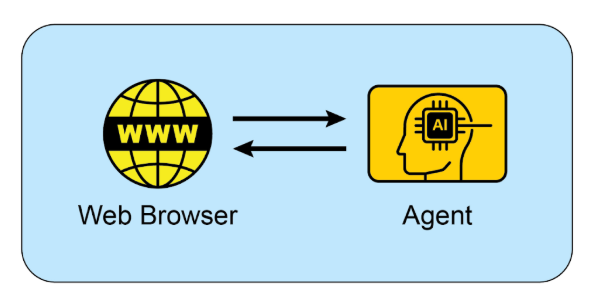

# 附錄 B - AI 智能體互動：從圖形介面到真實世界環境

AI 智能體越來越多地通過與數位介面和物理世界互動來執行複雜任務。它們在這些多樣化環境中感知、處理和行動的能力正在根本性地改變自動化、人機互動和智慧系統。本附錄探討智能體如何與電腦及其環境互動，重點介紹了進展和專案。

## 互動：智能體與電腦

AI 從對話夥伴演進為主動、任務導向智能體，這一演進是由智能體-電腦介面 (Agent-Computer Interfaces, ACIs) 所推動的。這些介面允許 AI 直接與電腦的圖形使用者介面 (GUI) 互動，使其能夠像人類一樣感知和操控視覺元素，如圖示和按鈕。這種新方法超越了傳統自動化的僵化、依賴開發者的腳本，那些腳本依賴 API 和系統呼叫。通過使用軟體的視覺「前門」，AI 現在可以以更靈活和強大的方式自動化複雜的數位任務，這個過程涉及幾個關鍵階段：

* **視覺感知：** 智能體首先捕獲螢幕的視覺表示，本質上是截取螢幕截圖。
* **GUI 元素識別：** 然後分析這個圖片以區分各種 GUI 元素。它必須學會「看到」螢幕不僅僅是像素的集合，而是具有互動組件的結構化布局，辨別可點擊的「提交」按鈕與靜態橫幅圖片，或可編輯的文字欄位與簡單標籤。
* **脈絡解釋：** ACI 模組作為視覺資料和智能體核心智慧 (通常是大語言模型或 LLM) 之間的橋樑，在任務脈絡內解釋這些元素。它理解放大鏡圖示通常意味著「搜尋」，或一系列單選按鈕代表選擇。這個模組對於增強大語言模型的推理至關重要，讓它能基於視覺證據形成計劃。
* **動態行動和回應：** 智能體然後程式化地控制滑鼠和鍵盤來執行其計劃——點擊、輸入、滾動和拖拽。關鍵是，它必須持續監控螢幕以獲得視覺回饋，動態回應變化、載入畫面、彈出通知或錯誤，以成功導覽多步驟工作流程。

這項技術不再是理論性的。幾個領先的 AI 實驗室已經開發出功能性智能體，展示了 GUI 互動的力量：

**ChatGPT Operator (OpenAI)：** 設想為數位夥伴，ChatGPT Operator 被設計為直接從桌面自動化各種應用程式的任務。它理解螢幕上的元素，使其能夠執行如將資料從試算表傳輸到客戶關係管理 (CRM) 平台、在航空公司和飯店網站上預訂複雜的旅行行程，或填寫詳細的線上表單等行動，而無需為每個服務提供專門的 API 存取。這使其成為一個通用適應工具，旨在通過接管重複的數位雜務來提升個人和企業生產力。

**Google Project Mariner：** 作為研究原型，Project Mariner 在 Chrome 瀏覽器內作為智能體運作 (見圖 1)。其目的是理解用戶的意圖並代表他們自主執行基於網路的任務。例如，用戶可以要求它在特定預算和社區內尋找三間出租公寓；Mariner 然後會導覽到房地產網站，應用篩選器，瀏覽清單，並將相關資訊提取到文件中。這個專案代表 Google 在建立真正有幫助且「智能體化」的網路體驗方面的探索，其中瀏覽器主動為用戶工作。

圖 1：智能體與網路瀏覽器之間的互動

**Anthropic 的電腦使用：** 這項功能賦予 Anthropic 的 AI 模型 Claude 成為電腦桌面環境的直接使用者。通過捕獲螢幕截圖來感知螢幕並程式化地控制滑鼠和鍵盤，Claude 可以編排跨越多個不相連應用程式的工作流程。用戶可以要求它分析 PDF 報告中的資料，開啟試算表應用程式對該資料執行計算，產生圖表，然後將該圖表貼到電子郵件草稿中——這是一系列以前需要持續人工輸入的任務。

**Browser Use**：這是一個開源函式庫，為程式化瀏覽器自動化提供高階 API。它讓 AI 智能體能夠通過授予它們存取和控制文件物件模型 (DOM) 來與網頁介面互動。API 將瀏覽器控制協定的複雜、低階命令抽象成更簡化且直觀的函數集。這讓智能體能夠執行複雜的行動序列，包括從嵌套元素提取資料、表單提交，以及跨多個頁面的自動導覽。因此，該函式庫促進了將非結構化網路資料轉換為 AI 智能體可以系統性處理並用於分析或決策的結構化格式。

## 互動：智能體與環境

超越電腦螢幕的限制，AI 智能體越來越多地被設計為與複雜、動態的環境互動，通常反映真實世界。這需要複雜的感知、推理和執行能力。

Google 的 **Project Astra** 是推動智能體與環境互動界限的倡議的典型範例。Astra 旨在建立一個在日常生活中有幫助的通用 AI 智能體，利用多模態輸入 (視覺、聲音、語音) 和輸出來脈絡化地理解和互動世界。這個專案專注於快速理解、推理和回應，讓智能體能夠通過攝影機和麥克風「看到」和「聽到」其周圍環境，並在提供即時協助的同時進行自然對話。Astra 的願景是一個能夠無縫協助用戶從尋找遺失物品到除錯程式碼等任務的智能體，通過理解它觀察到的環境。這超越了簡單的語音命令，達到對用戶即時物理脈絡的真正具身理解。

Google 的 **Gemini Live** 將標準 AI 互動轉變為流暢且動態的對話。用戶可以與 AI 對話並以最小延遲接收自然聲音的回應，甚至可以在句子中途打斷或改變話題，促使 AI 立即適應。介面擴展到語音之外，允許用戶通過使用手機攝影機、分享螢幕或上傳檔案來納入視覺資訊，進行更具脈絡感知的討論。更進階的版本甚至可以感知用戶的語調並智慧地過濾掉無關的背景噪音以更好地理解對話。這些能力結合起來建立豐富的互動，如通過簡單地將攝影機指向任務來接收實時指導。

OpenAI 的 **GPT-4o 模型** 是為「全能」互動設計的替代方案，意味著它可以跨語音、視覺和文字進行推理。它以鏡像人類回應時間的低延遲處理這些輸入，允許即時對話。例如，用戶可以向 AI 顯示實時影片流以詢問正在發生的事情，或將其用於語言翻譯。OpenAI 為開發者提供「即時 API」以建置需要低延遲、語音到語音互動的應用程式。

OpenAI 的 **ChatGPT Agent** 代表了相對於其前身的重要架構進步，具有新能力的整合框架。其設計納入了幾個關鍵功能模式：自主導覽即時網際網路進行即時資料提取的能力、動態產生和執行計算程式碼進行資料分析等任務的能力，以及直接與第三方軟體應用程式介面的功能。這些功能的綜合讓智能體能夠從單一用戶指令編排和完成複雜、順序的工作流程。因此它可以自主管理整個過程，如執行市場分析並產生相應的簡報，或規劃物流安排並執行必要的交易。與發布同時，OpenAI 主動解決了這種系統固有的新興安全考量。附帶的「系統卡」描述了能夠在線上執行行動的 AI 相關的潛在操作危險，承認了濫用的新載體。為減輕這些風險，智能體的架構包含工程保護措施，如對某些類別的行動需要明確的用戶授權，並部署強健的內容過濾機制。公司現在正在與其初始用戶群互動，通過回饋驅動的迭代過程進一步完善這些安全協定。

**Seeing AI** 是 Microsoft 的免費行動應用程式，通過提供其周圍環境的即時旁白來賦能失明或低視力的個人。該應用程式通過設備的攝影機利用人工智慧識別和描述各種元素，包括物體、文字甚至人物。其核心功能包括閱讀文件、識別貨幣、通過條碼識別產品，以及描述場景和顏色。通過提供對視覺資訊的增強存取，Seeing AI 最終促進視覺障礙用戶的更大獨立性。

**Anthropic 的 Claude 4 系列** Anthropic 的 Claude 4 是另一個具有進階推理和分析能力的替代方案。雖然歷史上專注於文字，Claude 4 包含強健的視覺能力，讓它能夠處理來自圖片、圖表和文件的資訊。該模型適合處理複雜、多步驟任務並提供詳細分析。雖然即時對話方面不是其主要焦點，與其他模型相比，其底層智慧被設計用於建置高度能力的 AI 智能體。

## Vibe 編程：與 AI 的直觀開發

除了與 GUI 和物理世界的直接互動之外，開發者使用 AI 建置軟體的新範式正在出現：「vibe 編程」。這種方法遠離精確、逐步的指令，而是依賴開發者和 AI 編程助手之間更直觀、對話式和迭代的互動。開發者提供高階目標、所需的「氛圍」或一般方向，AI 產生相符的程式碼。

這個過程的特徵是：

* **對話式提示：** 開發者可能會說「為新應用程式建立一個簡單、現代外觀的登陸頁面」或「重構這個函數使其更 Pythonic 且可讀」，而不是撰寫詳細的規格。AI 解釋「現代」或「Pythonic」的「氛圍」並產生相應的程式碼。
* **迭代改進：** AI 的初始輸出通常是起點。開發者然後提供自然語言回饋，如「這是好的開始，但你能讓按鈕變藍嗎？」或「為那個添加一些錯誤處理。」這種來回持續直到程式碼符合開發者的期望。
* **創意合作夥伴關係：** 在 vibe 編程中，AI 作為創意夥伴，建議開發者可能沒有考慮的想法和解決方案。這可以加速開發過程並導致更創新的結果。
* **專注於「什麼」而非「如何」：** 開發者專注於所需的結果 (「什麼」) 並將實作細節 (「如何」) 留給 AI。這允許快速原型製作和探索不同方法，而不會陷入樣板程式碼。
* **可選記憶庫：** 為了在更長的互動中維持脈絡，開發者可以使用「記憶庫」來儲存關鍵資訊、偏好或約束。例如，開發者可能將特定的編程風格或一組專案要求保存到 AI 的記憶中，確保未來的程式碼生成與建立的「氛圍」保持一致，而無需重複指令。

隨著 GPT-4、Claude 和 Gemini 等強大 AI 模型整合到開發環境中，Vibe 編程變得越來越受歡迎。這些工具不只是自動完成程式碼；它們主動參與軟體開發的創意過程，使其更易於存取且更有效率。這種新的工作方式正在改變軟體工程的本質，強調創意和高階思維，而非語法和 API 的死記硬背。

## 關鍵要點

* AI 智能體正在從簡單自動化演進為通過圖形使用者介面視覺化控制軟體，就像人類一樣。
* 下一個前沿是真實世界互動，像 Google 的 Astra 這樣的專案使用攝影機和麥克風來看、聽和理解其物理周圍環境。
* 領先的科技公司正在整合這些數位和物理能力，以建立在兩個領域無縫運作的通用 AI 助手。
* 這個轉變正在建立一個新類別的主動、脈絡感知 AI 伴侶，能夠協助用戶日常生活中的大量任務。

## 結論

智能體正在經歷重大轉型，從基本自動化轉向與數位和物理環境的複雜互動。通過利用視覺感知來操作圖形使用者介面，這些智能體現在可以像人類一樣操控軟體，繞過對傳統 API 的需求。主要科技實驗室正在開拓這個領域，智能體能夠直接在用戶桌面上自動化複雜、多應用程式的工作流程。同時，下一個前沿正在擴展到物理世界，像 Google 的 Project Astra 這樣的倡議使用攝影機和麥克風來脈絡化地與其周圍環境互動。這些進階系統被設計用於鏡像人類互動的多模態、即時理解。

最終願景是這些數位和物理能力的融合，建立在用戶所有環境中無縫運作的通用 AI 助手。這種演進也通過「vibe 編程」重新塑造軟體建立本身，這是開發者和 AI 之間更直觀且對話式的合作夥伴關係。這種新方法優先考慮高階目標和創意意圖，讓開發者專注於所需結果而非實作細節。這種轉變通過將 AI 視為創意夥伴來加速開發並促進創新。最終，這些進步正在為主動、脈絡感知的 AI 伴侶新時代鋪路，能夠協助我們日常生活中的大量任務。

## 參考文獻

1. Open AI Operator, [https://openai.com/index/introducing-operator/](https://openai.com/index/introducing-operator/)
2. Open AI ChatGPT Agent: [https://openai.com/index/introducing-chatgpt-agent/](https://openai.com/index/introducing-chatgpt-agent/)
3. Browser Use: [https://docs.browser-use.com/introduction](https://docs.browser-use.com/introduction)
4. Project Mariner, [https://deepmind.google/models/project-mariner/](https://deepmind.google/models/project-mariner/)
5. Anthropic Computer use: [https://docs.anthropic.com/en/docs/build-with-claude/computer-use](https://docs.anthropic.com/en/docs/build-with-claude/computer-use)  
6. Project Astra, [https://deepmind.google/models/project-astra/](https://deepmind.google/models/project-astra/)
7. Gemini Live, [https://gemini.google/overview/gemini-live/?hl=en](https://gemini.google/overview/gemini-live/?hl=en)
8. OpenAI's GPT-4,  [https://openai.com/index/gpt-4-research/](https://openai.com/index/gpt-4-research/)
9. Claude 4, [https://www.anthropic.com/news/claude-4](https://www.anthropic.com/news/claude-4)