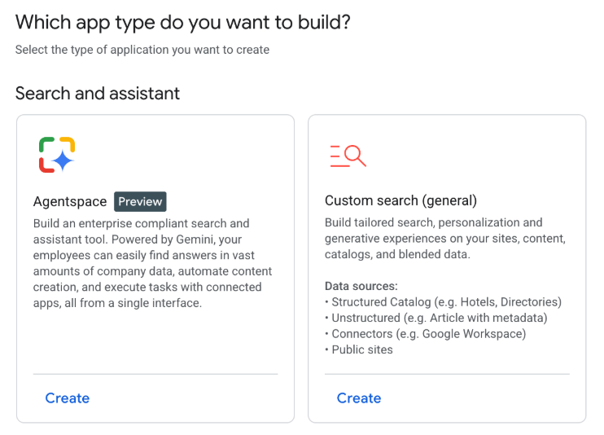
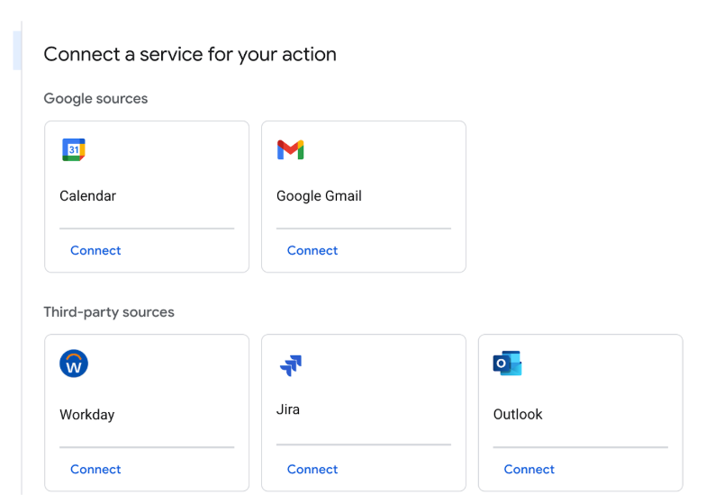
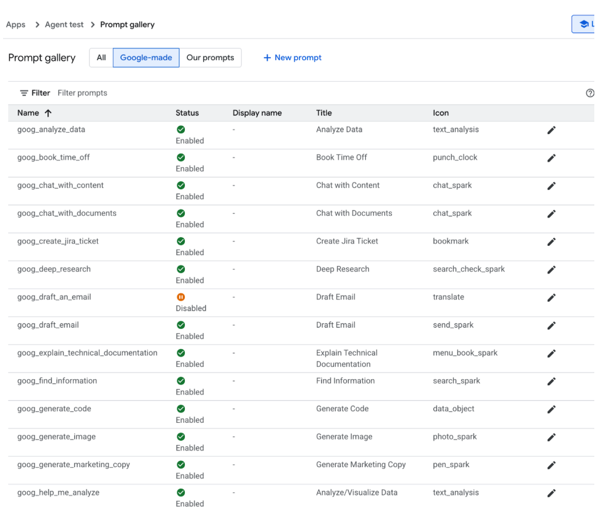
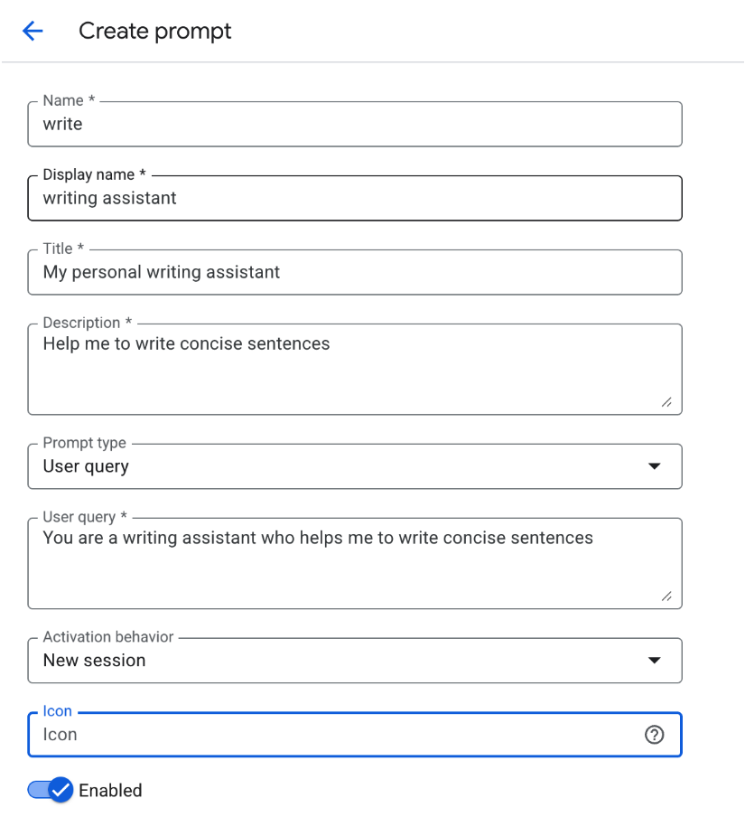
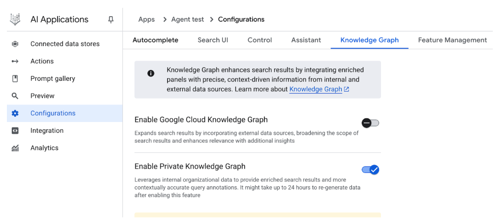
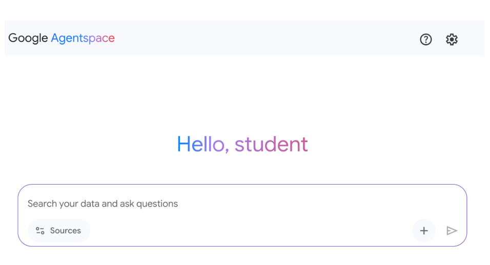

# 附錄 D - 使用 AgentSpace 建置智能體

## 概述

AgentSpace 是一個旨在通過將人工智慧整合到日常工作流程中來促進「智能體驅動企業」的平台。其核心提供跨組織整個數位足跡的統一搜尋能力，包括文件、電子郵件和資料庫。這個系統利用像 Google 的 Gemini 等進階 AI 模型來理解和綜合來自這些多樣化來源的資訊。

該平台能夠建立和部署可以執行複雜任務和自動化程序的專門 AI「智能體」。這些智能體不僅僅是聊天機器人；它們可以推理、規劃並自主執行多步驟行動。例如，智能體可以研究主題、編譯帶有引用的報告，甚至產生音訊摘要。

為了實現這一點，AgentSpace 構建了企業知識圖譜，映射人員、文件和資料之間的關係。這讓 AI 能夠理解脈絡並提供更相關且個人化的結果。該平台還包括一個稱為 Agent Designer 的無程式碼介面，用於建立自訂智能體而無需深度技術專業知識。

此外，AgentSpace 支援多智能體系統，其中不同的 AI 智能體可以通過稱為 Agent2Agent (A2A) 協定的開放協定進行溝通和協作。這種互操作性允許更複雜和編排的工作流程。安全性是基礎組件，具有基於角色的存取控制和資料加密等功能來保護敏感的企業資訊。最終，AgentSpace 旨在通過將智慧的自主系統直接嵌入組織的運營結構來增強生產力和決策制定。

## 如何使用 AgentSpace UI 建置智能體

圖 1 說明了如何通過從 Google Cloud Console 選擇 AI Applications 來存取 AgentSpace。

圖 1：如何使用 Google Cloud Console 存取 AgentSpace

你的智能體可以連接到各種服務，包括 Calendar、Google Mail、Workaday、Jira、Outlook 和 Service Now (見圖 2)。

圖 2：與多樣化服務整合，包括 Google 和第三方平台。

智能體然後可以使用自己的提示，從 Google 提供的預製提示庫中選擇，如圖 3 所示。

圖 3：Google 的預組裝提示庫

或者你可以建立自己的提示，如圖 4 所示，這將被你的智能體使用

圖 4：自訂智能體的提示

AgentSpace 提供許多進階功能，如與資料存儲整合以儲存你自己的資料、與 Google 知識圖譜或你的私有知識圖譜整合、用於將你的智能體公開到網路的網路介面，以及用於監控使用情況的分析等等 (見圖 5)

圖 5：AgentSpace 進階功能

完成後，AgentSpace 聊天介面 (圖 6) 將可以存取。

圖 6：用於啟動與你的智能體聊天的 AgentSpace 使用者介面。

## 結論

總之，AgentSpace 為在組織現有數位基礎設施內開發和部署 AI 智能體提供了功能框架。該系統的架構將複雜的後端程序 (如自主推理和企業知識圖譜映射) 連結到用於智能體構建的圖形使用者介面。通過這個介面，用戶可以通過整合各種資料服務並通過提示定義其操作參數來配置智能體，從而產生自訂的、脈絡感知的自動化系統。

這種方法抽象了底層的技術複雜性，能夠在不需要深度程式設計專業知識的情況下構建專門的多智能體系統。主要目標是將自動化分析和操作能力直接嵌入工作流程，從而提高程序效率並增強資料驅動分析。對於實際指導，提供了實踐學習模組，如 Google Cloud Skills Boost 上的「使用 Agentspace 建立生成式 AI 智能體」實驗室，它提供了結構化的技能習得環境。

## 參考文獻

1. Create a no-code agent with Agent Designer, [https://cloud.google.com/agentspace/agentspace-enterprise/docs/agent-designer](https://cloud.google.com/agentspace/agentspace-enterprise/docs/agent-designer)
2. Google Cloud Skills Boost, [https://www.cloudskillsboost.google/](https://www.cloudskillsboost.google/)