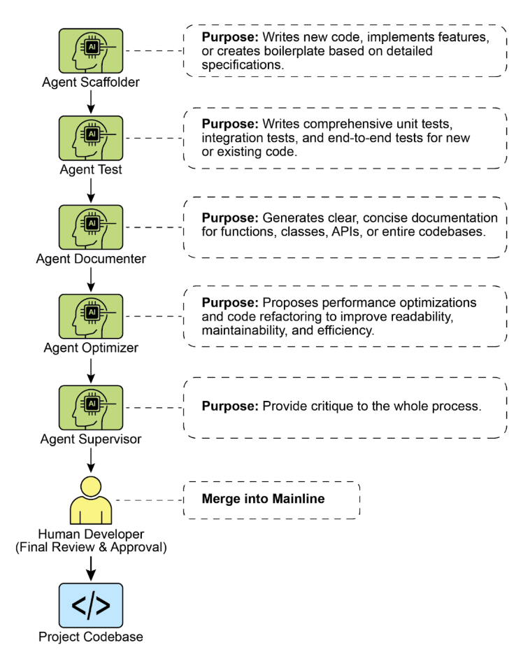

# 附錄 G - 編程智能體

## Vibe 編程：起點

「Vibe 編程」已成為快速創新和創意探索的強大技術。這種實踐涉及使用大語言模型生成初始草稿、概述複雜邏輯或建置快速原型，顯著減少初始阻力。它對於克服「空白頁面」問題非常寶貴，使開發者能夠快速從模糊概念轉換為有形、可執行的程式碼。Vibe 編程在探索不熟悉的 API 或測試新穎架構模式時特別有效，因為它繞過了對完美實作的直接需求。生成的程式碼通常作為創意催化劑，為開發者提供批評、重構和擴展的基礎。其主要優勢在於能夠加速軟體生命週期的初始發現和構思階段。然而，雖然 vibe 編程在腦力激盪方面表現出色，但開發強健、可擴展且可維護的軟體需要更結構化的方法，從純生成轉向與專門編程智能體的協作合作夥伴關係。

## 智能體作為團隊成員

雖然最初的浪潮專注於原始程式碼生成——完美適合構思的「vibe 程式碼」——行業現在正轉向更整合且強大的生產工作範式。最有效的開發團隊不僅僅是將任務委派給智能體；他們正在用一套複雜的編程智能體增強自己。這些智能體作為不知疲倦、專門的團隊成員，放大人類創意並大幅增加團隊的可擴展性和速度。

這種演進反映在行業領袖的聲明中。在 2025 年初，Alphabet 執行長 Sundar Pichai 指出，在 Google，**「超過 30% 的新程式碼現在由我們的 Gemini 模型協助或生成，根本性地改變了我們的開發速度。」** Microsoft 也做了類似聲明。這個全行業的轉變表明真正的前沿不是取代開發者，而是賦能他們。目標是一種增強關係，其中人類指導架構願景和創意問題解決，而智能體處理專門的、可擴展的任務，如測試、文件和審查。

本章基於人類開發者作為創意領導者和架構師，而 AI 智能體作為力量倍增器的核心理念，提出了組織人機智能體團隊的框架。這個框架基於三個基礎原則：

1. **人類主導的編排：** 開發者是團隊領導和專案架構師。他們始終在迴圈中，編排工作流程，設定高階目標，並做出最終決策。智能體很強大，但它們是支援性的協作者。開發者指導要接觸哪個智能體，提供必要的脈絡，最重要的是，對任何智能體生成的輸出行使最終判斷，確保它符合專案的品質標準和長期願景。
2. **脈絡的首要性：** 智能體的效能完全取決於其脈絡的品質和完整性。一個具有差劣脈絡的強大大語言模型是無用的。因此，我們的框架優先考慮細緻的、人類主導的脈絡策劃方法。避免自動化、黑盒脈絡檢索。開發者負責為其智能體團隊成員組裝完美的「簡報」。這包括：
   * **完整的程式碼庫：** 提供所有相關的原始程式碼，以便智能體理解現有的模式和邏輯。
   * **外部知識：** 提供特定文件、API 定義或設計文件。
   * **人類簡報：** 闡明清晰的目標、要求、拉取請求描述和風格指南。
3. **直接模型存取：** 為了達到最先進的結果，智能體必須由直接存取前沿模型 (例如，Gemini 2.5 PRO、Claude Opus 4、OpenAI、DeepSeek 等) 提供支援。使用較不強大的模型或通過中介平台路由請求，這些平台會模糊或截斷脈絡，將會降低效能。該框架建立在人類領導者和底層模型原始能力之間建立最純粹可能的對話之上，確保每個智能體都在其巔峰潛力下運作。

該框架結構化為一個專門智能體團隊，每個都為開發生命週期中的核心功能而設計。人類開發者作為中央編排者，委派任務並整合結果。

## 核心組件

為了有效利用前沿大語言模型，這個框架為專門智能體團隊分配不同的開發角色。這些智能體不是獨立的應用程式，而是通過精心製作的角色特定提示和脈絡在大語言模型內調用的概念人格。這種方法確保模型的龐大能力精確聚焦於手頭的任務，從撰寫初始程式碼到執行細緻、批判性的審查。

**編排者：人類開發者：** 在這個協作框架中，人類開發者作為編排者，作為 AI 智能體的中央情報和最終權威。

* **角色：** 團隊領導、架構師和最終決策者。編排者定義任務，準備脈絡，並驗證智能體完成的所有工作。
  * **介面：** 開發者自己的終端、編輯器和所選智能體的原生網頁 UI。

**脈絡準備區：** 作為任何成功智能體互動的基礎，脈絡準備區是人類開發者細緻準備完整且任務特定簡報的地方。

* **角色：** 每個任務的專用工作空間，確保智能體接收完整且準確的簡報。
  * **實作：** 包含目標 markdown 檔案、程式碼檔案和相關文件的臨時目錄 (task-context/)

**專門智能體：** 通過使用有針對性的提示，我們可以建置一個專門智能體團隊，每個都為特定的開發任務量身定制。

* **腳手架智能體：實作者**
  * **目的：** 基於詳細規格撰寫新程式碼、實作功能或建立樣板。
    * **調用提示：** 「你是一名資深軟體工程師。基於 01_BRIEF.md 中的要求和 02_CODE/ 中的現有模式，實作功能...」
  * **測試工程師智能體：品質守護者**
    * **目的：** 為新的或現有程式碼撰寫全面的單元測試、整合測試和端到端測試。
    * **調用提示：** 「你是一名品質保證工程師。對於 02_CODE/ 中提供的程式碼，使用 [測試框架，例如 pytest] 撰寫完整的單元測試套件。涵蓋所有邊緣情況並遵守專案的測試理念。」
  * **文件編寫智能體：文書**
    * **目的：** 為函數、類別、API 或整個程式碼庫生成清晰、簡潔的文件。
    * **調用提示：** 「你是一名技術作家。為提供程式碼中定義的 API 端點生成 markdown 文件。包括請求/回應範例並解釋每個參數。」
  * **優化智能體：重構夥伴**
    * **目的：** 提出效能優化和程式碼重構建議，以改善可讀性、可維護性和效率。
    * **調用提示：** 「分析提供的程式碼以尋找效能瓶頸或可以為了清晰而重構的區域。提出具體變更建議，並解釋為什麼它們是改進。」
  * **流程智能體：程式碼監督者**
    * **批評：** 智能體執行初始通過，識別潛在錯誤、風格違規和邏輯缺陷，很像靜態分析工具。
    * **反思：** 智能體然後分析自己的批評。它綜合發現，優先考慮最關鍵的問題，駁回迂腐或低影響的建議，並為人類開發者提供高階、可執行的摘要。
    * **調用提示：** 「你是一名主體工程師進行程式碼審查。首先，對變更執行詳細批評。其次，反思你的批評以提供最重要回饋的簡潔、優先順序摘要。」

最終，這個人類主導的模型在開發者的策略方向和智能體的戰術執行之間建立了強大的協同效應。因此，開發者可以超越例行任務，將他們的專業知識聚焦於提供最大價值的創意和架構挑戰。

## 實際實作

### 設定檢查清單

為了有效實作人機智能體團隊框架，建議以下設定，專注於在提高效率的同時保持控制。

1. **提供前沿模型存取** 為至少兩個領先的大語言模型 (如 Gemini 2.5 Pro 和 Claude 4 Opus) 獲得 API 金鑰。這種雙供應商方法允許比較分析並對抗單一平台限制或停機時間。這些憑證應該像任何其他生產機密一樣安全管理。
2. **實作本地脈絡編排器** 而不是臨時腳本，使用輕量級 CLI 工具或本地智能體執行器來管理脈絡。這些工具應該允許你在專案根目錄中定義簡單的配置檔案 (例如，context.toml)，指定要編譯到大語言模型提示的單一負載中的檔案、目錄或甚至 URL。這確保你對每個請求中模型看到的內容保持完全、透明的控制。
3. **建立版本控制的提示函式庫** 在專案的 Git 儲存庫內建立專用的 /prompts 目錄。在其中，將每個專門智能體的調用提示 (例如，reviewer.md、documenter.md、tester.md) 儲存為 markdown 檔案。將你的提示視為程式碼允許整個團隊隨時間協作、改進和版本化給予 AI 智能體的指令。
4. **將智能體工作流程與 Git Hook 整合** 通過使用本地 Git Hook 自動化你的審查節奏。例如，pre-commit Hook 可以配置為自動觸發暫存變更上的審查者智能體。智能體的批評和反思摘要可以直接在你的終端中呈現，在你完成提交之前提供即時回饋，並將品質保證步驟直接烘焙到你的開發過程中。

圖 1：編程專家範例

### 領導增強團隊的原則

成功領導這個框架需要從個人貢獻者演進為人機 AI 團隊的領導者，遵循以下原則：

* **維護架構所有權** 你的角色是設定策略方向並擁有高階架構。你定義「什麼」和「為什麼」，使用智能體團隊來加速「如何」。你是設計的最終**仲裁者**，確保每個組件與專案的長期願景和品質標準一致。
* **掌握簡報的藝術** 智能體輸出的品質直接反映其輸入的品質。通過為每個任務提供清晰、明確且全面的脈絡來掌握簡報的藝術。將你的提示視為不僅僅是簡單命令，而是為新的、高能力團隊成員的完整簡報包。
* **充當最終品質關卡** 智能體的輸出始終是提案，絕不是命令。將審查者智能體的回饋視為強大信號，但你是最終品質關卡。應用你的領域專業知識和專案特定知識來驗證、挑戰和批准所有變更，充當程式碼庫完整性的最終守護者。
* **參與迭代對話** 最佳結果來自對話，而非獨白。如果智能體的初始輸出不完美，不要丟棄它——改進它。提供糾正性回饋，添加澄清脈絡，並提示另一次嘗試。這種迭代對話至關重要，特別是與審查者智能體，其「反思」輸出被設計為協作討論的開始，而不僅僅是最終報告。

## 結論

程式碼開發的未來已經到來，它是增強的。獨行編程者的時代已經讓位給開發者領導專門 AI 智能體團隊的新範式。這個模型不會貶低人類角色；它通過自動化例行任務、擴大個人影響和實現之前無法想像的開發速度來提升它。

通過將戰術執行卸載給智能體，開發者現在可以將他們的認知能量專注於真正重要的事情：策略創新、彈性架構設計，以及建置讓用戶滿意的產品所需的創意問題解決。基本關係已經重新定義；這不再是人類與機器的競賽，而是人類智慧和 AI 之間的合作夥伴關係，作為單一、無縫整合的團隊工作。

## 參考文獻

1. AI is responsible for generating more than 30% of the code at Google [https://www.reddit.com/r/singularity/comments/1k7rxo0/ai_is_now_writing_well_over_30_of_the_code_at/](https://www.reddit.com/r/singularity/comments/1k7rxo0/ai_is_now_writing_well_over_30_of_the_code_at/)
2. AI is responsible for generating more than 30% of the code at Microsoft [https://www.businesstoday.in/tech-today/news/story/30-of-microsofts-code-is-now-ai-generated-says-ceo-satya-nadella-474167-2025-04-30](https://www.businesstoday.in/tech-today/news/story/30-of-microsofts-code-is-now-ai-generated-says-ceo-satya-nadella-474167-2025-04-30)