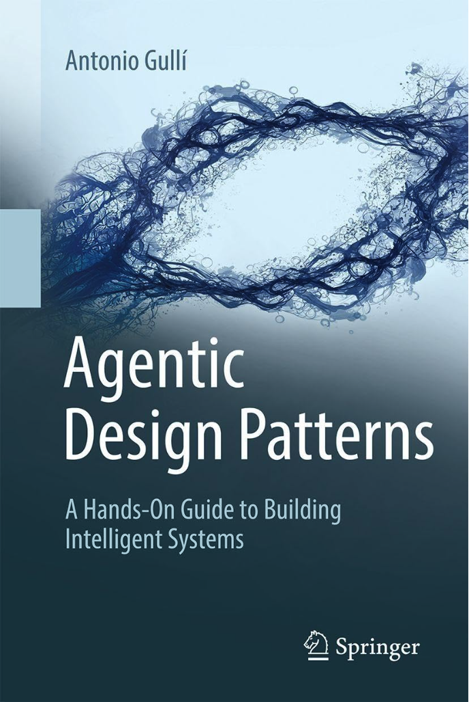

# 智能體設計模式 (繁體中文版)

此儲存庫包含 Antonio Gulli 和 Mauro Sauco 所著《智能體設計模式》一書的完整繁體中文翻譯。該內容已由 Tom Mathews 編譯和組織，並翻譯為繁體中文，方便華語社群輕鬆存取和參考。

> **原始專案：** [Agentic Design Patterns (英文版)](https://github.com/circleghost/Agentic-Design-Patterns)  
> **翻譯說明：** 本翻譯遵循台灣繁體中文的術語和用語習慣，適合台灣及其他華語地區的 AI 從業者閱讀。

## 作者與致謝

- **作者：** [Antonio Gulli](https://www.linkedin.com/in/searchguy/) 和 [Mauro Sauco](https://www.linkedin.com/in/maurosauco/)
- **編譯者：** [Tom Mathews](https://www.linkedin.com/in/mathews-tom/)

### 這本書有何特別之處？

這本 424 頁的指南解決了我們在建立智慧型、自主 AI 系統時面臨的實際挑戰。它彌補了理論與實作之間的差距 — 正是我們領域現在所需要的。這是任何認真建立真實 AI 系統的人最好的資源。如果你是一位工程師、研究人員或產品經理，準備超越基本的大語言模型應用程式並建立真正強韌的 AI 智能體，這本書就是為你而寫。

本書涵蓋了重要的智能體模式，包括提示鏈結 (Prompt Chaining)、路由 (Routing)、規劃 (Planning) 和多智能體系統 (Multi-Agent Systems)，全部都有實用的、基於程式碼的範例。你會發現工具使用 (Tool Use)、記憶體管理 (Memory Management) 和 RAG 實作的全面覆蓋，以及推理技術 (Reasoning Techniques) 和智能體間通訊 (Inter-Agent Communication) 等進階主題。

書中內容包括：

- **真實程式碼範例：** 不只是理論，而是可運作的實作。
- **經過驗證的模式：** 記憶體處理、例外邏輯、資源控制、安全防護機制。
- **進階技術：** 多智能體編排、智能體間訊息傳遞、人機協作 (human-in-the-loop)。
- **完整的 MCP (Model Context Protocol) 章節：** 用於整合工具與智能體的關鍵框架。

它涵蓋了 4 個部分中的 21 個核心模式：

1. 基礎模式 (提示鏈結、路由、工具使用)
2. 進階系統 (記憶體、學習、監控)
3. 產品考量 (錯誤處理、安全、評估)
4. 多智能體架構

大多數 AI 內容止於「如何呼叫 API」。但在真實世界的系統中，你需要問：

- 如果智能體在任務中途卡住怎麼辦？
- 如何在長時間的會話中保存記憶體？
- 如何防止運行 10 個以上智能體時出現混亂？

本書用你可以實際應用的模式回答了所有這些問題。僅僅 70 多頁的附錄就值得投資，其中包含進階提示技術和智能體框架概述。

## 目錄

### 前言

- [獻詞](00-Introduction/01-Dedication.md)
- [致謝](00-Introduction/02-Acknowledgment.md)
- [序言](00-Introduction/03-Foreword.md)
- [思想領袖觀點：權力與責任](00-Introduction/04-A_Thought_Leaders_Perspective_Power_and_Responsibility.md)
- [簡介](00-Introduction/05-Introduction.md)
- [什麼讓 AI 系統成為智能體？](00-Introduction/06-What_makes_an_AI_system_an_Agent.md)

### 第一部分：基礎模式

- [第 1 章：提示鏈結](01-Part_One/Chapter_1-Prompt_Chaining.md)
- [第 2 章：路由](01-Part_One/Chapter_2-Routing.md)
- [第 3 章：並行化](01-Part_One/Chapter_3-Parallelization.md)
- [第 4 章：反思](01-Part_One/Chapter_4-Reflection.md)
- [第 5 章：工具使用 (函數呼叫)](01-Part_One/Chapter_5-Tool_Use_(Function_Calling).md)
- [第 6 章：規劃](01-Part_One/Chapter_6-Planning.md)
- [第 7 章：多智能體協作](01-Part_One/Chapter_7-Multi-Agent_Collaboration.md)

### 第二部分：進階系統

- [第 8 章：記憶體管理](02-Part_Two/Chapter_8-Memory_Management.md)
- [第 9 章：學習與適應](02-Part_Two/Chapter_9-Learning_and_Adaptation.md)
- [第 10 章：Model Context Protocol (MCP)](02-Part_Two/Chapter_10-Model_Context_Protocol_(MCP).md)
- [第 11 章：目標設定與監控](02-Part_Two/Chapter_11-Goal_Setting_and_Monitoring.md)

### 第三部分：產品考量

- [第 12 章：例外處理與復原](03-Part_Three/Chapter_12-Exception_Handling_and_Recovery.md)
- [第 13 章：人機協作](03-Part_Three/Chapter_13-Human_in_the_Loop.md)
- [第 14 章：知識檢索 (RAG)](03-Part_Three/Chapter_14-Knowledge_Retrieval_(RAG).md)

### 第四部分：多智能體架構

- [第 15 章：智能體間通訊 (A2A)](04-Part_Four/Chapter_15-Inter_Agent_Communication_(A2A).md)
- [第 16 章：資源感知優化](04-Part_Four/Chapter_16-Resource_Aware_Optimization.md)
- [第 17 章：推理技術](04-Part_Four/Chapter_17-Reasoning_Techniques.md)
- [第 18 章：防護機制與安全模式](04-Part_Four/Chapter_18-Guardrails_Safety_Patterns.md)
- [第 19 章：評估與監控](04-Part_Four/Chapter_19-Evaluation_and_Monitoring.md)
- [第 20 章：優先順序排列](04-Part_Four/Chapter_20-Prioritization.md)
- [第 21 章：探索與發現](04-Part_Four/Chapter_21-Exploration_and_Discovery.md)

### 附錄

- [附錄 A：進階提示技術](05-Appendix/Appendix_A-Advanced_Prompting_Techniques.md)
- [附錄 B：AI 智能體互動：從 GUI 到真實世界環境](05-Appendix/Appendix_B-AI_Agentic_Interactions_From_GUI_to_Real_World_Environment.md)
- [附錄 C：智能體框架快速概述](05-Appendix/Appendix_C-Quick_Overview_of_Agentic_Frameworks.md)
- [附錄 D：使用 AgentSpace 建立智能體 (僅線上版)](05-Appendix/Appendix_D-Building_an_Agent_with_AgentSpace_(on_line_only).md)
- [附錄 E - 命令列上的 AI 智能體](05-Appendix/Appendix_E-AI_Agents_on_the_CLI.md)
- [附錄 F：深入探討：智能體推理引擎內部運作](05-Appendix/Appendix_F-Under_the_Hood_An_Inside_Look_at_the_Agents_Reasoning_Engines.md)
- [附錄 G：程式設計智能體](05-Appendix/Appendix_G-Coding_Agents.md)

## 授權條款

此儲存庫採用 [MIT 授權條款](LICENSE)。

